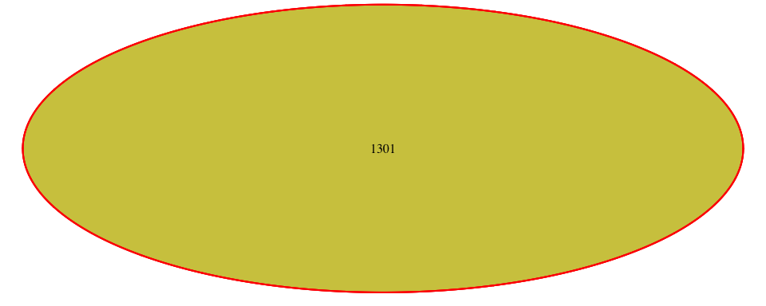
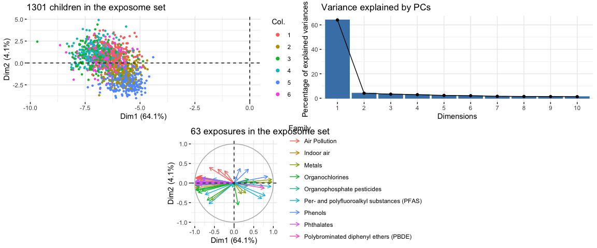
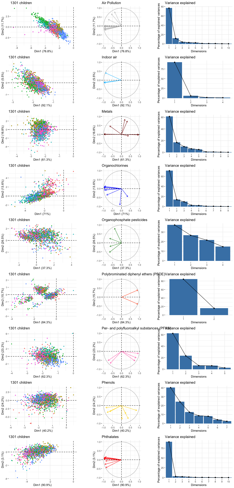
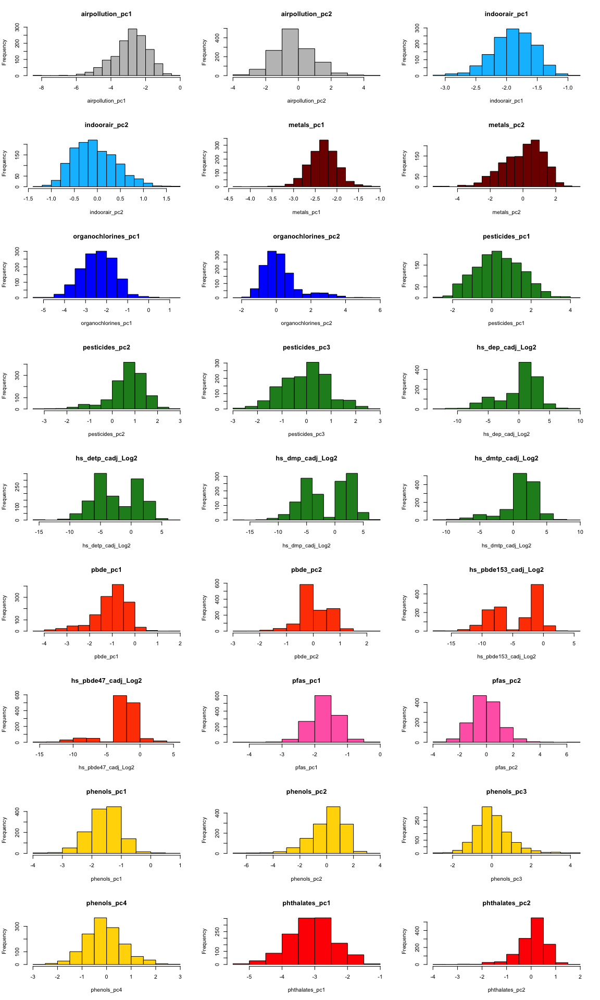

# Load packages


```r
library("VennDiagram")
library("ggplot2")
library("factoextra")
library("cowplot")
```

# Load data

## Load exposome data


```r
load("../../data/exposome.RData")
ls()
```

```
## [1] "codebook"   "covariates" "exposome"   "phenotype"
```

## Prepare exposome data


```r
exposome$ID <- paste0('sample_', exposome$ID)
rownames(exposome) <- exposome$ID
exposome <- exposome[ , -1]
exposome[1:3, 1:3]
```

```
##          h_abs_ratio_preg_Log h_no2_ratio_preg_Log h_pm10_ratio_preg_None
## sample_1             0.896711             2.872304               25.94850
## sample_2             0.892538             2.980008               25.89774
## sample_3             0.778723             3.056501               26.08735
```


```r
phenotype$ID <- paste0('sample_', phenotype$ID)
rownames(phenotype) <- phenotype$ID
phenotype <- phenotype[ , -1]
phenotype[1:3, 1:3]
```

```
##          e3_bw hs_asthma hs_zbmi_who
## sample_1  4100         0        0.30
## sample_2  4158         0        0.41
## sample_3  4110         1        3.33
```


```r
covariates$ID <- paste0('sample_', covariates$ID)
rownames(covariates) <- covariates$ID
covariates <- covariates[ , -1]
covariates[1:3, 1:3]
```

```
##          h_cohort e3_sex_None e3_yearbir_None
## sample_1        4        male            2008
## sample_2        4        male            2007
## sample_3        4        male            2008
```


```r
s1 <- rownames(exposome)
s2 <- rownames(phenotype)
s3 <- rownames(covariates)
s12 <- intersect(s1, s2)
s23 <- intersect(s2, s3)
s13 <- intersect(s1, s3)
s123 <- intersect(intersect(s12, s23), s13)
draw.triple.venn(
	area1 = length(s1), area2 = length(s2), area3 = length(s3),
	n12 = length(s12), n23 = length(s23), n13 = length(s13),
	n123 = length(s123),
	col = "red", fill = c("pink", "green", "orange"))
```

<!-- -->

```
## (polygon[GRID.polygon.1], polygon[GRID.polygon.2], polygon[GRID.polygon.3], polygon[GRID.polygon.4], polygon[GRID.polygon.5], polygon[GRID.polygon.6], text[GRID.text.7], text[GRID.text.8], text[GRID.text.9], text[GRID.text.10])
```

```r
rm(s1, s2, s3, s12, s23, s13, s123)
```

## Load custom codebook


```r
codebook2 <- read.delim("../../data/codebook_chf.csv", sep=";")
```

## Prepare filtering


```r
table(codebook2$to.use)
```

```
## 
##   ?   C   N   Y 
##  13  19  94 115
```

```r
table(codebook2$period)
```

```
## 
## Postnatal Pregnancy 
##       142        99
```

```r
table(codebook2$var_type)
```

```
## 
##  factor numeric 
##      61     180
```

```r
sel_exp <- codebook2$to.use == "Y" &
	codebook2$period == "Postnatal" &
	codebook2$var_type == "numeric"
sel_exp <- codebook2$variable_name[sel_exp]
length(sel_exp)
```

```
## [1] 63
```


```r
exposome <- exposome[ , sel_exp]
dim(exposome)
```

```
## [1] 1301   63
```


```r
rownames(codebook2) <- codebook2$variable_name
fData <- codebook2[sel_exp, ]
dim(fData)
```

```
## [1] 63 31
```

```r
rm(codebook, codebook2)
```

# Identify covariates of interest

* cohort: `h_cohort` (Covariates)
* age: `hs_child_age_None` (Covariates)
* sex: `e3_sex_None` (Covariates)
* maternal education: `h_edumc_None` (Covariates)
* bmi: `hs_zbmi_who` (Phenotype)

## HELIX Cohort


```r
'h_cohort' %in% colnames(covariates)
```

```
## [1] TRUE
```

## Child age at examination (years)


```r
'hs_child_age_None' %in% colnames(covariates)
```

```
## [1] TRUE
```

## Child sex (female / male)


```r
'e3_sex_None' %in% colnames(covariates)
```

```
## [1] TRUE
```

## Child's maternal education

Maternal education (1: primary school, 2:secondary school, 3:university degree or higher)


```r
'h_edumc_None' %in% colnames(covariates)
```

```
## [1] TRUE
```

## Child's BMI

Body mass index z-score at 6-11 years old - WHO reference - Standardized on sex and age


```r
'hs_zbmi_who' %in% colnames(phenotype)
```

```
## [1] TRUE
```


# Create blocsk of families of exposures


```r
unique(data.frame(domain=fData$domain, family=fData$family))
```

```
##               domain                                     family
## 1  Outdoor exposures                              Air Pollution
## 13        Indoor air                                 Indoor air
## 17         Chemicals                                     Metals
## 26         Chemicals                            Organochlorines
## 35         Chemicals                 Organophosphate pesticides
## 39         Chemicals      Polybrominated diphenyl ethers (PBDE)
## 41         Chemicals Per- and polyfluoroalkyl substances (PFAS)
## 46         Chemicals                                    Phenols
## 53         Chemicals                                 Phthalates
```


```r
fam_exposome <- lapply(unique(fData$family), function(fam) {
	exposome[ , fData$variable_name[fData$family == fam]]
})
names(fam_exposome) <- unique(fData$family)
data.frame(
	n_exposures = sapply(fam_exposome, ncol)
)
```

```
##                                            n_exposures
## Air Pollution                                       12
## Indoor air                                           4
## Metals                                               9
## Organochlorines                                      9
## Organophosphate pesticides                           4
## Polybrominated diphenyl ethers (PBDE)                2
## Per- and polyfluoroalkyl substances (PFAS)           5
## Phenols                                              7
## Phthalates                                          11
```

# Principal Component Analysis


```r
pca_full_exposome <- prcomp(exposome[ , rownames(fData)], 
	center = FALSE, scale = TRUE)

var <- pca_full_exposome$sdev^2 / sum(pca_full_exposome$sdev^2)
data.frame(PC = paste("PC ", seq(length(pca_full_exposome$sdev))), 
	Var = sprintf("%.2f %%", var * 100))[1:20, ]
```

```
##        PC     Var
## 1   PC  1 64.05 %
## 2   PC  2  4.12 %
## 3   PC  3  3.33 %
## 4   PC  4  2.91 %
## 5   PC  5  2.30 %
## 6   PC  6  2.07 %
## 7   PC  7  1.57 %
## 8   PC  8  1.46 %
## 9   PC  9  1.39 %
## 10 PC  10  1.26 %
## 11 PC  11  1.18 %
## 12 PC  12  1.09 %
## 13 PC  13  0.94 %
## 14 PC  14  0.91 %
## 15 PC  15  0.84 %
## 16 PC  16  0.81 %
## 17 PC  17  0.80 %
## 18 PC  18  0.79 %
## 19 PC  19  0.74 %
## 20 PC  20  0.60 %
```


```r
plot_grid(
	plot_grid(
		fviz_pca_ind(pca_full_exposome, 
					 label = "none",
					 col.ind = as.factor(covariates[rownames(pca_full_exposome$x), "h_cohort"]),
					 pointshape = 20
			) +
			ggtitle("1301 children in the exposome set"),
		fviz_eig(pca_full_exposome) +
			ggtitle("Variance explained by PCs"),
		ncol = 2
	),
	fviz_pca_var(pca_full_exposome,
		col.var = fData[rownames(pca_full_exposome$rotation), "family"],
		label = "none",
		legend.title = "Family"
    ) + ggtitle("63 exposures in the exposome set"),
	ncol = 1, nrow = 2
)
```

<!-- -->

## Principal Components Analysis per family of exposures


```r
color_families <- c(
	"#C0C0C0", #silver"
	"#00BFFF", #deepskyblue 
	"#800000", #maroon
	"#0000FF", #blue 
	"#228B22", #forestgreen
	"#FF4500", #orangered
	"#FF69B4", #hotpink
	"#FFD700", #gold
 	"#FF0000") #red
names(color_families) <- c("Air Pollution",	"Indoor air", "Metals", 
	"Organochlorines", "Organophosphate pesticides", 
	"Polybrominated diphenyl ethers (PBDE)", 
	"Per- and polyfluoroalkyl substances (PFAS)", "Phenols", "Phthalates")
```


```r
pca_exposome <- lapply(fam_exposome, function(ds) {
	prcomp(ds, center = FALSE, scale = TRUE)
})
```


```r
plots <- list()
jj <- 1
for(ii in seq(1, length(pca_exposome))) {
	plots[[jj]] <- fviz_pca_ind(pca_exposome[[ii]], 
					label = "none",
					 col.ind = as.factor(covariates[rownames(pca_exposome[[ii]]$x), "h_cohort"]),
					 pointshape = 20) +
			ggtitle("1301 children") + theme(legend.position = "none")
	plots[[jj + 1]] <- fviz_pca_var(pca_exposome[[ii]],
		col.var = color_families[fData[rownames(pca_exposome[[ii]]$rotation), "family"]][1],
		label = "none",
		legend.title = "Family"
    ) + ggtitle(names(pca_exposome)[ii]) + theme(legend.position = "none")
	plots[[jj + 2]] <- fviz_eig(pca_exposome[[ii]]) +
			ggtitle("Variance explained")
	jj <- jj + 3
}
plot_grid(plotlist = plots, ncol = 3)
```

<!-- -->


## Number of PCs to use for each family

Number of PCs to be used in order to get an explained variance over 85%.


```r
exp_sel <- do.call(rbind, lapply(names(pca_exposome), function(fam) {
	pca <- pca_exposome[[fam]]
	var <- pca$sdev^2 / sum(pca$sdev^2)
	cvar <- cumsum(var)
	sel <- which(cvar > 0.85)[1]
	if(sel < 2) {
		sel <- 2
	}
	nexp=nrow(pca_exposome[[fam]]$rotation)
	if(sel >= nexp-1) {
		use <- "pcs + exposures"
	} else {
		use <- "pcs"
	}
	data.frame(Family=fam, NPCs=sel, NExp=nexp, To_Use=use)
}))
exp_sel
```

```
##                                       Family NPCs NExp          To_Use
## 1                              Air Pollution    2   12             pcs
## 2                                 Indoor air    2    4             pcs
## 3                                     Metals    3    9             pcs
## 4                            Organochlorines    3    9             pcs
## 5                 Organophosphate pesticides    3    4 pcs + exposures
## 6      Polybrominated diphenyl ethers (PBDE)    2    2 pcs + exposures
## 7 Per- and polyfluoroalkyl substances (PFAS)    2    5             pcs
## 8                                    Phenols    4    7             pcs
## 9                                 Phthalates    2   11             pcs
```

## Create new ExposomeSet but with PCs if required


```r
exposomePC <- data.frame(
	# Air Pollution
	airpollution_pc1 = pca_exposome[[1]]$x[ , 1],
	airpollution_pc2 = pca_exposome[[1]]$x[ , 2],
	# Indoor air
	indoorair_pc1 = pca_exposome[[2]]$x[ , 1],
	indoorair_pc2 = pca_exposome[[2]]$x[ , 2],
	# Metals
	metals_pc1 = pca_exposome[[3]]$x[ , 1],
	metals_pc2 = pca_exposome[[3]]$x[ , 2],
	# Organochlorines
	organochlorines_pc1 = pca_exposome[[4]]$x[ , 1],
	organochlorines_pc2 = pca_exposome[[4]]$x[ , 2],
	# Organophosphate pesticides
	pesticides_pc1 = pca_exposome[[5]]$x[ , 1],
	pesticides_pc2 = pca_exposome[[5]]$x[ , 2],
	pesticides_pc3 = pca_exposome[[5]]$x[ , 3],
	hs_dep_cadj_Log2 = exposome[rownames(pca_exposome[[5]]$x), "hs_dep_cadj_Log2"],
	hs_detp_cadj_Log2 = exposome[rownames(pca_exposome[[5]]$x), "hs_detp_cadj_Log2"],
	hs_dmp_cadj_Log2 = exposome[rownames(pca_exposome[[5]]$x), "hs_dmp_cadj_Log2"],
	hs_dmtp_cadj_Log2 = exposome[rownames(pca_exposome[[5]]$x), "hs_dmtp_cadj_Log2"],
	# Polybrominated diphenyl ethers (PBDE)
	pbde_pc1 = pca_exposome[[6]]$x[ , 1],
	pbde_pc2 = pca_exposome[[6]]$x[ , 2],
	hs_pbde153_cadj_Log2 = exposome[rownames(pca_exposome[[6]]$x), "hs_pbde153_cadj_Log2"],
	hs_pbde47_cadj_Log2 = exposome[rownames(pca_exposome[[6]]$x), "hs_pbde47_cadj_Log2"],
	# Per- and polyfluoroalkyl substances (PFAS)
	pfas_pc1 = pca_exposome[[7]]$x[ , 1],
	pfas_pc2 = pca_exposome[[7]]$x[ , 2],
	# Phenols
	phenols_pc1 = pca_exposome[[8]]$x[ , 1],
	phenols_pc2 = pca_exposome[[8]]$x[ , 2],
	phenols_pc3 = pca_exposome[[8]]$x[ , 3],
	phenols_pc4 = pca_exposome[[8]]$x[ , 4],
	# Phthalates
	phthalates_pc1 = pca_exposome[[9]]$x[ , 1],
	phthalates_pc2 = pca_exposome[[9]]$x[ , 2]
)
exposomePC_fam <- data.frame(
	var = colnames(exposomePC),
	family = c(
		rep("Air Pollution", 2),
		rep("Indoor air", 2),
		rep("Metals", 2),
		rep("Organochlorines", 2),
		rep("Organophosphate pesticides", 7),
		rep("Polybrominated diphenyl ethers (PBDE)", 4),
		rep("Per- and polyfluoroalkyl substances (PFAS)", 2),
		rep("Phenols", 4),
		rep("Phthalates", 2)
	)
)
rownames(exposomePC_fam) <- exposomePC_fam$var
```


```r
par(mfrow=c(9, 3))
for(exp in colnames(exposomePC)) {
	hist(exposomePC[ , exp], main = exp, xlab = exp, col=color_families[exposomePC_fam[exp, "family"]])
}
```

<!-- -->


```r
save(exposomePC, exposomePC_fam, color_families, file = "exposomePC.RData")
```

