# Load packages


```r
library("Biobase")
library("VennDiagram")
library("ggplot2")
library("factoextra")
library("cowplot")
library("hipathia")
library("limma")
library("tidyverse")
library("DT")
```

# Load data

## Load exposome data


```r
load("../exposure_pca/exposomePC.RData")
```

## Load metabolites


```r
load("../../data/metabol_serum.Rdata")
load("../../data/metabol_urine.Rdata")
```


```r
sampleNames(metabol_serum) <- paste0('sample_', pData(metabol_serum)$ID)
sampleNames(metabol_urine) <- paste0('sample_', pData(metabol_urine)$ID)
```


```r
s1 <- rownames(exposomePC)
s2 <- sampleNames(metabol_serum)
s3 <- sampleNames(metabol_urine)
s12 <- intersect(s1, s2)
s23 <- intersect(s2, s3)
s13 <- intersect(s1, s3)
s123 <- intersect(intersect(s12, s23), s13)
draw.triple.venn(
	area1 = length(s1), area2 = length(s2), area3 = length(s3),
	n12 = length(s12), n23 = length(s23), n13 = length(s13),
	n123 = length(s123),
	col = "red", fill = c("pink", "green", "orange"))
```

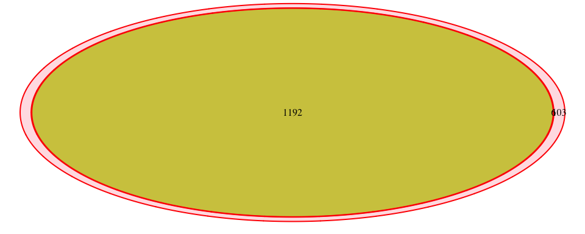<!-- -->

```
## (polygon[GRID.polygon.11], polygon[GRID.polygon.12], polygon[GRID.polygon.13], polygon[GRID.polygon.14], polygon[GRID.polygon.15], polygon[GRID.polygon.16], text[GRID.text.17], text[GRID.text.18], text[GRID.text.19], text[GRID.text.20], text[GRID.text.21], text[GRID.text.22])
```

```r
rm(s1, s2, s3, s12, s23, s13, s123)
```


## Load metabolite description


```r
serum_qc_table <- read.delim("../../data/Metabolome_codebook_chf_serum.csv", sep = ",", header = TRUE)
urine_qc_table <- read.delim("../../data/Metabolome_codebook_chf_urine.csv", sep = ";", header = TRUE)
```

### Update fData

Serum:


```r
fd <- fData(metabol_serum)
fd$feature_name <- rownames(fd)
fd <- merge(fd, serum_qc_table, by.x="feature_name", by.y="Metab_name", all.x=TRUE)
fd$Class.y <- tolower(fd$Class.y)
table(duplicated(fd$feature_name))
```

```
## 
## FALSE 
##   177
```

```r
rownames(fd) <- fd$feature_name
fData(metabol_serum) <- fd[featureNames(metabol_serum), ]
rm(fd)
```

Urine:


```r
fd <- fData(metabol_urine)
fd$feature_name <- rownames(fd)
fd <- merge(fd, urine_qc_table, by="feature_name")
table(duplicated(fd$feature_name))
```

```
## 
## FALSE 
##    44
```

```r
rownames(fd) <- fd$feature_name
fData(metabol_urine) <- fd[featureNames(metabol_urine), ]
rm(fd)
```

# Create blocsk of metabolites

## Serum


```r
serum_blocks <- lapply(unique(fData(metabol_serum)$Class.x), function(cls) {
	metabol_serum[fData(metabol_serum)$Class.x == cls, ]
})
names(serum_blocks) <- unique(fData(metabol_serum)$Class.x)
```

## Urine


```r
urine_blocks <- lapply(unique(fData(metabol_urine)$Class), function(cls) {
	metabol_urine[fData(metabol_urine)$Class == cls, ]
})
names(urine_blocks) <- unique(fData(metabol_urine)$Class)
```

# Principal Component Analysis

## Serum


```r
pca_full_serum <- prcomp(t(exprs(metabol_serum)), 
	center = TRUE, scale = TRUE)

var <- pca_full_serum$sdev^2 / sum(pca_full_serum$sdev^2)
data.frame(PC = paste("PC ", seq(length(pca_full_serum$sdev))), 
	Var = sprintf("%.2f %%", var * 100))[1:20, ]
```

```
##        PC     Var
## 1   PC  1 23.30 %
## 2   PC  2  8.66 %
## 3   PC  3  7.37 %
## 4   PC  4  4.82 %
## 5   PC  5  4.26 %
## 6   PC  6  3.90 %
## 7   PC  7  3.41 %
## 8   PC  8  3.17 %
## 9   PC  9  2.25 %
## 10 PC  10  2.13 %
## 11 PC  11  1.94 %
## 12 PC  12  1.73 %
## 13 PC  13  1.62 %
## 14 PC  14  1.37 %
## 15 PC  15  1.35 %
## 16 PC  16  1.12 %
## 17 PC  17  1.04 %
## 18 PC  18  1.00 %
## 19 PC  19  0.95 %
## 20 PC  20  0.90 %
```


```r
plot_grid(
	plot_grid(
		fviz_pca_ind(pca_full_serum, 
					 label = "none",
					 pointshape = 20
			) +
			ggtitle("1301 children in the exposome set"),
		fviz_eig(pca_full_serum) +
			ggtitle("Variance explained by PCs"),
		ncol = 2
	),
	fviz_pca_var(pca_full_serum,
		col.var = fData(metabol_serum)[rownames(pca_full_serum$rotation), "Class.x"],
		label = "none",
		legend.title = "Family"
    ) + ggtitle("177 metaboloites measured in serum"),
	ncol = 1, nrow = 2
)
```

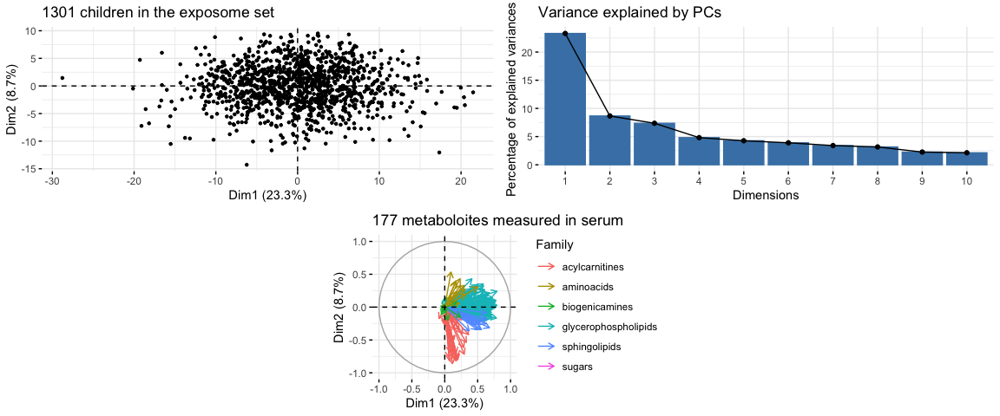<!-- -->


## Urine


```r
pca_full_urine <- prcomp(t(exprs(metabol_urine)), 
	center = TRUE, scale = TRUE)

var <- pca_full_urine$sdev^2 / sum(pca_full_urine$sdev^2)
data.frame(PC = paste("PC ", seq(length(pca_full_urine$sdev))), 
	Var = sprintf("%.2f %%", var * 100))[1:20, ]
```

```
##        PC     Var
## 1   PC  1 10.69 %
## 2   PC  2  6.56 %
## 3   PC  3  5.06 %
## 4   PC  4  3.99 %
## 5   PC  5  3.63 %
## 6   PC  6  3.60 %
## 7   PC  7  3.37 %
## 8   PC  8  3.30 %
## 9   PC  9  3.07 %
## 10 PC  10  2.78 %
## 11 PC  11  2.66 %
## 12 PC  12  2.60 %
## 13 PC  13  2.47 %
## 14 PC  14  2.35 %
## 15 PC  15  2.27 %
## 16 PC  16  2.23 %
## 17 PC  17  2.19 %
## 18 PC  18  2.07 %
## 19 PC  19  2.04 %
## 20 PC  20  1.96 %
```


```r
plot_grid(
	plot_grid(
		fviz_pca_ind(pca_full_urine, 
					 label = "none",
					 pointshape = 20
			) +
			ggtitle("1301 children in the exposome set"),
		fviz_eig(pca_full_urine) +
			ggtitle("Variance explained by PCs"),
		ncol = 2
	),
	fviz_pca_var(pca_full_urine,
		col.var = fData(metabol_urine)[rownames(pca_full_urine$rotation), "Class"],
		label = "none",
		legend.title = "Family"
    ) + ggtitle("44 metaboloites measured in urine"),
	ncol = 1, nrow = 2
)
```

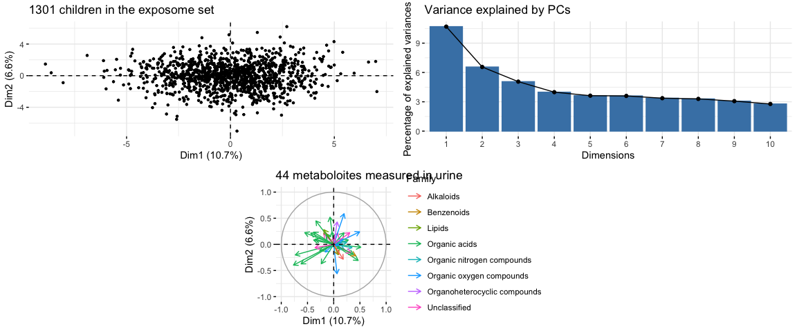<!-- -->

# Principal Components Analysis per class of metabolites

## Serum


```r
color_serum <- c(
	"#C0C0C0", #silver"
	"#00BFFF", #deepskyblue 
	"#800000", #maroon
	"#0000FF", #blue 
	"#FF4500", #orangered
	"#FFD700") #gold
names(color_serum) <- c("sugars", "aminoacids", "biogenicamines", 
	"acylcarnitines" , "glycerophospholipids", "sphingolipids")
```


```r
pca_serum <- lapply(serum_blocks, function(ds) {
	prcomp(t(exprs(ds)), center = TRUE, scale = TRUE)
})
names(pca_serum) <- names(serum_blocks)
```


```r
plots <- list()
jj <- 1
for(ii in seq(1, length(pca_serum))) {
	if(nrow(pca_serum[[ii]]$rotation) > 1) {
	plots[[jj]] <- fviz_pca_ind(pca_serum[[ii]], 
					label = "none",
					pointshape = 20) +
			ggtitle("1301 children") + theme(legend.position = "none")
	plots[[jj + 1]] <- fviz_pca_var(pca_serum[[ii]],
		col.var = color_serum[fData(metabol_serum)[rownames(pca_serum[[ii]]$rotation), "Class.x"]][1],
		label = "none",
		legend.title = "Family"
    ) + ggtitle(names(pca_serum)[ii]) + theme(legend.position = "none")
	plots[[jj + 2]] <- fviz_eig(pca_serum[[ii]]) +
			ggtitle("Variance explained")
	jj <- jj + 3
	}
}
plot_grid(plotlist = plots, ncol = 3)
```

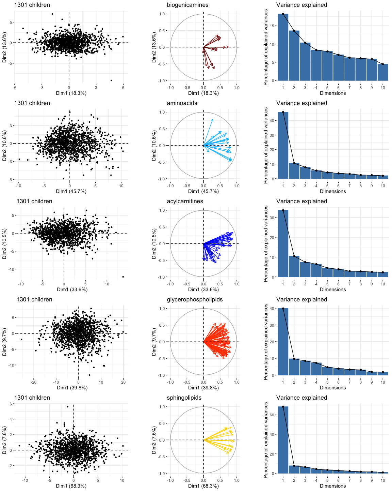<!-- -->


### Number of PCs to use for each family

Number of PCs to be used in order to get an explained variance over 85%.


```r
exp_sel <- do.call(rbind, lapply(names(serum_blocks), function(fam) {
	pca <- pca_serum[[fam]]
	var <- pca$sdev^2 / sum(pca$sdev^2)
	cvar <- cumsum(var)
	sel <- which(cvar > 0.85)[1]
	nexp = nrow(pca_serum[[fam]]$rotation)
	if (sel < 2 || sel == nexp ) {
		use <- "metabolites"
	} else  if(sel >= nexp-1) {
		use <- "pcs + metabolites"
	} else {
		use <- "pcs"
	}
	data.frame(Family=fam, NPCs=sel, NMetab=nexp, To_Use=use)
}))
exp_sel
```

```
##                 Family NPCs NMetab      To_Use
## 1       biogenicamines   10     14         pcs
## 2           aminoacids    9     21         pcs
## 3       acylcarnitines   16     38         pcs
## 4               sugars    1      1 metabolites
## 5 glycerophospholipids   11     89         pcs
## 6        sphingolipids    4     14         pcs
```

### Create new ExposomeSet but with PCs if required


```r
serumPC <- data.frame(
	# biogenicamines
	biogenicamines_pc1 = pca_serum[[1]]$x[ , 1],
	biogenicamines_pc2 = pca_serum[[1]]$x[ , 2],
	biogenicamines_pc3 = pca_serum[[1]]$x[ , 3],
	biogenicamines_pc4 = pca_serum[[1]]$x[ , 4],
	biogenicamines_pc5 = pca_serum[[1]]$x[ , 5],
	biogenicamines_pc6 = pca_serum[[1]]$x[ , 6],
	biogenicamines_pc7 = pca_serum[[1]]$x[ , 7],
	biogenicamines_pc8 = pca_serum[[1]]$x[ , 8],
	biogenicamines_pc9 = pca_serum[[1]]$x[ , 9],
	biogenicamines_pc10 = pca_serum[[1]]$x[ , 10],
	# aminoacids
	aminoacids_pc1 = pca_serum[[2]]$x[ , 1],
	aminoacids_pc2 = pca_serum[[2]]$x[ , 2],
	aminoacids_pc3 = pca_serum[[2]]$x[ , 3],
	aminoacids_pc4 = pca_serum[[2]]$x[ , 4],
	aminoacids_pc5 = pca_serum[[2]]$x[ , 5],
	aminoacids_pc6 = pca_serum[[2]]$x[ , 6],
	aminoacids_pc7 = pca_serum[[2]]$x[ , 7],
	aminoacids_pc8 = pca_serum[[2]]$x[ , 8],
	aminoacids_pc9 = pca_serum[[2]]$x[ , 9],
	# acylcarnitines
	acylcarnitines_pc1 = pca_serum[[3]]$x[ , 1],
	acylcarnitines_pc2 = pca_serum[[3]]$x[ , 2],
	acylcarnitines_pc3 = pca_serum[[3]]$x[ , 3],
	acylcarnitines_pc4 = pca_serum[[3]]$x[ , 4],
	acylcarnitines_pc5 = pca_serum[[3]]$x[ , 5],
	acylcarnitines_pc6 = pca_serum[[3]]$x[ , 6],
	acylcarnitines_pc7 = pca_serum[[3]]$x[ , 7],
	acylcarnitines_pc8 = pca_serum[[3]]$x[ , 8],
	acylcarnitines_pc9 = pca_serum[[3]]$x[ , 9],
	acylcarnitines_pc10 = pca_serum[[3]]$x[ , 10],
	acylcarnitines_pc11 = pca_serum[[3]]$x[ , 11],
	acylcarnitines_pc12 = pca_serum[[3]]$x[ , 12],
	acylcarnitines_pc13 = pca_serum[[3]]$x[ , 13],
	acylcarnitines_pc14 = pca_serum[[3]]$x[ , 14],
	acylcarnitines_pc15 = pca_serum[[3]]$x[ , 15],
	acylcarnitines_pc16 = pca_serum[[3]]$x[ , 16],
	# sugars
	metab_51 = exprs(metabol_serum)["metab_51", rownames(pca_serum[[4]]$x)],
	# glycerophospholipids
	glycerophospholipids_pc1 = pca_serum[[5]]$x[ , 1],
	glycerophospholipids_pc2 = pca_serum[[5]]$x[ , 2],
	glycerophospholipids_pc3 = pca_serum[[5]]$x[ , 3],
	glycerophospholipids_pc4 = pca_serum[[5]]$x[ , 4],
	glycerophospholipids_pc5 = pca_serum[[5]]$x[ , 5],
	glycerophospholipids_pc6 = pca_serum[[5]]$x[ , 6],
	glycerophospholipids_pc7 = pca_serum[[5]]$x[ , 7],
	glycerophospholipids_pc8 = pca_serum[[5]]$x[ , 8],
	glycerophospholipids_pc9 = pca_serum[[5]]$x[ , 9],
	glycerophospholipids_pc10 = pca_serum[[5]]$x[ , 10],
	glycerophospholipids_pc11 = pca_serum[[5]]$x[ , 11],
	# sphingolipids
	sphingolipids_pc1 = pca_serum[[6]]$x[ , 1],
	sphingolipids_pc2 = pca_serum[[6]]$x[ , 2],
	sphingolipids_pc3 = pca_serum[[6]]$x[ , 3],
	sphingolipids_pc4 = pca_serum[[6]]$x[ , 4]
)
serumPC_fam <- data.frame(
	var = colnames(serumPC),
	family = c(
		rep("biogenicamines", 10),
		rep("aminoacids", 9),
		rep("acylcarnitines", 16),
		rep("sugars", 1),
		rep("glycerophospholipids", 11),
		rep("sphingolipids", 4)
	)
)
rownames(serumPC_fam) <- serumPC_fam$var
```


```r
save(serumPC, serumPC_fam, color_serum, file = "serumPC.RData")
```


```r
par(mfrow=c(11, 5))
for(exp in colnames(serumPC)) {
	hist(serumPC[ , exp], main = exp, xlab = exp, col = color_serum[serumPC_fam[exp, "family"]])
}
```

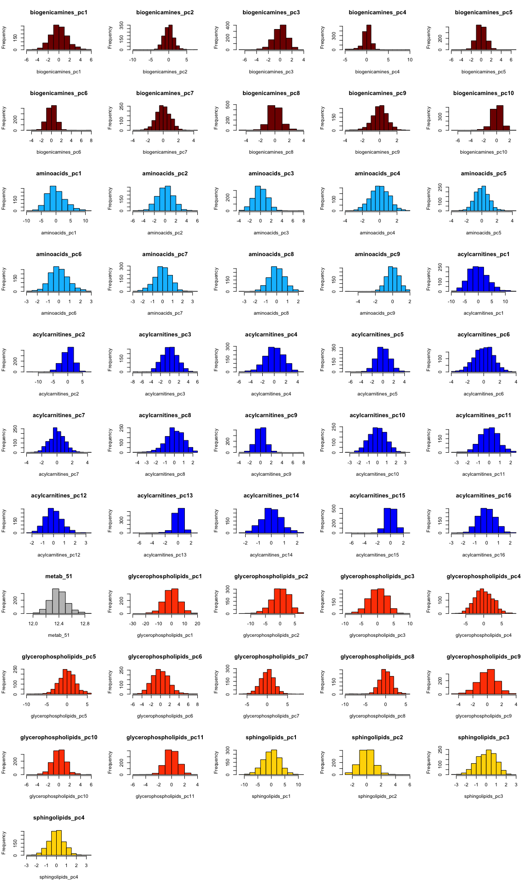<!-- -->
## Urine


```r
color_urine <- c(
	"#C0C0C0", #silver"
	"#00BFFF", #deepskyblue 
	"#800000", #maroon
	"#0000FF", #blue 
	"#228B22", #forestgreen
	"#FF4500", #orangered
	"#FF69B4", #hotpink
	"#FFD700") #gold
names(color_urine) <- c("Unclassified", "Organic acids", "Organic oxygen compounds ", 
	"Organic nitrogen compounds " , "Benzenoids ",  "Lipids", 
	"Organoheterocyclic compounds ",  "Alkaloids")
```


```r
pca_urine <- lapply(urine_blocks, function(ds) {
	prcomp(t(exprs(ds)), center = TRUE, scale = TRUE)
})
names(pca_urine) <- names(urine_blocks)
```


```r
plots <- list()
jj <- 1
for(ii in seq(1, length(pca_urine))) {
	if(nrow(pca_urine[[ii]]$rotation) > 1) {
	plots[[jj]] <- fviz_pca_ind(pca_urine[[ii]], 
					label = "none",
					pointshape = 20) +
			ggtitle("1301 children") + theme(legend.position = "none")
	plots[[jj + 1]] <- fviz_pca_var(pca_urine[[ii]],
		col.var = color_urine[fData(metabol_urine)[rownames(pca_urine[[ii]]$rotation), "Class"]][1],
		label = "none",
		legend.title = "Family"
    ) + ggtitle(names(pca_urine)[ii]) + theme(legend.position = "none")
	plots[[jj + 2]] <- fviz_eig(pca_urine[[ii]]) +
			ggtitle("Variance explained")
	jj <- jj + 3
	}
}
plot_grid(plotlist = plots, ncol = 3)
```

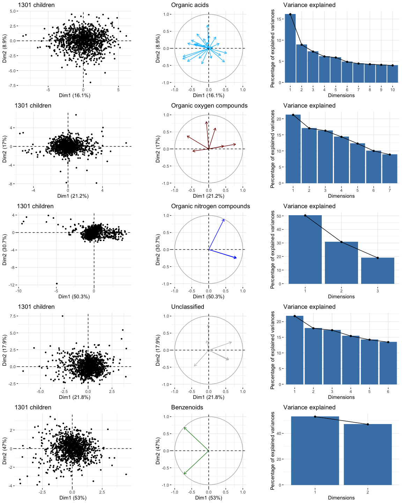<!-- -->

### Number of PCs to use for each family

Number of PCs to be used in order to get an explained variance over 85%.


```r
exp_sel <- do.call(rbind, lapply(names(urine_blocks), function(fam) {
	pca <- pca_urine[[fam]]
	var <- pca$sdev^2 / sum(pca$sdev^2)
	cvar <- cumsum(var)
	sel <- which(cvar > 0.85)[1]
	nexp = nrow(pca_urine[[fam]]$rotation)
	if (sel < 2 || sel == nexp ) {
		use <- "metabolites"
	} else  if(sel >= nexp-1) {
		use <- "pcs + metabolites"
	} else {
		use <- "pcs"
	}
	data.frame(Family=fam, NPCs=sel, NMetab=nexp, To_Use=use)
}))
exp_sel
```

```
##                          Family NPCs NMetab            To_Use
## 1                 Organic acids   16     23               pcs
## 2     Organic oxygen compounds     6      7 pcs + metabolites
## 3   Organic nitrogen compounds     3      3       metabolites
## 4                  Unclassified    5      6 pcs + metabolites
## 5                   Benzenoids     2      2       metabolites
## 6                        Lipids    1      1       metabolites
## 7 Organoheterocyclic compounds     1      1       metabolites
## 8                     Alkaloids    1      1       metabolites
```


### Create new ExposomeSet but with PCs if required


```r
urinePC <- data.frame(
	# "Organic acids"  
	orgacis_pc1 = pca_urine[[1]]$x[ , 1],
	orgacis_pc2 = pca_urine[[1]]$x[ , 2],
	orgacis_pc3 = pca_urine[[1]]$x[ , 3],
	orgacis_pc4 = pca_urine[[1]]$x[ , 4],
	orgacis_pc5 = pca_urine[[1]]$x[ , 5],
	orgacis_pc6 = pca_urine[[1]]$x[ , 6],
	orgacis_pc7 = pca_urine[[1]]$x[ , 7],
	orgacis_pc8 = pca_urine[[1]]$x[ , 8],
	orgacis_pc9 = pca_urine[[1]]$x[ , 9],
	orgacis_pc10 = pca_urine[[1]]$x[ , 10],
	orgacis_pc11 = pca_urine[[1]]$x[ , 11],
	orgacis_pc12 = pca_urine[[1]]$x[ , 12],
	orgacis_pc13 = pca_urine[[1]]$x[ , 13],
	orgacis_pc14 = pca_urine[[1]]$x[ , 14],
	orgacis_pc15 = pca_urine[[1]]$x[ , 15],
	orgacis_pc16 = pca_urine[[1]]$x[ , 16],
	# "Organic oxygen compounds "
	orgoxycom_pc1 = pca_urine[[2]]$x[ , 1],
	orgoxycom_pc2 = pca_urine[[2]]$x[ , 2],
	orgoxycom_pc3 = pca_urine[[2]]$x[ , 3],
	orgoxycom_pc4 = pca_urine[[2]]$x[ , 4],
	orgoxycom_pc5 = pca_urine[[2]]$x[ , 5],
	orgoxycom_pc6 = pca_urine[[2]]$x[ , 6],
	metab_6 = exprs(metabol_urine)["metab_6", rownames(pca_urine[[3]]$x)],
	metab_7 = exprs(metabol_urine)["metab_7", rownames(pca_urine[[3]]$x)],
	metab_21 = exprs(metabol_urine)["metab_21", rownames(pca_urine[[3]]$x)],
	metab_27 = exprs(metabol_urine)["metab_27", rownames(pca_urine[[3]]$x)],
	metab_31 = exprs(metabol_urine)["metab_31", rownames(pca_urine[[3]]$x)],
	metab_35 = exprs(metabol_urine)["metab_35", rownames(pca_urine[[3]]$x)],
	metab_36 = exprs(metabol_urine)["metab_36", rownames(pca_urine[[3]]$x)],
	# "Organic nitrogen compounds "
	metab_17 = exprs(metabol_urine)["metab_17", rownames(pca_urine[[3]]$x)],
	metab_18 = exprs(metabol_urine)["metab_18", rownames(pca_urine[[3]]$x)],
	metab_20 = exprs(metabol_urine)["metab_20", rownames(pca_urine[[3]]$x)],
	# "Unclassified"
	unclassified_pc1 = pca_urine[[4]]$x[ , 1],
	unclassified_pc2 = pca_urine[[4]]$x[ , 2],
	unclassified_pc3 = pca_urine[[4]]$x[ , 3],
	unclassified_pc4 = pca_urine[[4]]$x[ , 4],
	unclassified_pc5 = pca_urine[[4]]$x[ , 5],
	metab_19 = exprs(metabol_urine)["metab_19", rownames(pca_urine[[4]]$x)],
	metab_26 = exprs(metabol_urine)["metab_26", rownames(pca_urine[[4]]$x)],
	metab_28 = exprs(metabol_urine)["metab_28", rownames(pca_urine[[4]]$x)],
	metab_30 = exprs(metabol_urine)["metab_30", rownames(pca_urine[[4]]$x)],
	metab_42 = exprs(metabol_urine)["metab_42", rownames(pca_urine[[4]]$x)],
	metab_44 = exprs(metabol_urine)["metab_44", rownames(pca_urine[[4]]$x)],
	# "Benzenoids "
	metab_25 = exprs(metabol_urine)["metab_25", rownames(pca_urine[[5]]$x)],
	metab_39 = exprs(metabol_urine)["metab_39", rownames(pca_urine[[5]]$x)],
	# "Lipids"
	metab_29 = exprs(metabol_urine)["metab_29", rownames(pca_urine[[6]]$x)],
	# "Organoheterocyclic compounds "
	metab_38 = exprs(metabol_urine)["metab_38", rownames(pca_urine[[7]]$x)],
	# "Alkaloids"
	metab_43 = exprs(metabol_urine)["metab_43", rownames(pca_urine[[8]]$x)]
)
urinePC_fam <- data.frame(
	var = colnames(urinePC),
	family = c(
		rep("Organic acids", 16),
		rep("Organic oxygen compounds ", 13),
		rep("Organic nitrogen compounds ", 3),
		rep("Unclassified", 11),
		rep("Benzenoids ", 2),
		rep("Lipids", 1),
		rep("Organoheterocyclic compounds ", 1),
		rep("Alkaloids", 1)
	)
)
rownames(urinePC_fam) <- urinePC_fam$var
```


```r
save(urinePC, urinePC_fam, color_urine, file = "urinePC.RData")
```


```r
par(mfrow=c(10, 5))
for(exp in colnames(urinePC)) {
	hist(urinePC[ , exp], main = exp, xlab = exp, col = color_urine[urinePC_fam[exp, "family"]])
}
```

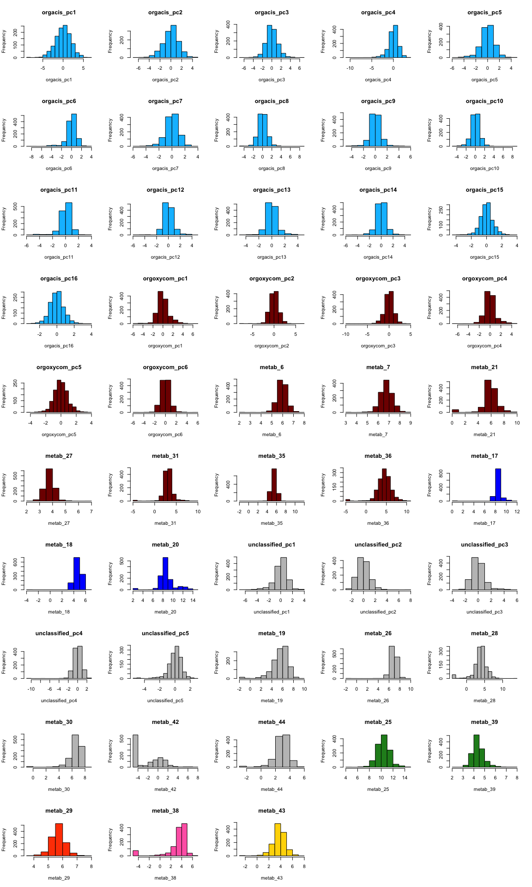<!-- -->

# Association analyses with exposures


```r
load("../../data/exposome.RData")

covariates$ID <- paste0('sample_', covariates$ID)
rownames(covariates) <- covariates$ID

phenotype$ID <- paste0('sample_', phenotype$ID)
rownames(phenotype) <- phenotype$ID
```


## Serum

Merge serum with exposure covariates and exposures:


```r
serum_covars <- cbind(covariates[rownames(serumPC), c("h_cohort", "h_edumc_None")],
	pData(metabol_serum)[rownames(serumPC), c("e3_sex", "age_sample_years")],
	phenotype[rownames(serumPC), c("hs_zbmi_who"), drop=FALSE])
dim(serum_covars)
```

```
## [1] 1198    5
```

```r
c("e3_sex", "h_cohort", "h_edumc_None", "hs_zbmi_who", "age_sample_years") %in%
	colnames(serum_covars)
```

```
## [1] TRUE TRUE TRUE TRUE TRUE
```

```r
serum_covars <- cbind(serum_covars, exposomePC[rownames(serum_covars), ])
dim(serum_covars)
```

```
## [1] 1198   32
```

Add exposures and perform model:


```r
runExpoSerum <- function(expname){
  model <- model.matrix(
  	formula(paste("~ ", expname, " + e3_sex + h_cohort + h_edumc_None + hs_zbmi_who + age_sample_years")),
    serum_covars)
  lmF <- lmFit(t(serumPC), model)
  lmFe <- eBayes(lmF)
  tab <- topTable(lmFe, number = Inf, coef = 2)
  tab$exposure <- expname
  tab$feat.ID <- rownames(tab)
  tab
}

exps <- colnames(exposomePC)
expoSerum <- lapply(exps, runExpoSerum)
```


```r
expoSerumDF <- Reduce(rbind, expoSerum) %>%
  tibble() %>%
  arrange(P.Value) %>%
  mutate(adj.P.Value.all = p.adjust(P.Value, method = "fdr")) %>%
  left_join(mutate(exposomePC_fam, exposure = var) %>% select(-var), by = "exposure")
datatable(expoSerumDF)
```

```{=html}
<div id="htmlwidget-b0d696bc3a444a9d21bb" style="width:100%;height:auto;" class="datatables html-widget"></div>
<script type="application/json" data-for="htmlwidget-b0d696bc3a444a9d21bb">{"x":{"filter":"none","data":[["1","2","3","4","5","6","7","8","9","10","11","12","13","14","15","16","17","18","19","20","21","22","23","24","25","26","27","28","29","30","31","32","33","34","35","36","37","38","39","40","41","42","43","44","45","46","47","48","49","50","51","52","53","54","55","56","57","58","59","60","61","62","63","64","65","66","67","68","69","70","71","72","73","74","75","76","77","78","79","80","81","82","83","84","85","86","87","88","89","90","91","92","93","94","95","96","97","98","99","100","101","102","103","104","105","106","107","108","109","110","111","112","113","114","115","116","117","118","119","120","121","122","123","124","125","126","127","128","129","130","131","132","133","134","135","136","137","138","139","140","141","142","143","144","145","146","147","148","149","150","151","152","153","154","155","156","157","158","159","160","161","162","163","164","165","166","167","168","169","170","171","172","173","174","175","176","177","178","179","180","181","182","183","184","185","186","187","188","189","190","191","192","193","194","195","196","197","198","199","200","201","202","203","204","205","206","207","208","209","210","211","212","213","214","215","216","217","218","219","220","221","222","223","224","225","226","227","228","229","230","231","232","233","234","235","236","237","238","239","240","241","242","243","244","245","246","247","248","249","250","251","252","253","254","255","256","257","258","259","260","261","262","263","264","265","266","267","268","269","270","271","272","273","274","275","276","277","278","279","280","281","282","283","284","285","286","287","288","289","290","291","292","293","294","295","296","297","298","299","300","301","302","303","304","305","306","307","308","309","310","311","312","313","314","315","316","317","318","319","320","321","322","323","324","325","326","327","328","329","330","331","332","333","334","335","336","337","338","339","340","341","342","343","344","345","346","347","348","349","350","351","352","353","354","355","356","357","358","359","360","361","362","363","364","365","366","367","368","369","370","371","372","373","374","375","376","377","378","379","380","381","382","383","384","385","386","387","388","389","390","391","392","393","394","395","396","397","398","399","400","401","402","403","404","405","406","407","408","409","410","411","412","413","414","415","416","417","418","419","420","421","422","423","424","425","426","427","428","429","430","431","432","433","434","435","436","437","438","439","440","441","442","443","444","445","446","447","448","449","450","451","452","453","454","455","456","457","458","459","460","461","462","463","464","465","466","467","468","469","470","471","472","473","474","475","476","477","478","479","480","481","482","483","484","485","486","487","488","489","490","491","492","493","494","495","496","497","498","499","500","501","502","503","504","505","506","507","508","509","510","511","512","513","514","515","516","517","518","519","520","521","522","523","524","525","526","527","528","529","530","531","532","533","534","535","536","537","538","539","540","541","542","543","544","545","546","547","548","549","550","551","552","553","554","555","556","557","558","559","560","561","562","563","564","565","566","567","568","569","570","571","572","573","574","575","576","577","578","579","580","581","582","583","584","585","586","587","588","589","590","591","592","593","594","595","596","597","598","599","600","601","602","603","604","605","606","607","608","609","610","611","612","613","614","615","616","617","618","619","620","621","622","623","624","625","626","627","628","629","630","631","632","633","634","635","636","637","638","639","640","641","642","643","644","645","646","647","648","649","650","651","652","653","654","655","656","657","658","659","660","661","662","663","664","665","666","667","668","669","670","671","672","673","674","675","676","677","678","679","680","681","682","683","684","685","686","687","688","689","690","691","692","693","694","695","696","697","698","699","700","701","702","703","704","705","706","707","708","709","710","711","712","713","714","715","716","717","718","719","720","721","722","723","724","725","726","727","728","729","730","731","732","733","734","735","736","737","738","739","740","741","742","743","744","745","746","747","748","749","750","751","752","753","754","755","756","757","758","759","760","761","762","763","764","765","766","767","768","769","770","771","772","773","774","775","776","777","778","779","780","781","782","783","784","785","786","787","788","789","790","791","792","793","794","795","796","797","798","799","800","801","802","803","804","805","806","807","808","809","810","811","812","813","814","815","816","817","818","819","820","821","822","823","824","825","826","827","828","829","830","831","832","833","834","835","836","837","838","839","840","841","842","843","844","845","846","847","848","849","850","851","852","853","854","855","856","857","858","859","860","861","862","863","864","865","866","867","868","869","870","871","872","873","874","875","876","877","878","879","880","881","882","883","884","885","886","887","888","889","890","891","892","893","894","895","896","897","898","899","900","901","902","903","904","905","906","907","908","909","910","911","912","913","914","915","916","917","918","919","920","921","922","923","924","925","926","927","928","929","930","931","932","933","934","935","936","937","938","939","940","941","942","943","944","945","946","947","948","949","950","951","952","953","954","955","956","957","958","959","960","961","962","963","964","965","966","967","968","969","970","971","972","973","974","975","976","977","978","979","980","981","982","983","984","985","986","987","988","989","990","991","992","993","994","995","996","997","998","999","1000","1001","1002","1003","1004","1005","1006","1007","1008","1009","1010","1011","1012","1013","1014","1015","1016","1017","1018","1019","1020","1021","1022","1023","1024","1025","1026","1027","1028","1029","1030","1031","1032","1033","1034","1035","1036","1037","1038","1039","1040","1041","1042","1043","1044","1045","1046","1047","1048","1049","1050","1051","1052","1053","1054","1055","1056","1057","1058","1059","1060","1061","1062","1063","1064","1065","1066","1067","1068","1069","1070","1071","1072","1073","1074","1075","1076","1077","1078","1079","1080","1081","1082","1083","1084","1085","1086","1087","1088","1089","1090","1091","1092","1093","1094","1095","1096","1097","1098","1099","1100","1101","1102","1103","1104","1105","1106","1107","1108","1109","1110","1111","1112","1113","1114","1115","1116","1117","1118","1119","1120","1121","1122","1123","1124","1125","1126","1127","1128","1129","1130","1131","1132","1133","1134","1135","1136","1137","1138","1139","1140","1141","1142","1143","1144","1145","1146","1147","1148","1149","1150","1151","1152","1153","1154","1155","1156","1157","1158","1159","1160","1161","1162","1163","1164","1165","1166","1167","1168","1169","1170","1171","1172","1173","1174","1175","1176","1177","1178","1179","1180","1181","1182","1183","1184","1185","1186","1187","1188","1189","1190","1191","1192","1193","1194","1195","1196","1197","1198","1199","1200","1201","1202","1203","1204","1205","1206","1207","1208","1209","1210","1211","1212","1213","1214","1215","1216","1217","1218","1219","1220","1221","1222","1223","1224","1225","1226","1227","1228","1229","1230","1231","1232","1233","1234","1235","1236","1237","1238","1239","1240","1241","1242","1243","1244","1245","1246","1247","1248","1249","1250","1251","1252","1253","1254","1255","1256","1257","1258","1259","1260","1261","1262","1263","1264","1265","1266","1267","1268","1269","1270","1271","1272","1273","1274","1275","1276","1277","1278","1279","1280","1281","1282","1283","1284","1285","1286","1287","1288","1289","1290","1291","1292","1293","1294","1295","1296","1297","1298","1299","1300","1301","1302","1303","1304","1305","1306","1307","1308","1309","1310","1311","1312","1313","1314","1315","1316","1317","1318","1319","1320","1321","1322","1323","1324","1325","1326","1327","1328","1329","1330","1331","1332","1333","1334","1335","1336","1337","1338","1339","1340","1341","1342","1343","1344","1345","1346","1347","1348","1349","1350","1351","1352","1353","1354","1355","1356","1357","1358","1359","1360","1361","1362","1363","1364","1365","1366","1367","1368","1369","1370","1371","1372","1373","1374","1375","1376","1377"],[-0.427830533261743,-0.275248054227682,-0.169593812577802,0.100036178959118,-0.259601357901947,-0.198799132651552,-0.769227869958625,0.0967788004738667,0.669877084648857,0.302475696940093,0.216224796432149,0.0884489783714332,0.175821202888659,0.134136567866481,-0.0935490665622432,-0.365973327147963,0.221475379560049,-0.111286642369342,0.172746715628355,0.160719100267799,-0.138150473600205,0.166081958932374,-0.0899587670109297,-0.241164677966861,-0.0354254704244358,0.238432142364592,-0.0284112730641617,-0.216619960397033,0.209665249654903,0.0873467733569867,-0.305963612458716,-0.168568362569217,0.136481551912979,-0.164407210065765,0.419586203856748,0.0938336077400786,-0.0748116328286327,-0.0762320009549601,0.113098095740652,-0.171444018651908,0.140938371445781,-0.579077381452215,0.144000931190668,0.173035679908265,0.129332372949472,0.121391556898769,0.0168208247296052,0.159991482177519,0.132886751064374,0.195713570104856,0.248150263783021,-0.195218670660638,-0.271020824855861,0.132056312516148,-0.113539855260945,0.409757497790508,-0.0587128219049397,-0.301063462822003,0.0230866493189,-0.286872674864435,0.0717854840955002,0.166156826988363,-0.101121501189783,-0.0220476796661357,-0.58853735572217,-0.104892844832097,-0.180207896725718,-0.0899967222129243,0.238076979972878,0.0200623994921991,-0.125089558039546,0.0565306020278522,0.0881030913387252,-0.067528449692672,0.0257529235619332,-0.0418539376952373,0.203834828685881,-0.206717398298433,-0.13323859421852,0.698953823946642,0.030279819092848,0.0361364587901823,0.282484477105619,0.0213217939221139,-0.0737602882285805,-0.104590837014192,0.129887323649429,-0.0604052898348329,-0.111011132492635,0.143043174052778,0.0752625155220841,-0.171030949799389,-0.0890907864375642,0.0837520707130294,0.0965135886883058,-0.017894255996816,0.0792706748148805,-0.112733690904093,-0.0680833789974784,-0.0720790201456437,-0.217041367534227,-0.131547323995403,0.0549703391128636,0.0949917363579988,-0.0146030022233306,-0.115845776350313,0.0553097954667853,0.0681447544318213,-0.245998337387598,0.0649565618168307,0.331215583485029,0.0830405156139673,-0.0870884538268219,-0.0547670256589601,-0.0554006264549039,0.619892422160658,0.088829291651036,-0.107596200669758,-0.0507267394636508,-0.111796752146623,0.123450990054228,0.0689399203538169,-0.528488633622038,0.0658219442389972,-0.0427128805420292,-0.0525191507545589,0.0525434265960895,-0.240396722053446,-0.170838948956129,0.143472239797189,0.0739834796154299,0.281925670312084,0.323839429255379,0.380040076847977,-0.0795426617816573,-0.0908499840524856,-0.016519747482646,0.0323900818460941,0.0464899006495912,-0.162214445012854,-0.168721047434631,-0.0588921029521833,0.579952237060017,-0.629633756656912,0.107504314202332,0.0103674531975213,-0.100053980356279,-0.0194860870736237,-0.317394568360099,-0.0467695147205451,-0.130906438407074,-0.250595364258732,-0.160071964372541,-0.0449676520878108,0.0762412096387088,0.00773776916596449,-0.0210913836842692,-0.333512058758677,-0.405872956163159,-0.270164758077465,-0.414626856549544,0.0112608491024164,0.143069845982454,-0.0763057654680134,0.204757314280718,-0.0821525972152712,0.0804532649441748,0.0154839289742769,-0.0600089086784431,-0.0821648257760046,0.0989781576911723,0.0735878378013049,0.0495404318703014,0.0716482286621769,-0.0974016126044377,0.137739561678338,0.0930513878547696,0.116126349709327,0.0581367502603925,0.0561833261369383,-0.0917117753550001,0.451884179386092,0.0920026729478523,-0.0527120988213021,-0.0973555069046668,-0.092638348074478,0.410616323094317,0.168059059282681,0.165061279201093,-0.0346121808873089,0.0741692858820739,-0.136476026978173,-0.0591335033584354,0.241519780679035,0.0197674904560101,0.1019704914641,-0.155243179421189,0.0248461505554309,-0.0871264911742369,-0.0375140454614167,0.206213746909653,-0.389810585010117,0.0701409600483513,0.0333389997067821,0.111541437860262,-0.0758857955923763,0.0398262397943562,-0.0425623904054584,-0.108457770665981,-0.150592895238424,0.0685968858767269,0.0522585009483237,-0.0754197237888589,0.0656507209205126,-0.0634639636064407,0.0156084253483653,0.0212662040363323,-0.120712136889092,0.0856061343405,0.174442774522723,-0.0685399079738018,-0.0541271418284206,0.15674640228907,0.120784025270426,0.199286674700291,0.115304456366654,-0.064798904648827,0.150188757358075,0.0174711093362091,0.0116581378718946,0.0688818876975296,-0.158331542119691,0.250737654234394,0.292881142261528,0.0134260615659994,0.201096992570353,-0.0867400488499261,0.121267873970949,-0.175896109622519,0.0647886586470307,0.0430325936160809,0.0637089318419928,0.110631482892393,-0.0668886626074872,-0.0273134728923736,-0.056603513404317,0.062493423939189,-0.120503210118227,-0.00982505970853911,-0.0199397980478048,-0.549238631158486,-0.0756303361870732,0.0690111744881889,-0.118148374423625,-0.0351869177452327,0.0189511734101277,0.136315059928355,0.0806525444538953,0.0503805444618314,0.239110425718344,-0.0392594015539969,0.104153909188645,-0.0756081469745536,-0.0599996928229687,-0.0795668210331403,-0.0495562289265385,0.0215935773072841,-0.0213936532718004,0.0102840247023652,0.0163973505565556,0.0103780110467386,-0.0337528410709889,-0.0578085343475585,-0.0109182660583172,0.0680458481077447,0.0610302406015459,-0.087081443395385,-0.184010939175033,-0.0467116403775658,-0.180860218583071,-0.277019665762464,0.0641403257314206,0.042980462286991,-0.0768296585805739,-0.0453516897806799,0.143776174235194,-0.0759585249699067,-0.0495640933660658,-0.0367489347480159,-0.0905901579077652,-0.0768963385758443,-0.286649880451929,-0.0215209914902843,0.0694237707892606,0.0112248659586693,0.0649588427387351,-0.0517916058638585,0.0119857541657433,-0.00641352170579794,-0.056641646056378,0.0546895640023422,-0.0645659795239095,0.0589711000312755,-0.16261890092013,0.0772368366582842,-0.0264159523362698,0.00984380363101372,0.0288959648993103,0.0605451841603059,0.0122711470590743,-0.0784593849293177,0.151902089351123,-0.120477017492532,-0.0914806399019797,0.0549374105841682,-0.0461480441851865,0.031516016629615,-0.0429163443109957,0.0299044971891303,-0.00913943941105127,0.0101926749240788,-0.0105531131978801,-0.0506104873931741,-0.0229257581902782,0.0560363291280158,-0.0367371745217442,-0.0458462391904668,0.119113526979715,0.0653154728297472,-0.039866441005409,0.0886989521487579,-0.104054149953897,0.123001043746764,-0.0150707876128885,-0.0132481414718191,0.0181569463859802,-0.0836094956353341,-0.044462727331797,-0.0162837371454787,0.264800528588369,-0.0415112163603358,-0.131411685245151,-0.129036257337793,0.00819968094396796,0.107107760851035,0.032753058590115,0.0391955936293761,0.0365548492310367,0.032827666652786,-0.0212702614151531,0.094734975007669,0.0902711001232941,-0.014576350290452,-0.027853383449302,0.0318419657906567,0.0158530047067955,0.0912452312772588,-0.26157566391028,-0.108350290206288,-0.0059796022376502,-0.0381062146362047,-0.0397759996813265,0.0980671012697663,0.0163590496702085,0.0412483194873865,0.0957134381853235,0.0316426027273673,-0.0143122050580465,0.0705489801014911,-0.133900942243451,0.055566893786906,0.151678462945749,0.0100743592933243,-0.0107481022523105,0.0630134848566839,-0.0686692732064358,-0.0618296325100231,-0.0369615912410513,-0.333530731341911,0.149600879216531,-0.0302422778168533,-0.056069705459585,0.112484908875149,0.161587876249237,0.0568928967070932,-0.00852057098601445,0.0326115032205826,0.0692090977847506,0.120783846713332,-0.0502279124525726,-0.0246263612636838,0.0949169705528241,0.00764874912809344,0.0530749485494666,0.0307920292156997,-0.261441773507879,0.0518477599115259,0.104250980053164,0.0297745031201363,-0.0545528751271834,0.129632012174866,0.0680241129969664,-0.0388695225842192,-0.0962651495474147,-0.0862833026030741,-0.19470472022036,-0.0320186919324849,-0.109953776428227,0.0736960407861295,0.0493269364864334,0.0364215688643069,0.00877106540333264,0.0359075811497342,-0.0685684881887386,0.0408895135071724,-0.0540339690199715,-0.0621753192866966,-0.238576627915912,-0.023851406370218,0.172696844694442,0.0317420108157999,0.00844823860073048,-0.165441719085369,0.0478750205058872,-0.172446043390284,0.0979720217838115,0.412075920180381,0.0111220201776326,0.0691830813135,0.0309756467196294,0.0358136174029629,0.0163008434617008,0.111369738651731,0.0804956862696249,-0.030639599951262,0.0625606386915253,-0.0300618123343139,-0.0219515153665179,0.170383142153621,-0.0108796186092559,-0.00541762996985494,0.0398373311492363,-0.0112359597998122,0.039968474314529,0.0461979832327513,-0.00516493418345142,-0.0576458856848804,-0.0637346377832274,0.0478426447965726,0.00904254699791331,-0.0766571129854823,0.0247141198888331,-0.0414382511347568,-0.0350205664942793,0.0804641771030149,0.0413554692272893,-0.0332021971928,-0.0516392128145591,-0.0811851214371479,0.224535041867599,-0.0808118369306614,0.0137731170152754,-0.00909958990916668,-0.00997006019236136,0.00786970851167515,0.0423660364466659,0.012901311386522,-0.0418286962371647,0.0555731815313193,0.0309273143643104,-0.0904426636207398,-0.0143738788304192,-0.0448018742295264,-0.047248932863809,-0.0293822741229258,0.0835616523629712,0.0469816277437248,0.0466483222211572,-0.0482028753902134,-0.106894816226342,-0.0420974821812621,-0.0686970007141891,-0.06310038636431,-0.119354590954305,-0.0317538737184731,-0.0911517349833617,-0.103486024052153,0.160343096784788,-0.0337805923012419,0.0268576647683577,-0.0889825832049534,0.0534388731862425,-0.0891803874725601,0.0415204540719652,-0.456502845327354,0.0462567528532299,-0.165620259134672,0.0408561345519133,0.0442011670959678,-0.109906057597031,0.200214462542331,0.0427056037022993,0.115918886763235,0.12520970906014,0.0982651888170965,-0.0390925068366292,-0.0605076678398629,0.178224580011087,0.00816651658991795,-0.0109713549534185,-0.0413062250933487,-0.0425065846987459,-0.0447276685537321,-0.0978297814751062,-0.0803831506311231,0.0497457968991579,0.027995509439674,-0.0152867589653929,-0.0252925212736067,0.109239377341264,0.00654307555943669,-0.0589407903770468,-0.086744420524544,0.041381860031548,-0.0985015639991754,-0.0377445839643016,-0.0171873502627551,0.0561100682227788,-0.031696110127161,0.0370415715657901,-0.0366305488832037,0.0828730884224006,-0.0152092223300873,0.0109238726113414,-0.00757520386378907,0.0621014178119091,0.0296812390436059,-0.0700644822694302,-0.0100130008072753,0.0313764110633218,-0.15329979291646,-0.0114599118590742,-0.0191273368173078,-0.0630474428944171,0.00773023697127824,-0.0667644783858508,-0.0454026417296099,0.0395042306413508,0.0484829395079604,-0.0413650827450081,0.0523893153364055,0.0508133301490951,0.112022896970492,-0.0111878476015854,-0.0224136501388076,-0.00919642285628408,-0.113624873719726,0.102770793309297,-0.0746924776083113,0.0235525010012531,0.00726995125891725,0.0366938226882037,0.00694000873579636,-0.0740604922345421,0.0638936820771594,0.0150909067822248,-0.0617383479257479,0.0122469073100257,0.120004564231628,-0.0294138301368216,-0.0636178128682882,-0.0704491772085523,0.0593733759551723,-0.029010830743199,0.0383926412233601,0.470370571859571,-0.00766410091954791,0.0391280740199171,0.154468160600532,0.0832562254547101,0.0298431368064042,-0.0079975883198762,0.146972967949969,0.0439662666274759,-0.0387157473937992,-0.0782970058100594,0.0295523502758963,-0.0132148115978731,0.026085676830479,-0.0296982294507903,0.0430772071866658,-0.00858842266619171,-0.0111577454697956,-0.0277161072463781,0.029689779455871,-0.20604933784756,0.0592633260990312,-0.0425329518082843,-0.0286312238673945,0.0259669164414559,0.010250231497911,-0.122467065138677,-0.0100181231913526,0.0478381299365356,0.0301178748017063,0.00088961634119567,0.0300699846793515,0.0160113772697933,0.0224786836881978,0.0211812913721397,0.0391048860317991,-0.0287845798954215,-0.00638873008288971,0.112642685167441,-0.00834888397896371,0.0869165992585421,-0.0598613373469246,-0.00832013107696124,0.0268475164659672,0.0449351785427289,-0.212593580234972,-0.0267205943410529,0.0261876511676373,-0.0132864323214792,0.0446766698599794,0.0339164763569585,-0.0192994488164454,0.0315928790850333,0.0405232823223763,-0.00936972538632454,0.00669552475672005,-0.0316100357287507,-0.0784945601451383,0.0116097196767601,0.0307364944505508,0.147378441296239,-0.0312118392259927,0.0278635624293879,-0.0663537438936178,-0.00792896360185128,-0.0260177720593706,0.0911060439620003,-0.0414617225250366,0.0819012410779198,0.0190482009757172,0.0833806808073029,0.0311098171128257,-0.0430890549710299,0.0273866670371853,0.0253128567023748,0.131276150223957,-0.00885379965391544,0.0546349774985009,-0.00785353038619857,0.475473154340525,0.0277683408293111,0.0273759795033186,0.0270361266553403,0.139405716026607,0.056287985319119,0.0320485151477597,0.0579645006389247,-0.123673249791119,0.0249364636657083,0.198869129008705,-0.00921872043785893,-0.0160549305969557,0.0102842682110823,0.105105887028834,0.0161240732593526,-0.0267759528197728,-0.0633522393884474,0.128989615917302,-0.126703233606636,0.00630456663631685,0.063986430449848,0.0546203978294126,0.0072839389374493,-0.00977313914720722,0.0520411521807638,0.0329014942228303,-0.0371032784561678,-0.0628879174013641,-0.066150394349839,0.00593409889840519,-0.0190079190782954,-0.00434663309116554,-0.031982819728767,-0.0557867166019307,-0.0501251115962965,0.0717642433838405,0.00963399310426282,-0.0570113600574451,-0.0326779533336218,0.0413341708314928,0.0539755106379022,0.0197967175009799,-0.0462869889992012,0.0293156376613188,0.244131577084476,-0.025838124540229,-0.00434572699778774,-0.041391445887357,-0.102478715868668,-0.0268776195220583,-0.0679798338837632,0.0198651536904057,-0.00484570278220029,0.0579650826739656,0.0538405721754289,-0.0308117166102212,0.0210582490451408,0.118096437573918,-0.030942362307664,0.0593606970267396,0.0296580247955896,0.0776731580986444,0.0261693042767181,0.0403589425557543,-0.0312642209031037,0.074240013500001,0.0226155897204045,-0.00618633088234043,-0.0677740931245289,-0.00780609727041008,-0.0110897394848478,-0.0140047896528815,-0.0196216823961383,-0.00482359375690637,-0.0562226950525509,-0.0299695980570469,0.0685239406447981,-0.0157780935351304,-0.0955738230276827,-0.0773807187298917,-0.0386263832115614,-0.0260204474802332,-0.06559923697025,-0.0291724348345893,0.0199196433453156,0.00647166063948404,0.0111251908920415,0.0250233109699273,0.0371474113831903,0.0880065733493643,-0.00616984850896039,0.0366163922768479,0.0294019370326495,0.214300357600579,-0.0312993096489933,0.0134706084298307,0.0099278394672322,0.0431925271438046,0.0367207932279783,0.00435853449316625,-0.00846838085993564,0.0593792502190965,0.054990449124006,-0.095831003507681,0.00519413295339871,-0.0325871741257572,-0.00820834802886005,0.0647485977284577,0.00832648425472307,-0.00746286613608577,-0.0178865602841018,-0.0976258235733238,-0.00382130887791456,-0.0291179289300334,0.0471611500729135,0.00521920791498815,-0.0263488449742002,0.0360837327389953,0.0443946036246509,-0.0271055517645471,-0.0352147920388228,-0.00737166268214355,-0.0141290766718388,-0.00654091762008317,0.0678362800599251,-0.0100578795552517,0.0398038090863007,-0.0161836367260274,-0.0366847313773811,-0.0895270424830126,-0.00486888708720113,-0.0181792441702663,-0.0863501919435791,-0.0404763419276013,0.126596773406352,0.0215114205858626,0.0202991664671563,-0.0773490639696667,0.0562869587814666,-0.022075984311632,0.0449685421250442,-0.0309721841533118,-0.0217965038990869,0.0371363005139207,0.0256786217237149,-0.0159642185600507,0.00485483881908881,0.0682442554529582,0.0322606961255151,-0.0364612533003435,-0.0192505670338515,0.0364445076508539,0.026437101516932,-0.0857010191625155,0.0253460114713496,0.0174728413889603,0.0197450901450602,-0.0199459000681315,0.0608611898354418,0.0812235156112487,-0.018713381024838,0.0199752820812063,0.049471505107933,0.018698538293404,0.363829357638234,-0.00583784655428323,0.0187226534640722,-0.00611824344742045,0.0327790569102571,-0.0610586401508094,0.055165889115123,0.0303009778758112,-0.0120355541861319,-0.0213382369447729,0.0184964381726755,0.0196541521140994,-0.0249306569618418,0.00436048534819244,-0.0046940092434539,-0.00360695806616596,0.0143829995072865,-0.0738440424684126,-0.211741739727727,0.0221481485751439,-0.00665878171656427,-0.00738808490667998,0.0371447669436073,-0.0326293964233411,0.0189346292766739,-0.0944360866119719,-0.0188253019231377,0.00840964625903428,-0.0100988601825395,-0.00832227727675221,-0.153589538817975,-0.0120777609873755,0.0179507079508002,0.0058266416798649,0.0273575398745161,0.025258055002173,0.0519783032443475,-0.0242335523322461,0.0178354674619124,-0.0464781513225965,0.0208460746327167,0.0153047410962525,-0.0253447910980359,0.0292607647120879,-0.0193353037050038,-0.00809461894508948,-0.0130652506512046,0.0112573880345757,0.0371897913715601,0.0257438837609658,-0.0347040009347975,-0.0375360837332005,-0.0352984280607213,0.00504490683155041,0.00241588144240369,-0.0481671671826364,-0.0401699431371719,-0.00936429583937458,-0.00473330173031762,0.0181694680155869,0.0141996884394494,0.0197707506125667,-0.0357765779963102,0.0529744176150377,-0.0132463355168015,-0.006623037189653,0.0539436152794163,-0.00632099995221064,-0.0365737104585367,0.0269103847935105,0.0382595808398197,-0.0136723891972317,0.0209031842104136,0.0579475232034182,0.0131807357672304,0.034586796238022,0.0487257250292624,0.022145953079679,-0.0190591007494915,-0.0147844456199923,0.0509199359575833,0.0195958928316746,-0.016359518391285,-0.00404201618836044,0.0327048509176146,-0.0134651328789784,0.0274131820472588,-0.0203191630935478,-0.0180863959494347,-0.026237001992116,-0.0160491238224199,0.0317612985013524,0.0390890718119688,0.0329308603087946,0.0392861030478817,0.0028851777915854,0.0112903474375219,0.0283756136788894,-0.0123412898724326,-0.0305592639541486,0.016314037521664,-0.0318804403400777,-0.0115160730433341,-0.0362956640945978,-0.012083949661151,-0.0102412250902696,-0.0225967029990718,-0.00460139417614507,-0.0457350159583697,-0.06094047638103,0.0162388520343864,-0.00446161997641075,-0.0432920338231002,0.059496698391176,0.00577042871497555,-0.114658136993848,0.0255953362844881,0.058547079338431,-0.0242265772071725,-0.00271413424626097,0.06673346989112,0.0168300482559584,0.00904125039661723,-0.0153517712652347,0.00389646667222498,0.0839010689696233,-0.0159637101576686,-0.0197167891619881,0.00409671078266067,-0.0372766055523578,-0.0153100318746057,-0.0117155325769209,0.0418318521618127,-0.0409985858337611,0.0499107332925905,-0.0227213706994898,-0.00336580655270392,0.0107142154019585,-0.0145293223939499,0.0106530482501148,-0.0454140545774809,0.00372806915419287,-0.0224173263585554,-0.0293565810615766,-0.0259681493120685,0.00491564543045205,0.0159603336420728,0.00303190290578865,0.0183639326765323,-0.0543478407745593,-0.0104414607356413,0.0112870831595572,0.00415596480886294,0.129905760412495,0.00237276795281996,0.114854461444625,-0.0418681585869009,-0.0173824014918698,0.0103580539542524,-0.0181706740753371,-0.00803533127405541,-0.0250126706118315,0.0126139104569778,0.0456443143689344,0.0111507018046727,0.0173394646045514,0.0280689008108524,0.0109623514998367,-0.061665115822199,0.00572194249904558,0.0105159107360338,-0.00221364171484561,-0.0273181931557407,0.0174448167485481,-0.0271105974453093,-0.00749083664494026,0.0144878283025279,0.000477649102144462,0.0816484624710012,0.0293586731488826,-0.0229051998665466,0.0279939906718329,0.0131341862031228,-0.031669468308871,-0.00919998132881792,0.0252065545329074,-0.0110809541758727,0.0269142221084228,0.00270999235377892,-0.00270597328889111,-0.00798167418729333,0.0399623743626709,-0.00360433600681408,0.0265040728229596,-0.0148431494260172,0.0409858227919872,-0.0354173367791063,-0.0479490428135746,-0.00418315459288019,-0.00341498400813227,-0.0144501635629119,0.00678386355747619,0.00880429109124437,-0.0025696854325482,0.00384722031751594,0.0246112701132446,-0.00883986002881025,0.0182458076524247,-0.0113547866876431,0.0130438532091422,-0.0123085815782519,-0.00499017308670772,-0.0200429231324788,0.0253318855782672,-0.0164258422063319,-0.0101971176212148,0.00949321856386027,-0.00561439185394128,0.00477680221743485,-0.00258153943431385,-0.00306155625068701,-0.00805948595344676,0.00290523795764828,-0.00238786913524639,-0.0170803582671769,0.00316574155946864,0.0112543634977869,0.0182621340242587,-0.0311963825869675,0.0150282841039297,-0.0109562935127307,-0.0541936238035218,0.0067555296381601,-0.00234844624254545,-0.0263568536178916,-0.0109904036625984,0.00286418190586721,0.0305734469620988,-0.00123047063843284,-0.0182729053731487,-0.0110305471443463,0.0207171744900264,0.0174541234311015,0.0102403744459283,-0.0278687040384688,-0.0137279663094468,-0.0330362542457776,0.00977594011624995,-0.00785994980464097,0.0253374793618796,-0.013704429321822,0.00989416876639231,-0.00838940593402356,-0.00299121529123918,0.00964315759418717,-0.0629192543845286,-0.017333800936493,-0.00666525105681821,-0.013415906355255,0.0308472169533875,-0.0138423244295337,0.0220901201116266,0.00971044035567534,0.00215047846757582,0.0109712507845635,-0.0114403138928804,-0.00972125032136261,0.023059231722212,0.0302873424924175,0.0155949503427148,-0.0143381454633892,0.0338678856953242,0.00581853173196508,-0.00182745438545453,0.0154083067511084,0.00196923297081479,-0.00248583709397836,0.00313504461014305,0.00213586372286801,0.0125705545392402,0.0151054208718736,-0.0237968828377335,0.0200710478955503,-0.00703598103127131,0.0093766499836132,0.0111147140470038,-0.00170103787352975,0.00855474678822872,0.00828352458472489,-0.00174656193365046,0.015681649041785,0.00645222430937843,0.0193740721539691,-0.00225850696204883,0.00796020428643335,-0.0315660214778749,-0.00261095726337667,-0.0123907234201723,0.00713284793767812,0.00221682426443411,-0.0084194030184402,-0.0250362679726211,0.00198489751455668,-0.00389805474528934,-0.0221013943346102,-0.0124751416314055,-0.0214309181239821,0.0176111574372577,0.00471217037526314,-0.00506159609491136,-0.0242058150683764,0.0152551551205339,-0.00354109879863666,-0.00804266597356766,-0.0566032464255146,-0.0195405369851414,0.0146791354595445,0.0128975614833592,0.00661916104274933,-0.0169215433554749,0.0180915041256462,0.0250184654331777,0.0739554631942065,0.0643553331021642,-0.00234123533700354,-0.00769166787015795,-0.00650687079915757,-0.00463897313267162,-0.0223340821519152,-0.00221293941506218,-0.010236000867913,0.00211189462700444,-0.0044320412842529,-0.00534463113290215,0.00140914915579005,0.0125742778676871,0.0112133981163938,-0.0245630643972612,0.00738693138725671,-0.06716692216708,0.00186910092781912,0.00227461394471166,-0.00117230284310671,-0.0163124931450816,0.0266453201809441,0.00229060679580416,-0.000332931916957836,-0.0121212376292552,0.00867653187468111,-0.0064233362140813,0.0111159755254843,0.00956568960098748,-0.00507080959815099,-0.0253480687319795,-0.0041736242331494,-0.0115348525373534,-0.0207229994414568,-0.0103804170659194,-0.00490358604709533,0.00167845526038172,0.0227575961581722,-0.00660125323176089,-0.0101092681911445,-0.00162612836174089,0.0089510223553343,0.011379604971856,0.0042666933240555,-0.00729179434401593,-0.00225186086025783,-0.0296309495267536,0.00961913464014355,-0.0017736573572805,0.00162417987308288,0.00372756972899684,0.00467570768551421,-0.00560585951008616,0.00440795671063603,0.0049350599030824,-0.0112933138690182,0.0106449778857234,0.00458490499663204,-0.0281779985138677,-0.00139428134506331,0.0124646428355861,0.0040343687830798,-0.00997171843590614,-0.000254568556474465,0.00606527839037955,-0.00118338646842556,-0.00607914663429299,0.00401223528859094,0.00646471397758836,-0.00100254695505431,0.00136620303293192,-0.0122345184905927,0.00457097956301781,-0.0119525746868247,0.00208834587868182,0.000809187095774683,0.00528005650853137,-0.00154712114546878,-0.0124177175282853,-0.00194039519147966,0.00737251498814261,-0.000997499564500411,0.00410176378880699,0.00489573678769227,0.00456210844801468,0.0115293888533183,0.0120644754521634,-0.00556281323378393,0.0112136886840698,-0.00407463475565808,-0.0012764205807735,-0.00109603109473728,-0.0113087241581188,0.00925475615609434,-0.00798852193116892,-0.00393329599569551,0.0127929598236179,0.00194355806199558,-0.00280480409991909,0.00441291707724469,0.00672872780498524,0.000750327890669589,-0.00312374038316726,-0.00370401658744837,0.00357326069616092,-0.0039179361733499,0.00269595920336345,0.00145335152948554,-0.00421978584119127,0.00564975939902435,0.000989807757300053,0.00957605018596818,0.00436563732052191,-0.00212527821978745,0.00537106882301926,0.0114095475332333,0.00614252582293092,0.00601671623258325,-0.0013620389159484,-0.000350844786674488,0.0153716983276172,-0.00246854218462633,0.0159016964009234,0.0118665985326202,-0.00819003980505686,0.00340076373531775,-0.00808570715304284,-0.00103716745330812,0.00364465756002363,0.00345238907259565,-0.00460726498799501,-0.0147266917563258,-0.0199919857261008,-0.00265835647231477,0.00243189908183225,0.00520347071704496,0.000642159910316692,0.00290348870637667,0.00422551577522473,0.0121702501060987,0.00987577365226957,-0.0100087957994805,0.00509887325805884,-0.00198580072811689,0.0016883137778783,0.00891505874278367,0.00704712199878714,0.000480697661826336,-0.000669746465117672,0.000655198272305275,-0.000772079985267447,-0.0032846946017864,-0.00123596316510345,0.0024920877837591,0.00735896189566387,0.00509299192633159,-0.000888171191183479,-0.00634164129700794,0.00239126781005236,-0.00572584711963769,-0.00125429528609245,-0.00338901920896168,0.00370081153858225,0.000848857579394077,0.000598281861024148,0.0117773477647692,0.000567962973088256,-0.00682852123077745,0.0123636864725154,0.00273227378316193,-0.000827546736555823,0.00574260364954144,-0.00377961141510715,0.00375482307490425,0.00149214622331623,-0.00144849418735539,0.00455855882219173,-0.00316026638912398,0.00339526275724199,-0.00380000812850158,0.00309424945421897,-0.00415606820936126,0.000926476267729905,-0.00266332355239747,0.00379752880996133,0.00196048247676703,0.00250601962473101,-0.00206245491496679,-0.000300011417289062,0.000395287586331034,0.00784027428125708,0.00468956027246981,-0.0010546732574683,0.00368400251466451,-0.000482066546544436,0.000401036774069274,0.00104738662202405,-0.0021467251305049,0.00239186670555663,-0.00122446981841974,-0.00226474143888489,0.000494196629831048,0.00308629638726552,-0.001553294719883,-0.00174974463606028,-0.00228206446397856,-0.000393402552159705,0.00150417932047448,-0.00167120243422072,-0.000581016733016467,-0.00488759267298474,0.000874134679173886,-0.000219591894288459,3.2797344196746e-05,0.0017735438522782,0.00331322403628859,0.000968503702274121,0.00124812737983026,-0.00040533933697182,0.000481310730547265,0.000573904868545963,-0.00216810416350853,-0.000683634466352181,-0.00144197813490651,0.00113306898914315,-0.000336513392352489,0.000858496704567986,-0.000217867776974032,-0.000227061839897446,0.000277539599929096,6.63149719112941e-06,-0.000383020465435999,6.43476780104682e-05,3.89759163712328e-05,5.21555362311926e-05],[-2.0899624082927e-15,1.351057088502e-16,4.70337400542076e-16,4.70337400542076e-16,3.92406613602513e-16,-8.26437902530927e-16,-9.01256902534034e-16,8.79409233247274e-17,-9.01256902534034e-16,4.53420226610659e-16,1.78633656744402e-15,5.14769779390446e-18,3.87295116215036e-16,-1.76038232405219e-16,4.70337400542076e-16,-3.09585875762806e-17,-1.85246746990467e-15,6.95627009899214e-18,-1.99687233915781e-16,8.79409233247274e-17,3.92406613602513e-16,6.95627009899214e-18,-1.7322039276895e-16,1.78633656744402e-15,8.79409233247274e-17,-1.37619465072484e-16,8.79409233247274e-17,-1.37619465072484e-16,4.53420226610659e-16,2.01321754666768e-15,3.95876060554467e-16,-1.26127718453079e-15,-1.7322039276895e-16,-1.99687233915781e-16,1.78633656744402e-15,-8.26437902530927e-16,-8.26437902530927e-16,5.14769779390446e-18,-4.06620341181969e-16,-9.37115577124259e-16,-9.01256902534034e-16,-2.0899624082927e-15,3.87295116215036e-16,3.92406613602513e-16,1.78633656744402e-15,1.11497251794837e-16,4.28979160207477e-16,1.351057088502e-16,8.79409233247274e-17,1.30784828339086e-17,-3.09585875762806e-17,1.44348686222367e-15,4.53420226610659e-16,-1.26127718453079e-15,1.78633656744402e-15,-1.99687233915781e-16,-1.41383148927875e-15,3.95876060554467e-16,-1.7322039276895e-16,7.29829153891344e-16,2.01321754666768e-15,4.70337400542076e-16,3.92406613602513e-16,-9.37115577124259e-16,-2.0899624082927e-15,3.92406613602513e-16,2.01321754666768e-15,8.79409233247274e-17,1.351057088502e-16,-8.26437902530927e-16,-8.26437902530927e-16,-2.73049529564269e-16,-1.76038232405219e-16,-1.7322039276895e-16,-1.42419928567942e-15,3.23204468660604e-16,4.53420226610659e-16,4.53420226610659e-16,7.13870566722112e-16,-3.09585875762806e-17,-1.7322039276895e-16,4.50066620959271e-16,-2.0899624082927e-15,-8.26437902530927e-16,4.70337400542076e-16,-1.46552277362385e-16,6.95627009899214e-18,1.26139483585168e-15,6.95627009899214e-18,-1.99687233915781e-16,-9.37115577124259e-16,1.78633656744402e-15,7.29829153891344e-16,-1.07220101374686e-15,-4.01972208996756e-16,8.79409233247274e-17,-2.73049529564269e-16,-4.01972208996756e-16,4.53420226610659e-16,-9.89388964004695e-16,3.95876060554467e-16,3.23204468660604e-16,4.70337400542076e-16,1.26139483585168e-15,2.64349123883629e-16,-1.99687233915781e-16,5.14769779390446e-18,7.13870566722112e-16,4.53420226610659e-16,1.11497251794837e-16,-3.09585875762806e-17,1.44348686222367e-15,-7.68245025191565e-16,4.53420226610659e-16,7.29829153891344e-16,3.95876060554467e-16,-9.37115577124259e-16,5.99391849453956e-16,-1.41383148927875e-15,-1.46552277362385e-16,1.351057088502e-16,-9.37115577124259e-16,3.95876060554467e-16,-1.41383148927875e-15,4.70337400542076e-16,4.70337400542076e-16,3.95876060554467e-16,-1.26127718453079e-15,1.78633656744402e-15,4.53420226610659e-16,2.01321754666768e-15,5.89081973703576e-17,-1.26127718453079e-15,-9.01256902534034e-16,6.95627009899214e-18,-1.46552277362385e-16,6.95627009899214e-18,1.78633656744402e-15,1.44348686222367e-15,-1.99687233915781e-16,1.11497251794837e-16,-1.46552277362385e-16,-9.01256902534034e-16,-9.01256902534034e-16,1.78633656744402e-15,-1.36666091168825e-15,1.36634814017672e-16,-4.06620341181969e-16,3.95876060554467e-16,-1.41383148927875e-15,-1.26127718453079e-15,3.23204468660604e-16,2.01321754666768e-15,4.28979160207477e-16,-9.37115577124259e-16,12.3943213537748,-1.46552277362385e-16,1.351057088502e-16,3.95876060554467e-16,-2.0899624082927e-15,-1.37619465072484e-16,5.14769779390446e-18,4.70337400542076e-16,-1.85246746990467e-15,-1.76038232405219e-16,-1.7322039276895e-16,1.30784828339086e-17,6.95627009899214e-18,8.43900978591261e-16,-1.41383148927875e-15,-7.68245025191565e-16,2.64349123883629e-16,8.43900978591261e-16,1.30784828339086e-17,4.50066620959271e-16,-1.37619465072484e-16,-9.01256902534034e-16,1.11497251794837e-16,1.30784828339086e-17,-1.42419928567942e-15,-4.06620341181969e-16,-9.01256902534034e-16,-2.73049529564269e-16,-1.42419928567942e-15,-1.7322039276895e-16,3.23204468660604e-16,4.53420226610659e-16,-1.37619465072484e-16,1.351057088502e-16,-1.37619465072484e-16,-9.78113985418975e-16,-9.89388964004695e-16,-7.68245025191565e-16,4.53420226610659e-16,-8.26437902530927e-16,-9.89388964004695e-16,4.50066620959271e-16,4.50066620959271e-16,7.13870566722112e-16,5.14769779390446e-18,1.62762819360348e-16,-3.09585875762806e-17,3.87295116215036e-16,-1.99687233915781e-16,1.30784828339086e-17,4.50066620959271e-16,-9.78113985418975e-16,2.64349123883629e-16,1.26139483585168e-15,1.11497251794837e-16,-8.26437902530927e-16,6.95627009899214e-18,5.14769779390446e-18,-1.07220101374686e-15,1.26139483585168e-15,4.70337400542076e-16,-1.7322039276895e-16,-1.99687233915781e-16,4.50066620959271e-16,-4.06620341181969e-16,6.50215048052931e-16,-9.37115577124259e-16,1.351057088502e-16,1.351057088502e-16,5.89081973703576e-17,-9.78113985418975e-16,-9.78113985418975e-16,4.50066620959271e-16,-1.7322039276895e-16,-1.46552277362385e-16,4.50066620959271e-16,3.87295116215036e-16,-9.01256902534034e-16,7.29829153891344e-16,-1.03877790250104e-15,3.92406613602513e-16,7.13870566722112e-16,-1.41383148927875e-15,-3.09585875762806e-17,-2.73049529564269e-16,3.95876060554467e-16,-1.85246746990467e-15,1.30784828339086e-17,5.99391849453956e-16,1.62762819360348e-16,-1.7322039276895e-16,5.99391849453956e-16,1.26139483585168e-15,-2.73049529564269e-16,-9.89388964004695e-16,7.29829153891344e-16,1.78633656744402e-15,7.29829153891344e-16,-1.07220101374686e-15,2.01321754666768e-15,-8.26437902530927e-16,-7.68245025191565e-16,-7.68245025191565e-16,6.95627009899214e-18,3.23204468660604e-16,-1.03877790250104e-15,3.92406613602513e-16,6.50215048052931e-16,-1.46552277362385e-16,3.92406613602513e-16,1.44348686222367e-15,1.78633656744402e-15,4.50066620959271e-16,4.70337400542076e-16,5.99391849453956e-16,5.14769779390446e-18,-2.73049529564269e-16,-1.41383148927875e-15,8.79409233247274e-17,-1.26127718453079e-15,2.64349123883629e-16,3.87295116215036e-16,-3.09585875762806e-17,-1.36666091168825e-15,7.29829153891344e-16,-3.09585875762806e-17,2.64349123883629e-16,-9.89388964004695e-16,-1.42419928567942e-15,-9.78113985418975e-16,6.95627009899214e-18,-7.68245025191565e-16,-4.01972208996756e-16,-1.36666091168825e-15,-4.06620341181969e-16,-1.03877790250104e-15,1.62762819360348e-16,-1.85246746990467e-15,2.64349123883629e-16,1.11497251794837e-16,-1.76038232405219e-16,3.95876060554467e-16,-1.7322039276895e-16,12.3943213537748,1.78633656744402e-15,-1.42419928567942e-15,-9.89388964004695e-16,-1.07220101374686e-15,3.23204468660604e-16,-8.26437902530927e-16,-1.36666091168825e-15,4.70337400542076e-16,4.70337400542076e-16,3.23204468660604e-16,2.01321754666768e-15,6.95627009899214e-18,-9.89388964004695e-16,7.13870566722112e-16,5.99391849453956e-16,7.13870566722112e-16,6.95627009899214e-18,-1.36666091168825e-15,-1.46552277362385e-16,1.351057088502e-16,-1.41383148927875e-15,-1.42419928567942e-15,1.26139483585168e-15,-1.46552277362385e-16,-1.26127718453079e-15,8.43900978591261e-16,-9.37115577124259e-16,1.44348686222367e-15,2.01321754666768e-15,4.70337400542076e-16,-1.76038232405219e-16,-9.89388964004695e-16,-1.85246746990467e-15,7.29829153891344e-16,-1.85246746990467e-15,5.99391849453956e-16,12.3943213537748,-4.01972208996756e-16,3.87295116215036e-16,6.50215048052931e-16,7.29829153891344e-16,7.13870566722112e-16,7.13870566722112e-16,1.36634814017672e-16,-9.78113985418975e-16,5.89081973703576e-17,8.79409233247274e-17,1.26139483585168e-15,-3.09585875762806e-17,4.28979160207477e-16,1.351057088502e-16,3.87295116215036e-16,5.89081973703576e-17,3.92406613602513e-16,4.53420226610659e-16,-1.36666091168825e-15,-1.42419928567942e-15,-1.85246746990467e-15,-1.37619465072484e-16,-2.0899624082927e-15,12.3943213537748,2.01321754666768e-15,-1.36666091168825e-15,1.78633656744402e-15,-1.85246746990467e-15,8.79409233247274e-17,-7.68245025191565e-16,-2.73049529564269e-16,1.26139483585168e-15,3.87295116215036e-16,-9.37115577124259e-16,1.30784828339086e-17,7.29829153891344e-16,8.43900978591261e-16,6.50215048052931e-16,1.11497251794837e-16,1.30784828339086e-17,5.14769779390446e-18,2.01321754666768e-15,-9.01256902534034e-16,-1.37619465072484e-16,-9.78113985418975e-16,4.70337400542076e-16,-4.01972208996756e-16,-1.37619465072484e-16,2.01321754666768e-15,1.44348686222367e-15,1.44348686222367e-15,-1.99687233915781e-16,3.95876060554467e-16,8.79409233247274e-17,-1.36666091168825e-15,-9.37115577124259e-16,4.70337400542076e-16,-4.06620341181969e-16,-1.42419928567942e-15,-9.01256902534034e-16,3.92406613602513e-16,6.50215048052931e-16,-1.36666091168825e-15,-4.01972208996756e-16,-3.09585875762806e-17,-9.89388964004695e-16,-1.42419928567942e-15,8.43900978591261e-16,5.99391849453956e-16,1.351057088502e-16,8.43900978591261e-16,-9.37115577124259e-16,-7.68245025191565e-16,4.70337400542076e-16,1.11497251794837e-16,4.28979160207477e-16,1.11497251794837e-16,-9.37115577124259e-16,3.92406613602513e-16,2.01321754666768e-15,-1.46552277362385e-16,5.89081973703576e-17,4.28979160207477e-16,1.62762819360348e-16,8.43900978591261e-16,-2.73049529564269e-16,7.29829153891344e-16,6.50215048052931e-16,-1.26127718453079e-15,-2.0899624082927e-15,7.29829153891344e-16,-1.7322039276895e-16,-1.37619465072484e-16,-1.07220101374686e-15,3.87295116215036e-16,1.36634814017672e-16,7.29829153891344e-16,8.79409233247274e-17,-4.01972208996756e-16,6.95627009899214e-18,-1.42419928567942e-15,-2.0899624082927e-15,7.29829153891344e-16,-9.89388964004695e-16,12.3943213537748,1.30784828339086e-17,-1.85246746990467e-15,2.01321754666768e-15,-4.06620341181969e-16,12.3943213537748,1.11497251794837e-16,1.30784828339086e-17,-1.42419928567942e-15,5.14769779390446e-18,-1.46552277362385e-16,2.64349123883629e-16,-9.37115577124259e-16,-2.0899624082927e-15,-1.85246746990467e-15,-1.7322039276895e-16,4.28979160207477e-16,-1.07220101374686e-15,-2.73049529564269e-16,-9.01256902534034e-16,4.50066620959271e-16,-9.37115577124259e-16,12.3943213537748,-4.01972208996756e-16,5.14769779390446e-18,4.28979160207477e-16,7.13870566722112e-16,-1.76038232405219e-16,-8.26437902530927e-16,2.64349123883629e-16,-2.0899624082927e-15,-1.26127718453079e-15,8.43900978591261e-16,-9.89388964004695e-16,2.64349123883629e-16,5.99391849453956e-16,-1.7322039276895e-16,3.87295116215036e-16,-1.85246746990467e-15,-1.37619465072484e-16,1.26139483585168e-15,-2.0899624082927e-15,-1.76038232405219e-16,1.30784828339086e-17,1.26139483585168e-15,1.62762819360348e-16,3.87295116215036e-16,7.29829153891344e-16,-1.07220101374686e-15,-1.07220101374686e-15,-8.26437902530927e-16,7.13870566722112e-16,4.50066620959271e-16,-1.36666091168825e-15,-9.01256902534034e-16,-7.68245025191565e-16,3.95876060554467e-16,-3.09585875762806e-17,6.95627009899214e-18,-2.0899624082927e-15,7.29829153891344e-16,-1.42419928567942e-15,1.62762819360348e-16,-4.06620341181969e-16,4.53420226610659e-16,-1.7322039276895e-16,-8.26437902530927e-16,1.62762819360348e-16,-4.01972208996756e-16,-9.89388964004695e-16,-7.68245025191565e-16,-1.41383148927875e-15,-1.36666091168825e-15,-1.42419928567942e-15,1.351057088502e-16,-1.03877790250104e-15,-9.89388964004695e-16,-4.06620341181969e-16,-1.46552277362385e-16,1.62762819360348e-16,-1.41383148927875e-15,-9.01256902534034e-16,-1.26127718453079e-15,-8.26437902530927e-16,4.50066620959271e-16,-4.06620341181969e-16,5.89081973703576e-17,1.44348686222367e-15,8.79409233247274e-17,-9.89388964004695e-16,-1.36666091168825e-15,5.89081973703576e-17,3.23204468660604e-16,-1.03877790250104e-15,1.26139483585168e-15,4.28979160207477e-16,-8.26437902530927e-16,6.95627009899214e-18,-9.37115577124259e-16,-1.42419928567942e-15,1.36634814017672e-16,-7.68245025191565e-16,-1.26127718453079e-15,-1.07220101374686e-15,-9.37115577124259e-16,5.14769779390446e-18,1.351057088502e-16,5.14769779390446e-18,1.78633656744402e-15,-1.26127718453079e-15,-1.07220101374686e-15,-1.42419928567942e-15,-1.37619465072484e-16,-1.03877790250104e-15,-1.46552277362385e-16,1.44348686222367e-15,-1.99687233915781e-16,-1.85246746990467e-15,5.14769779390446e-18,-2.73049529564269e-16,4.70337400542076e-16,-1.76038232405219e-16,-8.26437902530927e-16,-1.37619465072484e-16,2.64349123883629e-16,-1.99687233915781e-16,-1.26127718453079e-15,-1.76038232405219e-16,3.95876060554467e-16,-4.01972208996756e-16,-1.99687233915781e-16,1.351057088502e-16,-1.85246746990467e-15,5.14769779390446e-18,1.30784828339086e-17,-9.01256902534034e-16,3.87295116215036e-16,4.70337400542076e-16,-3.09585875762806e-17,-1.26127718453079e-15,-1.03877790250104e-15,1.11497251794837e-16,4.50066620959271e-16,2.01321754666768e-15,1.36634814017672e-16,5.89081973703576e-17,-7.68245025191565e-16,1.30784828339086e-17,-1.03877790250104e-15,-1.7322039276895e-16,3.23204468660604e-16,1.30784828339086e-17,-4.01972208996756e-16,-1.03877790250104e-15,-4.01972208996756e-16,-9.01256902534034e-16,8.43900978591261e-16,-1.42419928567942e-15,-1.07220101374686e-15,-1.41383148927875e-15,8.79409233247274e-17,4.50066620959271e-16,6.95627009899214e-18,-9.89388964004695e-16,-9.37115577124259e-16,12.3943213537748,1.26139483585168e-15,1.36634814017672e-16,8.43900978591261e-16,-8.26437902530927e-16,-9.01256902534034e-16,3.87295116215036e-16,2.01321754666768e-15,1.351057088502e-16,-1.76038232405219e-16,-3.09585875762806e-17,-2.73049529564269e-16,-7.68245025191565e-16,4.28979160207477e-16,5.99391849453956e-16,7.29829153891344e-16,3.92406613602513e-16,-7.68245025191565e-16,1.351057088502e-16,1.62762819360348e-16,4.28979160207477e-16,1.62762819360348e-16,1.11497251794837e-16,-1.42419928567942e-15,3.87295116215036e-16,-1.03877790250104e-15,3.87295116215036e-16,-8.26437902530927e-16,-4.06620341181969e-16,4.28979160207477e-16,7.29829153891344e-16,6.50215048052931e-16,-1.85246746990467e-15,1.36634814017672e-16,12.3943213537748,-8.26437902530927e-16,-1.76038232405219e-16,-9.78113985418975e-16,3.95876060554467e-16,5.89081973703576e-17,-2.0899624082927e-15,-8.26437902530927e-16,-9.37115577124259e-16,-4.01972208996756e-16,8.43900978591261e-16,4.53420226610659e-16,1.30784828339086e-17,-1.76038232405219e-16,-1.76038232405219e-16,-9.01256902534034e-16,7.29829153891344e-16,5.99391849453956e-16,4.70337400542076e-16,-3.09585875762806e-17,-8.26437902530927e-16,-4.06620341181969e-16,-4.06620341181969e-16,3.23204468660604e-16,4.70337400542076e-16,-9.01256902534034e-16,12.3943213537748,8.43900978591261e-16,-9.37115577124259e-16,-3.09585875762806e-17,-1.41383148927875e-15,1.44348686222367e-15,3.23204468660604e-16,-1.99687233915781e-16,-9.01256902534034e-16,-1.46552277362385e-16,1.36634814017672e-16,-9.78113985418975e-16,-1.03877790250104e-15,-7.68245025191565e-16,1.62762819360348e-16,-1.99687233915781e-16,1.78633656744402e-15,-2.0899624082927e-15,5.89081973703576e-17,1.44348686222367e-15,4.28979160207477e-16,4.28979160207477e-16,5.99391849453956e-16,4.28979160207477e-16,3.23204468660604e-16,3.23204468660604e-16,1.78633656744402e-15,-1.07220101374686e-15,-2.73049529564269e-16,-1.41383148927875e-15,-1.36666091168825e-15,2.64349123883629e-16,-1.76038232405219e-16,3.92406613602513e-16,-9.01256902534034e-16,4.70337400542076e-16,-1.41383148927875e-15,-1.7322039276895e-16,1.36634814017672e-16,-9.78113985418975e-16,5.99391849453956e-16,6.95627009899214e-18,-1.07220101374686e-15,3.95876060554467e-16,4.28979160207477e-16,5.99391849453956e-16,-2.73049529564269e-16,-3.09585875762806e-17,-1.41383148927875e-15,1.78633656744402e-15,-4.06620341181969e-16,-9.89388964004695e-16,-1.7322039276895e-16,1.36634814017672e-16,-7.68245025191565e-16,1.351057088502e-16,-1.03877790250104e-15,7.13870566722112e-16,-1.26127718453079e-15,-1.46552277362385e-16,5.89081973703576e-17,-2.73049529564269e-16,2.01321754666768e-15,2.01321754666768e-15,8.43900978591261e-16,-1.85246746990467e-15,6.50215048052931e-16,-9.78113985418975e-16,-2.0899624082927e-15,5.99391849453956e-16,1.30784828339086e-17,-3.09585875762806e-17,-1.99687233915781e-16,5.14769779390446e-18,-9.37115577124259e-16,4.28979160207477e-16,-1.85246746990467e-15,-9.89388964004695e-16,-4.06620341181969e-16,-1.85246746990467e-15,-9.78113985418975e-16,3.23204468660604e-16,-1.07220101374686e-15,-9.01256902534034e-16,-1.99687233915781e-16,-1.41383148927875e-15,-1.99687233915781e-16,1.62762819360348e-16,8.79409233247274e-17,-1.36666091168825e-15,3.92406613602513e-16,-1.26127718453079e-15,-3.09585875762806e-17,4.53420226610659e-16,7.13870566722112e-16,-1.76038232405219e-16,-4.06620341181969e-16,8.79409233247274e-17,3.87295116215036e-16,-1.85246746990467e-15,1.44348686222367e-15,1.78633656744402e-15,12.3943213537748,6.95627009899214e-18,5.89081973703576e-17,-7.68245025191565e-16,1.11497251794837e-16,1.11497251794837e-16,1.62762819360348e-16,1.36634814017672e-16,1.36634814017672e-16,1.30784828339086e-17,8.43900978591261e-16,2.64349123883629e-16,5.89081973703576e-17,1.62762819360348e-16,1.351057088502e-16,8.43900978591261e-16,-1.26127718453079e-15,-1.37619465072484e-16,3.87295116215036e-16,1.11497251794837e-16,3.95876060554467e-16,5.89081973703576e-17,4.53420226610659e-16,2.64349123883629e-16,-1.03877790250104e-15,-4.06620341181969e-16,1.26139483585168e-15,-9.37115577124259e-16,-9.01256902534034e-16,-1.76038232405219e-16,2.64349123883629e-16,-9.37115577124259e-16,3.23204468660604e-16,3.87295116215036e-16,6.95627009899214e-18,-1.7322039276895e-16,-4.06620341181969e-16,-1.99687233915781e-16,-2.73049529564269e-16,-1.76038232405219e-16,-8.26437902530927e-16,-2.0899624082927e-15,8.79409233247274e-17,-9.78113985418975e-16,2.64349123883629e-16,-8.26437902530927e-16,-1.76038232405219e-16,-3.09585875762806e-17,3.95876060554467e-16,-1.41383148927875e-15,3.23204468660604e-16,2.01321754666768e-15,-9.01256902534034e-16,6.50215048052931e-16,-1.46552277362385e-16,5.14769779390446e-18,-9.37115577124259e-16,-7.68245025191565e-16,-1.37619465072484e-16,5.99391849453956e-16,-1.37619465072484e-16,-1.76038232405219e-16,1.26139483585168e-15,6.95627009899214e-18,8.79409233247274e-17,-1.03877790250104e-15,2.64349123883629e-16,8.43900978591261e-16,1.11497251794837e-16,5.99391849453956e-16,-9.01256902534034e-16,1.11497251794837e-16,6.50215048052931e-16,1.30784828339086e-17,1.78633656744402e-15,-4.01972208996756e-16,7.13870566722112e-16,4.50066620959271e-16,7.13870566722112e-16,-1.26127718453079e-15,5.89081973703576e-17,-1.99687233915781e-16,4.53420226610659e-16,1.44348686222367e-15,8.79409233247274e-17,2.01321754666768e-15,-4.06620341181969e-16,-9.37115577124259e-16,-1.46552277362385e-16,7.13870566722112e-16,-1.41383148927875e-15,-1.42419928567942e-15,-2.73049529564269e-16,-7.68245025191565e-16,1.26139483585168e-15,1.36634814017672e-16,5.14769779390446e-18,3.92406613602513e-16,-1.07220101374686e-15,4.50066620959271e-16,-4.06620341181969e-16,-9.89388964004695e-16,2.01321754666768e-15,-1.03877790250104e-15,-1.7322039276895e-16,8.43900978591261e-16,12.3943213537748,1.36634814017672e-16,-4.01972208996756e-16,1.62762819360348e-16,-7.68245025191565e-16,-8.26437902530927e-16,3.87295116215036e-16,-1.36666091168825e-15,1.44348686222367e-15,-1.37619465072484e-16,-1.41383148927875e-15,1.78633656744402e-15,1.62762819360348e-16,3.23204468660604e-16,4.50066620959271e-16,-1.03877790250104e-15,-1.26127718453079e-15,-1.41383148927875e-15,-1.46552277362385e-16,5.89081973703576e-17,-1.07220101374686e-15,3.23204468660604e-16,8.79409233247274e-17,-4.01972208996756e-16,1.26139483585168e-15,-1.46552277362385e-16,-7.68245025191565e-16,-9.78113985418975e-16,3.87295116215036e-16,-1.46552277362385e-16,5.99391849453956e-16,7.13870566722112e-16,4.50066620959271e-16,-1.36666091168825e-15,-9.89388964004695e-16,-1.36666091168825e-15,3.87295116215036e-16,1.351057088502e-16,2.64349123883629e-16,1.36634814017672e-16,-1.46552277362385e-16,12.3943213537748,1.11497251794837e-16,2.64349123883629e-16,7.13870566722112e-16,-1.36666091168825e-15,-1.42419928567942e-15,4.50066620959271e-16,2.01321754666768e-15,-1.41383148927875e-15,-1.07220101374686e-15,-2.0899624082927e-15,1.44348686222367e-15,3.92406613602513e-16,6.50215048052931e-16,3.95876060554467e-16,5.14769779390446e-18,-1.42419928567942e-15,-1.46552277362385e-16,1.30784828339086e-17,1.36634814017672e-16,-2.0899624082927e-15,3.23204468660604e-16,5.99391849453956e-16,3.23204468660604e-16,-1.07220101374686e-15,-1.99687233915781e-16,-9.89388964004695e-16,3.23204468660604e-16,-7.68245025191565e-16,-1.36666091168825e-15,1.351057088502e-16,2.64349123883629e-16,8.43900978591261e-16,-2.73049529564269e-16,-1.03877790250104e-15,6.50215048052931e-16,1.44348686222367e-15,1.30784828339086e-17,3.92406613602513e-16,1.351057088502e-16,-1.46552277362385e-16,12.3943213537748,1.26139483585168e-15,6.50215048052931e-16,-2.73049529564269e-16,-4.01972208996756e-16,-1.42419928567942e-15,1.30784828339086e-17,5.89081973703576e-17,-1.7322039276895e-16,-1.76038232405219e-16,-9.78113985418975e-16,8.43900978591261e-16,6.50215048052931e-16,-1.37619465072484e-16,-1.36666091168825e-15,4.70337400542076e-16,7.13870566722112e-16,3.95876060554467e-16,-2.73049529564269e-16,4.53420226610659e-16,6.95627009899214e-18,-4.01972208996756e-16,-1.03877790250104e-15,-1.85246746990467e-15,4.28979160207477e-16,-1.26127718453079e-15,1.11497251794837e-16,3.92406613602513e-16,2.64349123883629e-16,7.13870566722112e-16,-2.0899624082927e-15,6.50215048052931e-16,4.53420226610659e-16,1.36634814017672e-16,6.95627009899214e-18,12.3943213537748,1.62762819360348e-16,-1.85246746990467e-15,1.30784828339086e-17,1.351057088502e-16,-7.68245025191565e-16,12.3943213537748,5.89081973703576e-17,-1.36666091168825e-15,-7.68245025191565e-16,-1.42419928567942e-15,-8.26437902530927e-16,1.62762819360348e-16,4.28979160207477e-16,-1.76038232405219e-16,-4.01972208996756e-16,3.23204468660604e-16,12.3943213537748,12.3943213537748,2.64349123883629e-16,1.62762819360348e-16,-9.89388964004695e-16,5.99391849453956e-16,-1.46552277362385e-16,-1.7322039276895e-16,-9.89388964004695e-16,-2.0899624082927e-15,5.99391849453956e-16,-1.36666091168825e-15,3.95876060554467e-16,1.78633656744402e-15,4.53420226610659e-16,1.11497251794837e-16,1.26139483585168e-15,5.89081973703576e-17,-2.73049529564269e-16,6.50215048052931e-16,-3.09585875762806e-17,-4.01972208996756e-16,8.43900978591261e-16,3.23204468660604e-16,4.50066620959271e-16,6.50215048052931e-16,-9.37115577124259e-16,-1.36666091168825e-15,-1.37619465072484e-16,1.30784828339086e-17,3.23204468660604e-16,12.3943213537748,-7.68245025191565e-16,1.351057088502e-16,-9.78113985418975e-16,8.43900978591261e-16,8.79409233247274e-17,-1.46552277362385e-16,-1.85246746990467e-15,1.36634814017672e-16,-1.99687233915781e-16,5.14769779390446e-18,6.50215048052931e-16,1.36634814017672e-16,5.89081973703576e-17,2.64349123883629e-16,1.44348686222367e-15,-1.07220101374686e-15,-2.73049529564269e-16,4.53420226610659e-16,12.3943213537748,4.50066620959271e-16,8.79409233247274e-17,-4.06620341181969e-16,6.50215048052931e-16,-4.06620341181969e-16,3.23204468660604e-16,1.30784828339086e-17,-4.01972208996756e-16,-9.78113985418975e-16,4.28979160207477e-16,4.70337400542076e-16,1.44348686222367e-15,4.28979160207477e-16,8.43900978591261e-16,2.64349123883629e-16,1.11497251794837e-16,1.62762819360348e-16,3.92406613602513e-16,-1.26127718453079e-15,1.30784828339086e-17,-2.0899624082927e-15,2.64349123883629e-16,1.30784828339086e-17,4.28979160207477e-16,-9.78113985418975e-16,-9.89388964004695e-16,2.01321754666768e-15,-1.42419928567942e-15,-1.37619465072484e-16,-1.99687233915781e-16,-4.01972208996756e-16,-1.03877790250104e-15,4.53420226610659e-16,1.44348686222367e-15,-2.73049529564269e-16,1.26139483585168e-15,1.44348686222367e-15,4.28979160207477e-16,2.01321754666768e-15,-1.41383148927875e-15,4.28979160207477e-16,4.28979160207477e-16,3.87295116215036e-16,7.13870566722112e-16,5.89081973703576e-17,4.53420226610659e-16,4.28979160207477e-16,-9.78113985418975e-16,1.44348686222367e-15,-1.07220101374686e-15,4.28979160207477e-16,8.79409233247274e-17,3.95876060554467e-16,-1.99687233915781e-16,-9.89388964004695e-16,1.26139483585168e-15,7.29829153891344e-16,3.87295116215036e-16,-9.89388964004695e-16,5.14769779390446e-18,-1.42419928567942e-15,-2.73049529564269e-16,-1.03877790250104e-15,-1.07220101374686e-15,-1.26127718453079e-15,4.50066620959271e-16,8.43900978591261e-16,1.62762819360348e-16,4.50066620959271e-16,-2.73049529564269e-16,1.36634814017672e-16,-8.26437902530927e-16,1.351057088502e-16,-1.76038232405219e-16,-1.46552277362385e-16,-1.37619465072484e-16,2.64349123883629e-16,-9.89388964004695e-16,-1.85246746990467e-15,1.44348686222367e-15,1.36634814017672e-16,-9.01256902534034e-16,-9.37115577124259e-16,-3.09585875762806e-17,-3.09585875762806e-17,8.43900978591261e-16,3.87295116215036e-16,4.70337400542076e-16,1.62762819360348e-16,-1.42419928567942e-15,5.14769779390446e-18,5.99391849453956e-16,1.44348686222367e-15,4.50066620959271e-16,-9.78113985418975e-16,-1.36666091168825e-15,-1.26127718453079e-15,1.351057088502e-16,5.89081973703576e-17,7.13870566722112e-16,7.29829153891344e-16,3.87295116215036e-16,1.11497251794837e-16,-9.78113985418975e-16,-1.37619465072484e-16,-1.85246746990467e-15,3.92406613602513e-16,12.3943213537748,-1.42419928567942e-15,3.92406613602513e-16,7.29829153891344e-16,3.92406613602513e-16,1.11497251794837e-16,1.62762819360348e-16,1.78633656744402e-15,-1.99687233915781e-16,4.70337400542076e-16,-3.09585875762806e-17,3.23204468660604e-16,-9.78113985418975e-16,6.50215048052931e-16,1.36634814017672e-16,8.43900978591261e-16,6.50215048052931e-16,1.26139483585168e-15,1.78633656744402e-15,-1.37619465072484e-16,4.53420226610659e-16,-1.42419928567942e-15,5.99391849453956e-16,-1.37619465072484e-16,5.89081973703576e-17,-4.01972208996756e-16,-4.06620341181969e-16,-2.0899624082927e-15,5.14769779390446e-18,-7.68245025191565e-16,2.64349123883629e-16,-2.73049529564269e-16,1.62762819360348e-16,5.89081973703576e-17,-2.0899624082927e-15,-2.0899624082927e-15,-1.41383148927875e-15,5.14769779390446e-18,1.44348686222367e-15,-1.41383148927875e-15,12.3943213537748,1.44348686222367e-15,1.11497251794837e-16,-1.03877790250104e-15,-3.09585875762806e-17,1.44348686222367e-15,1.26139483585168e-15,-1.07220101374686e-15,-1.99687233915781e-16,6.50215048052931e-16,-3.09585875762806e-17,5.99391849453956e-16,12.3943213537748,-1.03877790250104e-15,1.78633656744402e-15,4.53420226610659e-16,1.351057088502e-16,7.13870566722112e-16,6.50215048052931e-16,-1.46552277362385e-16,2.01321754666768e-15,7.13870566722112e-16,3.23204468660604e-16,-1.85246746990467e-15,5.99391849453956e-16,-2.0899624082927e-15,-1.03877790250104e-15,4.70337400542076e-16,7.13870566722112e-16,-4.06620341181969e-16,-1.26127718453079e-15,-2.73049529564269e-16,-1.76038232405219e-16,-1.26127718453079e-15,3.92406613602513e-16,-1.37619465072484e-16,-1.7322039276895e-16,5.99391849453956e-16,2.64349123883629e-16,4.28979160207477e-16,-1.36666091168825e-15,6.50215048052931e-16,5.14769779390446e-18,-9.78113985418975e-16,-1.99687233915781e-16,1.78633656744402e-15,3.87295116215036e-16,-4.01972208996756e-16,1.62762819360348e-16,-1.03877790250104e-15,-1.07220101374686e-15,3.92406613602513e-16,3.95876060554467e-16,6.50215048052931e-16,-4.01972208996756e-16,12.3943213537748,12.3943213537748,4.53420226610659e-16,-1.36666091168825e-15,3.95876060554467e-16,7.29829153891344e-16,3.95876060554467e-16,6.95627009899214e-18,8.79409233247274e-17,-4.06620341181969e-16,-1.76038232405219e-16,1.11497251794837e-16,2.01321754666768e-15,7.29829153891344e-16,7.29829153891344e-16,-1.37619465072484e-16,5.14769779390446e-18,8.43900978591261e-16,-1.36666091168825e-15,5.99391849453956e-16,-1.7322039276895e-16,-3.09585875762806e-17,4.53420226610659e-16,4.50066620959271e-16,-9.78113985418975e-16,-3.09585875762806e-17,-1.07220101374686e-15,7.29829153891344e-16,1.26139483585168e-15,1.44348686222367e-15,-8.26437902530927e-16,8.79409233247274e-17,6.95627009899214e-18,3.87295116215036e-16,5.99391849453956e-16,8.79409233247274e-17,7.13870566722112e-16,1.36634814017672e-16,-4.01972208996756e-16,1.36634814017672e-16,-4.06620341181969e-16,-1.76038232405219e-16,-9.78113985418975e-16,1.26139483585168e-15,-1.85246746990467e-15,4.50066620959271e-16,-9.37115577124259e-16,3.95876060554467e-16,-1.07220101374686e-15,-2.0899624082927e-15,-9.01256902534034e-16,8.43900978591261e-16,-9.89388964004695e-16,-1.7322039276895e-16,1.78633656744402e-15,1.36634814017672e-16,-1.41383148927875e-15,6.50215048052931e-16,-1.7322039276895e-16,-1.85246746990467e-15,-1.7322039276895e-16,3.92406613602513e-16,-1.03877790250104e-15,1.11497251794837e-16,-1.37619465072484e-16,1.62762819360348e-16,3.92406613602513e-16,6.95627009899214e-18,-1.85246746990467e-15,7.13870566722112e-16,-1.07220101374686e-15,-1.76038232405219e-16,5.89081973703576e-17,1.78633656744402e-15,-2.0899624082927e-15,6.95627009899214e-18,1.11497251794837e-16,-1.41383148927875e-15,-1.07220101374686e-15,5.89081973703576e-17,5.14769779390446e-18,8.79409233247274e-17,-1.26127718453079e-15,7.13870566722112e-16,1.351057088502e-16,-1.03877790250104e-15,1.36634814017672e-16,1.62762819360348e-16,6.95627009899214e-18,1.26139483585168e-15,-1.99687233915781e-16,-9.78113985418975e-16,3.95876060554467e-16,7.29829153891344e-16,2.01321754666768e-15,12.3943213537748,-4.06620341181969e-16,3.92406613602513e-16,-1.41383148927875e-15,2.01321754666768e-15,5.14769779390446e-18,-7.68245025191565e-16,-4.01972208996756e-16,-1.26127718453079e-15,4.50066620959271e-16,1.30784828339086e-17,5.89081973703576e-17,6.50215048052931e-16,-1.03877790250104e-15,-9.78113985418975e-16,-2.73049529564269e-16,-1.76038232405219e-16,12.3943213537748,3.95876060554467e-16,1.26139483585168e-15,1.36634814017672e-16,1.26139483585168e-15],[-6.14578005048511,-5.26880032987787,-4.58071204883422,4.43806448007857,-4.4340625226989,-4.3941181979025,-4.19546455010709,4.11986631195261,3.92467161871234,3.90632373504032,3.90093399352982,3.86429531182351,3.85624166815252,3.85607315198532,-3.85231645380989,-3.81470016987872,3.74457969604854,-3.66316746567552,3.64313848882352,3.61120159092057,-3.59667269978862,3.59035945052331,-3.55993531792011,-3.55311449297633,-3.47561600339067,3.4216476308526,-3.31533808052641,-3.30802364974247,3.30200708052145,3.25078978443282,-3.24969543382121,-3.24930880550688,3.23903340550172,-3.22094243368449,3.19228071143484,3.17684996772162,-3.11531359145438,-3.09073908326926,3.03001984267581,-2.99828078941973,2.98476467016554,-2.97972817708603,2.96123630692576,2.95405627502998,2.89559639821513,2.87269240442513,2.86475158525329,2.82516731070129,2.80054876578204,2.79566624932853,2.77308318455924,-2.7561037102754,-2.75188773167019,2.73334030688818,-2.73206797844019,2.72253398790963,-2.71294824614061,-2.70811244135323,2.70442283756754,-2.69703016368883,2.69476497035182,2.65818608507381,-2.65255548947419,-2.65098959659445,-2.6362899410001,-2.63233275550331,-2.60991782244045,-2.6037532717425,2.59449860710544,2.58967159609867,-2.58532482836143,2.57214175133802,2.54926450048889,-2.52119239644706,2.50602052110103,-2.48503426369362,2.48311934674481,-2.47354527720244,-2.4660719760275,2.46421011267549,2.45625290983159,2.43933492883716,2.43692485380231,2.43605138145364,-2.4315553766928,-2.40322962700045,2.38841882528982,-2.38563763072708,-2.38293083906815,2.37185545659794,2.36880027818361,-2.3616271458837,-2.36063140475922,2.35891024915842,2.35467450914263,-2.35298768899233,2.34464117333994,-2.34222757595378,-2.33704708040239,-2.33495011140135,-2.32337707374618,-2.3074980318481,2.2953273410461,2.29167704076539,-2.2891639589996,-2.2874429451921,2.27878540393319,2.27224125069585,-2.2696170278524,2.26756091144005,2.25894470108268,2.25643005274278,-2.2524063816405,-2.2365558996783,-2.23651240452129,2.22961012757499,2.22350958947184,-2.22303394134195,-2.21712372493252,-2.19965396111211,2.19893035746729,2.18484828488207,-2.18247000998976,2.17961146036301,-2.17628874772266,-2.17525435156866,2.16947767955148,-2.14507785305642,-2.14020062937438,2.13172055003476,2.11848979182091,2.11413358976755,2.11345488887061,2.09861418535356,-2.09591163035938,-2.09477279206167,-2.08907725451445,2.07733309414777,2.07535468486046,-2.07387468407421,-2.06807920093769,-2.06704919854827,2.0663293308675,-2.06172801249691,2.03754947689925,2.03598461892994,-2.03564459288,-2.03012192115304,-2.0297309448342,-2.02741706905053,-2.02207383608907,-2.0191878234454,-2.01743250820267,-2.0169842359155,2.01342400224927,2.00429312755156,-1.99854359019309,-1.99642916436734,-1.99502819684338,-1.99486728326791,-1.99390486253605,1.99181652610538,1.99073239962974,-1.98979380667077,1.9896703121345,-1.98147366506091,1.97835981514006,1.97832331163397,-1.97701504004478,-1.97612966769491,1.96619010297023,1.96384331593111,1.96282905969347,1.96019161558014,-1.95740406204167,1.95053163123219,1.94592147853795,1.94565563701703,1.94308923760174,1.93640863660342,-1.93287542620778,1.93205106832831,1.9209605148022,-1.91987432786716,-1.91948349059783,-1.91481742053993,1.91303946319826,1.91216411609422,1.91118120160848,-1.90994779443267,1.9090677253117,-1.90676082217644,-1.90221111038907,1.89641311480451,1.89614084832876,1.89557677776923,-1.89322712507857,1.89239784637209,-1.88815120673672,-1.8851031947609,1.87993536212019,-1.876919337776,1.87285092645357,1.86881938492503,1.86414540850451,-1.86217143797373,1.86197419647397,-1.85881156980546,-1.84704273216483,-1.84591376955235,1.84238383290634,1.8417502335151,-1.84130483638937,1.83990592745112,-1.83625601557154,1.83554181808677,1.83129987059504,-1.81879043372166,1.81763898040713,1.81704953889292,-1.8153030928813,-1.81166765891577,1.80726215401587,1.80517279129089,1.80385463681551,1.79788284443274,-1.79636956812922,1.79051792152328,1.79011410216334,1.78852629856046,1.7866873323878,-1.78635100984076,1.78555884412819,1.77475782898723,1.77206108808206,1.76981989278383,-1.76662369239986,1.76654845373197,-1.76330148914303,1.75939424697159,1.75708205999157,1.75499296641039,1.73763387200689,-1.73578472974946,-1.73102336966219,-1.72906590793177,1.72627322748159,-1.72323910518297,-1.72213284679832,-1.72210754057878,-1.72028039176741,-1.71991814798244,1.7187022075864,-1.71827260708229,-1.71465883313749,1.70999735771466,1.7085743105459,1.70376588786106,1.68082266895141,1.67700299475651,-1.6693057091702,1.66723283251454,-1.66124160867241,-1.65937348851469,-1.65739847935068,-1.65219606698526,1.64681367638624,-1.6459878891759,1.64198546255828,1.64151233783046,1.63498996172296,-1.63207270503667,-1.62878003776135,-1.62600269381855,1.62436417398915,1.62128394848794,-1.62117180838907,-1.61849278877035,-1.61709024981729,-1.61186528495404,-1.61020026388492,1.60812145709881,1.60710424978119,-1.60629926083089,-1.60591047352141,1.59912903348481,-1.59787124627234,-1.59395836808316,-1.59375530293032,-1.58985765944038,-1.58847105003976,-1.58264286465883,-1.58181425416233,1.57976278041653,1.57843250841698,1.57546975451854,-1.57313398735644,1.57231388235244,-1.57205065938091,-1.57179875233816,1.5703122357436,-1.56113373844159,1.55920346549928,-1.55906243118455,1.55798559286194,-1.55713920315337,1.55514781390269,1.55491410003382,1.55415437581416,1.55405512074462,-1.55201446546062,1.551503992423,-1.54836400437857,-1.53725737372928,1.53623874096708,-1.52720107903749,1.52058606210444,-1.52020015746019,1.51164665709433,-1.51148848380268,1.5089764599521,-1.50846508926114,-1.50518306735155,-1.50366618851366,1.50210787458241,-1.5015608331233,-1.49955042624528,1.49949639186725,1.49948677540472,-1.49745975096011,1.49572091396673,-1.49357976131285,1.48981085981273,-1.48851612229748,-1.4879181872496,1.48427531172454,-1.48000069555355,-1.4766906131494,-1.47619450557688,1.47410327006056,-1.47156373966603,-1.47069326690126,-1.47009747743519,1.46662717249573,1.46634398356504,1.46487666103081,1.46355473750703,1.46178185360109,1.46061891713769,-1.46009965875352,1.46007782745415,1.45726277324429,-1.45684489800985,-1.45499034404054,1.4545631823078,1.4490088643097,1.44291146824039,-1.44267946805355,-1.44072710567732,-1.4394184336926,-1.43776386803772,-1.43407302459745,1.43263672879688,1.43049402454827,1.42976438581285,1.42787837314213,1.42267389157274,-1.41726617181305,1.41444821246302,-1.4141263888949,1.41284078751066,1.41255741693734,1.40924262858823,-1.40619525721969,1.40369478466585,-1.40291226827773,-1.40045696781329,-1.39538395542181,-1.39404361703117,1.39054108251607,-1.38793696379017,-1.38644422256165,1.38456931867773,1.38036093803787,1.38025685379198,-1.37724229191092,1.37706334527393,1.37546963459763,1.37431039427152,-1.37405165117256,-1.37286917418014,1.37041792003259,1.36989905597232,1.3698913481767,1.36908872665367,-1.36893948914438,1.36784527358076,1.3640753962871,1.35911067398918,-1.35834719824729,1.35755720651979,1.34426602804471,-1.33941568226801,-1.33906966127542,-1.33764589067959,-1.33656072625106,-1.33446872905665,-1.33325176545044,1.3275755481964,1.32706100045929,1.32704432197184,1.31903506047581,1.3186669304745,-1.31717175336698,1.31653381486769,-1.31613400999196,-1.3160864107167,-1.30706057331973,-1.30525983639142,1.30265022991647,1.30025337446451,1.2967545706689,-1.29344522720442,1.29132574258769,-1.2907553875873,1.28954658733704,1.28947181070065,1.28623400801159,1.28570852569159,1.28132347426183,1.27856088226626,1.27761303432715,1.27569493255883,1.2716454390434,-1.27085662678034,1.2652749473595,-1.26422354017128,-1.26344195677308,1.26208887653377,-1.26205847470874,-1.2600083406919,1.25834037541452,-1.25805820486406,1.25674246073145,1.25602402245038,-1.25560292854252,-1.25532217992629,-1.2497608460207,1.24900506903707,1.24762005255673,-1.24718834068472,1.24633490627245,-1.24567523265603,-1.24452283475499,1.24381099230948,1.24013341057672,-1.2400343478148,-1.23877410095147,-1.23872407775374,1.23763044346099,-1.2300569283576,1.22940868218337,-1.22739169066618,-1.22681023493983,1.22630768033884,1.22064720831124,1.22024648818286,-1.21733664418728,1.21430849083875,1.21295698477451,-1.21182686815879,-1.20698581258294,-1.20543575176641,-1.20523984239878,-1.20445838404162,1.20240616319473,1.19471464668704,1.19466329954175,-1.19261748454112,-1.19232507974938,-1.19064197513091,-1.18759190820497,-1.18490414737899,-1.1824954592099,-1.17599023810092,-1.16800495628786,-1.16621807190724,1.16534105959766,-1.16175288124488,1.16107443006572,-1.15825050417156,1.15231973028434,-1.15123963091263,1.15000060533908,-1.14761812919359,1.1466574999429,-1.1464071140292,1.14348284719436,1.14136683192062,-1.14043013144514,1.13952758671139,1.13949063786856,1.13730934990901,1.13530881607291,1.1339583702859,-1.13270650542388,-1.13248687793135,1.12887292544962,1.12749624747156,-1.1267000222195,-1.1257260108684,-1.12510222927184,-1.1243826062213,-1.12374217524058,-1.11600052335076,1.11299793412842,1.10598081791447,-1.10210190785345,-1.10162668022974,1.09614194514968,1.092987326856,-1.09014932525219,-1.08964855704957,1.08959510294885,-1.08920179065578,-1.08359622132321,-1.0808127876954,1.0797011406481,-1.07878654143591,1.07654296230027,-1.07489883619325,1.07453801888574,-1.07227313308825,1.07193079831132,-1.07101646575276,1.06577788495296,1.06568535099747,-1.06478413190498,-1.06335119748494,1.06174387517172,-1.05733319649064,-1.05670327833313,-1.05379082194693,-1.05163598006575,1.05135115999373,-1.05129863676353,-1.05006642808581,1.04840344732298,1.04574948294274,-1.0431995011769,1.04045949976734,1.03805602340536,1.03666172852208,-1.03296186885127,-1.03195775527902,-1.02954838248115,-1.02901704994798,1.02538658298658,-1.02425770091334,1.02288488849362,1.0163154996403,1.0134757053898,1.01338795815667,-1.01229914887826,1.01049997158008,1.00553086675814,-1.00520501434435,1.0044109977177,1.00094599527437,-0.998369095510719,-0.997541695981263,-0.996659986586547,0.994351541269938,-0.993911660385772,0.993364760966656,0.992989765839051,-0.99143154723881,0.9891696864486,0.988555826355077,0.986971414361639,0.986130498567096,-0.984737465371404,0.984213343483592,0.983901498368361,-0.977416922783722,-0.974481355031599,0.966100449154571,-0.963709630654911,0.95901818500348,-0.9572645177531,0.956228332139044,-0.9544660036926,-0.951010389721278,-0.947706000778995,0.946652164487137,-0.946428943338206,0.945859494230918,-0.945358668404423,-0.945061879168606,0.943826677453568,0.941842373653235,-0.941659819132922,-0.941296766583951,0.941164549676383,0.936633475296857,0.935984029216231,0.93481625103654,0.933474538525943,0.929727226202749,0.928989196169019,0.926163992281814,-0.923306478419169,-0.922818398248933,0.920306687020839,-0.920153974523789,0.917048049903555,-0.913449115045872,-0.912784229426622,0.911748215249553,0.909426619751905,-0.909198840632574,-0.909149047457824,0.904670365257075,-0.902049133498993,0.901960993724708,0.901488523630242,-0.899804416470815,0.898210534380862,0.897008514736302,-0.892422634433581,0.892142049422333,-0.889786376182508,-0.889607908881042,0.889381541517044,0.88891852680383,0.888563450809,-0.888199324846401,0.88617548806421,-0.885557965273227,-0.885268879692687,-0.88382808316093,0.88377577365534,-0.882621034677638,0.88196624757379,0.88186150145418,0.881524969810781,0.880886944724471,-0.880218905428622,0.879535636513125,0.878997999638302,0.878380057864441,-0.876818097285042,0.875057839168108,-0.874639744048754,0.874082080705254,0.873749059632972,0.873105941172157,0.872668291036155,0.872214644696434,0.872159554599877,0.870482771973566,0.867254762332801,-0.866966405707086,0.865725103771617,0.865430644469281,-0.864443854328276,-0.863514914701878,0.863495803874197,0.858831614671313,0.858626598743193,-0.856251138221734,-0.855652151841529,0.854313131873513,-0.852626034693943,0.852083061967745,0.850482969363584,0.850442174654393,0.850347799786062,-0.847804700454155,0.845531693005943,0.843258353244672,-0.842443699019021,-0.841827110289127,-0.841475410565229,0.83998843174744,-0.836811940187313,-0.836785773704431,-0.835726422235398,-0.83363785926554,-0.831467440884322,0.830289955257172,0.829116346076219,-0.828027145164297,-0.822945213995985,0.822057546065502,0.821902497072437,0.817164549022051,-0.816760121928126,0.81639062636448,0.816382325652437,-0.815875032943703,-0.814404272894156,-0.811745322557313,-0.811442927763718,-0.809864173154243,-0.809716442186131,0.808151721142695,-0.807990457168436,0.805336136924098,0.804850581830304,-0.804601758488139,0.802461538688693,0.800673874088077,-0.8005613681501,0.799752591742365,0.79968617649469,0.79305422746695,0.792324559093347,0.792320825191676,-0.791963679945688,0.789007722423811,0.787166220203268,-0.786076002617572,-0.785427942140646,-0.784989489650258,-0.782352682592947,-0.781913023934107,-0.78189209682381,-0.781753599440749,-0.781380121349895,-0.780896955660397,0.780430273248638,-0.778122548489043,-0.7764189319237,-0.77408113922397,-0.773899029299898,-0.773740055807861,-0.772713020614902,-0.770907625779071,0.769628368685494,0.769227313703807,0.768802048971806,0.765976125386676,0.764905743126957,0.764556960693631,-0.764099941020848,0.763468486014439,0.759487433917115,0.759266241728478,-0.758788134873168,0.758265001409867,0.754849155134661,0.754474286720532,0.754342752358157,0.753706627621933,-0.748895382689815,0.748734527408153,0.748511070972788,-0.748462069717817,0.748380141457408,-0.748243453563028,-0.748165736377579,0.748120131823842,0.74614667649406,-0.744332751473932,-0.741474117410509,-0.739474279021417,-0.738687639760947,-0.735340076183684,0.735223674111067,0.73322240471488,-0.732785131271884,0.729122425640938,0.728485532900713,-0.723279334033882,-0.722559580506304,-0.722358830103864,-0.718785707448205,-0.716469146594669,0.715963568658004,-0.714529358549873,0.712863027580936,-0.712414989777684,-0.71123539530809,-0.709536027793463,-0.7066172557302,-0.704708253546488,-0.704464510607618,-0.702056689041167,0.701328269318127,0.701220816574825,0.700950028457365,-0.700838830400815,0.700268104129911,-0.698815199345863,0.698768219193131,-0.697809386541952,-0.697193451356734,0.697121148099076,0.696255154993152,-0.695940172492819,0.695034727803978,0.694593202633829,0.691952442548595,-0.687428333222216,-0.681977782251773,0.681316480933128,0.68078847493822,-0.68067176738902,0.679969214405678,0.6796293605999,0.679303280211989,-0.677900136400249,0.677820266413873,0.676284235171893,-0.675784367289521,0.674905042678231,0.670813159121628,0.669644120644015,0.669010934993616,-0.668777101230591,0.667510411296375,-0.667206105239701,0.666802235337142,-0.666062211202475,0.66156379199014,0.65949107068487,-0.656333306863897,-0.655562804012833,0.655109808497799,0.654640545182694,-0.654308373317283,0.65186521843947,-0.650191979380335,-0.645758499187808,0.644310237516229,-0.643523899872518,-0.642602041685384,0.641611740722523,-0.641060359997331,-0.640974010973646,0.639337050373277,-0.635882593234791,0.634693621346358,-0.63248914051672,-0.631424804862556,0.629029369197628,-0.628239684632811,-0.626134861270302,-0.622321070148276,-0.622060025923541,0.621389593472045,0.619599242465962,0.619279852675222,0.61920324826266,0.618483507743822,-0.615855443932905,0.614098756822381,-0.612802317444141,0.61276143352919,0.6108932091449,-0.607719688301628,0.605106841312396,-0.602361605032661,-0.601537805928939,-0.600989254864974,0.599500119782139,0.599299721868431,0.597018874022999,-0.596822613096596,-0.595486921249851,-0.592928756343651,0.592659258551364,0.591243575029484,-0.590693675309347,-0.588333647661098,-0.586637550478365,-0.586369736102506,0.586138268471059,0.585521713683267,0.582319481244178,-0.577990779575539,0.577804439297902,-0.577483928524786,-0.575901984702669,0.575638020715771,-0.570533114065763,-0.568757000337394,0.568031192357824,0.566430306506167,-0.5661433137483,0.564987329807345,0.564326290240451,0.563899050316917,0.562877685603819,0.562713744851614,0.561598889302158,-0.561266141769432,-0.557000412412492,0.555217894169522,0.554933666246824,-0.552352630021498,-0.551943667612464,0.551336144741931,-0.551202603335087,0.550431184195124,-0.550015552883147,-0.549217215489201,-0.545918747074854,-0.542211012777635,0.540231851861708,0.538430538509359,0.537481521950148,0.536535279972614,0.535325506712205,0.534642360506639,0.534168226240722,-0.534062375970897,-0.534029916328758,0.533284516795754,-0.533233730467642,-0.530251152606112,-0.527896029661246,-0.525966233664504,-0.525001267064298,-0.524919568865464,-0.52108014579863,-0.521010287829824,-0.517848121734459,0.517093084856552,-0.515314733874791,-0.514902714621986,0.513107104491322,0.512549433001411,-0.511962931854835,0.510517915731148,0.509986973899373,-0.509066859705109,-0.507750148582372,0.507408411637064,0.505973163464756,0.503857859432956,-0.502038951553372,0.501300372749235,0.501258245363463,-0.499496578799022,-0.498405166753342,0.49694639243693,-0.4966507634505,-0.496343346402411,-0.494049162171288,0.493225313522176,-0.492710565102491,0.492334221449689,-0.491596834835125,-0.488765228508322,0.487891001128472,-0.487432985347442,0.48724692924734,-0.486481104518701,0.486314730488471,-0.483014298469225,-0.481774972447385,-0.480566749085054,0.479558114568261,0.47887519778337,0.478654060689614,0.475211166015594,-0.474503430599794,-0.472848936416286,0.470007063773635,0.467489136113674,0.466488941018695,0.466151000557633,0.465518199054459,-0.465393785088929,-0.4652091458525,0.465088354200845,-0.464990509228183,-0.464567598868174,-0.463904362475665,0.462644187476358,0.460696895228447,0.460477688654745,0.458996350590617,0.458776441346204,0.456955876231258,-0.454486175288452,0.452917816045823,0.452168316878171,-0.451537876585899,-0.451477928156058,0.450898364201989,-0.450632911299627,-0.450175499318023,0.449717826909691,0.447715663673635,0.447205909841214,0.446792045121668,-0.444192041535287,0.439432162606286,0.438428152169712,-0.436263497977665,-0.435377826238284,0.43479206342698,-0.434506164102504,0.428485855064768,0.428236092870357,-0.425855751427229,-0.425272145383458,0.424688449793492,-0.422259942504718,0.419964537270301,-0.417896359010255,0.416940816215337,-0.414987534350955,-0.414322989906665,-0.413967935511641,-0.413393481606478,-0.41259226854629,0.408674193629131,0.405257923913508,-0.405080529469064,0.404568909399752,0.404141143138847,-0.404048623137018,0.402083264921119,-0.401695779594967,0.397784488600383,-0.397282839974744,-0.397183816273679,-0.395284729234039,0.394369410846928,-0.393907847083084,-0.387707172968641,0.385162245380135,-0.385130591274079,0.384201080948201,-0.383418527802337,-0.383231027471771,-0.382995256280389,0.382309282742634,-0.380932892295642,-0.380167297687838,0.378736298209429,0.378286756851056,0.377384576761272,-0.375768523854924,0.374746504247684,-0.374182411686368,-0.373772194391937,0.372054809840938,-0.371220489242812,-0.37080171349064,-0.370698200078934,0.36922580257575,0.368585513285349,-0.367753781891275,-0.363993556558445,-0.362637770306608,0.361749131423179,0.361546402993223,0.359003636991845,-0.355159322212053,-0.354843421725497,-0.354008327453897,0.353478479496729,-0.352189172471034,0.35212380122912,-0.350726263102871,0.349915747823446,-0.349628241131456,-0.348154701415893,0.347620005262551,-0.346906451176587,-0.346231604030747,-0.345380657197982,-0.344267386038783,0.344104130456963,-0.338973092117936,0.338818773872883,0.336979245184806,0.336728805777744,0.335557487352226,-0.334238140152341,-0.332119690212202,0.331711141728684,0.331118844918857,0.321969916775752,-0.321948583563566,0.318722362994007,0.316767649722653,-0.31659811118837,0.31645671387321,0.314748518550699,-0.313948893450027,0.313651033607124,0.312464523225709,0.310074517588939,0.308529510561887,-0.307769113476619,0.306836673400423,-0.30641413675373,0.302174363873572,0.302062301880455,-0.300824973375429,0.300685959537173,0.30050797843425,-0.299565870246165,0.298987799250689,0.298363274783651,0.297981927522361,-0.296893632998163,0.29678897909699,-0.29606027013806,-0.295822992442113,-0.293687823159275,0.29306226343559,0.292202637539867,-0.291752150662596,-0.290480317479363,0.289919863835467,-0.288494000509712,-0.286319994848647,-0.286202807219399,-0.279707046624396,0.2790734618975,0.278060341720271,-0.27757401091005,-0.274356546963459,0.273332804027977,-0.273158705915807,-0.272309588283658,-0.271649841054196,-0.269031774106779,0.266406323141663,0.265185675230704,0.265105963225131,-0.265105052179006,0.264475360436749,0.264107180142381,0.260178959060248,0.259870647585906,-0.258766256036976,-0.257792158748898,-0.257339675833888,-0.257280657711977,-0.256514820181254,-0.256431207930922,-0.253821813996913,0.251162854050756,-0.25080641727835,-0.249360348910257,0.246191378348518,0.245672207626055,0.24521549501101,-0.244630530190765,0.243340141626305,-0.241176477880312,0.239176309307727,0.235279531384133,-0.235083127001846,-0.2348001449108,0.23151861275887,0.231145001528332,-0.229775564383598,-0.229771211896038,0.22858518886191,-0.228205521576285,0.226951293719803,0.226509512526939,-0.222384380413157,-0.220419562001601,-0.21981752123394,-0.219073287223539,-0.21843603603137,-0.217964617812341,-0.217300611490455,0.217132170919615,0.214500174866871,-0.208436002992281,-0.204733654636754,-0.203467894482847,0.201709160685052,0.19991281256332,0.19845089892524,-0.198174782608378,-0.197297425578636,-0.194416824345359,0.192774768058683,-0.191106444210037,0.189551683461808,0.189078899748944,0.18246301162657,-0.181867401663574,0.178789781171558,0.178138711619849,-0.177261507944093,0.173417569563362,0.173049381169792,-0.171999835646261,-0.171414327018164,0.170920213048902,0.16888515973623,-0.166515952657659,-0.165314007699731,0.165128550901566,-0.164503311046739,-0.163833616316739,0.161989172732356,0.161755289042541,-0.160653455034268,0.157793424225147,-0.156769851639119,0.15600363735303,-0.15386495978769,0.153766454414435,0.153449092417223,0.153052704783285,-0.15093867187926,-0.150788607915816,-0.149333054958555,0.14662032737779,-0.146322385750096,0.146304256782236,0.145759785322564,0.145225634063068,0.143652583705447,0.143260643500174,-0.142741458089055,0.142533983481751,-0.14169826880717,-0.141042636879258,-0.14069933094672,-0.140061029480354,0.140036395176252,-0.139870455158193,-0.139625317936233,0.137593132244392,0.13588262055928,-0.135402558428553,0.134548405154512,0.133180807181853,0.133082782034599,-0.132855189269623,-0.130927957723456,0.128876365733564,-0.127128544821718,0.12487105673954,0.123969843019553,-0.123662432418188,0.122648532090144,0.120451220755456,0.119976151124926,0.119901282143209,-0.119415952691838,0.117945568737151,0.116588971243724,0.115479252608522,0.114624047739468,-0.111193205478741,-0.110837326547519,0.110761177532103,-0.110667736662734,0.110457118832059,0.109321348373391,-0.107608283897848,0.107569452392724,-0.107208555973678,-0.106745477623752,0.105937932982093,0.105537301840715,-0.105409747303711,-0.104649517165213,-0.10321966072516,-0.101480091023393,0.0991917828840384,0.0988464005855063,0.0982978726304851,0.0978620535663343,0.0976763913121861,0.0972574184296392,0.0947101117916661,-0.0915977817695815,0.0911321483868981,-0.0899649092604116,0.0897355902119718,0.0883042567404162,0.0876894982885489,0.0871184494112038,-0.0871161400129317,0.0868595907899851,-0.0862898957146857,-0.0859349478007173,-0.0856296821409905,0.0856295020309375,0.0823148855285699,0.0815575355873158,-0.0804227401405585,-0.0795298756648004,0.0792965770485948,-0.075913635615541,-0.0755517715189952,-0.0749761924367104,0.0746637363291364,0.0732022152154491,0.0724800661523965,0.0697956024857495,0.0697151930401698,-0.0692807114068597,0.0676117750924961,0.0675220402943823,-0.067166733666017,0.0670743712239987,-0.0664860000689032,0.0646729770292179,0.0639293888023822,-0.0638240096940019,0.0633963210108453,-0.0623751297557504,0.0614277239286119,-0.0594043720347829,0.05927365576301,-0.058390077312434,0.0572800088892884,-0.056822125015619,0.0551096099638264,0.0544201544177809,0.0543800297277095,-0.0535675790299637,-0.0494904763381178,0.0493832256944312,0.0492862139582939,0.048553189762141,-0.0473664070082794,0.0469989432995326,-0.0469176582841276,0.0463915098289974,0.0456120064783629,-0.0454798278880266,0.0448234097434711,-0.0447862650426711,-0.044218911790047,0.0439546195774721,0.04189721416783,-0.0409529370028003,-0.0382090348033092,-0.0377353447745826,-0.0347678910665703,0.0340352136340347,-0.033166432192207,-0.0331054064530978,-0.0319126270425519,0.0313820896189253,-0.0313773089185115,0.0304205251752756,0.0292265069814773,0.0291319847877001,0.0271471745378721,0.0259183309048797,-0.0215003549726165,0.0203063086754535,0.0181099833420449,-0.0141284951455865,-0.0130280472500045,-0.012439215347806,0.0120047825818385,-0.0114017169012824,0.00996409182873763,-0.00802773466179288,-0.00629830949582412,0.0061161245982465,0.00544594392649871,-0.00412067701475863,0.0030973188437318,0.00270289287471277,0.00191123037793817],[1.08423449560695e-09,1.6293095320172e-07,5.12208253501388e-06,9.92002424395464e-06,1.01030027001142e-05,1.21151615537852e-05,2.925701558601e-05,4.05356466044631e-05,9.18309357554568e-05,9.89910107536992e-05,0.000101192616136696,0.000117431067946094,0.000121316308356016,0.000121398860975279,0.000123253558342641,0.000143359297852673,0.0001893486876164,0.000260082909948345,0.000280945944115702,0.000317488780304703,0.000335547170927848,0.000343690314663594,0.000385593917995663,0.000395622624943975,0.000528061166053917,0.00064358775200262,0.000942959440172286,0.00096770288950547,0.000988505959013844,0.00118313321133753,0.00118765447393019,0.00118925562944828,0.00123254835400484,0.00131232857818212,0.0014485468601595,0.00152717601640556,0.00188149578575326,0.00204302001825817,0.00249822767769794,0.00277152345083024,0.00289599845950255,0.00294367338594474,0.00312492985494974,0.00319801249793766,0.00385363683623593,0.00414224823590167,0.00424680575374306,0.0048046453574942,0.00518425211755598,0.00526268746656498,0.00563961844327169,0.00593889914180672,0.00601539695355032,0.00636259956619702,0.00638706637507497,0.00657311893962422,0.00676508633343561,0.00686383230525209,0.00694004289606053,0.00709503638762062,0.00714314698177012,0.00796171131969169,0.008094923099877,0.0081323232173192,0.00849103490781163,0.00858999069017321,0.00917024317625707,0.00933584875420991,0.00958948590863893,0.00972420292304563,0.00984695944769267,0.0102277592076557,0.0109198226122349,0.0118257668947255,0.0123426701898233,0.0130906720441956,0.0131608830637317,0.0135169419455993,0.0138007698593966,0.0138722959393855,0.0141816901143886,0.01485983080833,0.0149587288575718,0.0149947149510529,0.0151811566246721,0.0164034700401007,0.0170764168276073,0.0172054532138631,0.0173318607170115,0.0178576125015349,0.018005083155803,0.0183555278592956,0.0184046443495816,0.018489815135181,0.0187008911983003,0.0187855349337155,0.0192093146182899,0.0193334100061509,0.0196021363912159,0.0197118366328826,0.0203269774594025,0.0211982471211559,0.0218879227958274,0.0220985489201029,0.0222445803106021,0.0223450698992827,0.0228565985065997,0.0232499889474082,0.0234093853194382,0.0235349373824318,0.0240674510361892,0.0242248245617116,0.0244784946915395,0.0255003309332249,0.0255031850464155,0.0259596235990677,0.0263689149359403,0.0264010599843618,0.0268033180425818,0.0280234642020132,0.0280750205361101,0.0290947814103724,0.0292701191871768,0.029482069276396,0.0297300950886314,0.0298076738663582,0.0302441309912818,0.032148843600924,0.0325416735713013,0.0332344948108911,0.0343406777435714,0.0347117131797879,0.0347698284212833,0.0360615532528325,0.0363011384310546,0.0364025041224281,0.0369130839406829,0.0379851967600347,0.0381683880447269,0.0383059221260279,0.0388485495739754,0.0389456686018411,0.0390136687919983,0.0394507030419193,0.0418161602058611,0.0419733117078305,0.0420075242130337,0.0425665311807057,0.0426063436665385,0.0428426072974768,0.0433924305068131,0.0436918781572522,0.0438748600239976,0.043921693560492,0.0442951542908433,0.0452652470114987,0.0458852513654533,0.0461150554350085,0.0462678519104796,0.046285429425301,0.0463906765802826,0.0466197443084498,0.0467390363634136,0.0468425224561217,0.0468561529465439,0.0477683404648663,0.0481187695968335,0.04812289021676,0.0482707763916552,0.0483710749302906,0.0495091458249969,0.0497811082585146,0.0498990350700499,0.0502067861182355,0.0505337847763697,0.051347603061863,0.0518996621582542,0.0519316471641701,0.0522412771581927,0.0530545326721764,0.0534889087023591,0.0535906827318601,0.0549757188920435,0.0551129579529143,0.0551624114271338,0.0557556702441264,0.0559831222908681,0.0560953881737283,0.0562216734255172,0.0563804769548188,0.0564940165071647,0.056792538542267,0.0573851406875155,0.0581477867591047,0.0581838056477984,0.0582584879249786,0.0585704365883878,0.0586808658025035,0.0592490775094711,0.0596597219244518,0.0603613604652609,0.060774002537684,0.0613343340148373,0.0618938058609923,0.0625477178282974,0.0628255988763261,0.0628534211495242,0.0633009249415731,0.0649894090567945,0.0651533195923701,0.065668023652519,0.0657607626598941,0.0658260212899993,0.0660313311354681,0.0665694954251258,0.0666752227882349,0.0673060437513856,0.0691950144623433,0.0693710569609017,0.0694613190738134,0.0697293191997773,0.0702899183706764,0.0709742249208981,0.0713006710913443,0.0715072560676395,0.0724493318943304,0.0726896665633461,0.0736251660537957,0.0736900864938365,0.0739458055789197,0.074242881917594,0.0742973190297554,0.0744256670902708,0.0761938361800901,0.0766406147825401,0.0770135465570104,0.0775479508193527,0.0775605669914603,0.0781066242422487,0.0787678735786143,0.0791613241872823,0.0795181858474349,0.0825344147112138,0.0828611136597156,0.083707162587084,0.0840570110028783,0.0845581829854973,0.0851054271097064,0.085305666913019,0.0853102520204991,0.0856418273919204,0.0857076880837219,0.0859290613808791,0.0860073846589493,0.0866685240017312,0.0875274024154309,0.0877909646743162,0.0886862773665054,0.0930601583299961,0.0938048941668308,0.0953202003372671,0.0957316090935972,0.0969287082964381,0.0973044165134161,0.0977028888612751,0.0987587639796956,0.0998607470364346,0.100030682784682,0.100857602761629,0.100955711934871,0.102315993490816,0.102929111995357,0.10362464342268,0.104214222011495,0.104563298838604,0.105222038402923,0.105246082766505,0.105821801559774,0.106124202343204,0.107256796399477,0.107619723770959,0.108074210477382,0.108297154813871,0.108473844726126,0.108559262803096,0.110057758760316,0.110337483263541,0.111211280078016,0.111256775941508,0.11213288150388,0.112445871505375,0.113768977305812,0.11395807963555,0.114427326164343,0.114732419994873,0.11541422229332,0.115953985229613,0.116143970628105,0.116205000724881,0.116263430697861,0.116608699327863,0.118758456649839,0.119214493611315,0.119247867334605,0.119502928352242,0.119703705183889,0.120177137873645,0.120232796772471,0.120413865853086,0.12043753745246,0.120925029700706,0.121047218021919,0.121800943454657,0.124496501338224,0.124746035214264,0.12697712657059,0.12862976559165,0.128726692230213,0.130889645258994,0.130929907476252,0.131570616747304,0.131701342747285,0.132542756127781,0.132933045109368,0.133334922217028,0.133476222497479,0.133996507314797,0.134010512746004,0.134013005689418,0.134539229393851,0.134991912463021,0.135550950664273,0.13653932845722,0.136880150215345,0.137037769860284,0.138001086558049,0.139138114272319,0.140023530602378,0.140156609086339,0.140718639886241,0.141403482509054,0.141638816103273,0.141800061823104,0.142742078226238,0.142819161759119,0.143219077085886,0.143580100663399,0.144065379788523,0.144384385429409,0.144526998144071,0.144532996584866,0.14530804978498,0.145423373286571,0.145936028172289,0.146054304711079,0.147598930061868,0.149308943141036,0.149374305045045,0.149925216403011,0.150295360034022,0.150764336121933,0.151814503576972,0.152224681750598,0.152838165286992,0.153047499644763,0.153589610525332,0.155093156219254,0.156667245477572,0.157492294347867,0.157586727943669,0.157964393556057,0.158047731450684,0.159025061276008,0.159927579474192,0.160671019154489,0.160904212918929,0.161637566791317,0.163160783319437,0.163565035827209,0.16462498542596,0.165416402993903,0.165871354058081,0.166444112413746,0.16773513691062,0.167767162779039,0.168696705668608,0.168752005830742,0.169245110573134,0.169604465266234,0.169684753071153,0.170052032582713,0.170815295988746,0.170977187290473,0.170979593064944,0.171230248634156,0.17127688559472,0.171619118779918,0.172802131590936,0.174369395938383,0.174611349908877,0.174861971285738,0.179118936356388,0.180691496497336,0.18080407303814,0.181267840151011,0.181621905868407,0.182305929109609,0.182704720320102,0.1845733371093,0.18474342428744,0.184748939338571,0.187411504032592,0.187534562037034,0.188034981308907,0.188248792353452,0.188382882149387,0.188398850891522,0.191444999839502,0.192057051829765,0.192946584585239,0.193766263592918,0.194967381604856,0.196108481185014,0.196841873685234,0.197039572882334,0.197459053701329,0.197485025126543,0.198611949237675,0.198795287290239,0.200330043273986,0.201301378098208,0.20163543680451,0.202312686556904,0.203747943010729,0.204028381924804,0.206020823575501,0.206397713450365,0.206678206203864,0.207164451389329,0.207175386181642,0.207913736969084,0.208515858881625,0.208617845085974,0.20909387855308,0.209354140893623,0.209506795733734,0.209608617428351,0.211632999751247,0.21190919872812,0.212416030223054,0.212574189437873,0.212887099110969,0.213129194695657,0.213552594128963,0.213814433566952,0.215170865225089,0.215207489601649,0.215673799628838,0.215692323710145,0.216097599618709,0.218919240990229,0.219161981093401,0.219918495570715,0.220136930159663,0.220325850172961,0.222461774137414,0.222613542278147,0.223717841469811,0.224871198658941,0.225387327954368,0.225819560426869,0.227677808764496,0.228275102371954,0.228350672340192,0.228652290823052,0.229445735321273,0.23243693159385,0.232456993252677,0.233257294918346,0.233371840159009,0.234031948537297,0.23523154820376,0.236292259211993,0.237245708848137,0.239834313549822,0.243039047716715,0.243760286046094,0.244114823953706,0.245569143899388,0.24584480855039,0.246994544734591,0.249421469574018,0.249865245823225,0.250374999177651,0.251357227236912,0.251754028352601,0.251857525621179,0.253068472436866,0.253947248603429,0.254336936431906,0.254712808749404,0.254728204513563,0.255638254835595,0.256474879981115,0.257040712815271,0.257566014834892,0.25765825087672,0.259179280940832,0.259760328274413,0.260096798703744,0.260508808673969,0.260772908170534,0.261077815425832,0.261349375916083,0.264647524735108,0.265934405485266,0.268958671774876,0.270640529275159,0.270847078620943,0.273238750555976,0.274620883225583,0.275868375465949,0.276088897936925,0.276112444292781,0.276285741083301,0.278763671753413,0.279999692055362,0.280494373771697,0.280901814012861,0.281903000711151,0.282638220813978,0.282799744874911,0.283815078635607,0.283968759703162,0.284379499334151,0.286740549769106,0.2867823731167,0.287189929731486,0.287838747186975,0.288567701974651,0.29057443721423,0.290861797525035,0.292192909115716,0.293180393177327,0.293311083364259,0.293335187866875,0.293901070486757,0.294665943929772,0.295889375703736,0.297068075844783,0.298338109873031,0.299455144055564,0.300104432422626,0.301831916624739,0.302301883480243,0.303431557939195,0.303681059439065,0.305389495031982,0.305922026153295,0.306570457619389,0.309686042437042,0.311039298004904,0.311081174577616,0.311601108649959,0.312461517926322,0.314845995914812,0.315002776723634,0.315385026031272,0.317056689574957,0.318303659680828,0.318704723479805,0.319132476267244,0.320254177490205,0.320468212874112,0.320734452197159,0.320917089001454,0.321676729586296,0.322781489920012,0.323081744380774,0.323857562586257,0.324269815959841,0.324953493817086,0.325210967125858,0.325364223242882,0.328561720423974,0.330015913106832,0.334190486931689,0.335387589078417,0.337744658954061,0.338628463886966,0.339151373781311,0.34004192234306,0.34179248071681,0.343471820306115,0.344008504439279,0.344122252014992,0.344412537731365,0.344667970956207,0.344819397579898,0.345450073456298,0.346464770829734,0.346558217481581,0.346744106035448,0.346811819229484,0.349137432683938,0.349471577996394,0.350072919113566,0.350764638060958,0.352701153863859,0.353083345656118,0.354548811976948,0.356034943793743,0.356289176330085,0.357599295757985,0.357679049140356,0.359303533723945,0.361191672005212,0.361541176961368,0.362086192987085,0.363309385085701,0.363429535662929,0.363455804129031,0.365823412678494,0.367213561144027,0.367260362565714,0.367511302938023,0.368406643498304,0.369255267670593,0.369896058572158,0.37234711747622,0.372497410858699,0.373760694960872,0.373856510323365,0.373978063965543,0.374226767820885,0.374417562753534,0.374613282675705,0.375702263308536,0.376034927542413,0.376190722587623,0.376967797133178,0.376996028139647,0.37761956512062,0.377973420305139,0.378030045175181,0.37821200754824,0.378557134873202,0.378918706276181,0.379288740283185,0.379580061505259,0.379915066934925,0.380762664335718,0.381719260801794,0.381946687321923,0.382250163090796,0.382431461038461,0.382781726427811,0.38302019873448,0.383267483530043,0.383297520093151,0.384212435839098,0.385977522528604,0.386135437702526,0.386815673359042,0.386977145212995,0.387518567878675,0.388028671996355,0.3880391707187,0.390606623502659,0.390719713436327,0.392031504216984,0.392362701929943,0.393103700305475,0.394038528842629,0.394339678842054,0.395227952052058,0.395250614360509,0.395303045198286,0.396717469465869,0.397984257465032,0.399253669818132,0.399709158413587,0.400054112712586,0.400250953475764,0.401083836053607,0.402866530439981,0.40288123578568,0.403476828503572,0.404652613741591,0.405876652415717,0.406541637808884,0.407205081287152,0.407821386563622,0.410704257434726,0.411209052808663,0.411297263331218,0.413998195177926,0.414229230193969,0.414440375947422,0.414445120860341,0.414735116681103,0.415576560993154,0.417100347237985,0.41727385150701,0.418180382094731,0.41826526937866,0.41916499408008,0.419257786416267,0.420786840432856,0.421066904844365,0.421210466540505,0.422446479862519,0.423480516020476,0.423545642021376,0.424013990228026,0.424052463671471,0.427904536479783,0.428329595866466,0.428331771646529,0.428539912436212,0.430264876465985,0.431341531807407,0.431979676225075,0.432359269143087,0.432616196601596,0.434163196915777,0.434421453237614,0.434433747306525,0.43451512136088,0.434734600078676,0.435018633343578,0.435293078264245,0.436651666457161,0.437656176657935,0.439036782102698,0.439144433927657,0.439238421280398,0.439845897991252,0.440914932761736,0.441673325237086,0.441911239811078,0.442163596402988,0.44384262533809,0.444479546022659,0.444687198300896,0.444959375177086,0.445335592860712,0.447711659737397,0.447843888349614,0.448129775933224,0.448442706251713,0.450489065332093,0.450713962318249,0.450792890371136,0.451174708872251,0.45406846882467,0.454165397188225,0.454300066955558,0.454329601687442,0.454378984557512,0.454461381116638,0.454508233389124,0.454535727654091,0.455726391193818,0.456822351762053,0.458552523981357,0.459765099320466,0.460242559561967,0.462277506390907,0.46234835623106,0.46356740698464,0.46383400566804,0.466070453263529,0.466459950837151,0.46965062357577,0.470092680527484,0.47021601807498,0.472414273418245,0.473842489834498,0.474154506738952,0.47504024256434,0.476070471990459,0.476347685261413,0.477077958225729,0.478131093553978,0.479942886184032,0.481129900361558,0.48128157515058,0.482781291213222,0.483235489855892,0.483302510547884,0.483471429405471,0.483540804476942,0.483896958965839,0.484804268576373,0.484833621968247,0.485432918283891,0.485818106083344,0.485863333257766,0.486405207119817,0.486602380790061,0.487169414653102,0.487446048825811,0.489102367895429,0.491946988239261,0.495385896881299,0.495804003603082,0.496137969726998,0.496211803914813,0.496656393459391,0.496871535886941,0.497078005981232,0.497966981566887,0.498017609324298,0.49899179998847,0.499309047577073,0.49986738247593,0.502469918278289,0.50321477011721,0.503618447493505,0.50376756773695,0.504575765433579,0.50477002656499,0.505027907650927,0.505500611722083,0.508379071675432,0.509708260439281,0.511736757861015,0.512232355517124,0.512523846119466,0.512825895258488,0.513039759406075,0.514614177843564,0.515693895801534,0.518560439913281,0.519498622174888,0.520008377859012,0.520606315668854,0.52124904183494,0.521607076598597,0.521663158237234,0.522726910819475,0.524975389604408,0.525750427091694,0.527188977856108,0.527884237332778,0.529450725285165,0.529967655564529,0.53134673311204,0.533850156966328,0.534021727923624,0.534462496065554,0.535640442221537,0.535850719528257,0.535901160032401,0.536375192237065,0.538107867621356,0.539267612979591,0.540124311159468,0.540151338830118,0.541387106360112,0.543489518456623,0.545223540704723,0.547048380684399,0.547596574122271,0.547961755417766,0.548953711050898,0.549087269422617,0.55060850752298,0.55073950295849,0.551631425858675,0.553341650131653,0.55352197021416,0.5544696732442,0.554838007526325,0.556420161956138,0.55755857846299,0.55773843855692,0.557893911484336,0.558308144040066,0.56046196954186,0.563379850386862,0.563505622725152,0.563721986383769,0.564790478535619,0.564968862765804,0.568424029392762,0.569628528390785,0.570121097106136,0.571208254479869,0.57140325486451,0.572189021848253,0.572638586826289,0.572929236523224,0.573624352097998,0.573735963301078,0.574495232700343,0.574721941724614,0.577632033967489,0.578850127477293,0.579044467818488,0.58081064856631,0.581090729535756,0.581506913155447,0.581598414402099,0.582127114950318,0.582412065482772,0.582959576544229,0.585224256847419,0.587774808028265,0.589138377126178,0.590380684655466,0.591035676007946,0.591689085240363,0.592524954623946,0.592997200528175,0.593325062103253,0.593398268330713,0.593420718369428,0.593936364611967,0.593971504495004,0.596036873506684,0.597670055506013,0.599009806370721,0.599680240130033,0.599737017676878,0.602408026288612,0.60245667471566,0.604660630192136,0.605187408228176,0.606428950415946,0.606716761075473,0.607971774220813,0.608361785622849,0.608772079473595,0.609783483781711,0.610155291379407,0.610799867089973,0.611722799701813,0.611962436999484,0.612969334455178,0.614454659285015,0.615733127851064,0.6162525916238,0.616282226852336,0.617522060943783,0.618290728173004,0.61931877721786,0.619527208166988,0.61974398278719,0.621362766753314,0.621944525696788,0.622308134300107,0.622574034857129,0.623095168231479,0.625098104975339,0.625717051161954,0.62604142788021,0.626173218044494,0.626715803299939,0.626833705805339,0.629174555969524,0.630054521282225,0.630912908846767,0.63162987969407,0.632115516766236,0.632272806197311,0.634723799339495,0.635228133811591,0.636407792471647,0.638436209949341,0.640235675314295,0.640951065040613,0.641192852561793,0.641645707885913,0.641734758667787,0.641866925819282,0.64195339627262,0.642023443346481,0.642326242089321,0.642801231014377,0.643704131131699,0.64510037821816,0.645257632350294,0.646320728306898,0.646478609958982,0.647786278026619,0.649561944795605,0.65069060093009,0.651230255098172,0.651684326260597,0.651727510603835,0.652145063827927,0.65233634881271,0.652666012789525,0.652995932521752,0.654440018745243,0.654807892571734,0.655106627768195,0.656984621571377,0.660428322238001,0.661155632017166,0.662724807624875,0.663367266023528,0.663792309900786,0.663999804731296,0.668375083267571,0.668556843949639,0.670290076506517,0.670715294724195,0.671140684091645,0.672911677960176,0.674587278763419,0.676098393402088,0.676797002705237,0.678225937847594,0.678712353992296,0.678972292480569,0.679392936284877,0.679979791391727,0.68285240818857,0.685360876909698,0.685491227742844,0.68586722264006,0.686181652423549,0.686249666387528,0.687695055850096,0.687980160441669,0.690860497399737,0.691230244911972,0.691303240546268,0.692703712867923,0.693379086359312,0.693719746615808,0.698302180619879,0.700186141143391,0.700209585784452,0.700898154071678,0.701478049522821,0.701617018686487,0.701791779005811,0.702300331639195,0.703321133546195,0.703889169969436,0.704951349791607,0.705285147278519,0.705955213668776,0.707156057517823,0.707915868740102,0.708335363049103,0.708640481767719,0.709918376527387,0.710539484238464,0.710851313366927,0.710928399089167,0.712025203208842,0.712502347713784,0.713122323375972,0.715927572392416,0.716939977449613,0.717603820420596,0.717755295235572,0.719656143702604,0.722533262327394,0.722769860379788,0.7233954436843,0.723792457766298,0.724758843866828,0.724807853857338,0.725855883520834,0.726463933790257,0.7266796634229,0.727785668923334,0.728187140138092,0.728723021753332,0.729229956359499,0.729869343191953,0.730706119943155,0.730828855960382,0.734689889202975,0.734806116123384,0.736192050254076,0.7363808024476,0.737263817718742,0.738258842589311,0.739857452693372,0.740165878430848,0.740613095726542,0.74753211333288,0.74754827095095,0.749993064908546,0.751475550808229,0.75160417499708,0.751711454471107,0.753007857160681,0.75361495750074,0.753841141069415,0.754742341992473,0.756558658665567,0.757733525028734,0.758311958163058,0.759021449116001,0.759343022974988,0.762572023454425,0.762657426023264,0.763600587476939,0.763706573564989,0.763842275398765,0.764560707440581,0.765001632886243,0.765478076473131,0.765769046251102,0.766599602078841,0.766679485151186,0.767235782861109,0.767416946980585,0.76904774369532,0.769525727072682,0.770182700853933,0.770527053971664,0.771499489987733,0.771928123757574,0.77301893494462,0.7746829523041,0.774772679041586,0.779750948400948,0.780237007864842,0.78101440952241,0.781387665726119,0.783858317724442,0.784644896726019,0.78477868457241,0.78543129076763,0.785938456841789,0.787951932759576,0.789972513293063,0.790912422122008,0.790973811616243,0.790974513263019,0.791459510530547,0.791743125532898,0.794770806375238,0.795008569472747,0.795860408615278,0.796611951447661,0.796961118750835,0.797006664238081,0.797597739418273,0.797662278557318,0.799677128540381,0.801731625165949,0.802007137616035,0.803125147560186,0.805576606117861,0.805978410465596,0.806331918664877,0.806784755477944,0.807783908545482,0.80945994643857,0.811010114995715,0.814032318317991,0.814184716457567,0.814404306104796,0.816951785432182,0.817241946095975,0.818305717254566,0.818309098823896,0.819230666617774,0.81952572995164,0.820500650914103,0.820844117090621,0.824052884123982,0.825582273254686,0.826051026962868,0.826630579209366,0.827126896649028,0.827494101052812,0.82801138322238,0.828142615704643,0.830193832236361,0.834924266591824,0.837815284923775,0.838804172476587,0.840178623358463,0.841582973666363,0.842726242278636,0.842942212479848,0.843628534084713,0.84588274757675,0.847168304887773,0.848474844038219,0.849692822281609,0.850063265928694,0.855250501237658,0.855717804516899,0.858133245598944,0.858644402716193,0.859333192209584,0.862352750074408,0.862642082294856,0.863466944250175,0.863927173744655,0.864315599966578,0.865915713660723,0.867779257494538,0.868724951671762,0.868870886465092,0.869362916700378,0.869889986706447,0.871341918135521,0.871526060668457,0.872393655975738,0.874646388084378,0.875452863583631,0.876056650608254,0.877742338075715,0.877819992576465,0.878070185895076,0.878382696409021,0.880049711414483,0.880168064267193,0.881316172488161,0.883456577171439,0.883691712225953,0.883706019916313,0.884135743518038,0.884557355084461,0.88579917103009,0.886108624917855,0.886518571133833,0.886682400677191,0.887342360248468,0.887860164193075,0.888131318909483,0.888635506026773,0.888654965290918,0.88878604727736,0.888979695581324,0.890585292733282,0.891937089009901,0.892316532871891,0.8929917215003,0.894072937959214,0.894150443766513,0.894330399055775,0.895854458867823,0.897477286023199,0.898860166857031,0.900646752226315,0.901360117777295,0.901603470244317,0.902406159920864,0.904146080032094,0.904522320297183,0.904581616144779,0.904966007454278,0.906130718807533,0.907205477736888,0.908084774471214,0.908762481641735,0.911481916436164,0.911764061537798,0.911824434853025,0.911898518316905,0.912065507129229,0.912966071624086,0.91432459020783,0.914355387828604,0.914641624271981,0.915008920148126,0.915649476794342,0.915967283853848,0.916068471385073,0.916671581152898,0.917806052213179,0.919186480482892,0.921002728651488,0.921276897365944,0.921712344854502,0.92205833542275,0.922205734565669,0.922538371159049,0.924561053012074,0.927033051801543,0.927402946944934,0.928330260528843,0.928512454634838,0.929649734163696,0.930138240698746,0.930592037777182,0.930593873024084,0.930797753149082,0.931250507095256,0.93153260622224,0.931775226678767,0.931775369827747,0.934410179961872,0.935012304363948,0.935914583059577,0.936624559845025,0.936810079651755,0.939500586419981,0.939788424133297,0.940246273480034,0.940494827675697,0.941657522691932,0.942232065528969,0.944368090292078,0.944432078240275,0.94477783480391,0.946106055503792,0.946177475098727,0.946460266607231,0.946533779744177,0.947002086974258,0.948445256313783,0.949037202997282,0.949121094234864,0.949461578532938,0.950274589326807,0.951028902975835,0.952640018813561,0.952744109803952,0.953447735306579,0.954331774420044,0.954696441582646,0.956060403762898,0.956609569117524,0.956641529887034,0.957288691257129,0.960536743328904,0.960622194387058,0.960699488066692,0.961283533855597,0.962229161169684,0.96252196673065,0.962586737639276,0.96300599813051,0.963627162830049,0.963732494491067,0.964255596279873,0.964285197445609,0.964737336323346,0.964947961680346,0.966587675423976,0.967340294497806,0.969527435085963,0.969905033016133,0.972270663335913,0.972854786324041,0.973547436336643,0.973596090851789,0.974547087794466,0.974970094293391,0.97497390606518,0.975736783856455,0.976688848224571,0.976764218037964,0.978346906838575,0.979326830610698,0.982850129756816,0.983802432145052,0.985554153774506,0.988729838450302,0.989607603104222,0.990077286039246,0.990423814414042,0.990904857011013,0.992051608977308,0.993596210671653,0.994975766449542,0.99512109558618,0.995655700962691,0.996712876355474,0.997529220922764,0.997843859787455,0.9984753804985],[5.52959592759543e-08,4.15473930664386e-06,0.000257626568852911,0.000168640412147229,0.000257626568852911,0.000617873239243044,0.00149210779488651,0.00206731797682762,0.000998164077541799,0.000998164077541799,0.0051608234229715,0.000998164077541799,0.00309356586307842,0.00182783104762157,0.00182783104762157,0.00182783104762157,0.0032189276894788,0.00265284568147312,0.00204689187855726,0.00336279231202379,0.00285215095288671,0.00336279231202379,0.0196652898177788,0.00336279231202379,0.0269311194687497,0.0328229753521336,0.0480909314487866,0.00616910592059737,0.025206901954853,0.00669287574872881,0.00669287574872881,0.00669287574872881,0.062859966054247,0.00669287574872881,0.0738758898681343,0.0389429884183417,0.0479781425367082,0.00947218372101515,0.0106174676302162,0.134198530397407,0.14769592143463,0.150127342683182,0.125548732958082,0.0232998053421172,0.0151181137421564,0.0704182200103284,0.165311449691776,0.0175026366594432,0.125548732958082,0.134198530397407,0.0287516169171014,0.108260695074598,0.158709428821568,0.0287516169171014,0.0287516169171014,0.108260695074598,0.0287516169171014,0.158709428821568,0.176971093849543,0.361846855768652,0.0928184922039964,0.15589413399637,0.0928184922039964,0.165311449691776,0.108260695074598,0.438089525198834,0.15589413399637,0.158709428821568,0.125548732958082,0.165311449691776,0.125548732958082,0.0928184922039964,0.0928184922039964,0.201038037210334,0.199941791190402,0.199941791190402,0.341742305042918,0.0459576026150377,0.217724314551993,0.476738170906818,0.723266195833819,0.2549101541679,0.147320816094598,0.2549101541679,0.269290811840491,0.147320816094598,0.217724314551993,0.0674983164543861,0.147320816094598,0.21622212063579,0.118574943631782,0.187226384164815,0.199941791190402,0.0986003910313697,0.437843641230536,0.226894719168141,0.0986003910313697,0.0986003910313697,0.199941791190402,0.0718074048769293,0.118574943631782,0.21622212063579,0.341742305042918,0.102286666903804,0.226894719168141,0.118574943631782,0.341742305042918,0.118574943631782,0.437843641230536,0.600140903252011,0.102286666903804,0.176495150378184,0.269290811840491,0.325129219398617,0.792535653243647,0.476738170906818,0.269290811840491,0.269290811840491,0.341742305042918,0.276604225356061,0.126682613932022,0.4509635277135,0.373194019636504,0.437843641230536,0.338991847071089,0.126682613932022,0.434842972335968,0.414307482737065,0.276604225356061,0.338991847071089,0.437843641230536,0.414307482737065,0.476738170906818,0.367827843178892,0.273534399552713,0.142121222027994,0.313761213495805,0.322874172460295,0.129772519352071,0.244200253553428,0.476738170906818,0.124139318668368,0.142121222027994,0.640556093031176,0.322721838404715,0.792535653243647,0.126022572639101,0.434842972335968,0.640556093031176,0.168074844013178,0.273534399552713,0.445657157203972,0.298707975034217,0.4509635277135,0.322721838404715,0.144282974849152,0.972270663335913,0.298707975034217,0.414307482737065,0.307842938372831,0.298707975034217,0.792535653243647,0.476738170906818,0.4509635277135,0.298707975034217,0.273534399552713,0.636212697143136,0.434842972335968,0.273534399552713,0.307842938372831,0.373386533250973,0.159036997525422,0.636212697143136,0.150620358354707,0.4509635277135,0.145484875341945,0.37409051949096,0.414307482737065,0.608681077615016,0.4509635277135,0.711239055837728,0.711239055837728,0.414307482737065,0.156153380866591,0.159036997525422,0.146332108753164,0.475856539472379,0.279089100523206,0.159036997525422,0.434842972335968,0.307842938372831,0.414307482737065,0.146332108753164,0.159036997525422,0.343260823132067,0.373386533250973,0.373386533250973,0.37409051949096,0.159036997525422,0.457729363241804,0.307842938372831,0.414307482737065,0.279089100523206,0.343260823132067,0.159496680462158,0.457729363241804,0.478213133194436,0.162944810768386,0.414307482737065,0.313312615543315,0.279089100523206,0.162944810768386,0.640556093031176,0.36196854709658,0.711239055837728,0.343260823132067,0.343260823132067,0.705789147515902,0.162944810768386,0.497482133154458,0.711239055837728,0.162944810768386,0.36196854709658,0.45454177820732,0.331533641768147,0.313312615543315,0.640556093031176,0.640556093031176,0.751638882237132,0.826970826309637,0.608681077615016,0.313312615543315,0.608681077615016,0.185042173580219,0.40372275335514,0.654615145734588,0.42092551502719,0.313312615543315,0.751716391543269,0.640556093031176,0.40372275335514,0.176322933835616,0.42092551502719,0.301851199760393,0.434842972335968,0.478213133194436,0.179686138844182,0.497482133154458,0.434842972335968,0.39552935027686,0.313312615543315,0.478213133194436,0.972270663335913,0.313312615543315,0.608681077615016,0.972270663335913,0.497482133154458,0.205590915713263,0.478213133194436,0.656689056478811,0.511758929875618,0.425551237002495,0.432862434341585,0.827087540364037,0.359764068783177,0.359764068783177,0.811027812507642,0.434842972335968,0.434842972335968,0.434842972335968,0.434842972335968,0.209975388470529,0.229776383241596,0.826970826309637,0.511758929875618,0.432862434341585,0.380621218577806,0.519975427885911,0.790931771851126,0.751716391543269,0.380621218577806,0.425551237002495,0.511758929875618,0.425551237002495,0.790931771851126,0.656689056478811,0.432862434341585,0.478213133194436,0.751716391543269,0.238282373195746,0.640556093031176,0.386814522839761,0.454896403593098,0.380621218577806,0.450104109210656,0.519975427885911,0.454896403593098,0.826970826309637,0.478213133194436,0.511758929875618,0.519975427885911,0.403778752609454,0.434281369584075,0.675737914896097,0.640556093031176,0.608681077615016,0.49443946917434,0.608681077615016,0.511758929875618,0.811027812507642,0.640556093031176,0.656689056478811,0.621184811618748,0.453338735537895,0.519975427885911,0.410316331483802,0.252312232506697,0.410316331483802,0.476812279157763,0.49443946917434,0.826970826309637,0.460679806584228,0.519975427885911,0.811027812507642,0.453338735537895,0.608681077615016,0.879077120905947,0.656689056478811,0.380621218577806,0.608681077615016,0.380621218577806,0.380621218577806,0.608681077615016,0.49443946917434,0.826970826309637,0.43987846340378,0.380621218577806,0.322247362854356,0.972270663335913,0.640556093031176,0.267095466961547,0.656689056478811,0.380621218577806,0.460679806584228,0.520269803551077,0.608681077615016,0.478213133194436,0.49443946917434,0.424233384420258,0.460679806584228,0.712097285162905,0.322247362854356,0.49443946917434,0.826970826309637,0.478213133194436,0.972270663335913,0.507650406679523,0.621196049088348,0.424233384420258,0.322247362854356,0.968991016947134,0.480773467034934,0.485216173080032,0.811027812507642,0.478213133194436,0.712097285162905,0.322247362854356,0.972270663335913,0.640556093031176,0.669743593760594,0.322247362854356,0.424233384420258,0.811027812507642,0.47797399939439,0.512138873554935,0.480773467034934,0.412175795317859,0.478213133194436,0.911926253570653,0.335834970268959,0.324470636641886,0.640556093031176,0.621196049088348,0.640556093031176,0.503301488337116,0.47797399939439,0.478213133194436,0.478213133194436,0.308922418877784,0.480773467034934,0.571433792350496,0.722752244088769,0.871983655181413,0.751716391543269,0.67174943694938,0.751716391543269,0.478213133194436,0.621196049088348,0.968991016947134,0.879077120905947,0.445898026778632,0.343125963914955,0.478213133194436,0.542412219114421,0.640556093031176,0.621196049088348,0.968991016947134,0.621196049088348,0.448249532979727,0.343125963914955,0.448675995536529,0.828611371820639,0.478213133194436,0.56410494392672,0.571433792350496,0.343125963914955,0.640556093031176,0.719409734389548,0.571433792350496,0.722752244088769,0.359657562098849,0.828611371820639,0.623909658488755,0.528269351042789,0.628063638562441,0.359657562098849,0.719409734389548,0.586996927514652,0.693696498544332,0.751716391543269,0.354012768379607,0.586996927514652,0.571433792350496,0.722752244088769,0.693696498544332,0.583725666797251,0.571433792350496,0.881552747852578,0.528269351042789,0.586996927514652,0.751716391543269,0.571433792350496,0.881552747852578,0.623909658488755,0.500730329642188,0.485674844655474,0.641443300700857,0.911926253570653,0.911926253570653,0.82863140923357,0.722752244088769,0.571433792350496,0.751716391543269,0.972270663335913,0.641443300700857,0.378403935395845,0.623909658488755,0.487572187557705,0.733353900614491,0.968991016947134,0.911926253570653,0.709580666011595,0.487572187557705,0.59089386516541,0.591400966253737,0.576581970460514,0.709580666011595,0.500730329642188,0.576581970460514,0.751716391543269,0.500730329642188,0.881552747852578,0.40144931796447,0.623909658488755,0.501523409442795,0.487572187557705,0.623909658488755,0.911926253570653,0.751716391543269,0.879077120905947,0.911926253570653,0.749800559899486,0.401696840660387,0.654609966354097,0.501523409442795,0.879077120905947,0.743314092285975,0.879077120905947,0.596382206612799,0.501523409442795,0.654609966354097,0.576581970460514,0.576581970460514,0.63330563412844,0.774386701569616,0.911926253570653,0.576581970460514,0.972270663335913,0.879077120905947,0.879077120905947,0.63330563412844,0.879077120905947,0.724308388700853,0.726678826613159,0.751716391543269,0.751716391543269,0.512114176412209,0.654609966354097,0.881552747852578,0.82863140923357,0.657586644710371,0.63330563412844,0.512114176412209,0.743314092285975,0.879077120905947,0.576581970460514,0.770869802874618,0.972270663335913,0.690660050483405,0.633417103561581,0.679999252134451,0.82863140923357,0.576581970460514,0.879077120905947,0.521873066490679,0.471803258998441,0.679999252134451,0.774386701569616,0.474740412926039,0.751716391543269,0.576581970460514,0.655581226755475,0.82863140923357,0.714056751997564,0.725167723302086,0.654609966354097,0.471803258998441,0.774386701569616,0.82863140923357,0.474740412926039,0.743314092285975,0.714056751997564,0.714056751997564,0.654609966354097,0.881552747852578,0.654609966354097,0.770869802874618,0.484773004529624,0.751716391543269,0.770869802874618,0.774386701569616,0.792773703756136,0.588666386675151,0.972270663335913,0.770869802874618,0.972270663335913,0.774386701569616,0.654609966354097,0.743314092285975,0.751716391543269,0.82863140923357,0.751716391543269,0.881552747852578,0.751716391543269,0.654609966354097,0.82863140923357,0.657586644710371,0.714056751997564,0.879077120905947,0.494192001795625,0.678156512067894,0.678156512067894,0.604924557481499,0.657586644710371,0.681560710918964,0.654609966354097,0.745705145859142,0.660669427675964,0.660669427675964,0.660669427675964,0.751716391543269,0.82863140923357,0.743314092285975,0.792773703756136,0.761820619086481,0.911926253570653,0.968991016947134,0.714056751997564,0.494192001795625,0.494192001795625,0.494192001795625,0.881552747852578,0.972270663335913,0.539576032329722,0.666213290631733,0.657586644710371,0.654609966354097,0.549314578711456,0.911926253570653,0.657586644710371,0.972270663335913,0.654609966354097,0.714056751997564,0.626238099623231,0.539576032329722,0.881552747852578,0.657586644710371,0.714056751997564,0.666213290631733,0.827224047343103,0.881552747852578,0.789468788412214,0.749203117439157,0.781926940990029,0.85126780083388,0.732979208796847,0.91183782680301,0.852303151613916,0.911926253570653,0.879077120905947,0.781926940990029,0.827224047343103,0.518249834627866,0.85126780083388,0.761820619086481,0.792773703756136,0.714056751997564,0.879077120905947,0.626238099623231,0.714056751997564,0.749203117439157,0.657586644710371,0.743314092285975,0.714056751997564,0.552138686288149,0.626238099623231,0.657586644710371,0.761820619086481,0.552138686288149,0.781926940990029,0.968991016947134,0.743314092285975,0.781926940990029,0.741409401367772,0.714056751997564,0.759070554071645,0.657586644710371,0.552138686288149,0.968991016947134,0.657586644710371,0.654559910286595,0.749203117439157,0.654559910286595,0.749203117439157,0.743314092285975,0.852303151613916,0.761820619086481,0.879077120905947,0.792773703756136,0.781926940990029,0.968991016947134,0.654559910286595,0.91183782680301,0.657586644710371,0.759070554071645,0.7058373914933,0.827224047343103,0.972270663335913,0.879077120905947,0.761820619086481,0.911926253570653,0.626238099623231,0.743314092285975,0.761820619086481,0.865310797735198,0.626238099623231,0.743314092285975,0.852303151613916,0.972270663335913,0.587034087212543,0.827224047343103,0.968991016947134,0.968991016947134,0.879077120905947,0.852303151613916,0.587034087212543,0.881552747852578,0.754532463074754,0.743314092285975,0.766655899007466,0.654559910286595,0.865310797735198,0.743314092285975,0.654559910286595,0.790056619937468,0.91183782680301,0.968991016947134,0.78284078384731,0.571006025367057,0.78284078384731,0.911926253570653,0.881552747852578,0.626238099623231,0.733826428512328,0.592422207967535,0.790056619937468,0.761820619086481,0.791931374341838,0.827224047343103,0.91183782680301,0.968991016947134,0.694992595902853,0.626238099623231,0.792773703756136,0.792773703756136,0.725207144108206,0.91183782680301,0.725207144108206,0.910205014748874,0.879077120905947,0.792773703756136,0.754532463074754,0.881238539499153,0.792773703756136,0.772453775355182,0.881552747852578,0.761820619086481,0.571006025367057,0.881552747852578,0.743314092285975,0.754532463074754,0.743314092285975,0.571006025367057,0.797159464626953,0.746362529574587,0.879077120905947,0.772453775355182,0.792773703756136,0.626238099623231,0.761820619086481,0.972270663335913,0.972270663335913,0.754532463074754,0.911926253570653,0.743314092285975,0.972270663335913,0.725207144108206,0.792773703756136,0.626238099623231,0.761820619086481,0.827224047343103,0.80337723930568,0.572601066322659,0.792773703756136,0.884996544326338,0.886827369003298,0.626011763691877,0.827224047343103,0.626238099623231,0.881552747852578,0.795268181231625,0.886827369003298,0.91183782680301,0.972270663335913,0.80337723930568,0.649616075640256,0.743314092285975,0.795268181231625,0.911926253570653,0.925077571072482,0.881552747852578,0.911926253570653,0.717196640330966,0.725207144108206,0.827224047343103,0.725207144108206,0.888185811919408,0.777197675623564,0.972270663335913,0.636365259044383,0.881552747852578,0.968991016947134,0.572601066322659,0.725207144108206,0.717196640330966,0.881552747852578,0.572601066322659,0.911926253570653,0.572601066322659,0.880178927951804,0.795268181231625,0.725207144108206,0.743314092285975,0.743314092285975,0.793634876872226,0.82421715734602,0.879077120905947,0.879077120905947,0.816348451601789,0.827224047343103,0.827224047343103,0.881552747852578,0.91183782680301,0.795268181231625,0.925077571072482,0.879077120905947,0.643910582254932,0.911926253570653,0.816348451601789,0.879077120905947,0.74271775092581,0.74271775092581,0.793634876872226,0.819319292759329,0.795268181231625,0.886827369003298,0.879077120905947,0.674367521899808,0.925077571072482,0.91183782680301,0.886827369003298,0.968991016947134,0.972270663335913,0.643910582254932,0.91183782680301,0.74271775092581,0.74271775092581,0.888895636450091,0.593723866622121,0.925077571072482,0.968991016947134,0.911926253570653,0.881552747852578,0.886827369003298,0.881552747852578,0.812080659540168,0.91183782680301,0.75859777426033,0.805566701017634,0.830282955321241,0.886827369003298,0.911926253570653,0.860898838594477,0.968991016947134,0.91183782680301,0.815821094059748,0.900066232984781,0.888895636450091,0.888895636450091,0.743314092285975,0.812080659540168,0.968991016947134,0.830282955321241,0.759121852665031,0.911031972055081,0.91183782680301,0.911926253570653,0.808901419469387,0.853942908554497,0.659951558125899,0.812080659540168,0.659951558125899,0.817835311057084,0.911926253570653,0.830282955321241,0.621023322806801,0.972270663335913,0.848657581132039,0.911926253570653,0.906791852837298,0.906791852837298,0.783900671019842,0.830282955321241,0.968991016947134,0.848657581132039,0.906791852837298,0.888895636450091,0.888895636450091,0.925077571072482,0.813534724172667,0.7203353000264,0.853942908554497,0.911926253570653,0.968991016947134,0.905937842404041,0.7203353000264,0.917584199552719,0.914213811156185,0.860898838594477,0.911926253570653,0.925077571072482,0.911926253570653,0.848657581132039,0.789713271964444,0.914213811156185,0.743314092285975,0.811518214205236,0.811518214205236,0.640418124616129,0.743314092285975,0.860898838594477,0.968991016947134,0.905937842404041,0.723337867583604,0.821564339157861,0.818841900519723,0.848657581132039,0.849455382964448,0.906791852837298,0.818841900519723,0.925077571072482,0.927644514476623,0.811518214205236,0.853942908554497,0.915720384418825,0.945728490152074,0.906791852837298,0.945728490152074,0.853942908554497,0.925077571072482,0.818717479168789,0.821564339157861,0.743314092285975,0.968991016947134,0.905937842404041,0.826664537878939,0.917584199552719,0.927644514476623,0.811518214205236,0.935289630898091,0.960203275893568,0.743314092285975,0.743314092285975,0.917584199552719,0.743314092285975,0.925077571072482,0.743314092285975,0.818841900519723,0.917584199552719,0.853942908554497,0.818579890266763,0.972270663335913,0.818841900519723,0.897968062080394,0.743314092285975,0.924883250466121,0.860898838594477,0.972270663335913,0.853942908554497,0.925077571072482,0.968991016947134,0.906791852837298,0.906791852837298,0.8355598888872,0.860898838594477,0.885555648715063,0.825927504483939,0.818579890266763,0.818841900519723,0.743314092285975,0.948409209295967,0.824365004606552,0.968991016947134,0.860898838594477,0.960203275893568,0.744090758449432,0.948409209295967,0.924883250466121,0.860898838594477,0.898902655546602,0.968991016947134,0.960203275893568,0.927644514476623,0.934309585161469,0.927644514476623,0.927644514476623,0.824365004606552,0.948935514571622,0.818579890266763,0.948935514571622,0.925077571072482,0.968991016947134,0.865792612871741,0.822703481246625,0.84518864470902,0.825927504483939,0.825927504483939,0.860898838594477,0.905937842404041,0.948935514571622,0.824365004606552,0.968991016947134,0.898902655546602,0.744090758449432,0.960203275893568,0.925077571072482,0.905937842404041,0.927644514476623,0.759328136731317,0.890879152761581,0.935606789837168,0.822413103240865,0.824365004606552,0.719824054621276,0.890879152761581,0.825950976616978,0.946864701295726,0.797101087462611,0.744090758449432,0.950180000859276,0.744090758449432,0.905937842404041,0.860898838594477,0.862025451587663,0.767036603065936,0.886910841800699,0.797101087462611,0.952877439671883,0.972270663335913,0.972270663335913,0.972270663335913,0.952877439671883,0.960622194387058,0.907251990869193,0.842287791694725,0.968991016947134,0.797101087462611,0.960203275893568,0.932642495585176,0.956620364108813,0.952877439671883,0.841140222768192,0.95573874065743,0.956208299389357,0.847938362181282,0.907251990869193,0.972270663335913,0.905937842404041,0.860898838594477,0.905937842404041,0.972270663335913,0.907251990869193,0.905937842404041,0.762454059196884,0.960203275893568,0.965854298127179,0.968991016947134,0.860898838594477,0.860898838594477,0.842287791694725,0.945988016519347,0.960203275893568,0.905937842404041,0.788117760472028,0.956620364108813,0.907251990869193,0.920310489935658,0.86593424981368,0.920310489935658,0.932642495585176,0.762454059196884,0.860898838594477,0.965854298127179,0.860898838594477,0.968991016947134,0.945988016519347,0.956620364108813,0.842287791694725,0.945988016519347,0.860898838594477,0.903650259104954,0.842287791694725,0.907251990869193,0.863663817373086,0.790742002328084,0.978703362482486,0.972270663335913,0.920310489935658,0.865687912118601,0.936877798057315,0.936877798057315,0.956620364108813,0.960203275893568,0.968991016947134,0.956620364108813,0.920310489935658,0.968991016947134,0.918916433281882,0.778043628162793,0.84722137374441,0.956620364108813,0.982698797210761,0.959892577294018,0.918916433281882,0.959892577294018,0.907251990869193,0.972270663335913,0.960203275893568,0.918916433281882,0.964255596279873,0.96252196673065,0.964255596279873,0.972270663335913,0.972270663335913,0.883989289254238,0.959892577294018,0.865687912118601,0.865687912118601,0.935221851036919,0.918916433281882,0.960622194387058,0.956620364108813,0.960622194387058,0.968991016947134,0.865304575236346,0.960203275893568,0.956620364108813,0.968991016947134,0.935221851036919,0.986687100387762,0.803710971414768,0.960203275893568,0.959892577294018,0.858887621032807,0.918916433281882,0.916739398368691,0.916739398368691,0.995793372141072,0.972270663335913,0.945988016519347,0.865304575236346,0.972270663335913,0.932642495585176,0.803710971414768,0.803710971414768,0.952640018813561,0.916739398368691,0.932642495585176,0.986687100387762,0.972270663335913,0.945988016519347,0.945988016519347,0.96252196673065,0.972270663335913,0.960036986884715,0.932642495585176,0.961604823243314,0.945988016519347,0.907251990869193,0.932642495585176,0.907251990869193,0.907251990869193,0.968991016947134,0.947257710247607,0.865304575236346,0.95554628124479,0.914356056208337,0.93629498490499,0.96252196673065,0.959892577294018,0.907251990869193,0.960622194387058,0.865304575236346,0.946921387660029,0.947257710247607,0.907251990869193,0.948494637273153,0.968991016947134,0.959892577294018,0.957288691257129,0.890703190885567,0.972270663335913,0.96252196673065,0.972270663335913,0.964255596279873,0.968991016947134,0.968991016947134,0.932642495585176,0.959892577294018,0.964255596279873,0.986687100387762,0.952640018813561,0.961604823243314,0.960036986884715,0.95554628124479,0.955089741249121,0.941503314762933,0.961604823243314,0.964255596279873,0.95554628124479,0.961604823243314,0.960622194387058,0.963405034719187,0.932642495585176,0.960036986884715,0.970026451100591,0.941503314762933,0.932642495585176,0.960036986884715,0.913649380028566,0.964255596279873,0.913649380028566,0.979557679962121,0.960036986884715,0.96252196673065,0.972270663335913,0.91118563352582,0.963858885906941,0.957288691257129,0.961076706839548,0.952640018813561,0.960622194387058,0.972270663335913,0.91118563352582,0.968991016947134,0.95554628124479,0.913649380028566,0.957288691257129,0.956641529887034,0.960622194387058,0.968991016947134,0.960622194387058,0.952640018813561,0.960622194387058,0.919775653382285,0.941503314762933,0.932642495585176,0.952640018813561,0.964255596279873,0.970026451100591,0.932642495585176,0.968991016947134,0.972270663335913,0.961076706839548,0.964255596279873,0.957288691257129,0.96252196673065,0.95554628124479,0.975181611838156,0.972270663335913,0.989307460357966,0.968991016947134,0.986687100387762,0.960622194387058,0.932642495585176,0.957288691257129,0.953569616399649,0.941503314762933,0.965028176613868,0.960622194387058,0.997529220922764,0.920454283119281,0.972196977657384,0.986687100387762,0.941503314762933,0.997529220922764,0.956641529887034,0.932642495585176,0.975181611838156,0.952640018813561,0.911481916436164,0.997529220922764,0.952640018813561,0.970026451100591,0.930306817271814,0.970026451100591,0.95554628124479,0.932642495585176,0.96252196673065,0.972196977657384,0.972877569093989,0.956641529887034,0.994975766449542,0.986687100387762,0.975181611838156,0.972270663335913,0.965028176613868,0.964255596279873,0.989453663788709,0.997529220922764,0.986687100387762,0.986687100387762,0.943052274072316,0.964255596279873,0.96252196673065,0.960622194387058,0.95554628124479,0.967594621272419,0.992051608977308,0.960622194387058,0.961076706839548,0.961076706839548,0.989453663788709,0.957288691257129,0.972270663335913,0.965028176613868,0.992051608977308,0.957288691257129,0.944432078240275,0.994975766449542,0.95554628124479,0.964255596279873,0.997529220922764,0.952640018813561,0.957288691257129,0.960622194387058,0.961076706839548,0.975181611838156,0.944432078240275,0.986687100387762,0.965028176613868,0.952640018813561,0.972270663335913,0.96252196673065,0.957288691257129,0.956641529887034,0.987773415364518,0.997529220922764,0.964255596279873,0.986687100387762,0.952640018813561,0.952640018813561,0.975181611838156,0.96252196673065,0.960622194387058,0.997529220922764,0.975181611838156,0.956641529887034,0.956641529887034,0.957288691257129,0.975736783856455,0.960622194387058,0.96252196673065,0.964255596279873,0.997843859787455,0.96252196673065,0.972270663335913,0.972270663335913,0.969905033016133,0.997529220922764,0.964255596279873,0.969527435085963,0.993018385063376,0.972270663335913,0.986687100387762,0.986687100387762,0.969527435085963,0.969905033016133,0.972270663335913,0.994975766449542,0.993018385063376,0.973596090851789,0.994975766449542,0.974970094293391,0.975736783856455,0.975736783856455,0.994975766449542,0.992051608977308,0.978346906838575,0.979326830610698,0.997529220922764,0.997529220922764,0.9984753804985,0.992051608977308,0.989607603104222,0.992051608977308,0.990423814414042,0.990904857011013,0.992051608977308,0.993596210671653,0.994975766449542,0.99512109558618,0.997843859787455,0.996712876355474,0.997529220922764,0.997843859787455,0.9984753804985],[11.5749003535391,6.76025208747078,3.6707657853122,2.85254491945923,3.03469068086031,2.88873798706312,2.09524852429576,1.80407582711843,0.761208704068931,0.691089396726214,0.995461475548428,0.531678034584727,0.752000093343504,0.781812097168029,0.767876986780573,0.629073128290558,0.342421470854761,0.0833820563945036,-0.279424051700707,-0.131409233699118,-0.149253887933497,-0.203934294461812,-0.154504457821888,-0.332514204050744,-0.950008575834606,-0.578887771372956,-1.64065426441159,-1.41931865953083,-0.99673574413308,-1.29200160215181,-1.29543745893213,-1.29665105750776,-1.09862760794655,-1.38530419349478,-1.22422790457491,-1.34346689883298,-1.69423756623078,-1.78242564229876,-1.96210976323139,-1.71947024882563,-2.7910732329834,-1.76564190256563,-1.81174029946315,-2.21976358097932,-2.34741423808893,-2.48418089595695,-3.12819670282808,-2.54240987820995,-2.22447245694442,-2.24837069966283,-3.01492264501161,-2.4327404878521,-2.34496891450443,-3.12242135843956,-3.12583751441893,-2.51851240969289,-3.17698417011929,-2.45160025694519,-3.57950701352809,-2.53919639233126,-2.68590353960769,-2.5785544608768,-2.79308966598002,-3.71122943004012,-2.73411206368553,-2.67594321633098,-2.69268859503342,-2.69900032258357,-2.72049935714275,-3.87023290756919,-2.74171383912081,-2.99266477715016,-3.04833335305791,-3.31342033003835,-3.80148579612685,-3.85311178807597,-3.05038340871165,-3.44499378015065,-3.03074577126006,-3.26496539032228,-3.86655742036313,-4.12786702020571,-3.61001591561864,-4.13578224536618,-3.47728744623677,-3.6894568048066,-3.20097269900523,-3.99747199849666,-3.73678524676851,-3.21435632892246,-3.47021761130785,-3.23602424984842,-4.15031589502849,-3.7552273030617,-3.21846191997948,-4.44944082917294,-3.78786363240354,-3.79336463420865,-4.20495565479733,-4.11520831952076,-3.57157825120873,-3.34895497878053,-3.46439551822347,-3.9072879840364,-4.5962234534379,-3.65038700673819,-3.49932019682862,-3.68336017160288,-3.39058655200905,-3.49369234895295,-3.97974143129359,-4.02277032003511,-3.88241312673172,-4.59686296657204,-4.83610749814558,-3.5848129809191,-3.94488365937431,-3.94590524940851,-3.62729986818333,-3.59228554639055,-3.83931515024713,-3.69233195993393,-3.61312586871141,-3.56589440311766,-4.09847676083772,-3.88859813444551,-4.87066849288777,-3.57567593126144,-3.70892556810401,-4.19158291172375,-3.6809358903034,-3.62321357169592,-3.73148175069626,-3.86349480655213,-4.21116491368528,-4.32754279104468,-5.03043918533746,-4.77067126539684,-4.67888996813923,-4.40821420550795,-3.78666920970267,-4.34056909808014,-4.38515549311166,-3.70965383710003,-3.8735540596052,-5.26137100028648,-4.40313881497778,-5.16087773504814,-3.76291317435079,-4.1843576806931,-4.35812361464811,-3.92177473435217,-4.07961907014895,-4.01808740807502,-3.91729038557109,-4.82171027652528,-4.87128013668707,-4.11905739608089,-3.79979999734523,-3.98070404844675,-4.12376973388741,-5.349713080774,-3.87800746369326,-4.0684219105096,-4.13166144931051,-4.43670002915694,-4.05626277679553,-5.26387308825498,-4.44523267152297,-4.01436415151575,-4.00146599923134,-4.58625673144902,-4.08432219182851,-4.90786090706342,-4.12749601606796,-4.56793282240136,-5.31692690039884,-3.87002453196849,-4.4016802584894,-4.16527423312172,-4.2654588130919,-4.26695689053816,-3.90449453368698,-4.98495297817554,-4.670150437975,-4.63499971747792,-4.10965347482564,-4.56718159422496,-4.68564023238721,-5.3957799666883,-4.1322488575961,-3.924116980441,-4.65837875451055,-4.71302852711044,-5.12620941279083,-4.1235438475989,-4.12752974861342,-5.41885262551408,-4.72825862356496,-4.67220560360752,-4.18219969537807,-3.96488387546066,-4.63914058064775,-5.1770244130141,-4.7721361715602,-4.71391674817457,-4.29659984550273,-5.09868110658208,-4.00505938793418,-4.38968547711056,-4.69388572849674,-5.12980440209345,-4.05977967754816,-4.85502111384711,-4.43671743460782,-5.23792676729017,-5.24561191437762,-4.19801789286916,-5.17330158910279,-4.27087596612095,-4.47270517884363,-5.18398591611786,-4.91313959677574,-4.27331311025768,-4.30904938382379,-4.47161051409583,-4.12633713110719,-4.13488427819161,-5.48707995635352,-5.73149185655604,-4.68128521642554,-4.4909603896463,-4.68321793968841,-4.93060877721833,-5.63769112046326,-4.11987565597199,-4.33503278171692,-4.52389929946094,-4.42526240649178,-4.17987906281213,-5.66393082530098,-5.28365151826704,-4.38053898849595,-4.70717473850372,-5.7191242472516,-4.51729577881374,-5.33295388674915,-4.4204680575894,-5.73436641807198,-5.43734901011827,-4.59943666462525,-4.53188820479816,-5.38452979479647,-4.60266943841537,-4.80221065622812,-5.39926252819716,-4.44314032595692,-5.05095079525983,-4.59338518844984,-4.21308293383133,-5.0446320562613,-4.48793220926662,-5.16044338085485,-4.72761924909717,-5.00710580754649,-5.01543831374777,-5.7312109819349,-5.86171224731406,-5.8682474191289,-5.86901889156983,-5.87963165680623,-5.48898299067004,-5.17275476614711,-6.00732950786903,-5.11653158337184,-5.22450553719899,-4.59235945698431,-4.55964102987384,-4.50196942524687,-4.65978750982028,-4.60841728555285,-4.57469112646579,-5.14362570196985,-4.57731608677954,-4.5177783565234,-4.2874372083942,-5.26132058080609,-4.72498613833879,-4.6864319547308,-5.23382751509651,-4.41299396558178,-4.81235079077966,-5.66648452427479,-4.65239704902663,-5.96989411298485,-4.62122412256979,-5.68002523493177,-6.09270723165532,-4.7570793945787,-5.19814965106989,-4.62849573907308,-5.15706606505398,-4.64413214424568,-4.3594643641766,-4.45208343213347,-5.04940860490791,-5.99603074717375,-5.05273075949622,-5.22494675262774,-5.87843269294555,-4.45965152988662,-4.33117834782603,-4.67827126690713,-5.35415493195299,-4.67593973228174,-5.03165679671859,-5.66238331798578,-5.04183131496997,-5.7738172882412,-6.06253123497812,-6.18975812308453,-6.07717947453125,-4.71827905964051,-5.95484545165789,-5.4063511050385,-5.13097218341263,-4.96526564230554,-4.37744261864765,-4.76438150636878,-5.13687373283781,-4.7694920830113,-4.77239209226169,-5.14783770290925,-6.09676465156848,-6.22114499577491,-4.95369226948494,-4.79068745655061,-5.35739484342217,-5.76710102815766,-4.55574870133437,-5.73476343259046,-4.40238991657203,-4.80392532807403,-6.13901745627009,-4.77001796173195,-5.1831901977538,-4.90949921954683,-6.13594641478293,-5.12653690666564,-6.14850909345493,-4.46751508382719,-5.38512475451956,-6.14310462871321,-6.26934234837965,-4.92164400912545,-5.80638208123219,-4.80063898815821,-4.82077021485575,-5.15406560286414,-5.41027210731962,-4.9433922832957,-5.34132091873709,-5.50597632821793,-6.06134071149713,-4.95475305536772,-4.50114354849262,-5.43358878420951,-5.85132699456754,-4.62599774558956,-4.44998311096678,-5.44715461712105,-5.19240676187086,-6.09127828568492,-6.22527848287945,-4.8506939465894,-5.38412981963276,-4.89451501404063,-4.99971624116429,-4.79672682072193,-5.52351390411335,-5.48109266712472,-4.65797811936607,-4.89484828700762,-4.66484096886316,-5.57798383170219,-6.26532462033211,-5.02323079313465,-5.02526168263484,-5.87136021298473,-5.42294275996153,-5.4828146946881,-4.55929890811903,-6.38891489250315,-4.99103157837401,-5.31347203530405,-4.99222883686012,-5.03494509333533,-4.92024991307501,-5.04521593447166,-5.15529429574049,-5.26509172467444,-5.58524706178712,-5.07057946797405,-5.14582478937927,-4.7121831122511,-4.95375990803025,-5.07594293478063,-4.95774403354512,-4.98462997253316,-5.60766829545741,-5.30417493688497,-6.21338482547588,-5.09611557734515,-4.95626810070397,-5.55646482920021,-5.62175861435671,-4.73551496938141,-4.5349775705769,-5.57083448065749,-4.62482878051095,-5.59579644515661,-6.24230433025689,-4.98398925174278,-5.52973937432786,-5.008036352001,-5.60929148266007,-4.5483035001273,-6.37564611005533,-5.41973116834019,-5.09888079887685,-5.99675254430694,-6.38663094983597,-5.60793220166862,-4.65370594855625,-5.43796004891042,-5.01638062342076,-5.62209816265099,-6.52839814396898,-5.56590241124841,-6.40626418489529,-5.12376377340716,-5.62931374789669,-6.53515334425815,-5.02597225221418,-5.17080062953202,-5.39221755890696,-4.79924133111469,-4.96422040578021,-4.96504978287505,-6.30434332358311,-4.67599567486489,-5.64393408396164,-5.14026199873452,-6.0785202665819,-4.81097542423729,-5.67013098694133,-5.04468497030327,-5.08794214189606,-4.58574392805261,-5.1912648889886,-4.985679667008,-6.15652466275852,-5.10066905746098,-6.46002324333908,-6.45048025636957,-5.780914795966,-6.16763135394794,-5.21511491548217,-5.78846115718564,-5.17721733749085,-5.22131359333035,-6.59780472299559,-5.75795336410109,-5.08285245096002,-5.45226332502757,-5.12819505273254,-5.09418455752058,-5.02337231956975,-5.19969639937084,-5.35477824435011,-5.02758542742453,-5.53624551854006,-5.78190264365664,-5.12881678524026,-5.48460720108773,-5.38182521553042,-4.63663836015342,-5.38475401024208,-5.68372635330966,-5.50124558570381,-5.15442040331471,-5.86019405220474,-5.86141070402736,-5.14128431459508,-4.76228757331525,-5.07274255160252,-5.86684023559424,-6.19777579870172,-5.41081203586829,-5.41181918342602,-5.15204288709405,-5.41282850547679,-4.91442736835894,-5.38220842110513,-5.26240229722647,-5.26370614809329,-5.2022225398239,-5.18473530066207,-6.69016335753871,-6.44684180521632,-5.16600743184608,-5.16670079477372,-5.21051695339477,-4.66503273828051,-5.43779474277026,-5.903753443017,-5.626133827138,-6.24371055013544,-5.80916082141773,-5.19556547940279,-6.61436453474811,-6.48706459881281,-5.92890504458375,-5.46523999808342,-5.24583416604355,-6.22416533200823,-6.62752391824769,-4.81704232709295,-5.85227591394685,-5.32072355364421,-5.94451896610548,-5.77823548202045,-6.50625473008591,-6.3358919260809,-6.62783023216037,-5.24721693083079,-6.24317840843529,-4.8286223236884,-6.51571398525478,-5.87003851779517,-4.70732120302823,-6.35193715406014,-6.35497990486438,-5.26072953646814,-6.7727500320689,-5.26104966872827,-5.68403425300644,-5.93068774978505,-5.35075730355485,-5.69093843648431,-4.84716069780697,-5.00252814568863,-5.98400747034387,-6.31668930460971,-5.70214358007233,-6.32017010254058,-4.85573344406277,-5.28533337717263,-4.72742515424088,-5.37249507587394,-6.56427813746243,-5.38130125498287,-6.81177244144906,-5.38239669632878,-5.2990109419701,-6.57510418656324,-5.28125473252662,-6.40529290116931,-5.55258305530638,-6.31180876784323,-5.85555659938697,-5.85640880928699,-6.02603858485062,-5.29138721749833,-5.44447949376893,-5.31484349046885,-6.7196302735812,-5.29567322184811,-5.29621810840424,-5.29762293491304,-5.40643291456335,-6.5956519833604,-4.75091202597523,-5.04721497709975,-5.93477178611923,-5.23319648587236,-5.46841790286688,-6.44495145765279,-6.34985806401504,-6.35151817340339,-6.3524976528429,-6.86950113153129,-6.39707997145835,-5.98162812251326,-5.71700545705241,-5.33273874047855,-5.35608568646785,-6.03098077503263,-5.25801223763189,-5.33494659125286,-6.4056609864211,-5.35966355838226,-6.46609085643924,-6.07639451762985,-5.99178944233708,-6.88689767356034,-5.342544454881,-6.47335171847143,-5.73216990332362,-5.79913780341617,-6.89600280968755,-5.46157218236083,-6.78495330968963,-4.93246080175987,-6.7772033008264,-5.51203724980181,-5.59540755309915,-6.66344701774238,-5.28519594711057,-5.63499610205324,-4.93981970374122,-5.81665819142585,-6.39989647326565,-6.79361053192493,-6.00376251749429,-5.11063506336076,-6.50391477211688,-5.64455383896523,-6.11610080190228,-6.51046553030027,-6.81264602442816,-5.37942445298573,-4.8026881030839,-6.51314859053972,-6.0815262418171,-6.12347782321792,-5.38069110757344,-6.01749579863724,-6.0844378418696,-4.95537011239456,-5.53893578571792,-4.8057091933208,-4.95706532058094,-5.54128455141077,-6.51974401163131,-5.96122752657547,-5.38649808188554,-6.08904097045061,-5.54244304966718,-5.38799035740906,-5.43399573104687,-6.82612940314787,-5.43663865864763,-6.82802717310875,-4.81068671886428,-6.6980780884525,-6.02868297810283,-5.66587756221893,-5.13183019202385,-4.96371340588513,-5.54978404372442,-5.4428069161601,-5.63423450821294,-5.39838579887233,-5.97485745858948,-5.42261374243238,-5.85552323119792,-6.47560560923693,-5.67717247206625,-6.04088307915145,-5.32831843372431,-6.1515618548329,-4.82066786368961,-6.04587935726979,-6.83720219840915,-6.15587666710755,-4.82259558695561,-6.71811449690107,-6.48888525887987,-6.07086703506782,-5.87213463638977,-5.57203973691929,-5.57252097044704,-5.69108547688806,-6.7268108262534,-6.07801250289466,-6.97446546549385,-5.57809396315249,-4.83086275644117,-6.00279702034966,-5.47127743871299,-6.85640688645643,-4.83358636463181,-5.47678693447704,-4.9944551767837,-5.66994338013749,-5.59148099857553,-5.43543722391609,-6.47496400409685,-5.43571422256294,-5.35799263002728,-6.99286951169173,-6.18738055726316,-5.46271159460915,-6.14710108023187,-5.00174879737436,-6.08181926466112,-6.88381263745017,-5.90217400477643,-5.68295904250608,-5.60092254221818,-5.44576360514837,-6.19611505685314,-5.18076138731188,-5.18128979829652,-5.83957059452503,-5.69180366336053,-5.84516806978255,-5.56488272592237,-5.72921586307577,-5.1882592989071,-5.61461966098857,-6.89098561048459,-5.19056036100687,-6.59970378403864,-7.01835726833878,-6.10212108302537,-6.50220903414704,-7.01882393431453,-4.85551919805673,-5.61917610221812,-4.85595261621955,-6.50511481175383,-5.46429228623212,-5.48945539625582,-5.74255305743412,-6.60838760578411,-5.19864895393806,-6.21900415569117,-6.11139611899812,-6.55172747263073,-6.55205097901446,-5.62987403203809,-5.39340834771123,-4.86311774214803,-6.55561604273139,-5.86661044092279,-5.2069225011248,-6.22772031456465,-6.11945874128639,-5.93754031327553,-6.92512873627872,-6.52302414078683,-5.21010232406905,-6.91577835674937,-6.79869558751915,-6.19362782996892,-5.94460274410003,-6.23569109202286,-7.0442566601731,-6.06653773208314,-6.79923813555755,-5.72429932413064,-6.56902694361718,-6.93297228197205,-6.15131076551235,-4.87414019590381,-6.07342705782746,-5.41290641233585,-5.60498489335324,-7.05544181169154,-5.41455531829364,-5.54286406620905,-5.89153997674341,-5.96244824705222,-5.89564724399793,-6.9387960186513,-6.14822250304622,-6.59049722289798,-6.25897890365366,-7.06892085474637,-5.66543910912195,-6.55351218836395,-5.90340279481271,-5.55565137534685,-7.07452130202716,-6.55890930509176,-5.43244881965435,-6.56075266499572,-5.06107290590722,-6.09958555449544,-5.91034082225073,-4.89039996903132,-4.89063362955879,-5.67547439688124,-6.66306262663518,-5.79535569751883,-5.79576087025609,-5.24401430728102,-5.98088347307415,-5.98109421161658,-7.08260742792501,-5.76053850513963,-6.10584667837254,-5.63625104421424,-5.80565650312476,-6.28266896230238,-5.44686710070853,-5.25326860095119,-5.80694649098297,-5.52750114092309,-5.52770011380938,-5.68882202627086,-5.55255831556731,-6.11624182503108,-6.85043307075253,-5.81018204145716,-6.24764870031019,-5.64734907787415,-5.77690950072374,-6.85511317354442,-5.69445516689689,-6.62421474683586,-6.29224423683377,-5.77875704317766,-5.53838089411268,-5.53961043585142,-6.98408086754364,-6.59194677961799,-5.65620322280085,-5.70234213621779,-5.46240963310393,-7.11156906050433,-6.86728995166635,-7.11551617241979,-6.19762853267781,-5.79260919347158,-5.5967245535868,-6.13839974244164,-6.70135849213924,-6.87320225022126,-5.47092446355833,-5.55341280161651,-5.71426292187279,-5.79921746981835,-5.71703106752709,-7.01175844268959,-7.00203496773415,-7.00334851928337,-4.92075936324894,-6.21134238466641,-5.72200884774028,-6.71475948917672,-5.56270088588197,-5.84417553630152,-5.80744040554203,-5.48388278387112,-6.1551532229988,-5.59044964903837,-6.3260841212406,-6.21804352130086,-6.32909554035552,-5.73211776619485,-5.4911101518875,-6.72568426914432,-6.62583788956242,-6.66664070695344,-5.29580029957069,-5.4939275287251,-5.1102210089277,-5.1107979999683,-5.62457918118887,-6.7309362113966,-5.73895384982332,-5.29998255136884,-5.11386608109885,-7.02718051172519,-7.02733681100153,-5.69557328864565,-6.23281788019448,-6.30181207633067,-5.60916905279818,-5.50385253428249,-5.746408256562,-7.04361100722646,-6.30559112643489,-7.16109289398845,-5.87243814762618,-5.59009642666526,-5.50957484326917,-5.7061691953242,-5.51029267580886,-5.31241988506458,-6.26424641185075,-5.875575962575,-4.941403120825,-6.18508619288124,-6.18526738948165,-6.65101421947049,-4.94385226649772,-5.59670173187714,-5.75957055755537,-7.05705679837365,-6.31896874938538,-6.25180613030579,-5.7614087339207,-5.31893258722008,-6.0009581210246,-5.13129688699414,-5.76557290399793,-5.71935369405467,-5.85090906512784,-6.19794118843001,-5.63003424773577,-5.52464300678866,-6.07649113354943,-5.13589542016945,-6.07678905864581,-5.63124552553382,-5.72278376684527,-5.60723574643207,-6.2628349083414,-4.95250140271073,-5.77276040274314,-7.07149524465133,-5.6590855127246,-7.187985247175,-5.85957170698495,-6.20798977812571,-5.89889639697612,-6.94538423773521,-4.95646162798775,-4.95700115440617,-7.19237792560633,-4.95734396109105,-5.73371323645997,-4.95793417891316,-5.78172774392242,-7.19481734164523,-5.64376632664615,-6.29444412359053,-6.71884789667649,-5.78502239265988,-6.78044411207091,-4.96051415265489,-5.5409457871951,-5.62344336689445,-6.72227008728889,-5.64864442251123,-5.74027725197938,-5.78785265797304,-5.15113706394336,-5.15132095891588,-5.67413153811641,-5.62647057686732,-5.34491803911791,-6.28382834844052,-6.30341893332289,-5.79180723970841,-4.96478040602297,-7.08073824963611,-5.6301562683374,-5.79340527215614,-5.63128658827723,-6.96305784838537,-6.39761596256692,-7.08441651644764,-5.55135444007945,-5.63388745597805,-6.03824934282,-5.79859774757796,-6.96873658937822,-5.88484353279732,-7.21500050913529,-5.88526821781741,-5.88532258312515,-5.63773895407858,-6.10991457851107,-6.31383473819839,-6.11014728864715,-5.75460406473287,-5.80178127049762,-5.66418968473647,-5.80357020335709,-6.23587159967193,-6.29724482946397,-6.29805637182541,-5.64223950221485,-7.10657426394685,-6.11561118375288,-5.6433679500456,-5.80651339839215,-6.04793730433602,-6.41046499989437,-6.97663040948928,-5.76056549903474,-7.10890586324534,-5.89311387771025,-4.97560737294746,-5.36190267210909,-5.16931677173525,-6.32552855097821,-5.64945850984917,-6.71067218003285,-5.36527740473462,-6.30779850666,-5.56992235628381,-6.37787312643685,-6.42109478130898,-6.12695544794288,-6.42158075272855,-7.1199268421005,-5.65579807764967,-6.25335162211539,-4.98314414083404,-5.68226768766296,-6.38359979397777,-7.11314772563513,-6.75990278001627,-6.76023022239938,-6.76182232795616,-7.11669838889723,-7.2415082099337,-6.82385416512972,-5.82615561299234,-5.8253253893445,-6.38848136544363,-6.99714956697865,-5.7808099571056,-5.95056832351015,-7.1199224083068,-6.34305697297249,-5.18293242895331,-5.58242731714031,-5.66742843216041,-6.83144703888759,-6.77106943122668,-7.13520167859755,-5.66898556206597,-7.13557217057742,-6.77188099234834,-6.83253180874675,-7.13644615909558,-6.43912044889074,-7.00605250866412,-6.14510476963916,-5.83498555261683,-5.6715942183412,-5.67193874779219,-5.83696773123297,-5.92141406643534,-7.00854499565322,-7.14008177841083,-4.99376875069331,-5.96019867861911,-6.83740321121298,-6.08016714697947,-6.33386821596264,-6.08177451729236,-5.7931033734768,-6.44580924933662,-5.6763042852896,-6.15193925164286,-5.67836044102521,-5.84263792988258,-5.92816632540744,-5.96608085454828,-5.84437542366231,-5.92879102028902,-5.67976600983252,-6.27866851647707,-5.84520883702178,-6.84489219475483,-6.36031357564915,-4.9987821590535,-5.59794515545514,-6.78543726248731,-6.08845031296718,-5.68176083574018,-5.39556117897594,-5.39560390367505,-5.97145454773927,-7.02098596662784,-5.84881129215218,-5.97232243520019,-6.09237640437033,-5.85000125075394,-5.73439423348836,-6.45912263075414,-6.41682611171194,-5.97710143814768,-6.16566007687481,-7.14854605199806,-5.73870464947967,-7.14912715898307,-6.85611286608261,-6.79578411706965,-7.02881296242604,-5.74051994449492,-5.20479811428917,-5.71726887192207,-5.20517563791088,-6.79800451870573,-6.79928127926704,-5.69403526483466,-7.15339240089865,-5.69433575092954,-5.69438381375899,-7.16400302884951,-5.74358544381886,-7.27891020737039,-5.98313503268029,-7.27934608101869,-5.86017765014045,-5.86124770728248,-7.03384287613315,-5.98433352761885,-5.86119685418904,-7.16617165889047,-5.61323039866306,-5.00929621948715,-7.03556098271968,-7.1570087021884,-6.42741385241084,-5.74698198692059,-6.30011025243991,-6.30028198114746,-6.17672865933829,-6.80633839296183,-5.95166247130877,-5.86724863006411,-6.8075416292068,-5.81948554762324,-5.01239076851416,-5.01280460104611,-5.41350604824954,-6.30394835889789,-5.82126637987355,-5.61975620107181,-6.80985169575784,-5.95425338838181,-5.9552202532761,-5.72954995411856,-6.81132985869904,-6.11332804164949,-5.82313283612072,-7.04443562526041,-5.95610906017996,-6.87236719496032,-5.82396001856795,-6.87369215046502,-6.87378079867759,-5.8721878163509,-7.17850085577982,-5.87390585580748,-6.3704351852251,-5.70813885305199,-6.39034679800722,-5.73378086922174,-7.16995925633339,-6.87752026134929,-7.29572954880296,-5.87632824758505,-5.96183608003758,-7.18207549967761,-6.8787884792175,-5.76020093180642,-5.87679172661211,-7.17251100747214,-6.0007240146494,-6.44239928882562,-6.81999193454187,-5.73810877954952,-6.82055360544428,-5.22190313986239,-5.87889533471178,-5.87899072399438,-5.83187494719417,-7.17496514578196,-5.22262174796033,-5.6315581098043,-5.42537557341484,-7.05675594277322,-6.12564241782798,-6.38025278824322,-7.18906602421347,-6.31900992341462,-7.05798475619492,-5.22559814766528,-6.38161745641762,-7.05917962875544,-7.30536312346351,-7.18063626519923,-5.83828152056094,-6.12927933189243,-6.40362700227132,-6.32266734762325,-5.839142269262,-6.13071392172677,-6.89011035141328,-5.22857512983301,-6.89038941184476,-5.97328522677659,-6.13145530577352,-5.74753018939425,-6.83094076823089,-6.45414415035152,-7.18496072191472,-6.01235969329409,-7.19560719520587,-5.43181001870287,-7.31040578237578,-6.83214321587353,-6.45545874493816,-5.88973470996405,-6.38818406498649,-6.89323283202643,-6.01391401646121,-5.72442589731667,-7.31191408281992,-5.89047656391463,-7.31215431174282,-5.43371664733833,-7.31259783672186,-5.89196831886186,-6.32775465234899,-5.84389484244141,-5.43406856320431,-5.23185889326902,-6.40927605291013,-5.84425115452923,-5.89170939783942,-6.83462028025321,-7.19881462506615,-5.23218744782024,-6.01577101890359,-5.75121791504916,-6.39021876226533,-5.77557482512812,-6.83532738523617,-7.06821743410788,-5.89262522566335,-5.64286479174166,-7.31444106629905,-5.84547732491829,-6.016935324542,-6.79616675853123,-6.33022095315464,-6.13763383903102,-7.31560828335769,-6.20654756207025,-6.50250542163992,-7.1912078902609,-5.6443350118762,-6.33108700489047,-6.2070438242309,-5.72869967230533,-5.84734389355762,-5.7781156619995,-5.43713135874237,-5.03035035150865,-6.20799346620361,-5.43748702701717,-6.4132373977084,-6.46150543673392,-6.41338175674058,-6.3940726395564,-5.84827398076074,-5.75486332034322,-7.19275759372196,-5.89581555992315,-5.72994535539642,-5.7300301885406,-5.64584917603266,-5.77933294448923,-6.8393682554161,-6.14038339528591,-5.23575617752576,-7.07252642469838,-6.20929535799211,-5.64646968318325,-5.64650560358448,-6.3337095506654,-5.23625650942789,-5.75630368232115,-7.31923318440308,-6.39578985623617,-6.800523015604,-5.98339053244107,-7.31948434824871,-7.2048904327731,-7.20491264815876,-7.07362786773322,-6.02153835280197,-6.84083586664543,-6.14158122844557,-5.98381950810343,-6.02188423492476,-6.90174338525601,-5.73218026067865,-6.39664895132144,-5.23720873853166,-6.21115541927304,-5.44020228642613,-6.02239229433578,-7.32059604425795,-7.20605306420917,-5.78195845658801,-6.90253993322109,-5.64855477997328,-6.142900664606,-5.44063621734217,-6.84223187937281,-5.75802298391579,-6.02293683372613,-5.73306988232686,-6.41721466174604,-6.21194127345991,-5.23784075806469,-5.64895464240493,-5.44095725709307,-5.44105713448973,-5.78257503847892,-5.75851516890963,-7.32163125841359,-6.21234740653184,-5.78279128553731,-5.73361839411642,-5.73362035520586,-6.02366848005676,-7.19720944478741,-7.32205096047667,-5.75895798093593,-5.23844302039126,-7.07621305402797,-5.75905746436159,-6.84337504071678,-6.8433993352832,-5.90093000853336,-6.21290526665088,-5.23856924955649,-6.80338642546896,-5.90011278482931,-6.84350828399737,-5.64989377240449,-5.64992818077261,-6.8036563020871,-5.90123446134551,-6.84386616329769,-5.73450122380157,-5.90050937719062,-6.39917677442329,-5.73456410633278,-7.20817764813539,-7.19793842892376,-7.19796785520958,-5.73463788125914,-5.98660220933266,-6.50950874597775,-5.78386517780039,-6.2136774614244,-6.21370146123903,-6.41904675674733,-5.98690693677971,-5.85351901396608,-5.98692800771495,-6.46739616149196,-6.1450230746129,-5.98695404148852,-6.33802957231325,-5.735003784313,-5.65064936394512,-7.07731320827376,-5.90101156674285,-6.2138950944521,-7.07732431591717,-6.41920482656847],["metals_pc2","metals_pc2","organochlorines_pc1","metals_pc2","organochlorines_pc1","phthalates_pc1","pfas_pc2","pesticides_pc1","metals_pc2","metals_pc2","phenols_pc4","metals_pc2","phthalates_pc1","pfas_pc2","pfas_pc2","pfas_pc2","phthalates_pc1","pfas_pc2","metals_pc2","phthalates_pc1","pfas_pc2","phthalates_pc1","phenols_pc2","phthalates_pc1","hs_dmtp_cadj_Log2","organochlorines_pc2","hs_dep_cadj_Log2","metals_pc2","phenols_pc2","pfas_pc2","pfas_pc2","pfas_pc2","pbde_pc1","pfas_pc2","metals_pc1","organochlorines_pc2","pesticides_pc1","pfas_pc2","pfas_pc2","phenols_pc1","hs_pbde153_cadj_Log2","pfas_pc1","phthalates_pc2","phthalates_pc1","pfas_pc2","organochlorines_pc1","hs_detp_cadj_Log2","pfas_pc2","phthalates_pc2","phenols_pc1","metals_pc2","metals_pc1","pesticides_pc2","metals_pc2","metals_pc2","metals_pc1","metals_pc2","pesticides_pc2","hs_pbde153_cadj_Log2","pesticides_pc3","organochlorines_pc2","pfas_pc1","organochlorines_pc2","hs_detp_cadj_Log2","metals_pc1","phenols_pc3","pfas_pc1","pesticides_pc2","phthalates_pc2","hs_detp_cadj_Log2","phthalates_pc2","organochlorines_pc2","organochlorines_pc2","pesticides_pc1","hs_dmtp_cadj_Log2","hs_dmtp_cadj_Log2","airpollution_pc2","pfas_pc2","phenols_pc1","indoorair_pc1","hs_pbde47_cadj_Log2","hs_dep_cadj_Log2","organochlorines_pc1","hs_dep_cadj_Log2","phenols_pc4","organochlorines_pc1","phenols_pc1","metals_pc2","organochlorines_pc1","pesticides_pc2","organochlorines_pc2","phthalates_pc2","hs_dmtp_cadj_Log2","phthalates_pc1","airpollution_pc1","hs_detp_cadj_Log2","phthalates_pc1","phthalates_pc1","hs_dmtp_cadj_Log2","metals_pc2","organochlorines_pc2","pesticides_pc2","airpollution_pc2","phthalates_pc1","hs_detp_cadj_Log2","organochlorines_pc2","airpollution_pc2","organochlorines_pc2","airpollution_pc1","phenols_pc3","phthalates_pc1","organochlorines_pc1","phenols_pc4","hs_dep_cadj_Log2","hs_dmp_cadj_Log2","indoorair_pc1","phenols_pc4","phenols_pc4","airpollution_pc2","phenols_pc1","organochlorines_pc2","pesticides_pc3","pfas_pc1","airpollution_pc1","pesticides_pc1","organochlorines_pc2","hs_pbde153_cadj_Log2","indoorair_pc2","phenols_pc1","pesticides_pc1","airpollution_pc1","indoorair_pc2","indoorair_pc1","airpollution_pc2","phenols_pc4","phthalates_pc1","hs_detp_cadj_Log2","hs_dmtp_cadj_Log2","metals_pc2","organochlorines_pc1","indoorair_pc1","pfas_pc2","phthalates_pc1","pbde_pc2","pesticides_pc2","hs_dmp_cadj_Log2","pfas_pc2","hs_pbde153_cadj_Log2","pbde_pc2","organochlorines_pc2","phenols_pc4","pfas_pc1","metals_pc1","pesticides_pc3","pesticides_pc2","metals_pc2","hs_pbde47_cadj_Log2","metals_pc1","indoorair_pc2","phenols_pc1","metals_pc1","hs_dmp_cadj_Log2","indoorair_pc1","pesticides_pc3","metals_pc1","phenols_pc4","phenols_pc3","hs_pbde153_cadj_Log2","phenols_pc4","phenols_pc1","phthalates_pc2","phthalates_pc1","phenols_pc3","metals_pc2","pesticides_pc3","pfas_pc2","hs_detp_cadj_Log2","indoorair_pc2","phenols_pc2","pesticides_pc3","pbde_pc1","pbde_pc1","indoorair_pc2","metals_pc2","phthalates_pc1","pfas_pc2","pfas_pc1","phenols_pc4","phthalates_pc1","hs_pbde153_cadj_Log2","phenols_pc1","indoorair_pc2","pfas_pc2","phthalates_pc1","hs_dmtp_cadj_Log2","phthalates_pc2","phthalates_pc2","hs_detp_cadj_Log2","phthalates_pc1","pesticides_pc1","phenols_pc1","indoorair_pc2","phenols_pc4","hs_dmtp_cadj_Log2","phthalates_pc1","pesticides_pc1","airpollution_pc2","metals_pc2","indoorair_pc2","metals_pc1","phenols_pc4","metals_pc2","pbde_pc2","organochlorines_pc1","pbde_pc1","hs_dmtp_cadj_Log2","hs_dmtp_cadj_Log2","airpollution_pc1","metals_pc2","pfas_pc1","pbde_pc1","metals_pc2","organochlorines_pc1","pesticides_pc2","phenols_pc1","metals_pc1","pbde_pc2","pbde_pc2","hs_dep_cadj_Log2","hs_dmp_cadj_Log2","phenols_pc2","metals_pc1","phenols_pc2","phthalates_pc1","hs_detp_cadj_Log2","indoorair_pc1","phthalates_pc2","metals_pc1","phenols_pc3","pbde_pc2","hs_detp_cadj_Log2","metals_pc2","phthalates_pc2","organochlorines_pc2","hs_pbde153_cadj_Log2","airpollution_pc2","metals_pc2","pfas_pc1","hs_pbde153_cadj_Log2","hs_dmtp_cadj_Log2","metals_pc1","airpollution_pc2","hs_pbde47_cadj_Log2","metals_pc1","phenols_pc2","hs_pbde47_cadj_Log2","pfas_pc1","phthalates_pc1","airpollution_pc2","indoorair_pc1","pesticides_pc1","phthalates_pc2","organochlorines_pc1","pbde_pc1","phenols_pc4","phenols_pc4","hs_dep_cadj_Log2","hs_pbde153_cadj_Log2","hs_pbde153_cadj_Log2","hs_pbde153_cadj_Log2","hs_pbde153_cadj_Log2","metals_pc2","phthalates_pc1","hs_dmp_cadj_Log2","pesticides_pc1","organochlorines_pc1","phenols_pc1","pesticides_pc2","airpollution_pc1","phenols_pc3","phenols_pc1","phthalates_pc2","pesticides_pc1","phthalates_pc2","airpollution_pc1","indoorair_pc1","organochlorines_pc1","airpollution_pc2","phenols_pc3","phthalates_pc1","pbde_pc2","metals_pc1","hs_dmtp_cadj_Log2","phenols_pc1","hs_pbde153_cadj_Log2","pesticides_pc2","hs_dmtp_cadj_Log2","hs_dmp_cadj_Log2","airpollution_pc2","pesticides_pc1","pesticides_pc2","phenols_pc4","phthalates_pc2","indoorair_pc2","pbde_pc2","phenols_pc2","hs_detp_cadj_Log2","phenols_pc2","pesticides_pc1","hs_dep_cadj_Log2","pbde_pc2","indoorair_pc1","pfas_pc1","organochlorines_pc1","pesticides_pc2","organochlorines_pc2","metals_pc2","organochlorines_pc2","hs_dmtp_cadj_Log2","hs_detp_cadj_Log2","hs_dmp_cadj_Log2","hs_pbde153_cadj_Log2","pesticides_pc2","hs_dep_cadj_Log2","organochlorines_pc1","phenols_pc2","pbde_pc1","indoorair_pc1","phenols_pc1","phenols_pc2","phenols_pc1","phenols_pc1","phenols_pc2","hs_detp_cadj_Log2","hs_dmp_cadj_Log2","metals_pc1","phenols_pc1","pfas_pc2","hs_pbde47_cadj_Log2","pbde_pc2","metals_pc2","indoorair_pc1","phenols_pc1","hs_pbde153_cadj_Log2","pesticides_pc2","phenols_pc2","airpollution_pc2","hs_detp_cadj_Log2","organochlorines_pc2","hs_pbde153_cadj_Log2","indoorair_pc2","pfas_pc2","hs_detp_cadj_Log2","hs_dmp_cadj_Log2","airpollution_pc2","hs_pbde47_cadj_Log2","phthalates_pc2","pfas_pc1","organochlorines_pc2","pfas_pc2","pesticides_pc3","phenols_pc4","organochlorines_pc1","hs_dep_cadj_Log2","airpollution_pc2","indoorair_pc2","pfas_pc2","hs_pbde47_cadj_Log2","pbde_pc2","indoorair_pc1","pfas_pc2","organochlorines_pc2","hs_dep_cadj_Log2","hs_pbde153_cadj_Log2","phthalates_pc2","phenols_pc4","phenols_pc1","airpollution_pc2","airpollution_pc1","phthalates_pc1","pfas_pc2","pbde_pc2","pfas_pc1","pbde_pc2","organochlorines_pc1","hs_pbde153_cadj_Log2","airpollution_pc2","airpollution_pc2","metals_pc2","phenols_pc4","pesticides_pc1","indoorair_pc2","hs_dmp_cadj_Log2","phenols_pc3","phenols_pc2","phenols_pc3","airpollution_pc2","pfas_pc1","pesticides_pc3","pbde_pc1","organochlorines_pc2","phthalates_pc1","airpollution_pc2","metals_pc1","pbde_pc2","pfas_pc1","pesticides_pc3","pfas_pc1","phenols_pc1","phthalates_pc1","organochlorines_pc2","hs_dep_cadj_Log2","airpollution_pc2","phthalates_pc2","pesticides_pc1","phthalates_pc1","pbde_pc2","indoorair_pc1","pesticides_pc1","indoorair_pc2","pfas_pc2","hs_dep_cadj_Log2","pesticides_pc2","phenols_pc4","pfas_pc1","pfas_pc2","indoorair_pc1","hs_detp_cadj_Log2","phenols_pc2","phenols_pc3","metals_pc2","hs_detp_cadj_Log2","pesticides_pc1","indoorair_pc2","phenols_pc2","phthalates_pc2","pesticides_pc1","hs_dmp_cadj_Log2","phenols_pc4","hs_detp_cadj_Log2","phenols_pc3","pesticides_pc1","hs_dmp_cadj_Log2","pesticides_pc2","airpollution_pc2","organochlorines_pc2","pbde_pc2","airpollution_pc1","airpollution_pc1","hs_dep_cadj_Log2","indoorair_pc2","pesticides_pc1","phenols_pc3","hs_pbde47_cadj_Log2","pbde_pc2","pfas_pc2","pesticides_pc2","phenols_pc1","indoorair_pc1","pesticides_pc3","airpollution_pc1","hs_dmtp_cadj_Log2","phenols_pc1","hs_pbde153_cadj_Log2","hs_detp_cadj_Log2","organochlorines_pc1","hs_dmtp_cadj_Log2","airpollution_pc2","organochlorines_pc1","phenols_pc3","airpollution_pc2","hs_dmp_cadj_Log2","phthalates_pc1","pesticides_pc2","organochlorines_pc2","phenols_pc1","pesticides_pc2","airpollution_pc1","phenols_pc3","pbde_pc1","airpollution_pc1","phenols_pc2","phthalates_pc1","pfas_pc1","organochlorines_pc2","pbde_pc1","indoorair_pc1","pbde_pc1","phenols_pc4","organochlorines_pc2","pfas_pc1","organochlorines_pc1","organochlorines_pc1","phthalates_pc2","indoorair_pc2","airpollution_pc1","organochlorines_pc1","hs_pbde47_cadj_Log2","pbde_pc1","pbde_pc1","phthalates_pc2","pbde_pc1","pbde_pc2","metals_pc1","phenols_pc3","phenols_pc3","phenols_pc1","pfas_pc1","hs_dmp_cadj_Log2","hs_dep_cadj_Log2","pesticides_pc2","phthalates_pc2","phenols_pc1","indoorair_pc1","pbde_pc1","organochlorines_pc1","phenols_pc2","hs_pbde47_cadj_Log2","pesticides_pc1","phthalates_pc2","hs_pbde153_cadj_Log2","hs_dep_cadj_Log2","organochlorines_pc1","pbde_pc1","phenols_pc1","metals_pc2","hs_pbde153_cadj_Log2","indoorair_pc2","pfas_pc2","phenols_pc3","organochlorines_pc1","phenols_pc4","hs_dep_cadj_Log2","hs_dmtp_cadj_Log2","hs_detp_cadj_Log2","pfas_pc1","metals_pc2","indoorair_pc2","hs_dep_cadj_Log2","pfas_pc2","indoorair_pc1","hs_dmtp_cadj_Log2","hs_dmtp_cadj_Log2","pfas_pc1","hs_dmp_cadj_Log2","pfas_pc1","phenols_pc2","phthalates_pc1","phenols_pc3","phenols_pc2","indoorair_pc2","pbde_pc2","organochlorines_pc1","hs_pbde47_cadj_Log2","phenols_pc2","hs_pbde47_cadj_Log2","indoorair_pc2","pfas_pc1","indoorair_pc1","phenols_pc3","hs_dep_cadj_Log2","phenols_pc3","hs_dmp_cadj_Log2","phenols_pc3","pfas_pc1","hs_dep_cadj_Log2","pesticides_pc2","hs_dmtp_cadj_Log2","pbde_pc1","metals_pc2","phenols_pc4","phenols_pc4","organochlorines_pc1","pesticides_pc2","airpollution_pc2","pfas_pc1","hs_pbde153_cadj_Log2","phthalates_pc2","phthalates_pc2","phthalates_pc2","phenols_pc3","hs_dep_cadj_Log2","indoorair_pc1","pbde_pc2","pesticides_pc1","airpollution_pc1","pesticides_pc3","hs_dmtp_cadj_Log2","metals_pc2","metals_pc2","metals_pc2","hs_dmp_cadj_Log2","hs_pbde47_cadj_Log2","pfas_pc2","organochlorines_pc2","pesticides_pc2","pfas_pc1","phthalates_pc1","airpollution_pc1","pesticides_pc2","hs_pbde47_cadj_Log2","pfas_pc1","hs_dmtp_cadj_Log2","organochlorines_pc1","pfas_pc2","hs_dmp_cadj_Log2","pesticides_pc2","hs_dmtp_cadj_Log2","organochlorines_pc2","phenols_pc2","hs_dmp_cadj_Log2","phenols_pc3","hs_pbde153_cadj_Log2","indoorair_pc2","hs_detp_cadj_Log2","airpollution_pc2","metals_pc1","hs_dep_cadj_Log2","airpollution_pc1","pbde_pc1","indoorair_pc2","phenols_pc2","metals_pc2","hs_detp_cadj_Log2","pesticides_pc1","pbde_pc2","hs_dmtp_cadj_Log2","pbde_pc1","organochlorines_pc1","hs_dmtp_cadj_Log2","hs_pbde153_cadj_Log2","pesticides_pc2","indoorair_pc1","hs_dmtp_cadj_Log2","phthalates_pc1","organochlorines_pc1","pesticides_pc2","pesticides_pc1","phthalates_pc1","indoorair_pc2","pesticides_pc3","indoorair_pc1","indoorair_pc2","airpollution_pc2","hs_dmtp_cadj_Log2","phenols_pc4","pesticides_pc2","phthalates_pc1","pesticides_pc3","pesticides_pc2","phenols_pc1","hs_pbde153_cadj_Log2","phenols_pc1","hs_pbde153_cadj_Log2","indoorair_pc1","hs_dep_cadj_Log2","pesticides_pc1","pbde_pc1","pbde_pc2","indoorair_pc2","pesticides_pc3","phenols_pc1","metals_pc1","pesticides_pc2","phenols_pc4","pfas_pc1","phenols_pc2","hs_pbde47_cadj_Log2","pbde_pc1","pesticides_pc1","airpollution_pc1","organochlorines_pc1","indoorair_pc1","pesticides_pc1","hs_detp_cadj_Log2","organochlorines_pc1","indoorair_pc1","hs_dep_cadj_Log2","hs_pbde47_cadj_Log2","pfas_pc2","phenols_pc2","pesticides_pc3","pesticides_pc3","pbde_pc1","hs_dep_cadj_Log2","pfas_pc2","hs_dmp_cadj_Log2","airpollution_pc2","indoorair_pc1","phenols_pc4","phenols_pc1","hs_detp_cadj_Log2","indoorair_pc1","phenols_pc1","indoorair_pc2","metals_pc1","pesticides_pc3","phthalates_pc2","metals_pc2","phthalates_pc2","airpollution_pc1","hs_dmp_cadj_Log2","organochlorines_pc1","pfas_pc1","phthalates_pc1","indoorair_pc2","pesticides_pc1","hs_pbde153_cadj_Log2","phenols_pc2","metals_pc1","pesticides_pc3","pesticides_pc2","organochlorines_pc1","pbde_pc2","pbde_pc2","organochlorines_pc2","metals_pc1","organochlorines_pc2","phenols_pc3","pbde_pc1","pbde_pc2","airpollution_pc2","hs_detp_cadj_Log2","pbde_pc2","hs_dmtp_cadj_Log2","hs_dmp_cadj_Log2","pesticides_pc1","metals_pc2","hs_dmp_cadj_Log2","indoorair_pc1","airpollution_pc2","indoorair_pc1","metals_pc2","phthalates_pc2","pfas_pc1","pbde_pc1","hs_dmtp_cadj_Log2","pbde_pc2","organochlorines_pc1","pesticides_pc1","hs_pbde47_cadj_Log2","hs_pbde47_cadj_Log2","airpollution_pc2","airpollution_pc1","indoorair_pc1","hs_pbde47_cadj_Log2","organochlorines_pc2","pbde_pc2","organochlorines_pc1","pesticides_pc1","phenols_pc2","hs_pbde153_cadj_Log2","metals_pc2","pbde_pc2","hs_detp_cadj_Log2","hs_dep_cadj_Log2","phthalates_pc1","phenols_pc2","organochlorines_pc1","hs_dmp_cadj_Log2","phenols_pc4","hs_dep_cadj_Log2","metals_pc1","hs_pbde47_cadj_Log2","hs_pbde153_cadj_Log2","pfas_pc2","indoorair_pc1","phenols_pc4","airpollution_pc1","phenols_pc3","hs_dmp_cadj_Log2","airpollution_pc1","phenols_pc1","organochlorines_pc2","phenols_pc2","organochlorines_pc2","hs_detp_cadj_Log2","pesticides_pc1","hs_pbde47_cadj_Log2","organochlorines_pc1","hs_dmp_cadj_Log2","pesticides_pc3","metals_pc2","organochlorines_pc2","phenols_pc1","hs_dmp_cadj_Log2","metals_pc2","airpollution_pc1","metals_pc2","indoorair_pc2","phenols_pc4","organochlorines_pc2","indoorair_pc1","indoorair_pc1","airpollution_pc2","hs_dmtp_cadj_Log2","pbde_pc1","pbde_pc1","pbde_pc2","phenols_pc2","phenols_pc2","hs_dmp_cadj_Log2","metals_pc1","phenols_pc4","phenols_pc3","pbde_pc1","organochlorines_pc1","airpollution_pc1","pbde_pc2","pbde_pc1","pesticides_pc2","pesticides_pc2","airpollution_pc2","pfas_pc1","phenols_pc4","hs_dep_cadj_Log2","pbde_pc1","phthalates_pc1","phenols_pc3","metals_pc1","hs_dep_cadj_Log2","pesticides_pc3","hs_pbde47_cadj_Log2","organochlorines_pc1","metals_pc1","pesticides_pc2","pesticides_pc2","hs_detp_cadj_Log2","metals_pc2","phenols_pc3","pesticides_pc3","airpollution_pc1","hs_dmp_cadj_Log2","hs_dep_cadj_Log2","hs_dmp_cadj_Log2","pesticides_pc1","metals_pc1","phenols_pc1","phenols_pc4","hs_dmtp_cadj_Log2","hs_dep_cadj_Log2","airpollution_pc1","phthalates_pc2","pesticides_pc3","metals_pc1","airpollution_pc2","hs_pbde153_cadj_Log2","hs_detp_cadj_Log2","hs_detp_cadj_Log2","indoorair_pc1","pesticides_pc1","pesticides_pc3","hs_dmtp_cadj_Log2","pesticides_pc2","pbde_pc1","metals_pc1","airpollution_pc1","phenols_pc4","pfas_pc1","organochlorines_pc1","pesticides_pc1","organochlorines_pc1","airpollution_pc2","airpollution_pc1","hs_dmtp_cadj_Log2","metals_pc2","hs_pbde47_cadj_Log2","pbde_pc2","airpollution_pc1","indoorair_pc2","indoorair_pc2","phenols_pc1","hs_dmtp_cadj_Log2","pesticides_pc3","pbde_pc2","indoorair_pc2","hs_detp_cadj_Log2","hs_detp_cadj_Log2","phenols_pc3","pesticides_pc1","phthalates_pc1","pfas_pc1","airpollution_pc1","pesticides_pc3","hs_pbde153_cadj_Log2","phthalates_pc1","hs_dmp_cadj_Log2","pbde_pc1","phthalates_pc2","airpollution_pc1","phenols_pc3","airpollution_pc1","pbde_pc2","pfas_pc2","pbde_pc1","indoorair_pc1","phenols_pc4","phenols_pc4","metals_pc2","indoorair_pc1","phthalates_pc2","pesticides_pc3","hs_pbde153_cadj_Log2","phthalates_pc1","pesticides_pc1","airpollution_pc2","pbde_pc2","organochlorines_pc2","indoorair_pc2","airpollution_pc2","phenols_pc3","metals_pc1","phenols_pc4","pfas_pc1","airpollution_pc1","phenols_pc2","indoorair_pc2","phenols_pc2","pfas_pc1","phenols_pc3","pesticides_pc2","pesticides_pc1","indoorair_pc1","pesticides_pc3","hs_pbde153_cadj_Log2","phenols_pc1","hs_dmp_cadj_Log2","metals_pc1","phenols_pc4","pbde_pc1","hs_dep_cadj_Log2","indoorair_pc1","indoorair_pc1","hs_dmp_cadj_Log2","indoorair_pc1","phenols_pc3","indoorair_pc1","airpollution_pc2","hs_dmp_cadj_Log2","pfas_pc1","pfas_pc2","hs_pbde47_cadj_Log2","airpollution_pc2","hs_dmtp_cadj_Log2","indoorair_pc1","airpollution_pc1","phthalates_pc2","hs_pbde47_cadj_Log2","pfas_pc1","phenols_pc3","pesticides_pc3","indoorair_pc2","indoorair_pc2","phenols_pc1","phthalates_pc2","pbde_pc2","pesticides_pc1","pfas_pc2","airpollution_pc2","indoorair_pc1","hs_detp_cadj_Log2","pesticides_pc2","pesticides_pc3","phthalates_pc2","hs_dep_cadj_Log2","organochlorines_pc1","hs_detp_cadj_Log2","airpollution_pc1","phthalates_pc2","organochlorines_pc2","pesticides_pc3","hs_dep_cadj_Log2","metals_pc1","hs_dmp_cadj_Log2","metals_pc1","metals_pc1","pesticides_pc2","phenols_pc2","pfas_pc2","phenols_pc2","phenols_pc3","pesticides_pc3","pfas_pc1","airpollution_pc2","phenols_pc4","pesticides_pc1","pesticides_pc1","phthalates_pc2","hs_pbde153_cadj_Log2","phenols_pc2","pesticides_pc2","pesticides_pc3","organochlorines_pc2","organochlorines_pc1","hs_dep_cadj_Log2","phenols_pc3","hs_pbde153_cadj_Log2","metals_pc1","indoorair_pc1","pbde_pc2","indoorair_pc2","pfas_pc2","pesticides_pc2","metals_pc2","pbde_pc2","pesticides_pc1","airpollution_pc1","phthalates_pc1","organochlorines_pc1","phenols_pc2","organochlorines_pc1","hs_pbde153_cadj_Log2","phthalates_pc2","phenols_pc4","indoorair_pc1","pfas_pc1","phthalates_pc1","hs_detp_cadj_Log2","hs_pbde47_cadj_Log2","hs_pbde47_cadj_Log2","hs_pbde47_cadj_Log2","hs_detp_cadj_Log2","hs_dmp_cadj_Log2","hs_dmtp_cadj_Log2","airpollution_pc2","pesticides_pc3","phthalates_pc1","hs_dep_cadj_Log2","phenols_pc3","pbde_pc1","hs_detp_cadj_Log2","pfas_pc2","indoorair_pc2","airpollution_pc1","pesticides_pc2","hs_dmtp_cadj_Log2","hs_pbde47_cadj_Log2","hs_pbde153_cadj_Log2","phthalates_pc2","hs_pbde153_cadj_Log2","hs_pbde47_cadj_Log2","hs_dmtp_cadj_Log2","hs_pbde153_cadj_Log2","organochlorines_pc1","hs_dep_cadj_Log2","phenols_pc2","pesticides_pc3","phthalates_pc2","phthalates_pc2","airpollution_pc2","metals_pc1","hs_dep_cadj_Log2","hs_pbde153_cadj_Log2","indoorair_pc1","pbde_pc1","hs_dmtp_cadj_Log2","organochlorines_pc2","pesticides_pc1","organochlorines_pc2","phenols_pc3","organochlorines_pc1","phthalates_pc2","phenols_pc2","phthalates_pc2","pesticides_pc3","metals_pc1","pbde_pc1","airpollution_pc2","metals_pc1","phthalates_pc2","phenols_pc4","airpollution_pc2","hs_dmtp_cadj_Log2","pfas_pc2","indoorair_pc1","airpollution_pc1","hs_pbde47_cadj_Log2","organochlorines_pc2","pesticides_pc2","pbde_pc2","pbde_pc2","pbde_pc1","hs_dep_cadj_Log2","pesticides_pc3","pbde_pc1","organochlorines_pc2","pesticides_pc3","phenols_pc1","organochlorines_pc1","phthalates_pc1","pbde_pc1","phenols_pc2","hs_detp_cadj_Log2","phenols_pc1","hs_detp_cadj_Log2","hs_dmtp_cadj_Log2","hs_pbde47_cadj_Log2","hs_dep_cadj_Log2","phenols_pc1","indoorair_pc2","pfas_pc1","indoorair_pc2","hs_pbde47_cadj_Log2","hs_pbde47_cadj_Log2","phthalates_pc2","hs_detp_cadj_Log2","pesticides_pc2","pesticides_pc2","hs_pbde153_cadj_Log2","phenols_pc1","hs_dmp_cadj_Log2","pbde_pc1","hs_dmp_cadj_Log2","pesticides_pc3","airpollution_pc2","hs_dep_cadj_Log2","pbde_pc1","pesticides_pc3","hs_pbde153_cadj_Log2","airpollution_pc1","indoorair_pc1","hs_dep_cadj_Log2","hs_detp_cadj_Log2","phthalates_pc1","phenols_pc1","phenols_pc4","phenols_pc4","phenols_pc2","hs_pbde47_cadj_Log2","metals_pc1","airpollution_pc2","hs_pbde47_cadj_Log2","phenols_pc3","indoorair_pc1","indoorair_pc1","pbde_pc2","phenols_pc4","phenols_pc3","airpollution_pc1","hs_pbde47_cadj_Log2","metals_pc1","metals_pc1","pfas_pc1","hs_pbde47_cadj_Log2","organochlorines_pc2","phenols_pc3","hs_dep_cadj_Log2","metals_pc1","hs_dmtp_cadj_Log2","phenols_pc3","hs_dmtp_cadj_Log2","hs_dmtp_cadj_Log2","pesticides_pc3","hs_pbde153_cadj_Log2","airpollution_pc2","pesticides_pc1","phthalates_pc2","pfas_pc2","pfas_pc1","hs_detp_cadj_Log2","hs_dmtp_cadj_Log2","hs_dmp_cadj_Log2","airpollution_pc2","metals_pc1","hs_pbde153_cadj_Log2","hs_dmtp_cadj_Log2","phenols_pc1","pesticides_pc3","hs_detp_cadj_Log2","pbde_pc1","phthalates_pc1","hs_pbde47_cadj_Log2","pfas_pc1","hs_pbde47_cadj_Log2","indoorair_pc2","pesticides_pc3","pesticides_pc3","phenols_pc3","hs_detp_cadj_Log2","indoorair_pc2","airpollution_pc1","pbde_pc2","hs_dep_cadj_Log2","organochlorines_pc2","pesticides_pc1","hs_pbde153_cadj_Log2","phenols_pc4","hs_dep_cadj_Log2","indoorair_pc2","pesticides_pc1","hs_dep_cadj_Log2","hs_dmp_cadj_Log2","hs_detp_cadj_Log2","phenols_pc3","organochlorines_pc2","pfas_pc2","phenols_pc4","phenols_pc3","organochlorines_pc2","hs_dmtp_cadj_Log2","indoorair_pc2","hs_dmtp_cadj_Log2","metals_pc1","organochlorines_pc2","pfas_pc1","hs_pbde47_cadj_Log2","phthalates_pc1","hs_detp_cadj_Log2","pbde_pc1","hs_pbde153_cadj_Log2","pbde_pc2","hs_dmp_cadj_Log2","hs_pbde47_cadj_Log2","phthalates_pc1","pesticides_pc3","pesticides_pc1","hs_dmtp_cadj_Log2","pbde_pc1","pesticides_pc2","hs_dmp_cadj_Log2","pesticides_pc3","hs_dmp_cadj_Log2","pbde_pc2","hs_dmp_cadj_Log2","airpollution_pc2","phenols_pc4","phenols_pc3","pbde_pc2","indoorair_pc2","pfas_pc2","phenols_pc3","pesticides_pc3","hs_pbde47_cadj_Log2","hs_pbde153_cadj_Log2","indoorair_pc2","pbde_pc1","pfas_pc1","pesticides_pc1","phenols_pc1","hs_pbde47_cadj_Log2","hs_dep_cadj_Log2","pesticides_pc3","airpollution_pc1","hs_dmp_cadj_Log2","phenols_pc3","pbde_pc1","metals_pc2","phenols_pc4","organochlorines_pc2","hs_dmp_cadj_Log2","phenols_pc2","organochlorines_pc1","hs_detp_cadj_Log2","airpollution_pc1","phenols_pc4","phenols_pc2","pesticides_pc2","phenols_pc3","phenols_pc1","pbde_pc2","indoorair_pc1","phenols_pc2","pbde_pc2","pfas_pc2","phthalates_pc1","pfas_pc2","pesticides_pc1","phenols_pc3","pfas_pc1","hs_detp_cadj_Log2","pesticides_pc3","pesticides_pc2","phthalates_pc2","airpollution_pc1","phenols_pc1","hs_pbde47_cadj_Log2","organochlorines_pc2","indoorair_pc2","hs_dep_cadj_Log2","phenols_pc2","airpollution_pc1","airpollution_pc1","phenols_pc4","indoorair_pc2","pfas_pc1","hs_dmp_cadj_Log2","pesticides_pc1","metals_pc2","metals_pc1","hs_dmp_cadj_Log2","hs_pbde153_cadj_Log2","hs_pbde153_cadj_Log2","hs_dep_cadj_Log2","pbde_pc1","hs_pbde47_cadj_Log2","organochlorines_pc2","metals_pc1","pbde_pc1","hs_dmtp_cadj_Log2","phthalates_pc2","pesticides_pc1","indoorair_pc2","phenols_pc2","pbde_pc2","pbde_pc1","hs_dmp_cadj_Log2","hs_pbde153_cadj_Log2","phenols_pc1","hs_dmtp_cadj_Log2","airpollution_pc1","organochlorines_pc2","pbde_pc2","hs_pbde47_cadj_Log2","pfas_pc1","pbde_pc1","pesticides_pc2","pfas_pc2","phenols_pc2","indoorair_pc2","airpollution_pc1","pbde_pc2","pbde_pc2","phenols_pc1","pfas_pc1","hs_dmp_cadj_Log2","phenols_pc2","phenols_pc1","pesticides_pc2","pesticides_pc2","pbde_pc1","hs_detp_cadj_Log2","hs_dmp_cadj_Log2","pfas_pc1","indoorair_pc2","hs_dep_cadj_Log2","pfas_pc1","hs_pbde47_cadj_Log2","hs_pbde47_cadj_Log2","airpollution_pc2","phenols_pc2","indoorair_pc2","metals_pc2","pesticides_pc3","hs_pbde47_cadj_Log2","airpollution_pc1","airpollution_pc1","metals_pc2","airpollution_pc2","hs_pbde47_cadj_Log2","phthalates_pc2","pesticides_pc3","pesticides_pc1","phthalates_pc2","hs_pbde153_cadj_Log2","hs_detp_cadj_Log2","hs_detp_cadj_Log2","phthalates_pc2","metals_pc1","organochlorines_pc1","phenols_pc1","phenols_pc2","phenols_pc2","pfas_pc2","metals_pc1","phenols_pc3","metals_pc1","phthalates_pc1","organochlorines_pc2","metals_pc1","phenols_pc4","phthalates_pc2","airpollution_pc1","hs_dep_cadj_Log2","pesticides_pc3","phenols_pc2","hs_dep_cadj_Log2","pfas_pc2"],["glycerophospholipids_pc2","glycerophospholipids_pc6","sphingolipids_pc3","sphingolipids_pc3","glycerophospholipids_pc10","sphingolipids_pc2","glycerophospholipids_pc1","biogenicamines_pc7","glycerophospholipids_pc1","glycerophospholipids_pc3","aminoacids_pc2","acylcarnitines_pc12","biogenicamines_pc5","biogenicamines_pc3","sphingolipids_pc3","sphingolipids_pc1","glycerophospholipids_pc9","biogenicamines_pc6","glycerophospholipids_pc7","biogenicamines_pc7","glycerophospholipids_pc10","biogenicamines_pc6","biogenicamines_pc4","aminoacids_pc2","biogenicamines_pc7","glycerophospholipids_pc4","biogenicamines_pc7","glycerophospholipids_pc4","glycerophospholipids_pc3","acylcarnitines_pc11","aminoacids_pc1","acylcarnitines_pc3","biogenicamines_pc4","glycerophospholipids_pc7","aminoacids_pc2","sphingolipids_pc2","sphingolipids_pc2","acylcarnitines_pc12","acylcarnitines_pc6","aminoacids_pc3","glycerophospholipids_pc1","glycerophospholipids_pc2","biogenicamines_pc5","glycerophospholipids_pc10","aminoacids_pc2","biogenicamines_pc9","acylcarnitines_pc16","glycerophospholipids_pc6","biogenicamines_pc7","acylcarnitines_pc5","sphingolipids_pc1","acylcarnitines_pc13","glycerophospholipids_pc3","acylcarnitines_pc3","aminoacids_pc2","glycerophospholipids_pc7","acylcarnitines_pc15","aminoacids_pc1","biogenicamines_pc4","acylcarnitines_pc1","acylcarnitines_pc11","sphingolipids_pc3","glycerophospholipids_pc10","aminoacids_pc3","glycerophospholipids_pc2","glycerophospholipids_pc10","acylcarnitines_pc11","biogenicamines_pc7","glycerophospholipids_pc6","sphingolipids_pc2","sphingolipids_pc2","sphingolipids_pc4","biogenicamines_pc3","biogenicamines_pc4","acylcarnitines_pc7","biogenicamines_pc1","glycerophospholipids_pc3","glycerophospholipids_pc3","acylcarnitines_pc9","sphingolipids_pc1","biogenicamines_pc4","glycerophospholipids_pc8","glycerophospholipids_pc2","sphingolipids_pc2","sphingolipids_pc3","biogenicamines_pc8","biogenicamines_pc6","aminoacids_pc6","biogenicamines_pc6","glycerophospholipids_pc7","aminoacids_pc3","aminoacids_pc2","acylcarnitines_pc1","acylcarnitines_pc14","aminoacids_pc4","biogenicamines_pc7","sphingolipids_pc4","aminoacids_pc4","glycerophospholipids_pc3","glycerophospholipids_pc11","aminoacids_pc1","biogenicamines_pc1","sphingolipids_pc3","aminoacids_pc6","biogenicamines_pc10","glycerophospholipids_pc7","acylcarnitines_pc12","acylcarnitines_pc9","glycerophospholipids_pc3","biogenicamines_pc9","sphingolipids_pc1","acylcarnitines_pc13","acylcarnitines_pc8","glycerophospholipids_pc3","acylcarnitines_pc1","aminoacids_pc1","aminoacids_pc3","biogenicamines_pc2","acylcarnitines_pc15","biogenicamines_pc8","glycerophospholipids_pc6","aminoacids_pc3","aminoacids_pc1","acylcarnitines_pc15","sphingolipids_pc3","sphingolipids_pc3","aminoacids_pc1","acylcarnitines_pc3","aminoacids_pc2","glycerophospholipids_pc3","acylcarnitines_pc11","acylcarnitines_pc2","acylcarnitines_pc3","glycerophospholipids_pc1","biogenicamines_pc6","biogenicamines_pc8","biogenicamines_pc6","aminoacids_pc2","acylcarnitines_pc13","glycerophospholipids_pc7","biogenicamines_pc9","biogenicamines_pc8","glycerophospholipids_pc1","glycerophospholipids_pc1","aminoacids_pc2","aminoacids_pc8","acylcarnitines_pc4","acylcarnitines_pc6","aminoacids_pc1","acylcarnitines_pc15","acylcarnitines_pc3","biogenicamines_pc1","acylcarnitines_pc11","acylcarnitines_pc16","aminoacids_pc3","metab_51","biogenicamines_pc8","glycerophospholipids_pc6","aminoacids_pc1","glycerophospholipids_pc2","glycerophospholipids_pc4","acylcarnitines_pc12","sphingolipids_pc3","glycerophospholipids_pc9","biogenicamines_pc3","biogenicamines_pc4","acylcarnitines_pc5","biogenicamines_pc6","aminoacids_pc7","acylcarnitines_pc15","acylcarnitines_pc8","biogenicamines_pc10","aminoacids_pc7","acylcarnitines_pc5","glycerophospholipids_pc8","glycerophospholipids_pc4","glycerophospholipids_pc1","biogenicamines_pc9","acylcarnitines_pc5","acylcarnitines_pc7","acylcarnitines_pc6","glycerophospholipids_pc1","sphingolipids_pc4","acylcarnitines_pc7","biogenicamines_pc4","biogenicamines_pc1","glycerophospholipids_pc3","glycerophospholipids_pc4","glycerophospholipids_pc6","glycerophospholipids_pc4","aminoacids_pc9","glycerophospholipids_pc11","acylcarnitines_pc8","glycerophospholipids_pc3","sphingolipids_pc2","glycerophospholipids_pc11","glycerophospholipids_pc8","glycerophospholipids_pc8","acylcarnitines_pc9","acylcarnitines_pc12","glycerophospholipids_pc5","sphingolipids_pc1","biogenicamines_pc5","glycerophospholipids_pc7","acylcarnitines_pc5","glycerophospholipids_pc8","aminoacids_pc9","biogenicamines_pc10","aminoacids_pc6","biogenicamines_pc9","sphingolipids_pc2","biogenicamines_pc6","acylcarnitines_pc12","acylcarnitines_pc14","aminoacids_pc6","sphingolipids_pc3","biogenicamines_pc4","glycerophospholipids_pc7","glycerophospholipids_pc8","acylcarnitines_pc6","aminoacids_pc5","aminoacids_pc3","glycerophospholipids_pc6","glycerophospholipids_pc6","acylcarnitines_pc2","aminoacids_pc9","aminoacids_pc9","glycerophospholipids_pc8","biogenicamines_pc4","biogenicamines_pc8","glycerophospholipids_pc8","biogenicamines_pc5","glycerophospholipids_pc1","acylcarnitines_pc1","acylcarnitines_pc10","glycerophospholipids_pc10","acylcarnitines_pc9","acylcarnitines_pc15","sphingolipids_pc1","sphingolipids_pc4","aminoacids_pc1","glycerophospholipids_pc9","acylcarnitines_pc5","biogenicamines_pc2","glycerophospholipids_pc5","biogenicamines_pc4","biogenicamines_pc2","aminoacids_pc6","sphingolipids_pc4","glycerophospholipids_pc11","acylcarnitines_pc1","aminoacids_pc2","acylcarnitines_pc1","acylcarnitines_pc14","acylcarnitines_pc11","sphingolipids_pc2","acylcarnitines_pc8","acylcarnitines_pc8","biogenicamines_pc6","biogenicamines_pc1","acylcarnitines_pc10","glycerophospholipids_pc10","aminoacids_pc5","biogenicamines_pc8","glycerophospholipids_pc10","acylcarnitines_pc13","aminoacids_pc2","glycerophospholipids_pc8","sphingolipids_pc3","biogenicamines_pc2","acylcarnitines_pc12","sphingolipids_pc4","acylcarnitines_pc15","biogenicamines_pc7","acylcarnitines_pc3","biogenicamines_pc10","biogenicamines_pc5","sphingolipids_pc1","aminoacids_pc8","acylcarnitines_pc1","sphingolipids_pc1","biogenicamines_pc10","glycerophospholipids_pc11","acylcarnitines_pc7","aminoacids_pc9","biogenicamines_pc6","acylcarnitines_pc8","aminoacids_pc4","aminoacids_pc8","acylcarnitines_pc6","acylcarnitines_pc10","glycerophospholipids_pc5","glycerophospholipids_pc9","biogenicamines_pc10","biogenicamines_pc9","biogenicamines_pc3","aminoacids_pc1","biogenicamines_pc4","metab_51","aminoacids_pc2","acylcarnitines_pc7","glycerophospholipids_pc11","acylcarnitines_pc14","biogenicamines_pc1","sphingolipids_pc2","aminoacids_pc8","sphingolipids_pc3","sphingolipids_pc3","biogenicamines_pc1","acylcarnitines_pc11","biogenicamines_pc6","glycerophospholipids_pc11","acylcarnitines_pc9","biogenicamines_pc2","acylcarnitines_pc9","biogenicamines_pc6","aminoacids_pc8","biogenicamines_pc8","glycerophospholipids_pc6","acylcarnitines_pc15","acylcarnitines_pc7","aminoacids_pc6","biogenicamines_pc8","acylcarnitines_pc3","aminoacids_pc7","aminoacids_pc3","acylcarnitines_pc13","acylcarnitines_pc11","sphingolipids_pc3","biogenicamines_pc3","glycerophospholipids_pc11","glycerophospholipids_pc9","acylcarnitines_pc1","glycerophospholipids_pc9","biogenicamines_pc2","metab_51","aminoacids_pc4","biogenicamines_pc5","aminoacids_pc5","acylcarnitines_pc1","acylcarnitines_pc9","acylcarnitines_pc9","acylcarnitines_pc4","aminoacids_pc9","acylcarnitines_pc2","biogenicamines_pc7","aminoacids_pc6","sphingolipids_pc1","acylcarnitines_pc16","glycerophospholipids_pc6","biogenicamines_pc5","acylcarnitines_pc2","glycerophospholipids_pc10","glycerophospholipids_pc3","aminoacids_pc8","acylcarnitines_pc7","glycerophospholipids_pc9","glycerophospholipids_pc4","glycerophospholipids_pc2","metab_51","acylcarnitines_pc11","aminoacids_pc8","aminoacids_pc2","glycerophospholipids_pc9","biogenicamines_pc7","acylcarnitines_pc8","sphingolipids_pc4","aminoacids_pc6","biogenicamines_pc5","aminoacids_pc3","acylcarnitines_pc5","acylcarnitines_pc1","aminoacids_pc7","aminoacids_pc5","biogenicamines_pc9","acylcarnitines_pc5","acylcarnitines_pc12","acylcarnitines_pc11","glycerophospholipids_pc1","glycerophospholipids_pc4","aminoacids_pc9","sphingolipids_pc3","aminoacids_pc4","glycerophospholipids_pc4","acylcarnitines_pc11","acylcarnitines_pc13","acylcarnitines_pc13","glycerophospholipids_pc7","aminoacids_pc1","biogenicamines_pc7","aminoacids_pc8","aminoacids_pc3","sphingolipids_pc3","acylcarnitines_pc6","acylcarnitines_pc7","glycerophospholipids_pc1","glycerophospholipids_pc10","aminoacids_pc5","aminoacids_pc8","aminoacids_pc4","sphingolipids_pc1","glycerophospholipids_pc11","acylcarnitines_pc7","aminoacids_pc7","biogenicamines_pc2","glycerophospholipids_pc6","aminoacids_pc7","aminoacids_pc3","acylcarnitines_pc8","sphingolipids_pc3","biogenicamines_pc9","acylcarnitines_pc16","biogenicamines_pc9","aminoacids_pc3","glycerophospholipids_pc10","acylcarnitines_pc11","biogenicamines_pc8","acylcarnitines_pc2","acylcarnitines_pc16","glycerophospholipids_pc5","aminoacids_pc7","sphingolipids_pc4","acylcarnitines_pc1","aminoacids_pc5","acylcarnitines_pc3","glycerophospholipids_pc2","acylcarnitines_pc1","biogenicamines_pc4","glycerophospholipids_pc4","acylcarnitines_pc14","biogenicamines_pc5","acylcarnitines_pc4","acylcarnitines_pc1","biogenicamines_pc7","aminoacids_pc4","biogenicamines_pc6","acylcarnitines_pc7","glycerophospholipids_pc2","acylcarnitines_pc1","glycerophospholipids_pc11","metab_51","acylcarnitines_pc5","glycerophospholipids_pc9","acylcarnitines_pc11","acylcarnitines_pc6","metab_51","biogenicamines_pc9","acylcarnitines_pc5","acylcarnitines_pc7","acylcarnitines_pc12","biogenicamines_pc8","biogenicamines_pc10","aminoacids_pc3","glycerophospholipids_pc2","glycerophospholipids_pc9","biogenicamines_pc4","acylcarnitines_pc16","acylcarnitines_pc14","sphingolipids_pc4","glycerophospholipids_pc1","glycerophospholipids_pc8","aminoacids_pc3","metab_51","aminoacids_pc4","acylcarnitines_pc12","acylcarnitines_pc16","acylcarnitines_pc9","biogenicamines_pc3","sphingolipids_pc2","biogenicamines_pc10","glycerophospholipids_pc2","acylcarnitines_pc3","aminoacids_pc7","glycerophospholipids_pc11","biogenicamines_pc10","biogenicamines_pc2","biogenicamines_pc4","biogenicamines_pc5","glycerophospholipids_pc9","glycerophospholipids_pc4","aminoacids_pc6","glycerophospholipids_pc2","biogenicamines_pc3","acylcarnitines_pc5","aminoacids_pc6","glycerophospholipids_pc5","biogenicamines_pc5","acylcarnitines_pc1","acylcarnitines_pc14","acylcarnitines_pc14","sphingolipids_pc2","acylcarnitines_pc9","glycerophospholipids_pc8","aminoacids_pc8","glycerophospholipids_pc1","acylcarnitines_pc8","aminoacids_pc1","sphingolipids_pc1","biogenicamines_pc6","glycerophospholipids_pc2","acylcarnitines_pc1","acylcarnitines_pc7","glycerophospholipids_pc5","acylcarnitines_pc6","glycerophospholipids_pc3","biogenicamines_pc4","sphingolipids_pc2","glycerophospholipids_pc5","aminoacids_pc4","glycerophospholipids_pc11","acylcarnitines_pc8","acylcarnitines_pc15","aminoacids_pc8","acylcarnitines_pc7","glycerophospholipids_pc6","acylcarnitines_pc10","glycerophospholipids_pc11","acylcarnitines_pc6","biogenicamines_pc8","glycerophospholipids_pc5","acylcarnitines_pc15","glycerophospholipids_pc1","acylcarnitines_pc3","sphingolipids_pc2","glycerophospholipids_pc8","acylcarnitines_pc6","acylcarnitines_pc2","acylcarnitines_pc13","biogenicamines_pc7","glycerophospholipids_pc11","aminoacids_pc8","acylcarnitines_pc2","biogenicamines_pc1","acylcarnitines_pc10","aminoacids_pc6","acylcarnitines_pc16","sphingolipids_pc2","biogenicamines_pc6","aminoacids_pc3","acylcarnitines_pc7","acylcarnitines_pc4","acylcarnitines_pc8","acylcarnitines_pc3","acylcarnitines_pc14","aminoacids_pc3","acylcarnitines_pc12","glycerophospholipids_pc6","acylcarnitines_pc12","aminoacids_pc2","acylcarnitines_pc3","acylcarnitines_pc14","acylcarnitines_pc7","glycerophospholipids_pc4","acylcarnitines_pc10","biogenicamines_pc8","acylcarnitines_pc13","glycerophospholipids_pc7","glycerophospholipids_pc9","acylcarnitines_pc12","sphingolipids_pc4","sphingolipids_pc3","biogenicamines_pc3","sphingolipids_pc2","glycerophospholipids_pc4","biogenicamines_pc10","glycerophospholipids_pc7","acylcarnitines_pc3","biogenicamines_pc3","aminoacids_pc1","aminoacids_pc4","glycerophospholipids_pc7","glycerophospholipids_pc6","glycerophospholipids_pc9","acylcarnitines_pc12","acylcarnitines_pc5","glycerophospholipids_pc1","biogenicamines_pc5","sphingolipids_pc3","sphingolipids_pc1","acylcarnitines_pc3","acylcarnitines_pc10","biogenicamines_pc9","glycerophospholipids_pc8","acylcarnitines_pc11","acylcarnitines_pc4","acylcarnitines_pc2","acylcarnitines_pc8","acylcarnitines_pc5","acylcarnitines_pc10","biogenicamines_pc4","biogenicamines_pc1","acylcarnitines_pc5","aminoacids_pc4","acylcarnitines_pc10","aminoacids_pc4","glycerophospholipids_pc1","aminoacids_pc7","acylcarnitines_pc7","acylcarnitines_pc14","acylcarnitines_pc15","biogenicamines_pc7","glycerophospholipids_pc8","biogenicamines_pc6","glycerophospholipids_pc11","aminoacids_pc3","metab_51","aminoacids_pc6","acylcarnitines_pc4","aminoacids_pc7","sphingolipids_pc2","glycerophospholipids_pc1","biogenicamines_pc5","acylcarnitines_pc11","glycerophospholipids_pc6","biogenicamines_pc3","sphingolipids_pc1","sphingolipids_pc4","acylcarnitines_pc8","acylcarnitines_pc16","biogenicamines_pc2","acylcarnitines_pc1","glycerophospholipids_pc10","acylcarnitines_pc8","glycerophospholipids_pc6","glycerophospholipids_pc5","acylcarnitines_pc16","glycerophospholipids_pc5","biogenicamines_pc9","acylcarnitines_pc7","biogenicamines_pc5","acylcarnitines_pc10","biogenicamines_pc5","sphingolipids_pc2","acylcarnitines_pc6","acylcarnitines_pc16","acylcarnitines_pc1","aminoacids_pc5","glycerophospholipids_pc9","acylcarnitines_pc4","metab_51","sphingolipids_pc2","biogenicamines_pc3","aminoacids_pc9","aminoacids_pc1","acylcarnitines_pc2","glycerophospholipids_pc2","sphingolipids_pc2","aminoacids_pc3","aminoacids_pc4","aminoacids_pc7","glycerophospholipids_pc3","acylcarnitines_pc5","biogenicamines_pc3","biogenicamines_pc3","glycerophospholipids_pc1","acylcarnitines_pc1","biogenicamines_pc2","sphingolipids_pc3","sphingolipids_pc1","sphingolipids_pc2","acylcarnitines_pc6","acylcarnitines_pc6","biogenicamines_pc1","sphingolipids_pc3","glycerophospholipids_pc1","metab_51","aminoacids_pc7","aminoacids_pc3","sphingolipids_pc1","acylcarnitines_pc15","acylcarnitines_pc13","biogenicamines_pc1","glycerophospholipids_pc7","glycerophospholipids_pc1","biogenicamines_pc8","acylcarnitines_pc4","aminoacids_pc9","acylcarnitines_pc10","acylcarnitines_pc8","glycerophospholipids_pc5","glycerophospholipids_pc7","aminoacids_pc2","glycerophospholipids_pc2","acylcarnitines_pc2","acylcarnitines_pc13","acylcarnitines_pc16","acylcarnitines_pc16","biogenicamines_pc2","acylcarnitines_pc16","biogenicamines_pc1","biogenicamines_pc1","aminoacids_pc2","acylcarnitines_pc14","sphingolipids_pc4","acylcarnitines_pc15","aminoacids_pc8","biogenicamines_pc10","biogenicamines_pc3","glycerophospholipids_pc10","glycerophospholipids_pc1","sphingolipids_pc3","acylcarnitines_pc15","biogenicamines_pc4","acylcarnitines_pc4","aminoacids_pc9","biogenicamines_pc2","biogenicamines_pc6","acylcarnitines_pc14","aminoacids_pc1","acylcarnitines_pc16","biogenicamines_pc2","sphingolipids_pc4","sphingolipids_pc1","acylcarnitines_pc15","aminoacids_pc2","acylcarnitines_pc6","glycerophospholipids_pc11","biogenicamines_pc4","acylcarnitines_pc4","acylcarnitines_pc8","glycerophospholipids_pc6","acylcarnitines_pc10","acylcarnitines_pc9","acylcarnitines_pc3","biogenicamines_pc8","acylcarnitines_pc2","sphingolipids_pc4","acylcarnitines_pc11","acylcarnitines_pc11","aminoacids_pc7","glycerophospholipids_pc9","aminoacids_pc5","aminoacids_pc9","glycerophospholipids_pc2","biogenicamines_pc2","acylcarnitines_pc5","sphingolipids_pc1","glycerophospholipids_pc7","acylcarnitines_pc12","aminoacids_pc3","acylcarnitines_pc16","glycerophospholipids_pc9","glycerophospholipids_pc11","acylcarnitines_pc6","glycerophospholipids_pc9","aminoacids_pc9","biogenicamines_pc1","acylcarnitines_pc14","glycerophospholipids_pc1","glycerophospholipids_pc7","acylcarnitines_pc15","glycerophospholipids_pc7","glycerophospholipids_pc5","biogenicamines_pc7","aminoacids_pc8","glycerophospholipids_pc10","acylcarnitines_pc3","sphingolipids_pc1","glycerophospholipids_pc3","acylcarnitines_pc9","biogenicamines_pc3","acylcarnitines_pc6","biogenicamines_pc7","biogenicamines_pc5","glycerophospholipids_pc9","acylcarnitines_pc13","aminoacids_pc2","metab_51","biogenicamines_pc6","acylcarnitines_pc2","acylcarnitines_pc8","biogenicamines_pc9","biogenicamines_pc9","glycerophospholipids_pc5","acylcarnitines_pc4","acylcarnitines_pc4","acylcarnitines_pc5","aminoacids_pc7","biogenicamines_pc10","acylcarnitines_pc2","glycerophospholipids_pc5","glycerophospholipids_pc6","aminoacids_pc7","acylcarnitines_pc3","glycerophospholipids_pc4","biogenicamines_pc5","biogenicamines_pc9","aminoacids_pc1","acylcarnitines_pc2","glycerophospholipids_pc3","biogenicamines_pc10","acylcarnitines_pc10","acylcarnitines_pc6","aminoacids_pc6","aminoacids_pc3","glycerophospholipids_pc1","biogenicamines_pc3","biogenicamines_pc10","aminoacids_pc3","biogenicamines_pc1","biogenicamines_pc5","biogenicamines_pc6","biogenicamines_pc4","acylcarnitines_pc6","glycerophospholipids_pc7","sphingolipids_pc4","biogenicamines_pc3","sphingolipids_pc2","glycerophospholipids_pc2","biogenicamines_pc7","aminoacids_pc9","biogenicamines_pc10","sphingolipids_pc2","biogenicamines_pc3","sphingolipids_pc1","aminoacids_pc1","acylcarnitines_pc15","biogenicamines_pc1","acylcarnitines_pc11","glycerophospholipids_pc1","aminoacids_pc5","biogenicamines_pc8","acylcarnitines_pc12","aminoacids_pc3","acylcarnitines_pc8","glycerophospholipids_pc4","biogenicamines_pc2","glycerophospholipids_pc4","biogenicamines_pc3","aminoacids_pc6","biogenicamines_pc6","biogenicamines_pc7","acylcarnitines_pc10","biogenicamines_pc10","aminoacids_pc7","biogenicamines_pc9","biogenicamines_pc2","glycerophospholipids_pc1","biogenicamines_pc9","aminoacids_pc5","acylcarnitines_pc5","aminoacids_pc2","aminoacids_pc4","acylcarnitines_pc9","glycerophospholipids_pc8","acylcarnitines_pc9","acylcarnitines_pc3","acylcarnitines_pc2","glycerophospholipids_pc7","glycerophospholipids_pc3","acylcarnitines_pc13","biogenicamines_pc7","acylcarnitines_pc11","acylcarnitines_pc6","aminoacids_pc3","biogenicamines_pc8","acylcarnitines_pc9","acylcarnitines_pc15","acylcarnitines_pc7","sphingolipids_pc4","acylcarnitines_pc8","aminoacids_pc6","acylcarnitines_pc4","acylcarnitines_pc12","glycerophospholipids_pc10","acylcarnitines_pc14","glycerophospholipids_pc8","acylcarnitines_pc6","glycerophospholipids_pc11","acylcarnitines_pc11","acylcarnitines_pc10","biogenicamines_pc4","aminoacids_pc7","metab_51","acylcarnitines_pc4","aminoacids_pc4","glycerophospholipids_pc5","acylcarnitines_pc8","sphingolipids_pc2","biogenicamines_pc5","aminoacids_pc8","acylcarnitines_pc13","glycerophospholipids_pc4","acylcarnitines_pc15","aminoacids_pc2","glycerophospholipids_pc5","biogenicamines_pc1","glycerophospholipids_pc8","acylcarnitines_pc10","acylcarnitines_pc3","acylcarnitines_pc15","biogenicamines_pc8","acylcarnitines_pc2","acylcarnitines_pc14","biogenicamines_pc1","biogenicamines_pc7","aminoacids_pc4","aminoacids_pc6","biogenicamines_pc8","acylcarnitines_pc8","aminoacids_pc9","biogenicamines_pc5","biogenicamines_pc8","biogenicamines_pc2","acylcarnitines_pc9","glycerophospholipids_pc8","aminoacids_pc8","glycerophospholipids_pc11","aminoacids_pc8","biogenicamines_pc5","glycerophospholipids_pc6","biogenicamines_pc10","acylcarnitines_pc4","biogenicamines_pc8","metab_51","biogenicamines_pc9","biogenicamines_pc10","acylcarnitines_pc9","aminoacids_pc8","acylcarnitines_pc7","glycerophospholipids_pc8","acylcarnitines_pc11","acylcarnitines_pc15","acylcarnitines_pc14","glycerophospholipids_pc2","acylcarnitines_pc13","glycerophospholipids_pc10","aminoacids_pc5","aminoacids_pc1","acylcarnitines_pc12","acylcarnitines_pc7","biogenicamines_pc8","acylcarnitines_pc5","acylcarnitines_pc4","glycerophospholipids_pc2","biogenicamines_pc1","biogenicamines_pc2","biogenicamines_pc1","acylcarnitines_pc14","glycerophospholipids_pc7","glycerophospholipids_pc11","biogenicamines_pc1","acylcarnitines_pc8","aminoacids_pc8","glycerophospholipids_pc6","biogenicamines_pc10","aminoacids_pc7","sphingolipids_pc4","acylcarnitines_pc10","aminoacids_pc5","acylcarnitines_pc13","acylcarnitines_pc5","glycerophospholipids_pc10","glycerophospholipids_pc6","biogenicamines_pc8","metab_51","aminoacids_pc6","aminoacids_pc5","sphingolipids_pc4","aminoacids_pc4","acylcarnitines_pc7","acylcarnitines_pc5","acylcarnitines_pc2","biogenicamines_pc4","biogenicamines_pc3","aminoacids_pc9","aminoacids_pc7","aminoacids_pc5","glycerophospholipids_pc4","aminoacids_pc8","sphingolipids_pc3","acylcarnitines_pc9","aminoacids_pc1","sphingolipids_pc4","glycerophospholipids_pc3","biogenicamines_pc6","aminoacids_pc4","acylcarnitines_pc10","glycerophospholipids_pc9","acylcarnitines_pc16","acylcarnitines_pc3","biogenicamines_pc9","glycerophospholipids_pc10","biogenicamines_pc10","acylcarnitines_pc9","glycerophospholipids_pc2","aminoacids_pc5","glycerophospholipids_pc3","acylcarnitines_pc4","biogenicamines_pc6","metab_51","glycerophospholipids_pc5","glycerophospholipids_pc9","acylcarnitines_pc5","glycerophospholipids_pc6","acylcarnitines_pc8","metab_51","acylcarnitines_pc2","aminoacids_pc8","acylcarnitines_pc8","acylcarnitines_pc7","sphingolipids_pc2","glycerophospholipids_pc5","acylcarnitines_pc16","biogenicamines_pc3","aminoacids_pc4","biogenicamines_pc1","metab_51","metab_51","biogenicamines_pc10","glycerophospholipids_pc5","glycerophospholipids_pc11","biogenicamines_pc2","biogenicamines_pc8","biogenicamines_pc4","glycerophospholipids_pc11","glycerophospholipids_pc2","biogenicamines_pc2","aminoacids_pc8","aminoacids_pc1","aminoacids_pc2","glycerophospholipids_pc3","biogenicamines_pc9","aminoacids_pc6","acylcarnitines_pc2","sphingolipids_pc4","aminoacids_pc5","sphingolipids_pc1","aminoacids_pc4","aminoacids_pc7","biogenicamines_pc1","glycerophospholipids_pc8","aminoacids_pc5","aminoacids_pc3","aminoacids_pc8","glycerophospholipids_pc4","acylcarnitines_pc5","biogenicamines_pc1","metab_51","acylcarnitines_pc8","glycerophospholipids_pc6","aminoacids_pc9","aminoacids_pc7","biogenicamines_pc7","biogenicamines_pc8","glycerophospholipids_pc9","acylcarnitines_pc4","glycerophospholipids_pc7","acylcarnitines_pc12","aminoacids_pc5","acylcarnitines_pc4","acylcarnitines_pc2","biogenicamines_pc10","acylcarnitines_pc13","acylcarnitines_pc14","sphingolipids_pc4","glycerophospholipids_pc3","metab_51","glycerophospholipids_pc8","biogenicamines_pc7","acylcarnitines_pc6","aminoacids_pc5","acylcarnitines_pc6","biogenicamines_pc1","acylcarnitines_pc5","aminoacids_pc4","aminoacids_pc9","acylcarnitines_pc16","sphingolipids_pc3","acylcarnitines_pc13","acylcarnitines_pc16","aminoacids_pc7","biogenicamines_pc10","biogenicamines_pc9","glycerophospholipids_pc5","glycerophospholipids_pc10","acylcarnitines_pc3","acylcarnitines_pc5","glycerophospholipids_pc2","biogenicamines_pc10","acylcarnitines_pc5","acylcarnitines_pc16","aminoacids_pc9","glycerophospholipids_pc11","acylcarnitines_pc11","acylcarnitines_pc7","glycerophospholipids_pc4","glycerophospholipids_pc7","aminoacids_pc4","acylcarnitines_pc10","glycerophospholipids_pc3","acylcarnitines_pc13","sphingolipids_pc4","aminoacids_pc6","acylcarnitines_pc13","acylcarnitines_pc16","acylcarnitines_pc11","acylcarnitines_pc15","acylcarnitines_pc16","acylcarnitines_pc16","biogenicamines_pc5","acylcarnitines_pc9","acylcarnitines_pc2","glycerophospholipids_pc3","acylcarnitines_pc16","aminoacids_pc9","acylcarnitines_pc13","acylcarnitines_pc14","acylcarnitines_pc16","biogenicamines_pc7","aminoacids_pc1","glycerophospholipids_pc7","glycerophospholipids_pc11","aminoacids_pc6","acylcarnitines_pc1","biogenicamines_pc5","glycerophospholipids_pc11","acylcarnitines_pc12","acylcarnitines_pc7","sphingolipids_pc4","acylcarnitines_pc10","acylcarnitines_pc14","acylcarnitines_pc3","glycerophospholipids_pc8","aminoacids_pc7","glycerophospholipids_pc5","glycerophospholipids_pc8","sphingolipids_pc4","acylcarnitines_pc4","sphingolipids_pc2","glycerophospholipids_pc6","biogenicamines_pc3","biogenicamines_pc8","glycerophospholipids_pc4","biogenicamines_pc10","glycerophospholipids_pc11","glycerophospholipids_pc9","acylcarnitines_pc13","acylcarnitines_pc4","glycerophospholipids_pc1","aminoacids_pc3","sphingolipids_pc1","sphingolipids_pc1","aminoacids_pc7","biogenicamines_pc5","sphingolipids_pc3","glycerophospholipids_pc5","acylcarnitines_pc7","acylcarnitines_pc12","biogenicamines_pc2","acylcarnitines_pc13","glycerophospholipids_pc8","aminoacids_pc9","aminoacids_pc8","acylcarnitines_pc3","glycerophospholipids_pc6","acylcarnitines_pc2","acylcarnitines_pc9","acylcarnitines_pc1","biogenicamines_pc5","biogenicamines_pc9","aminoacids_pc9","glycerophospholipids_pc4","glycerophospholipids_pc9","glycerophospholipids_pc10","metab_51","acylcarnitines_pc7","glycerophospholipids_pc10","acylcarnitines_pc1","glycerophospholipids_pc10","biogenicamines_pc9","glycerophospholipids_pc5","aminoacids_pc2","glycerophospholipids_pc7","sphingolipids_pc3","sphingolipids_pc1","biogenicamines_pc1","aminoacids_pc9","aminoacids_pc5","acylcarnitines_pc4","aminoacids_pc7","aminoacids_pc5","aminoacids_pc6","aminoacids_pc2","glycerophospholipids_pc4","glycerophospholipids_pc3","acylcarnitines_pc7","biogenicamines_pc2","glycerophospholipids_pc4","acylcarnitines_pc2","aminoacids_pc4","acylcarnitines_pc6","glycerophospholipids_pc2","acylcarnitines_pc12","acylcarnitines_pc8","biogenicamines_pc10","sphingolipids_pc4","glycerophospholipids_pc5","acylcarnitines_pc2","glycerophospholipids_pc2","glycerophospholipids_pc2","acylcarnitines_pc15","acylcarnitines_pc12","acylcarnitines_pc13","acylcarnitines_pc15","metab_51","acylcarnitines_pc13","biogenicamines_pc9","acylcarnitines_pc10","sphingolipids_pc1","acylcarnitines_pc13","aminoacids_pc6","acylcarnitines_pc14","glycerophospholipids_pc7","aminoacids_pc5","sphingolipids_pc1","biogenicamines_pc2","metab_51","acylcarnitines_pc10","aminoacids_pc2","glycerophospholipids_pc3","glycerophospholipids_pc6","acylcarnitines_pc9","aminoacids_pc5","biogenicamines_pc8","acylcarnitines_pc11","acylcarnitines_pc9","biogenicamines_pc1","glycerophospholipids_pc9","biogenicamines_pc2","glycerophospholipids_pc2","acylcarnitines_pc10","sphingolipids_pc3","acylcarnitines_pc9","acylcarnitines_pc6","acylcarnitines_pc3","sphingolipids_pc4","biogenicamines_pc3","acylcarnitines_pc3","glycerophospholipids_pc10","glycerophospholipids_pc4","biogenicamines_pc4","biogenicamines_pc2","biogenicamines_pc10","acylcarnitines_pc16","aminoacids_pc8","aminoacids_pc5","acylcarnitines_pc12","aminoacids_pc9","glycerophospholipids_pc7","aminoacids_pc2","biogenicamines_pc5","aminoacids_pc4","glycerophospholipids_pc5","acylcarnitines_pc10","acylcarnitines_pc14","glycerophospholipids_pc10","aminoacids_pc1","aminoacids_pc5","aminoacids_pc4","metab_51","metab_51","glycerophospholipids_pc3","aminoacids_pc8","aminoacids_pc1","acylcarnitines_pc1","aminoacids_pc1","biogenicamines_pc6","biogenicamines_pc7","acylcarnitines_pc6","biogenicamines_pc3","biogenicamines_pc9","acylcarnitines_pc11","acylcarnitines_pc1","acylcarnitines_pc1","glycerophospholipids_pc4","acylcarnitines_pc12","aminoacids_pc7","aminoacids_pc8","biogenicamines_pc2","biogenicamines_pc4","sphingolipids_pc1","glycerophospholipids_pc3","glycerophospholipids_pc8","aminoacids_pc9","sphingolipids_pc1","acylcarnitines_pc14","acylcarnitines_pc1","aminoacids_pc6","acylcarnitines_pc13","sphingolipids_pc2","biogenicamines_pc7","biogenicamines_pc6","biogenicamines_pc5","biogenicamines_pc2","biogenicamines_pc7","acylcarnitines_pc9","acylcarnitines_pc4","aminoacids_pc4","acylcarnitines_pc4","acylcarnitines_pc6","biogenicamines_pc3","aminoacids_pc9","aminoacids_pc6","glycerophospholipids_pc9","glycerophospholipids_pc8","aminoacids_pc3","aminoacids_pc1","acylcarnitines_pc14","glycerophospholipids_pc2","glycerophospholipids_pc1","aminoacids_pc7","glycerophospholipids_pc11","biogenicamines_pc4","aminoacids_pc2","acylcarnitines_pc4","acylcarnitines_pc15","aminoacids_pc5","biogenicamines_pc4","glycerophospholipids_pc9","biogenicamines_pc4","glycerophospholipids_pc10","acylcarnitines_pc10","biogenicamines_pc9","glycerophospholipids_pc4","glycerophospholipids_pc5","glycerophospholipids_pc10","biogenicamines_pc6","glycerophospholipids_pc9","acylcarnitines_pc9","acylcarnitines_pc14","biogenicamines_pc3","acylcarnitines_pc2","aminoacids_pc2","glycerophospholipids_pc2","biogenicamines_pc6","biogenicamines_pc9","acylcarnitines_pc15","acylcarnitines_pc14","acylcarnitines_pc2","acylcarnitines_pc12","biogenicamines_pc7","acylcarnitines_pc3","acylcarnitines_pc9","glycerophospholipids_pc6","acylcarnitines_pc10","acylcarnitines_pc4","glycerophospholipids_pc5","biogenicamines_pc6","aminoacids_pc6","glycerophospholipids_pc7","aminoacids_pc9","aminoacids_pc1","acylcarnitines_pc1","acylcarnitines_pc11","metab_51","acylcarnitines_pc6","glycerophospholipids_pc10","acylcarnitines_pc15","acylcarnitines_pc11","acylcarnitines_pc12","acylcarnitines_pc8","aminoacids_pc4","acylcarnitines_pc3","glycerophospholipids_pc8","acylcarnitines_pc5","acylcarnitines_pc2","aminoacids_pc5","acylcarnitines_pc10","aminoacids_pc9","sphingolipids_pc4","biogenicamines_pc3","metab_51","aminoacids_pc1","aminoacids_pc6","acylcarnitines_pc4","aminoacids_pc6"],[1.49299090045077e-06,0.000112177961279384,0.00235103588357137,0.0027804295765937,0.0027804295765937,0.0027804295765937,0.00575527292313369,0.0069771981717932,0.0113146766558544,0.0113146766558544,0.0113146766558544,0.0113146766558544,0.0113146766558544,0.0113146766558544,0.0113146766558544,0.0123378595714456,0.0153372436969284,0.0198963426110484,0.0203611876340696,0.0215118892405349,0.0215118892405349,0.0215118892405349,0.0226988481061606,0.0226988481061606,0.0290856090262497,0.0340853974810619,0.0469369898469677,0.0469369898469677,0.0469369898469677,0.0511751563046962,0.0511751563046962,0.0511751563046962,0.0514308813171112,0.0531493074163759,0.0569899721839893,0.0584144826275125,0.070022153972493,0.0740325938195131,0.0882066541587195,0.0954096947948311,0.0965104345820453,0.0965104345820453,0.100070428145716,0.100083254765004,0.11792128718882,0.123997300452969,0.124422372827749,0.137833263693115,0.1449344128292,0.1449344128292,0.152269697968336,0.156286822736581,0.156286822736581,0.159908916335968,0.159908916335968,0.161247760555696,0.161247760555696,0.161247760555696,0.161247760555696,0.161247760555696,0.161247760555696,0.174972016722633,0.174972016722633,0.174972016722633,0.179218442126796,0.179218442126796,0.188469027667254,0.189050937272751,0.190975537457363,0.190975537457363,0.190975537457363,0.195605894846416,0.205980763521198,0.220055148838339,0.226611424685156,0.235357610113748,0.235357610113748,0.23862601357808,0.238776893856673,0.238776893856673,0.241088731944606,0.245806220090475,0.245806220090475,0.245806220090475,0.245934737319687,0.262646258665333,0.268156991093538,0.268156991093538,0.268156991093538,0.269455016705482,0.269455016705482,0.269455016705482,0.269455016705482,0.269455016705482,0.269455016705482,0.269455016705482,0.271431990434793,0.271431990434793,0.271431990434793,0.271431990434793,0.277131167936606,0.286176336135604,0.290275106144456,0.290275106144456,0.290275106144456,0.290275106144456,0.294145197603624,0.294614625232806,0.294614625232806,0.294614625232806,0.297835566263186,0.297835566263186,0.298291037081858,0.305372920077514,0.305372920077514,0.308086945749714,0.308086945749714,0.308086945749714,0.310152680207018,0.319498374200196,0.319498374200196,0.325755292968057,0.325755292968057,0.325755292968057,0.325755292968057,0.325755292968057,0.327922585629882,0.345851231550565,0.347363445795983,0.352029995035361,0.359985366436896,0.359985366436896,0.359985366436896,0.368575354239585,0.368575354239585,0.368575354239585,0.3710169093892,0.375677076409662,0.375677076409662,0.375677076409662,0.375677076409662,0.375677076409662,0.375677076409662,0.377247347838354,0.391035894590248,0.391035894590248,0.391035894590248,0.391035894590248,0.391035894590248,0.391035894590248,0.391035894590248,0.391035894590248,0.391035894590248,0.391035894590248,0.391035894590248,0.391035894590248,0.391035894590248,0.391035894590248,0.391035894590248,0.391035894590248,0.391035894590248,0.391035894590248,0.391035894590248,0.391035894590248,0.391035894590248,0.391805706935354,0.391805706935354,0.391805706935354,0.391805706935354,0.391805706935354,0.397173244459299,0.397173244459299,0.397173244459299,0.397326117728795,0.397628695068921,0.401736644410144,0.401740888455406,0.401740888455406,0.401878428194588,0.405463572097645,0.405463572097645,0.405463572097645,0.407289323195632,0.407289323195632,0.407289323195632,0.407289323195632,0.407289323195632,0.407289323195632,0.407289323195632,0.407289323195632,0.407289323195632,0.407308987357821,0.408098748535592,0.408098748535592,0.408098748535592,0.408098748535592,0.408098748535592,0.408098748535592,0.409979797640913,0.41075718544985,0.413520364978429,0.414286146011836,0.416046196741039,0.417783189561698,0.4181118885164,0.4181118885164,0.4181118885164,0.41906429636801,0.424883845670746,0.424883845670746,0.424883845670746,0.424883845670746,0.424883845670746,0.424883845670746,0.425054545274997,0.425054545274997,0.427098720026074,0.434467296552459,0.434467296552459,0.434467296552459,0.434467296552459,0.435987466650547,0.437624407133954,0.437624407133954,0.437624407133954,0.439846109799583,0.439846109799583,0.439846109799583,0.439846109799583,0.439846109799583,0.439846109799583,0.439846109799583,0.439846109799583,0.448371420598223,0.448743280450592,0.448743280450592,0.448743280450592,0.448743280450592,0.450011805780655,0.451930674657299,0.452303499609493,0.452465049222801,0.466268380611705,0.466268380611705,0.466268380611705,0.466268380611705,0.466268380611705,0.466268380611705,0.466268380611705,0.466268380611705,0.466268380611705,0.466268380611705,0.466268380611705,0.466268380611705,0.468010029609348,0.47038193913048,0.47038193913048,0.473337224549139,0.494763853360636,0.496805151029715,0.502896229365582,0.503139029472837,0.507493655225077,0.507530990677932,0.507686331931984,0.511243676691883,0.513963620128756,0.513963620128756,0.514874130867842,0.514874130867842,0.519886062866619,0.521078629476496,0.522678146494619,0.523190815774288,0.523190815774288,0.523190815774288,0.523190815774288,0.5237742889842,0.5237742889842,0.524512648701273,0.524512648701273,0.524512648701273,0.524512648701273,0.524512648701273,0.524512648701273,0.529389248968279,0.529389248968279,0.530105814780125,0.530105814780125,0.532089227020279,0.532089227020279,0.533455744101219,0.533455744101219,0.533455744101219,0.533455744101219,0.533455744101219,0.533455744101219,0.533455744101219,0.533455744101219,0.533455744101219,0.533455744101219,0.534237241077506,0.534237241077506,0.534237241077506,0.534237241077506,0.534237241077506,0.534237241077506,0.534237241077506,0.534237241077506,0.534237241077506,0.534237241077506,0.534237241077506,0.535846323121604,0.54531838250807,0.54531838250807,0.553314883821844,0.557410865411958,0.557410865411958,0.560899418949325,0.560899418949325,0.560899418949325,0.560899418949325,0.560899418949325,0.560899418949325,0.560899418949325,0.560899418949325,0.560899418949325,0.560899418949325,0.560899418949325,0.561395511743431,0.561582669068219,0.562209816459952,0.563286594321229,0.563286594321229,0.563286594321229,0.565558024376289,0.566526134048325,0.566526134048325,0.566526134048325,0.566526134048325,0.566526134048325,0.566526134048325,0.566526134048325,0.566526134048325,0.566526134048325,0.566526134048325,0.566526134048325,0.566526134048325,0.566526134048325,0.566526134048325,0.566526134048325,0.566526134048325,0.566526134048325,0.566526134048325,0.566526134048325,0.570909344649416,0.574548653762645,0.574548653762645,0.574879752130136,0.574879752130136,0.575076151911085,0.577387416468052,0.577387416468052,0.577387416468052,0.577387416468052,0.577849436320718,0.581916283689134,0.585031522063421,0.585031522063421,0.585031522063421,0.585031522063421,0.585031522063421,0.587071070715988,0.588824269882252,0.589268886141927,0.589268886141927,0.590384428306747,0.59427191117168,0.59427191117168,0.595263291082992,0.595263291082992,0.595263291082992,0.595263291082992,0.595263291082992,0.595263291082992,0.595263291082992,0.595263291082992,0.595263291082992,0.595263291082992,0.595263291082992,0.595263291082992,0.595263291082992,0.595263291082992,0.595263291082992,0.595263291082992,0.595263291082992,0.595263291082992,0.597860641207837,0.60046118319317,0.60046118319317,0.60046118319317,0.613549192444644,0.615993508327084,0.615993508327084,0.615993508327084,0.615993508327084,0.616628431080346,0.616628431080346,0.618976373404408,0.618976373404408,0.618976373404408,0.62212282416697,0.62212282416697,0.62212282416697,0.62212282416697,0.62212282416697,0.62212282416697,0.63066929372965,0.631175561741256,0.632589159461604,0.633767565243346,0.636185034288832,0.636854518967797,0.636854518967797,0.636854518967797,0.636854518967797,0.636854518967797,0.638091166896643,0.638091166896643,0.641522022298322,0.642712954814375,0.642712954814375,0.64338237734147,0.64570708321888,0.64570708321888,0.64570708321888,0.64570708321888,0.64570708321888,0.64570708321888,0.64570708321888,0.64570708321888,0.64570708321888,0.64570708321888,0.64570708321888,0.64570708321888,0.64570708321888,0.64570708321888,0.6468834666847,0.6468834666847,0.6468834666847,0.6468834666847,0.6468834666847,0.6468834666847,0.6468834666847,0.6468834666847,0.6468834666847,0.6468834666847,0.6468834666847,0.6468834666847,0.6468834666847,0.652448807931542,0.652448807931542,0.652448807931542,0.652448807931542,0.652448807931542,0.656400102177749,0.656400102177749,0.658246725863099,0.660198587490018,0.660198587490018,0.660198587490018,0.662850956764932,0.662850956764932,0.662850956764932,0.662850956764932,0.663753734322253,0.669485466456158,0.669485466456158,0.669485466456158,0.669485466456158,0.669983353712801,0.672020418831075,0.673653086821768,0.674973845214638,0.680931648985783,0.68861063519736,0.68882400119724,0.68882400119724,0.690874084436504,0.690874084436504,0.692691421791308,0.697802440201939,0.697802440201939,0.697802440201939,0.697802440201939,0.697802440201939,0.697802440201939,0.698726568954534,0.698726568954534,0.698726568954534,0.698726568954534,0.698726568954534,0.699793710961033,0.699793710961033,0.699793710961033,0.699793710961033,0.699793710961033,0.700151927308261,0.700151927308261,0.700151927308261,0.700151927308261,0.700151927308261,0.700151927308261,0.700151927308261,0.707610954485909,0.709673791382191,0.716356075500975,0.718605832872907,0.718605832872907,0.723557229837652,0.724658029469914,0.724658029469914,0.724658029469914,0.724658029469914,0.724658029469914,0.72976725476131,0.731194324944631,0.731194324944631,0.731194324944631,0.731944991744161,0.731944991744161,0.731944991744161,0.731944991744161,0.731944991744161,0.731944991744161,0.735056753234677,0.735056753234677,0.735056753234677,0.735350565633516,0.73584764003536,0.738960692236113,0.738960692236113,0.739784896873053,0.739784896873053,0.739784896873053,0.739784896873053,0.739856990969403,0.740428840860028,0.74214876201101,0.743750437160483,0.745574550444942,0.747010386529912,0.747276317262127,0.750035483878007,0.750035483878007,0.750751918936432,0.750751918936432,0.753586100202304,0.753586100202304,0.753834857396247,0.760138467800012,0.760770791863465,0.760770791863465,0.760770791863465,0.761521256963797,0.764586585994826,0.764586585994826,0.764586585994826,0.767168725009329,0.767168725009329,0.767168725009329,0.767168725009329,0.767168725009329,0.767168725009329,0.767168725009329,0.767168725009329,0.767168725009329,0.767168725009329,0.767168725009329,0.767168725009329,0.767168725009329,0.767168725009329,0.767168725009329,0.767168725009329,0.773383741921048,0.775481079092333,0.783952811763092,0.785422976464252,0.789599992155758,0.790205485104679,0.790205485104679,0.790662044832781,0.790662044832781,0.790662044832781,0.790662044832781,0.790662044832781,0.790662044832781,0.790662044832781,0.790662044832781,0.790662044832781,0.790662044832781,0.790662044832781,0.790662044832781,0.790662044832781,0.794096308417548,0.794096308417548,0.794152239900131,0.794412675345294,0.797042240931926,0.797042240931926,0.799040448596165,0.799698007830711,0.799698007830711,0.799698007830711,0.799698007830711,0.799698007830711,0.799698007830711,0.799698007830711,0.799698007830711,0.799698007830711,0.799698007830711,0.799698007830711,0.799698007830711,0.799698007830711,0.799698007830711,0.799698007830711,0.799698007830711,0.799698007830711,0.799698007830711,0.799698007830711,0.799698007830711,0.799698007830711,0.799698007830711,0.799698007830711,0.799698007830711,0.799698007830711,0.799698007830711,0.799698007830711,0.799698007830711,0.799698007830711,0.799698007830711,0.799698007830711,0.799698007830711,0.799698007830711,0.799698007830711,0.799698007830711,0.799698007830711,0.799698007830711,0.799698007830711,0.799698007830711,0.799698007830711,0.799698007830711,0.799698007830711,0.799698007830711,0.799698007830711,0.799698007830711,0.799698007830711,0.799698007830711,0.799698007830711,0.799698007830711,0.799895116885703,0.799895116885703,0.799895116885703,0.799895116885703,0.799895116885703,0.799895116885703,0.799895116885703,0.799895116885703,0.802849990026608,0.802849990026608,0.802849990026608,0.802849990026608,0.802849990026608,0.802849990026608,0.802849990026608,0.802849990026608,0.802849990026608,0.802849990026608,0.804536016869663,0.805768366865683,0.805768366865683,0.805768366865683,0.805768366865683,0.805768366865683,0.806266339044989,0.807521778277848,0.807521778277848,0.807540105885782,0.808717923254239,0.809988623733975,0.810141585040279,0.810291036029492,0.81034639148356,0.813730361504436,0.813730361504436,0.813730361504436,0.814679394678858,0.814679394678858,0.814679394678858,0.814679394678858,0.814679394678858,0.815169408101955,0.815420864258757,0.815420864258757,0.815420864258757,0.815420864258757,0.815420864258757,0.815420864258757,0.815531064910078,0.815531064910078,0.815531064910078,0.815531064910078,0.815531064910078,0.815531064910078,0.815531064910078,0.815531064910078,0.818850503783968,0.818850503783968,0.818850503783968,0.818850503783968,0.818850503783968,0.818850503783968,0.818850503783968,0.818850503783968,0.818850503783968,0.818850503783968,0.818850503783968,0.818850503783968,0.818850503783968,0.818850503783968,0.818850503783968,0.818850503783968,0.820285599879278,0.820308908230253,0.820308908230253,0.820308908230253,0.820308908230253,0.820308908230253,0.820308908230253,0.820308908230253,0.820308908230253,0.820308908230253,0.820308908230253,0.820308908230253,0.820308908230253,0.820308908230253,0.820308908230253,0.820308908230253,0.820308908230253,0.820308908230253,0.820308908230253,0.820308908230253,0.820308908230253,0.820308908230253,0.820308908230253,0.820308908230253,0.820308908230253,0.820308908230253,0.820308908230253,0.820308908230253,0.820308908230253,0.820308908230253,0.820308908230253,0.821381205070534,0.822280233171696,0.824317004598341,0.82520052671462,0.82520052671462,0.826822969519701,0.826822969519701,0.827330862441569,0.827330862441569,0.829864796256791,0.829864796256791,0.833317190333653,0.833317190333653,0.833317190333653,0.835881954213128,0.835881954213128,0.835881954213128,0.835881954213128,0.835881954213128,0.835881954213128,0.835881954213128,0.835881954213128,0.835881954213128,0.835881954213128,0.835881954213128,0.835881954213128,0.835881954213128,0.835881954213128,0.835881954213128,0.835881954213128,0.835881954213128,0.835881954213128,0.835881954213128,0.835881954213128,0.835881954213128,0.835881954213128,0.835881954213128,0.835881954213128,0.835881954213128,0.835881954213128,0.837679055462694,0.841504351311133,0.842469592186189,0.842469592186189,0.842469592186189,0.842469592186189,0.842469592186189,0.842469592186189,0.842469592186189,0.842469592186189,0.842469592186189,0.842493740109371,0.842493740109371,0.842493740109371,0.843726475565223,0.843726475565223,0.843726475565223,0.843726475565223,0.843726475565223,0.843726475565223,0.843726475565223,0.843726475565223,0.847503609802748,0.848691988663713,0.849105467190102,0.849105467190102,0.849105467190102,0.849105467190102,0.849105467190102,0.850688742965892,0.851451432276634,0.854138131858111,0.854138131858111,0.854138131858111,0.854138131858111,0.854138131858111,0.854138131858111,0.854138131858111,0.854863368406671,0.857522077681222,0.857770542778748,0.859099671606936,0.85921583310548,0.860572478434383,0.860572478434383,0.861795584800093,0.862837195923409,0.862837195923409,0.862837195923409,0.862837195923409,0.862837195923409,0.862837195923409,0.862837195923409,0.86461439173233,0.864870225080317,0.864870225080317,0.864870225080317,0.865842096931328,0.868196133311798,0.869956912572889,0.871075080639336,0.871075080639336,0.871075080639336,0.871075080639336,0.871075080639336,0.871687696061886,0.871687696061886,0.872096984394254,0.873081045801717,0.873081045801717,0.873156498701428,0.873156498701428,0.873625357208148,0.873625357208148,0.873625357208148,0.873625357208148,0.873625357208148,0.876000149896869,0.878061088068298,0.878061088068298,0.878061088068298,0.878061088068298,0.878061088068298,0.881282977455227,0.881282977455227,0.881282977455227,0.881282977455227,0.881282977455227,0.881282977455227,0.881282977455227,0.881282977455227,0.881282977455227,0.881282977455227,0.881282977455227,0.881282977455227,0.8840697542967,0.8840697542967,0.8840697542967,0.8840697542967,0.8840697542967,0.8840697542967,0.8840697542967,0.8840697542967,0.8840697542967,0.8840697542967,0.886527834630249,0.888055115841065,0.888055115841065,0.888055115841065,0.888055115841065,0.888055115841065,0.888055115841065,0.888055115841065,0.888055115841065,0.888055115841065,0.888055115841065,0.888055115841065,0.888055115841065,0.890176545356511,0.891648609351874,0.891833556523823,0.891833556523823,0.891833556523823,0.893947027029595,0.893947027029595,0.896067807666881,0.896067807666881,0.896404484979535,0.896404484979535,0.89645986781733,0.89645986781733,0.89645986781733,0.89645986781733,0.89645986781733,0.89645986781733,0.89645986781733,0.89645986781733,0.896980630759596,0.898011244841976,0.898011244841976,0.898011244841976,0.898011244841976,0.898178993646152,0.898178993646152,0.898178993646152,0.898178993646152,0.898178993646152,0.898178993646152,0.898178993646152,0.898178993646152,0.898178993646152,0.898178993646152,0.898178993646152,0.898178993646152,0.898178993646152,0.898178993646152,0.898178993646152,0.898178993646152,0.900351245226161,0.900351245226161,0.900351245226161,0.900351245226161,0.900351245226161,0.900351245226161,0.90228062702018,0.90228062702018,0.90228062702018,0.90228062702018,0.90228062702018,0.90228062702018,0.90228062702018,0.90228062702018,0.90228062702018,0.90228062702018,0.90228062702018,0.90228062702018,0.90228062702018,0.90228062702018,0.902627890599134,0.902786545263506,0.902786545263506,0.902786545263506,0.902786545263506,0.902786545263506,0.902786545263506,0.902786545263506,0.902786545263506,0.902786545263506,0.902786545263506,0.902786545263506,0.902786545263506,0.902786545263506,0.902786545263506,0.902984811248052,0.902984811248052,0.902984811248052,0.904667823903787,0.908501298423304,0.90859411705353,0.908874484209736,0.908874484209736,0.908874484209736,0.908874484209736,0.913296402895489,0.913296402895489,0.914105560825118,0.914105560825118,0.914105560825118,0.915612036117749,0.916985866591538,0.917972718378832,0.917972718378832,0.917972718378832,0.917972718378832,0.917972718378832,0.917972718378832,0.917972718378832,0.920947860994771,0.921019289099051,0.921019289099051,0.921019289099051,0.921019289099051,0.921019289099051,0.921545409463208,0.921545409463208,0.92330219421165,0.92330219421165,0.92330219421165,0.92384148074465,0.92384148074465,0.92384148074465,0.927913180612117,0.927913180612117,0.927913180612117,0.927913180612117,0.927913180612117,0.927913180612117,0.927913180612117,0.927913180612117,0.927913180612117,0.927913180612117,0.927913180612117,0.927913180612117,0.927913180612117,0.927913180612117,0.927913180612117,0.927913180612117,0.927913180612117,0.927913180612117,0.927913180612117,0.927913180612117,0.927913180612117,0.928137466246421,0.928137466246421,0.928137466246421,0.930648815008835,0.930648815008835,0.930648815008835,0.930648815008835,0.932235663102997,0.93267037503007,0.93267037503007,0.93267037503007,0.93267037503007,0.93267037503007,0.93267037503007,0.93267037503007,0.93267037503007,0.93267037503007,0.93267037503007,0.93267037503007,0.93267037503007,0.93267037503007,0.93267037503007,0.93267037503007,0.93267037503007,0.936011121093339,0.936011121093339,0.936284732197918,0.936284732197918,0.936542690958217,0.936942328336849,0.937338449278905,0.937338449278905,0.937338449278905,0.944379788164641,0.944379788164641,0.946166976971402,0.946166976971402,0.946166976971402,0.946166976971402,0.946252735872912,0.946252735872912,0.946252735872912,0.946521133810232,0.946893491032496,0.946893491032496,0.946893491032496,0.946893491032496,0.946893491032496,0.946893491032496,0.946893491032496,0.946893491032496,0.946893491032496,0.946893491032496,0.946893491032496,0.946893491032496,0.946893491032496,0.946893491032496,0.946893491032496,0.946893491032496,0.946893491032496,0.946893491032496,0.947335494034805,0.947335494034805,0.947335494034805,0.947335494034805,0.947366333702478,0.947366333702478,0.947860261281159,0.948321759146902,0.948321759146902,0.953029951908649,0.953029951908649,0.953029951908649,0.953029951908649,0.954353840450744,0.954353840450744,0.954353840450744,0.954353840450744,0.954353840450744,0.955504192689571,0.955504192689571,0.955504192689571,0.955504192689571,0.955504192689571,0.955504192689571,0.955504192689571,0.955945132788014,0.955945132788014,0.955945132788014,0.955945132788014,0.955945132788014,0.955945132788014,0.955945132788014,0.955945132788014,0.957526440000091,0.958649156681667,0.958649156681667,0.959152929913596,0.960192401290518,0.960192401290518,0.960192401290518,0.960192401290518,0.960551331664187,0.961713844905876,0.962724938231983,0.964260300521328,0.964260300521328,0.964260300521328,0.965245387902463,0.965245387902463,0.965245387902463,0.965245387902463,0.965245387902463,0.965245387902463,0.965245387902463,0.965245387902463,0.967220001548171,0.967220001548171,0.967220001548171,0.967220001548171,0.967220001548171,0.967220001548171,0.967220001548171,0.967220001548171,0.968793988974127,0.973489174510535,0.976033542588865,0.976359548182807,0.977133415848482,0.977842164507281,0.977842164507281,0.977842164507281,0.977842164507281,0.979630398160794,0.980294752798709,0.980982250411945,0.981171095711494,0.981171095711494,0.98604470026759,0.98604470026759,0.987731056487978,0.987731056487978,0.987731056487978,0.988640880382319,0.988640880382319,0.988640880382319,0.988640880382319,0.988640880382319,0.988640880382319,0.988640880382319,0.988640880382319,0.988640880382319,0.988640880382319,0.988640880382319,0.988640880382319,0.988640880382319,0.988640880382319,0.988640880382319,0.988640880382319,0.988640880382319,0.988640880382319,0.988640880382319,0.988640880382319,0.988640880382319,0.988640880382319,0.988640880382319,0.988640880382319,0.988640880382319,0.988640880382319,0.988640880382319,0.988640880382319,0.988640880382319,0.988640880382319,0.988640880382319,0.988640880382319,0.988640880382319,0.988640880382319,0.988640880382319,0.988640880382319,0.988640880382319,0.988640880382319,0.988640880382319,0.988640880382319,0.988640880382319,0.988640880382319,0.988640880382319,0.988640880382319,0.988640880382319,0.988640880382319,0.988640880382319,0.988640880382319,0.988640880382319,0.988640880382319,0.988640880382319,0.988640880382319,0.988640880382319,0.988640880382319,0.988640880382319,0.988640880382319,0.988640880382319,0.988640880382319,0.988640880382319,0.988640880382319,0.988640880382319,0.988640880382319,0.988640880382319,0.988640880382319,0.988640880382319,0.988640880382319,0.988640880382319,0.988640880382319,0.988640880382319,0.988640880382319,0.988640880382319,0.988640880382319,0.988640880382319,0.988640880382319,0.988640880382319,0.988640880382319,0.988640880382319,0.988640880382319,0.988640880382319,0.988640880382319,0.988640880382319,0.988640880382319,0.988640880382319,0.988640880382319,0.988640880382319,0.988640880382319,0.988640880382319,0.988640880382319,0.988640880382319,0.988640880382319,0.988640880382319,0.988640880382319,0.988640880382319,0.988640880382319,0.988640880382319,0.988640880382319,0.988640880382319,0.988640880382319,0.988640880382319,0.988640880382319,0.988640880382319,0.988640880382319,0.988640880382319,0.988640880382319,0.988640880382319,0.988640880382319,0.988640880382319,0.988640880382319,0.988640880382319,0.988640880382319,0.988640880382319,0.988640880382319,0.988640880382319,0.988640880382319,0.988640880382319,0.988640880382319,0.988640880382319,0.988640880382319,0.988640880382319,0.988640880382319,0.988640880382319,0.988640880382319,0.988640880382319,0.988640880382319,0.988640880382319,0.988640880382319,0.988640880382319,0.988640880382319,0.988640880382319,0.988640880382319,0.988640880382319,0.988640880382319,0.988640880382319,0.988640880382319,0.988640880382319,0.988640880382319,0.988640880382319,0.988640880382319,0.988640880382319,0.988640880382319,0.988640880382319,0.988640880382319,0.988640880382319,0.988640880382319,0.988640880382319,0.988640880382319,0.989584556921052,0.989619305738097,0.990430285889747,0.990430285889747,0.990430285889747,0.990430285889747,0.990430285889747,0.990430285889747,0.990430285889747,0.990430285889747,0.990430285889747,0.990430285889747,0.990430285889747,0.990430285889747,0.991305144015244,0.991568415993332,0.994404576543082,0.994637260692905,0.995677233857296,0.997423967912401,0.997423967912401,0.997423967912401,0.997423967912401,0.997423967912401,0.997848842630937,0.9984753804985,0.9984753804985,0.9984753804985,0.9984753804985,0.9984753804985,0.9984753804985,0.9984753804985,0.9984753804985],["Metals","Metals","Organochlorines","Metals","Organochlorines","Phthalates","Per- and polyfluoroalkyl substances (PFAS)","Organophosphate pesticides","Metals","Metals","Phenols","Metals","Phthalates","Per- and polyfluoroalkyl substances (PFAS)","Per- and polyfluoroalkyl substances (PFAS)","Per- and polyfluoroalkyl substances (PFAS)","Phthalates","Per- and polyfluoroalkyl substances (PFAS)","Metals","Phthalates","Per- and polyfluoroalkyl substances (PFAS)","Phthalates","Phenols","Phthalates","Organophosphate pesticides","Organochlorines","Organophosphate pesticides","Metals","Phenols","Per- and polyfluoroalkyl substances (PFAS)","Per- and polyfluoroalkyl substances (PFAS)","Per- and polyfluoroalkyl substances (PFAS)","Polybrominated diphenyl ethers (PBDE)","Per- and polyfluoroalkyl substances (PFAS)","Metals","Organochlorines","Organophosphate pesticides","Per- and polyfluoroalkyl substances (PFAS)","Per- and polyfluoroalkyl substances (PFAS)","Phenols","Polybrominated diphenyl ethers (PBDE)","Per- and polyfluoroalkyl substances (PFAS)","Phthalates","Phthalates","Per- and polyfluoroalkyl substances (PFAS)","Organochlorines","Organophosphate pesticides","Per- and polyfluoroalkyl substances (PFAS)","Phthalates","Phenols","Metals","Metals","Organophosphate pesticides","Metals","Metals","Metals","Metals","Organophosphate pesticides","Polybrominated diphenyl ethers (PBDE)","Organophosphate pesticides","Organochlorines","Per- and polyfluoroalkyl substances (PFAS)","Organochlorines","Organophosphate pesticides","Metals","Phenols","Per- and polyfluoroalkyl substances (PFAS)","Organophosphate pesticides","Phthalates","Organophosphate pesticides","Phthalates","Organochlorines","Organochlorines","Organophosphate pesticides","Organophosphate pesticides","Organophosphate pesticides","Air Pollution","Per- and polyfluoroalkyl substances (PFAS)","Phenols","Indoor air","Polybrominated diphenyl ethers (PBDE)","Organophosphate pesticides","Organochlorines","Organophosphate pesticides","Phenols","Organochlorines","Phenols","Metals","Organochlorines","Organophosphate pesticides","Organochlorines","Phthalates","Organophosphate pesticides","Phthalates","Air Pollution","Organophosphate pesticides","Phthalates","Phthalates","Organophosphate pesticides","Metals","Organochlorines","Organophosphate pesticides","Air Pollution","Phthalates","Organophosphate pesticides","Organochlorines","Air Pollution","Organochlorines","Air Pollution","Phenols","Phthalates","Organochlorines","Phenols","Organophosphate pesticides","Organophosphate pesticides","Indoor air","Phenols","Phenols","Air Pollution","Phenols","Organochlorines","Organophosphate pesticides","Per- and polyfluoroalkyl substances (PFAS)","Air Pollution","Organophosphate pesticides","Organochlorines","Polybrominated diphenyl ethers (PBDE)","Indoor air","Phenols","Organophosphate pesticides","Air Pollution","Indoor air","Indoor air","Air Pollution","Phenols","Phthalates","Organophosphate pesticides","Organophosphate pesticides","Metals","Organochlorines","Indoor air","Per- and polyfluoroalkyl substances (PFAS)","Phthalates","Polybrominated diphenyl ethers (PBDE)","Organophosphate pesticides","Organophosphate pesticides","Per- and polyfluoroalkyl substances (PFAS)","Polybrominated diphenyl ethers (PBDE)","Polybrominated diphenyl ethers (PBDE)","Organochlorines","Phenols","Per- and polyfluoroalkyl substances (PFAS)","Metals","Organophosphate pesticides","Organophosphate pesticides","Metals","Polybrominated diphenyl ethers (PBDE)","Metals","Indoor air","Phenols","Metals","Organophosphate pesticides","Indoor air","Organophosphate pesticides","Metals","Phenols","Phenols","Polybrominated diphenyl ethers (PBDE)","Phenols","Phenols","Phthalates","Phthalates","Phenols","Metals","Organophosphate pesticides","Per- and polyfluoroalkyl substances (PFAS)","Organophosphate pesticides","Indoor air","Phenols","Organophosphate pesticides","Polybrominated diphenyl ethers (PBDE)","Polybrominated diphenyl ethers (PBDE)","Indoor air","Metals","Phthalates","Per- and polyfluoroalkyl substances (PFAS)","Per- and polyfluoroalkyl substances (PFAS)","Phenols","Phthalates","Polybrominated diphenyl ethers (PBDE)","Phenols","Indoor air","Per- and polyfluoroalkyl substances (PFAS)","Phthalates","Organophosphate pesticides","Phthalates","Phthalates","Organophosphate pesticides","Phthalates","Organophosphate pesticides","Phenols","Indoor air","Phenols","Organophosphate pesticides","Phthalates","Organophosphate pesticides","Air Pollution","Metals","Indoor air","Metals","Phenols","Metals","Polybrominated diphenyl ethers (PBDE)","Organochlorines","Polybrominated diphenyl ethers (PBDE)","Organophosphate pesticides","Organophosphate pesticides","Air Pollution","Metals","Per- and polyfluoroalkyl substances (PFAS)","Polybrominated diphenyl ethers (PBDE)","Metals","Organochlorines","Organophosphate pesticides","Phenols","Metals","Polybrominated diphenyl ethers (PBDE)","Polybrominated diphenyl ethers (PBDE)","Organophosphate pesticides","Organophosphate pesticides","Phenols","Metals","Phenols","Phthalates","Organophosphate pesticides","Indoor air","Phthalates","Metals","Phenols","Polybrominated diphenyl ethers (PBDE)","Organophosphate pesticides","Metals","Phthalates","Organochlorines","Polybrominated diphenyl ethers (PBDE)","Air Pollution","Metals","Per- and polyfluoroalkyl substances (PFAS)","Polybrominated diphenyl ethers (PBDE)","Organophosphate pesticides","Metals","Air Pollution","Polybrominated diphenyl ethers (PBDE)","Metals","Phenols","Polybrominated diphenyl ethers (PBDE)","Per- and polyfluoroalkyl substances (PFAS)","Phthalates","Air Pollution","Indoor air","Organophosphate pesticides","Phthalates","Organochlorines","Polybrominated diphenyl ethers (PBDE)","Phenols","Phenols","Organophosphate pesticides","Polybrominated diphenyl ethers (PBDE)","Polybrominated diphenyl ethers (PBDE)","Polybrominated diphenyl ethers (PBDE)","Polybrominated diphenyl ethers (PBDE)","Metals","Phthalates","Organophosphate pesticides","Organophosphate pesticides","Organochlorines","Phenols","Organophosphate pesticides","Air Pollution","Phenols","Phenols","Phthalates","Organophosphate pesticides","Phthalates","Air Pollution","Indoor air","Organochlorines","Air Pollution","Phenols","Phthalates","Polybrominated diphenyl ethers (PBDE)","Metals","Organophosphate pesticides","Phenols","Polybrominated diphenyl ethers (PBDE)","Organophosphate pesticides","Organophosphate pesticides","Organophosphate pesticides","Air Pollution","Organophosphate pesticides","Organophosphate pesticides","Phenols","Phthalates","Indoor air","Polybrominated diphenyl ethers (PBDE)","Phenols","Organophosphate pesticides","Phenols","Organophosphate pesticides","Organophosphate pesticides","Polybrominated diphenyl ethers (PBDE)","Indoor air","Per- and polyfluoroalkyl substances (PFAS)","Organochlorines","Organophosphate pesticides","Organochlorines","Metals","Organochlorines","Organophosphate pesticides","Organophosphate pesticides","Organophosphate pesticides","Polybrominated diphenyl ethers (PBDE)","Organophosphate pesticides","Organophosphate pesticides","Organochlorines","Phenols","Polybrominated diphenyl ethers (PBDE)","Indoor air","Phenols","Phenols","Phenols","Phenols","Phenols","Organophosphate pesticides","Organophosphate pesticides","Metals","Phenols","Per- and polyfluoroalkyl substances (PFAS)","Polybrominated diphenyl ethers (PBDE)","Polybrominated diphenyl ethers (PBDE)","Metals","Indoor air","Phenols","Polybrominated diphenyl ethers (PBDE)","Organophosphate pesticides","Phenols","Air Pollution","Organophosphate pesticides","Organochlorines","Polybrominated diphenyl ethers (PBDE)","Indoor air","Per- and polyfluoroalkyl substances (PFAS)","Organophosphate pesticides","Organophosphate pesticides","Air Pollution","Polybrominated diphenyl ethers (PBDE)","Phthalates","Per- and polyfluoroalkyl substances (PFAS)","Organochlorines","Per- and polyfluoroalkyl substances (PFAS)","Organophosphate pesticides","Phenols","Organochlorines","Organophosphate pesticides","Air Pollution","Indoor air","Per- and polyfluoroalkyl substances (PFAS)","Polybrominated diphenyl ethers (PBDE)","Polybrominated diphenyl ethers (PBDE)","Indoor air","Per- and polyfluoroalkyl substances (PFAS)","Organochlorines","Organophosphate pesticides","Polybrominated diphenyl ethers (PBDE)","Phthalates","Phenols","Phenols","Air Pollution","Air Pollution","Phthalates","Per- and polyfluoroalkyl substances (PFAS)","Polybrominated diphenyl ethers (PBDE)","Per- and polyfluoroalkyl substances (PFAS)","Polybrominated diphenyl ethers (PBDE)","Organochlorines","Polybrominated diphenyl ethers (PBDE)","Air Pollution","Air Pollution","Metals","Phenols","Organophosphate pesticides","Indoor air","Organophosphate pesticides","Phenols","Phenols","Phenols","Air Pollution","Per- and polyfluoroalkyl substances (PFAS)","Organophosphate pesticides","Polybrominated diphenyl ethers (PBDE)","Organochlorines","Phthalates","Air Pollution","Metals","Polybrominated diphenyl ethers (PBDE)","Per- and polyfluoroalkyl substances (PFAS)","Organophosphate pesticides","Per- and polyfluoroalkyl substances (PFAS)","Phenols","Phthalates","Organochlorines","Organophosphate pesticides","Air Pollution","Phthalates","Organophosphate pesticides","Phthalates","Polybrominated diphenyl ethers (PBDE)","Indoor air","Organophosphate pesticides","Indoor air","Per- and polyfluoroalkyl substances (PFAS)","Organophosphate pesticides","Organophosphate pesticides","Phenols","Per- and polyfluoroalkyl substances (PFAS)","Per- and polyfluoroalkyl substances (PFAS)","Indoor air","Organophosphate pesticides","Phenols","Phenols","Metals","Organophosphate pesticides","Organophosphate pesticides","Indoor air","Phenols","Phthalates","Organophosphate pesticides","Organophosphate pesticides","Phenols","Organophosphate pesticides","Phenols","Organophosphate pesticides","Organophosphate pesticides","Organophosphate pesticides","Air Pollution","Organochlorines","Polybrominated diphenyl ethers (PBDE)","Air Pollution","Air Pollution","Organophosphate pesticides","Indoor air","Organophosphate pesticides","Phenols","Polybrominated diphenyl ethers (PBDE)","Polybrominated diphenyl ethers (PBDE)","Per- and polyfluoroalkyl substances (PFAS)","Organophosphate pesticides","Phenols","Indoor air","Organophosphate pesticides","Air Pollution","Organophosphate pesticides","Phenols","Polybrominated diphenyl ethers (PBDE)","Organophosphate pesticides","Organochlorines","Organophosphate pesticides","Air Pollution","Organochlorines","Phenols","Air Pollution","Organophosphate pesticides","Phthalates","Organophosphate pesticides","Organochlorines","Phenols","Organophosphate pesticides","Air Pollution","Phenols","Polybrominated diphenyl ethers (PBDE)","Air Pollution","Phenols","Phthalates","Per- and polyfluoroalkyl substances (PFAS)","Organochlorines","Polybrominated diphenyl ethers (PBDE)","Indoor air","Polybrominated diphenyl ethers (PBDE)","Phenols","Organochlorines","Per- and polyfluoroalkyl substances (PFAS)","Organochlorines","Organochlorines","Phthalates","Indoor air","Air Pollution","Organochlorines","Polybrominated diphenyl ethers (PBDE)","Polybrominated diphenyl ethers (PBDE)","Polybrominated diphenyl ethers (PBDE)","Phthalates","Polybrominated diphenyl ethers (PBDE)","Polybrominated diphenyl ethers (PBDE)","Metals","Phenols","Phenols","Phenols","Per- and polyfluoroalkyl substances (PFAS)","Organophosphate pesticides","Organophosphate pesticides","Organophosphate pesticides","Phthalates","Phenols","Indoor air","Polybrominated diphenyl ethers (PBDE)","Organochlorines","Phenols","Polybrominated diphenyl ethers (PBDE)","Organophosphate pesticides","Phthalates","Polybrominated diphenyl ethers (PBDE)","Organophosphate pesticides","Organochlorines","Polybrominated diphenyl ethers (PBDE)","Phenols","Metals","Polybrominated diphenyl ethers (PBDE)","Indoor air","Per- and polyfluoroalkyl substances (PFAS)","Phenols","Organochlorines","Phenols","Organophosphate pesticides","Organophosphate pesticides","Organophosphate pesticides","Per- and polyfluoroalkyl substances (PFAS)","Metals","Indoor air","Organophosphate pesticides","Per- and polyfluoroalkyl substances (PFAS)","Indoor air","Organophosphate pesticides","Organophosphate pesticides","Per- and polyfluoroalkyl substances (PFAS)","Organophosphate pesticides","Per- and polyfluoroalkyl substances (PFAS)","Phenols","Phthalates","Phenols","Phenols","Indoor air","Polybrominated diphenyl ethers (PBDE)","Organochlorines","Polybrominated diphenyl ethers (PBDE)","Phenols","Polybrominated diphenyl ethers (PBDE)","Indoor air","Per- and polyfluoroalkyl substances (PFAS)","Indoor air","Phenols","Organophosphate pesticides","Phenols","Organophosphate pesticides","Phenols","Per- and polyfluoroalkyl substances (PFAS)","Organophosphate pesticides","Organophosphate pesticides","Organophosphate pesticides","Polybrominated diphenyl ethers (PBDE)","Metals","Phenols","Phenols","Organochlorines","Organophosphate pesticides","Air Pollution","Per- and polyfluoroalkyl substances (PFAS)","Polybrominated diphenyl ethers (PBDE)","Phthalates","Phthalates","Phthalates","Phenols","Organophosphate pesticides","Indoor air","Polybrominated diphenyl ethers (PBDE)","Organophosphate pesticides","Air Pollution","Organophosphate pesticides","Organophosphate pesticides","Metals","Metals","Metals","Organophosphate pesticides","Polybrominated diphenyl ethers (PBDE)","Per- and polyfluoroalkyl substances (PFAS)","Organochlorines","Organophosphate pesticides","Per- and polyfluoroalkyl substances (PFAS)","Phthalates","Air Pollution","Organophosphate pesticides","Polybrominated diphenyl ethers (PBDE)","Per- and polyfluoroalkyl substances (PFAS)","Organophosphate pesticides","Organochlorines","Per- and polyfluoroalkyl substances (PFAS)","Organophosphate pesticides","Organophosphate pesticides","Organophosphate pesticides","Organochlorines","Phenols","Organophosphate pesticides","Phenols","Polybrominated diphenyl ethers (PBDE)","Indoor air","Organophosphate pesticides","Air Pollution","Metals","Organophosphate pesticides","Air Pollution","Polybrominated diphenyl ethers (PBDE)","Indoor air","Phenols","Metals","Organophosphate pesticides","Organophosphate pesticides","Polybrominated diphenyl ethers (PBDE)","Organophosphate pesticides","Polybrominated diphenyl ethers (PBDE)","Organochlorines","Organophosphate pesticides","Polybrominated diphenyl ethers (PBDE)","Organophosphate pesticides","Indoor air","Organophosphate pesticides","Phthalates","Organochlorines","Organophosphate pesticides","Organophosphate pesticides","Phthalates","Indoor air","Organophosphate pesticides","Indoor air","Indoor air","Air Pollution","Organophosphate pesticides","Phenols","Organophosphate pesticides","Phthalates","Organophosphate pesticides","Organophosphate pesticides","Phenols","Polybrominated diphenyl ethers (PBDE)","Phenols","Polybrominated diphenyl ethers (PBDE)","Indoor air","Organophosphate pesticides","Organophosphate pesticides","Polybrominated diphenyl ethers (PBDE)","Polybrominated diphenyl ethers (PBDE)","Indoor air","Organophosphate pesticides","Phenols","Metals","Organophosphate pesticides","Phenols","Per- and polyfluoroalkyl substances (PFAS)","Phenols","Polybrominated diphenyl ethers (PBDE)","Polybrominated diphenyl ethers (PBDE)","Organophosphate pesticides","Air Pollution","Organochlorines","Indoor air","Organophosphate pesticides","Organophosphate pesticides","Organochlorines","Indoor air","Organophosphate pesticides","Polybrominated diphenyl ethers (PBDE)","Per- and polyfluoroalkyl substances (PFAS)","Phenols","Organophosphate pesticides","Organophosphate pesticides","Polybrominated diphenyl ethers (PBDE)","Organophosphate pesticides","Per- and polyfluoroalkyl substances (PFAS)","Organophosphate pesticides","Air Pollution","Indoor air","Phenols","Phenols","Organophosphate pesticides","Indoor air","Phenols","Indoor air","Metals","Organophosphate pesticides","Phthalates","Metals","Phthalates","Air Pollution","Organophosphate pesticides","Organochlorines","Per- and polyfluoroalkyl substances (PFAS)","Phthalates","Indoor air","Organophosphate pesticides","Polybrominated diphenyl ethers (PBDE)","Phenols","Metals","Organophosphate pesticides","Organophosphate pesticides","Organochlorines","Polybrominated diphenyl ethers (PBDE)","Polybrominated diphenyl ethers (PBDE)","Organochlorines","Metals","Organochlorines","Phenols","Polybrominated diphenyl ethers (PBDE)","Polybrominated diphenyl ethers (PBDE)","Air Pollution","Organophosphate pesticides","Polybrominated diphenyl ethers (PBDE)","Organophosphate pesticides","Organophosphate pesticides","Organophosphate pesticides","Metals","Organophosphate pesticides","Indoor air","Air Pollution","Indoor air","Metals","Phthalates","Per- and polyfluoroalkyl substances (PFAS)","Polybrominated diphenyl ethers (PBDE)","Organophosphate pesticides","Polybrominated diphenyl ethers (PBDE)","Organochlorines","Organophosphate pesticides","Polybrominated diphenyl ethers (PBDE)","Polybrominated diphenyl ethers (PBDE)","Air Pollution","Air Pollution","Indoor air","Polybrominated diphenyl ethers (PBDE)","Organochlorines","Polybrominated diphenyl ethers (PBDE)","Organochlorines","Organophosphate pesticides","Phenols","Polybrominated diphenyl ethers (PBDE)","Metals","Polybrominated diphenyl ethers (PBDE)","Organophosphate pesticides","Organophosphate pesticides","Phthalates","Phenols","Organochlorines","Organophosphate pesticides","Phenols","Organophosphate pesticides","Metals","Polybrominated diphenyl ethers (PBDE)","Polybrominated diphenyl ethers (PBDE)","Per- and polyfluoroalkyl substances (PFAS)","Indoor air","Phenols","Air Pollution","Phenols","Organophosphate pesticides","Air Pollution","Phenols","Organochlorines","Phenols","Organochlorines","Organophosphate pesticides","Organophosphate pesticides","Polybrominated diphenyl ethers (PBDE)","Organochlorines","Organophosphate pesticides","Organophosphate pesticides","Metals","Organochlorines","Phenols","Organophosphate pesticides","Metals","Air Pollution","Metals","Indoor air","Phenols","Organochlorines","Indoor air","Indoor air","Air Pollution","Organophosphate pesticides","Polybrominated diphenyl ethers (PBDE)","Polybrominated diphenyl ethers (PBDE)","Polybrominated diphenyl ethers (PBDE)","Phenols","Phenols","Organophosphate pesticides","Metals","Phenols","Phenols","Polybrominated diphenyl ethers (PBDE)","Organochlorines","Air Pollution","Polybrominated diphenyl ethers (PBDE)","Polybrominated diphenyl ethers (PBDE)","Organophosphate pesticides","Organophosphate pesticides","Air Pollution","Per- and polyfluoroalkyl substances (PFAS)","Phenols","Organophosphate pesticides","Polybrominated diphenyl ethers (PBDE)","Phthalates","Phenols","Metals","Organophosphate pesticides","Organophosphate pesticides","Polybrominated diphenyl ethers (PBDE)","Organochlorines","Metals","Organophosphate pesticides","Organophosphate pesticides","Organophosphate pesticides","Metals","Phenols","Organophosphate pesticides","Air Pollution","Organophosphate pesticides","Organophosphate pesticides","Organophosphate pesticides","Organophosphate pesticides","Metals","Phenols","Phenols","Organophosphate pesticides","Organophosphate pesticides","Air Pollution","Phthalates","Organophosphate pesticides","Metals","Air Pollution","Polybrominated diphenyl ethers (PBDE)","Organophosphate pesticides","Organophosphate pesticides","Indoor air","Organophosphate pesticides","Organophosphate pesticides","Organophosphate pesticides","Organophosphate pesticides","Polybrominated diphenyl ethers (PBDE)","Metals","Air Pollution","Phenols","Per- and polyfluoroalkyl substances (PFAS)","Organochlorines","Organophosphate pesticides","Organochlorines","Air Pollution","Air Pollution","Organophosphate pesticides","Metals","Polybrominated diphenyl ethers (PBDE)","Polybrominated diphenyl ethers (PBDE)","Air Pollution","Indoor air","Indoor air","Phenols","Organophosphate pesticides","Organophosphate pesticides","Polybrominated diphenyl ethers (PBDE)","Indoor air","Organophosphate pesticides","Organophosphate pesticides","Phenols","Organophosphate pesticides","Phthalates","Per- and polyfluoroalkyl substances (PFAS)","Air Pollution","Organophosphate pesticides","Polybrominated diphenyl ethers (PBDE)","Phthalates","Organophosphate pesticides","Polybrominated diphenyl ethers (PBDE)","Phthalates","Air Pollution","Phenols","Air Pollution","Polybrominated diphenyl ethers (PBDE)","Per- and polyfluoroalkyl substances (PFAS)","Polybrominated diphenyl ethers (PBDE)","Indoor air","Phenols","Phenols","Metals","Indoor air","Phthalates","Organophosphate pesticides","Polybrominated diphenyl ethers (PBDE)","Phthalates","Organophosphate pesticides","Air Pollution","Polybrominated diphenyl ethers (PBDE)","Organochlorines","Indoor air","Air Pollution","Phenols","Metals","Phenols","Per- and polyfluoroalkyl substances (PFAS)","Air Pollution","Phenols","Indoor air","Phenols","Per- and polyfluoroalkyl substances (PFAS)","Phenols","Organophosphate pesticides","Organophosphate pesticides","Indoor air","Organophosphate pesticides","Polybrominated diphenyl ethers (PBDE)","Phenols","Organophosphate pesticides","Metals","Phenols","Polybrominated diphenyl ethers (PBDE)","Organophosphate pesticides","Indoor air","Indoor air","Organophosphate pesticides","Indoor air","Phenols","Indoor air","Air Pollution","Organophosphate pesticides","Per- and polyfluoroalkyl substances (PFAS)","Per- and polyfluoroalkyl substances (PFAS)","Polybrominated diphenyl ethers (PBDE)","Air Pollution","Organophosphate pesticides","Indoor air","Air Pollution","Phthalates","Polybrominated diphenyl ethers (PBDE)","Per- and polyfluoroalkyl substances (PFAS)","Phenols","Organophosphate pesticides","Indoor air","Indoor air","Phenols","Phthalates","Polybrominated diphenyl ethers (PBDE)","Organophosphate pesticides","Per- and polyfluoroalkyl substances (PFAS)","Air Pollution","Indoor air","Organophosphate pesticides","Organophosphate pesticides","Organophosphate pesticides","Phthalates","Organophosphate pesticides","Organochlorines","Organophosphate pesticides","Air Pollution","Phthalates","Organochlorines","Organophosphate pesticides","Organophosphate pesticides","Metals","Organophosphate pesticides","Metals","Metals","Organophosphate pesticides","Phenols","Per- and polyfluoroalkyl substances (PFAS)","Phenols","Phenols","Organophosphate pesticides","Per- and polyfluoroalkyl substances (PFAS)","Air Pollution","Phenols","Organophosphate pesticides","Organophosphate pesticides","Phthalates","Polybrominated diphenyl ethers (PBDE)","Phenols","Organophosphate pesticides","Organophosphate pesticides","Organochlorines","Organochlorines","Organophosphate pesticides","Phenols","Polybrominated diphenyl ethers (PBDE)","Metals","Indoor air","Polybrominated diphenyl ethers (PBDE)","Indoor air","Per- and polyfluoroalkyl substances (PFAS)","Organophosphate pesticides","Metals","Polybrominated diphenyl ethers (PBDE)","Organophosphate pesticides","Air Pollution","Phthalates","Organochlorines","Phenols","Organochlorines","Polybrominated diphenyl ethers (PBDE)","Phthalates","Phenols","Indoor air","Per- and polyfluoroalkyl substances (PFAS)","Phthalates","Organophosphate pesticides","Polybrominated diphenyl ethers (PBDE)","Polybrominated diphenyl ethers (PBDE)","Polybrominated diphenyl ethers (PBDE)","Organophosphate pesticides","Organophosphate pesticides","Organophosphate pesticides","Air Pollution","Organophosphate pesticides","Phthalates","Organophosphate pesticides","Phenols","Polybrominated diphenyl ethers (PBDE)","Organophosphate pesticides","Per- and polyfluoroalkyl substances (PFAS)","Indoor air","Air Pollution","Organophosphate pesticides","Organophosphate pesticides","Polybrominated diphenyl ethers (PBDE)","Polybrominated diphenyl ethers (PBDE)","Phthalates","Polybrominated diphenyl ethers (PBDE)","Polybrominated diphenyl ethers (PBDE)","Organophosphate pesticides","Polybrominated diphenyl ethers (PBDE)","Organochlorines","Organophosphate pesticides","Phenols","Organophosphate pesticides","Phthalates","Phthalates","Air Pollution","Metals","Organophosphate pesticides","Polybrominated diphenyl ethers (PBDE)","Indoor air","Polybrominated diphenyl ethers (PBDE)","Organophosphate pesticides","Organochlorines","Organophosphate pesticides","Organochlorines","Phenols","Organochlorines","Phthalates","Phenols","Phthalates","Organophosphate pesticides","Metals","Polybrominated diphenyl ethers (PBDE)","Air Pollution","Metals","Phthalates","Phenols","Air Pollution","Organophosphate pesticides","Per- and polyfluoroalkyl substances (PFAS)","Indoor air","Air Pollution","Polybrominated diphenyl ethers (PBDE)","Organochlorines","Organophosphate pesticides","Polybrominated diphenyl ethers (PBDE)","Polybrominated diphenyl ethers (PBDE)","Polybrominated diphenyl ethers (PBDE)","Organophosphate pesticides","Organophosphate pesticides","Polybrominated diphenyl ethers (PBDE)","Organochlorines","Organophosphate pesticides","Phenols","Organochlorines","Phthalates","Polybrominated diphenyl ethers (PBDE)","Phenols","Organophosphate pesticides","Phenols","Organophosphate pesticides","Organophosphate pesticides","Polybrominated diphenyl ethers (PBDE)","Organophosphate pesticides","Phenols","Indoor air","Per- and polyfluoroalkyl substances (PFAS)","Indoor air","Polybrominated diphenyl ethers (PBDE)","Polybrominated diphenyl ethers (PBDE)","Phthalates","Organophosphate pesticides","Organophosphate pesticides","Organophosphate pesticides","Polybrominated diphenyl ethers (PBDE)","Phenols","Organophosphate pesticides","Polybrominated diphenyl ethers (PBDE)","Organophosphate pesticides","Organophosphate pesticides","Air Pollution","Organophosphate pesticides","Polybrominated diphenyl ethers (PBDE)","Organophosphate pesticides","Polybrominated diphenyl ethers (PBDE)","Air Pollution","Indoor air","Organophosphate pesticides","Organophosphate pesticides","Phthalates","Phenols","Phenols","Phenols","Phenols","Polybrominated diphenyl ethers (PBDE)","Metals","Air Pollution","Polybrominated diphenyl ethers (PBDE)","Phenols","Indoor air","Indoor air","Polybrominated diphenyl ethers (PBDE)","Phenols","Phenols","Air Pollution","Polybrominated diphenyl ethers (PBDE)","Metals","Metals","Per- and polyfluoroalkyl substances (PFAS)","Polybrominated diphenyl ethers (PBDE)","Organochlorines","Phenols","Organophosphate pesticides","Metals","Organophosphate pesticides","Phenols","Organophosphate pesticides","Organophosphate pesticides","Organophosphate pesticides","Polybrominated diphenyl ethers (PBDE)","Air Pollution","Organophosphate pesticides","Phthalates","Per- and polyfluoroalkyl substances (PFAS)","Per- and polyfluoroalkyl substances (PFAS)","Organophosphate pesticides","Organophosphate pesticides","Organophosphate pesticides","Air Pollution","Metals","Polybrominated diphenyl ethers (PBDE)","Organophosphate pesticides","Phenols","Organophosphate pesticides","Organophosphate pesticides","Polybrominated diphenyl ethers (PBDE)","Phthalates","Polybrominated diphenyl ethers (PBDE)","Per- and polyfluoroalkyl substances (PFAS)","Polybrominated diphenyl ethers (PBDE)","Indoor air","Organophosphate pesticides","Organophosphate pesticides","Phenols","Organophosphate pesticides","Indoor air","Air Pollution","Polybrominated diphenyl ethers (PBDE)","Organophosphate pesticides","Organochlorines","Organophosphate pesticides","Polybrominated diphenyl ethers (PBDE)","Phenols","Organophosphate pesticides","Indoor air","Organophosphate pesticides","Organophosphate pesticides","Organophosphate pesticides","Organophosphate pesticides","Phenols","Organochlorines","Per- and polyfluoroalkyl substances (PFAS)","Phenols","Phenols","Organochlorines","Organophosphate pesticides","Indoor air","Organophosphate pesticides","Metals","Organochlorines","Per- and polyfluoroalkyl substances (PFAS)","Polybrominated diphenyl ethers (PBDE)","Phthalates","Organophosphate pesticides","Polybrominated diphenyl ethers (PBDE)","Polybrominated diphenyl ethers (PBDE)","Polybrominated diphenyl ethers (PBDE)","Organophosphate pesticides","Polybrominated diphenyl ethers (PBDE)","Phthalates","Organophosphate pesticides","Organophosphate pesticides","Organophosphate pesticides","Polybrominated diphenyl ethers (PBDE)","Organophosphate pesticides","Organophosphate pesticides","Organophosphate pesticides","Organophosphate pesticides","Polybrominated diphenyl ethers (PBDE)","Organophosphate pesticides","Air Pollution","Phenols","Phenols","Polybrominated diphenyl ethers (PBDE)","Indoor air","Per- and polyfluoroalkyl substances (PFAS)","Phenols","Organophosphate pesticides","Polybrominated diphenyl ethers (PBDE)","Polybrominated diphenyl ethers (PBDE)","Indoor air","Polybrominated diphenyl ethers (PBDE)","Per- and polyfluoroalkyl substances (PFAS)","Organophosphate pesticides","Phenols","Polybrominated diphenyl ethers (PBDE)","Organophosphate pesticides","Organophosphate pesticides","Air Pollution","Organophosphate pesticides","Phenols","Polybrominated diphenyl ethers (PBDE)","Metals","Phenols","Organochlorines","Organophosphate pesticides","Phenols","Organochlorines","Organophosphate pesticides","Air Pollution","Phenols","Phenols","Organophosphate pesticides","Phenols","Phenols","Polybrominated diphenyl ethers (PBDE)","Indoor air","Phenols","Polybrominated diphenyl ethers (PBDE)","Per- and polyfluoroalkyl substances (PFAS)","Phthalates","Per- and polyfluoroalkyl substances (PFAS)","Organophosphate pesticides","Phenols","Per- and polyfluoroalkyl substances (PFAS)","Organophosphate pesticides","Organophosphate pesticides","Organophosphate pesticides","Phthalates","Air Pollution","Phenols","Polybrominated diphenyl ethers (PBDE)","Organochlorines","Indoor air","Organophosphate pesticides","Phenols","Air Pollution","Air Pollution","Phenols","Indoor air","Per- and polyfluoroalkyl substances (PFAS)","Organophosphate pesticides","Organophosphate pesticides","Metals","Metals","Organophosphate pesticides","Polybrominated diphenyl ethers (PBDE)","Polybrominated diphenyl ethers (PBDE)","Organophosphate pesticides","Polybrominated diphenyl ethers (PBDE)","Polybrominated diphenyl ethers (PBDE)","Organochlorines","Metals","Polybrominated diphenyl ethers (PBDE)","Organophosphate pesticides","Phthalates","Organophosphate pesticides","Indoor air","Phenols","Polybrominated diphenyl ethers (PBDE)","Polybrominated diphenyl ethers (PBDE)","Organophosphate pesticides","Polybrominated diphenyl ethers (PBDE)","Phenols","Organophosphate pesticides","Air Pollution","Organochlorines","Polybrominated diphenyl ethers (PBDE)","Polybrominated diphenyl ethers (PBDE)","Per- and polyfluoroalkyl substances (PFAS)","Polybrominated diphenyl ethers (PBDE)","Organophosphate pesticides","Per- and polyfluoroalkyl substances (PFAS)","Phenols","Indoor air","Air Pollution","Polybrominated diphenyl ethers (PBDE)","Polybrominated diphenyl ethers (PBDE)","Phenols","Per- and polyfluoroalkyl substances (PFAS)","Organophosphate pesticides","Phenols","Phenols","Organophosphate pesticides","Organophosphate pesticides","Polybrominated diphenyl ethers (PBDE)","Organophosphate pesticides","Organophosphate pesticides","Per- and polyfluoroalkyl substances (PFAS)","Indoor air","Organophosphate pesticides","Per- and polyfluoroalkyl substances (PFAS)","Polybrominated diphenyl ethers (PBDE)","Polybrominated diphenyl ethers (PBDE)","Air Pollution","Phenols","Indoor air","Metals","Organophosphate pesticides","Polybrominated diphenyl ethers (PBDE)","Air Pollution","Air Pollution","Metals","Air Pollution","Polybrominated diphenyl ethers (PBDE)","Phthalates","Organophosphate pesticides","Organophosphate pesticides","Phthalates","Polybrominated diphenyl ethers (PBDE)","Organophosphate pesticides","Organophosphate pesticides","Phthalates","Metals","Organochlorines","Phenols","Phenols","Phenols","Per- and polyfluoroalkyl substances (PFAS)","Metals","Phenols","Metals","Phthalates","Organochlorines","Metals","Phenols","Phthalates","Air Pollution","Organophosphate pesticides","Organophosphate pesticides","Phenols","Organophosphate pesticides","Per- and polyfluoroalkyl substances (PFAS)"]],"container":"<table class=\"display\">\n  <thead>\n    <tr>\n      <th> <\/th>\n      <th>logFC<\/th>\n      <th>AveExpr<\/th>\n      <th>t<\/th>\n      <th>P.Value<\/th>\n      <th>adj.P.Val<\/th>\n      <th>B<\/th>\n      <th>exposure<\/th>\n      <th>feat.ID<\/th>\n      <th>adj.P.Value.all<\/th>\n      <th>family<\/th>\n    <\/tr>\n  <\/thead>\n<\/table>","options":{"columnDefs":[{"className":"dt-right","targets":[1,2,3,4,5,6,9]},{"orderable":false,"targets":0}],"order":[],"autoWidth":false,"orderClasses":false}},"evals":[],"jsHooks":[]}</script>
```


```r
ggplot(expoSerumDF, aes(feat.ID, exposure, fill = -log10(adj.P.Val))) +
	geom_tile() + 
	xlab("metabolite features") +
	theme(
		legend.position = "top",
		axis.text.x = element_text(angle=90, hjust = 1, vjust = 0.5)
	) +
	scale_fill_gradient(low = "white", high = "steelblue")
```

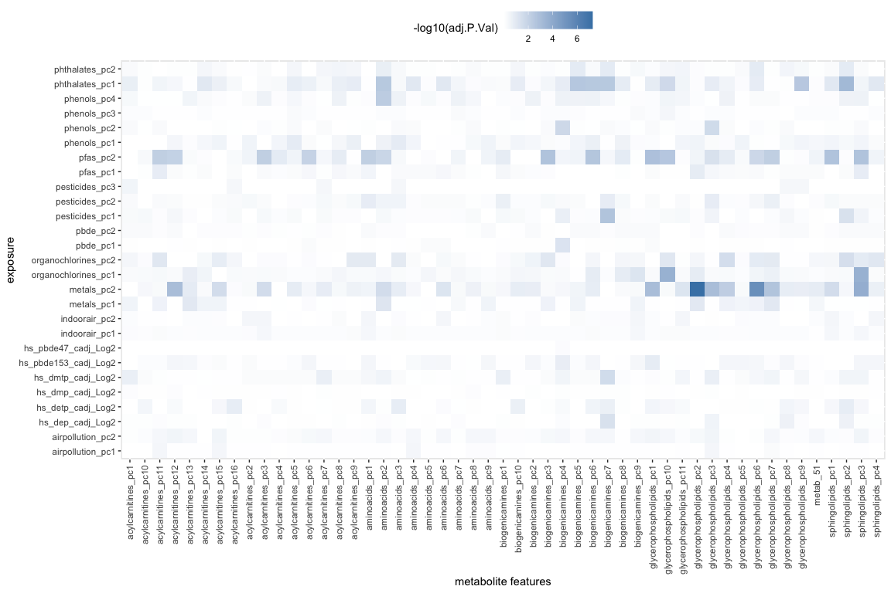<!-- -->


```r
par(mfrow=c(3, 4))
for(ii in seq_len(12)) {
	exp <- as.character(expoSerumDF[ii, "exposure"])
	met <- as.character(expoSerumDF[ii, "feat.ID"])
	apv <- as.numeric(expoSerumDF[ii, "adj.P.Val"])
	
	plot(exposomePC[rownames(serumPC), exp], serumPC[, met], xlab=exp, ylab=met, main=apv)
	abline(lm(serumPC[, met]~exposomePC[rownames(serumPC), exp]), col="red")
}
```

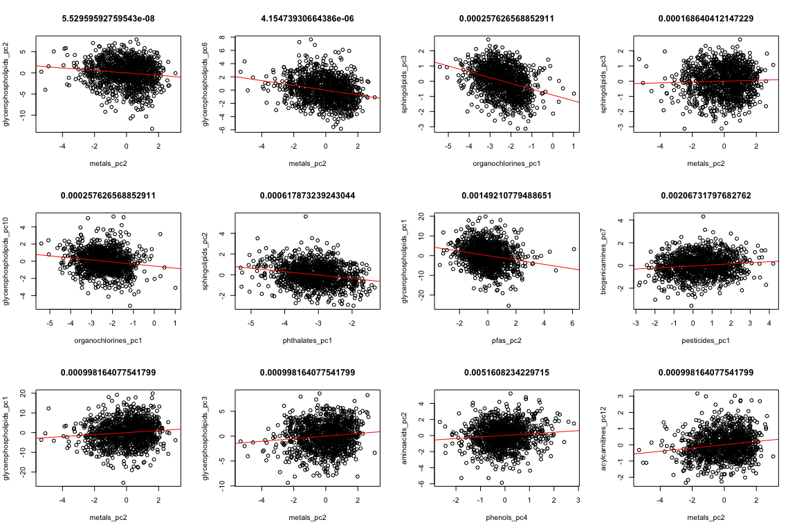<!-- -->


## Urine

Merge urine with exposure covariates and exposures:


```r
urine_covars <- cbind(covariates[rownames(urinePC), c("h_cohort", "h_edumc_None")],
	pData(metabol_urine)[rownames(urinePC), c("e3_sex", "age_sample_years")],
	phenotype[rownames(urinePC), c("hs_zbmi_who"), drop=FALSE])
dim(urine_covars)
```

```
## [1] 1192    5
```

```r
c("e3_sex", "h_cohort", "h_edumc_None", "hs_zbmi_who", "age_sample_years") %in%
	colnames(urine_covars)
```

```
## [1] TRUE TRUE TRUE TRUE TRUE
```

```r
urine_covars <- cbind(urine_covars, exposomePC[rownames(urine_covars), ])
dim(urine_covars)
```

```
## [1] 1192   32
```

Add exposures and perform model:


```r
runExpoUrine <- function(expname){
  model <- model.matrix(
  	formula(paste("~ ", expname, " + e3_sex + h_cohort + h_edumc_None + hs_zbmi_who + age_sample_years")),
    urine_covars)
  lmF <- lmFit(t(urinePC), model)
  lmFe <- eBayes(lmF)
  tab <- topTable(lmFe, number = Inf, coef = 2)
  tab$exposure <- expname
  tab$feat.ID <- rownames(tab)
  tab
}

exps <- colnames(exposomePC)
expoUrine <- lapply(exps, runExpoUrine)
```


```r
expoUrineDF <- Reduce(rbind, expoUrine) %>%
  tibble() %>%
  arrange(P.Value) %>%
  mutate(adj.P.Value.all = p.adjust(P.Value, method = "fdr")) %>%
  left_join(mutate(exposomePC_fam, exposure = var) %>% select(-var), by = "exposure")
datatable(expoUrineDF)
```

```{=html}
<div id="htmlwidget-ab7938a3b4514f9077be" style="width:100%;height:auto;" class="datatables html-widget"></div>
<script type="application/json" data-for="htmlwidget-ab7938a3b4514f9077be">{"x":{"filter":"none","data":[["1","2","3","4","5","6","7","8","9","10","11","12","13","14","15","16","17","18","19","20","21","22","23","24","25","26","27","28","29","30","31","32","33","34","35","36","37","38","39","40","41","42","43","44","45","46","47","48","49","50","51","52","53","54","55","56","57","58","59","60","61","62","63","64","65","66","67","68","69","70","71","72","73","74","75","76","77","78","79","80","81","82","83","84","85","86","87","88","89","90","91","92","93","94","95","96","97","98","99","100","101","102","103","104","105","106","107","108","109","110","111","112","113","114","115","116","117","118","119","120","121","122","123","124","125","126","127","128","129","130","131","132","133","134","135","136","137","138","139","140","141","142","143","144","145","146","147","148","149","150","151","152","153","154","155","156","157","158","159","160","161","162","163","164","165","166","167","168","169","170","171","172","173","174","175","176","177","178","179","180","181","182","183","184","185","186","187","188","189","190","191","192","193","194","195","196","197","198","199","200","201","202","203","204","205","206","207","208","209","210","211","212","213","214","215","216","217","218","219","220","221","222","223","224","225","226","227","228","229","230","231","232","233","234","235","236","237","238","239","240","241","242","243","244","245","246","247","248","249","250","251","252","253","254","255","256","257","258","259","260","261","262","263","264","265","266","267","268","269","270","271","272","273","274","275","276","277","278","279","280","281","282","283","284","285","286","287","288","289","290","291","292","293","294","295","296","297","298","299","300","301","302","303","304","305","306","307","308","309","310","311","312","313","314","315","316","317","318","319","320","321","322","323","324","325","326","327","328","329","330","331","332","333","334","335","336","337","338","339","340","341","342","343","344","345","346","347","348","349","350","351","352","353","354","355","356","357","358","359","360","361","362","363","364","365","366","367","368","369","370","371","372","373","374","375","376","377","378","379","380","381","382","383","384","385","386","387","388","389","390","391","392","393","394","395","396","397","398","399","400","401","402","403","404","405","406","407","408","409","410","411","412","413","414","415","416","417","418","419","420","421","422","423","424","425","426","427","428","429","430","431","432","433","434","435","436","437","438","439","440","441","442","443","444","445","446","447","448","449","450","451","452","453","454","455","456","457","458","459","460","461","462","463","464","465","466","467","468","469","470","471","472","473","474","475","476","477","478","479","480","481","482","483","484","485","486","487","488","489","490","491","492","493","494","495","496","497","498","499","500","501","502","503","504","505","506","507","508","509","510","511","512","513","514","515","516","517","518","519","520","521","522","523","524","525","526","527","528","529","530","531","532","533","534","535","536","537","538","539","540","541","542","543","544","545","546","547","548","549","550","551","552","553","554","555","556","557","558","559","560","561","562","563","564","565","566","567","568","569","570","571","572","573","574","575","576","577","578","579","580","581","582","583","584","585","586","587","588","589","590","591","592","593","594","595","596","597","598","599","600","601","602","603","604","605","606","607","608","609","610","611","612","613","614","615","616","617","618","619","620","621","622","623","624","625","626","627","628","629","630","631","632","633","634","635","636","637","638","639","640","641","642","643","644","645","646","647","648","649","650","651","652","653","654","655","656","657","658","659","660","661","662","663","664","665","666","667","668","669","670","671","672","673","674","675","676","677","678","679","680","681","682","683","684","685","686","687","688","689","690","691","692","693","694","695","696","697","698","699","700","701","702","703","704","705","706","707","708","709","710","711","712","713","714","715","716","717","718","719","720","721","722","723","724","725","726","727","728","729","730","731","732","733","734","735","736","737","738","739","740","741","742","743","744","745","746","747","748","749","750","751","752","753","754","755","756","757","758","759","760","761","762","763","764","765","766","767","768","769","770","771","772","773","774","775","776","777","778","779","780","781","782","783","784","785","786","787","788","789","790","791","792","793","794","795","796","797","798","799","800","801","802","803","804","805","806","807","808","809","810","811","812","813","814","815","816","817","818","819","820","821","822","823","824","825","826","827","828","829","830","831","832","833","834","835","836","837","838","839","840","841","842","843","844","845","846","847","848","849","850","851","852","853","854","855","856","857","858","859","860","861","862","863","864","865","866","867","868","869","870","871","872","873","874","875","876","877","878","879","880","881","882","883","884","885","886","887","888","889","890","891","892","893","894","895","896","897","898","899","900","901","902","903","904","905","906","907","908","909","910","911","912","913","914","915","916","917","918","919","920","921","922","923","924","925","926","927","928","929","930","931","932","933","934","935","936","937","938","939","940","941","942","943","944","945","946","947","948","949","950","951","952","953","954","955","956","957","958","959","960","961","962","963","964","965","966","967","968","969","970","971","972","973","974","975","976","977","978","979","980","981","982","983","984","985","986","987","988","989","990","991","992","993","994","995","996","997","998","999","1000","1001","1002","1003","1004","1005","1006","1007","1008","1009","1010","1011","1012","1013","1014","1015","1016","1017","1018","1019","1020","1021","1022","1023","1024","1025","1026","1027","1028","1029","1030","1031","1032","1033","1034","1035","1036","1037","1038","1039","1040","1041","1042","1043","1044","1045","1046","1047","1048","1049","1050","1051","1052","1053","1054","1055","1056","1057","1058","1059","1060","1061","1062","1063","1064","1065","1066","1067","1068","1069","1070","1071","1072","1073","1074","1075","1076","1077","1078","1079","1080","1081","1082","1083","1084","1085","1086","1087","1088","1089","1090","1091","1092","1093","1094","1095","1096","1097","1098","1099","1100","1101","1102","1103","1104","1105","1106","1107","1108","1109","1110","1111","1112","1113","1114","1115","1116","1117","1118","1119","1120","1121","1122","1123","1124","1125","1126","1127","1128","1129","1130","1131","1132","1133","1134","1135","1136","1137","1138","1139","1140","1141","1142","1143","1144","1145","1146","1147","1148","1149","1150","1151","1152","1153","1154","1155","1156","1157","1158","1159","1160","1161","1162","1163","1164","1165","1166","1167","1168","1169","1170","1171","1172","1173","1174","1175","1176","1177","1178","1179","1180","1181","1182","1183","1184","1185","1186","1187","1188","1189","1190","1191","1192","1193","1194","1195","1196","1197","1198","1199","1200","1201","1202","1203","1204","1205","1206","1207","1208","1209","1210","1211","1212","1213","1214","1215","1216","1217","1218","1219","1220","1221","1222","1223","1224","1225","1226","1227","1228","1229","1230","1231","1232","1233","1234","1235","1236","1237","1238","1239","1240","1241","1242","1243","1244","1245","1246","1247","1248","1249","1250","1251","1252","1253","1254","1255","1256","1257","1258","1259","1260","1261","1262","1263","1264","1265","1266","1267","1268","1269","1270","1271","1272","1273","1274","1275","1276","1277","1278","1279","1280","1281","1282","1283","1284","1285","1286","1287","1288","1289","1290","1291","1292","1293","1294","1295","1296"],[0.395651343179916,-0.176743377171462,0.0519788102960121,0.322577784268561,0.0466340120701793,-0.130950614180575,0.0526832344803079,0.0287601766281967,0.392744888262012,0.0370559719948194,0.238538800555625,0.122862706896545,-0.129092122006234,-0.162549757327266,-0.0576905794212835,0.178384846458086,0.322339089736128,0.145302104952174,-0.045889103972132,0.105096250281905,0.211359954194323,-0.11836924054517,0.0919046817607212,0.226050346886397,-0.290638137756588,0.090410609268058,0.181554760997847,0.0812857266340427,0.175547084640555,0.0939935122926167,-0.106964880580825,0.036111283908889,0.0889016599037603,-0.0279109017205047,-0.155602341813927,0.0571756440135511,0.0400423771261293,0.335041770988163,0.0297004708384995,0.0438653758406191,-0.0734719985073808,-0.233872874733361,-0.0251127356351266,-0.165995738621881,0.338968665498418,-0.0656848342312006,0.151544320513308,-0.00931224849010244,0.0276746976039794,-0.0755238227909252,-0.0583337381081689,0.0218462900093233,-0.0281469250086189,-0.117577520656114,0.0320502070611953,0.0891832432429273,0.0249992261102872,0.0849441580337761,-0.0404031874282535,-0.0892485889719653,-0.0766474604687235,-0.339130918562444,-0.15799292647212,0.0579808940087487,-0.287683068843712,-0.096515156011799,0.016980899116071,-0.0587057433293169,-0.031532361091636,0.249074546054922,-0.249226700316963,-0.137785200031181,-0.11737339299474,-0.0241467711729317,-0.100539039192188,-0.0166389052615336,0.133550240068909,0.0135765938308489,-0.108443936735087,-0.0371534153018809,-0.081774139523395,0.0818307181391085,0.209058213171587,0.0369709886284962,0.0619844013266337,0.0424829942248576,0.0236750485854706,0.0212958632120813,-0.0215062813847988,-0.193780136576505,-0.0691785259133254,-0.107151059246222,0.21182257596324,-0.124512482972369,-0.00990612697749881,0.158001599320112,-0.0426015537797769,-0.320448869471342,-0.080764717364906,-0.120580111224747,0.0241756950498454,0.256464448901262,-0.0259158500109213,0.0155835652809798,-0.103404605483638,-0.185561072611287,0.1313620797257,-0.0260863959187829,-0.138117180104057,0.41725250451795,0.0186052658629164,0.138358356387273,-0.0452713915438963,-0.0126164974220074,-0.0270192264388674,0.134515637557815,0.0554182908815031,0.105194440286948,0.0624497385092124,0.0172214674586942,0.0570539168294675,-0.0702465784631829,0.052336258780711,0.0558040017183846,-0.0292549465110193,0.0830944224965212,-0.0172636109035076,0.267051582339628,0.25164450570006,-0.0681525662601488,-0.131533705867167,-0.22802694905544,0.012771774770026,0.143471788462438,0.051837188780633,-0.0267742179530624,-0.134499604918313,0.234762011921394,0.0663563707670056,0.111472598895548,-0.079690416950842,-0.22199928044405,-0.062482105142502,-0.104476273322225,-0.0223174779692124,-0.00864657640683835,-0.0450703335072901,0.0620636229621052,0.0551713685342886,0.158500809885001,-0.0536888628597603,-0.0678231059822164,-0.126869525954627,0.112987563137831,-0.0569063963797816,0.0281273832404431,-0.0682407296345761,-0.0217435642645957,-0.126461873177585,-0.0487587350532676,0.11279807012452,0.117721300217689,-0.0127781885267079,0.137632103628178,-0.0202031575727842,-0.0181816747401112,-0.0182197023380059,-0.0202242052627862,-0.266259179137437,0.068407941671558,0.0320729281565022,-0.0220754275653777,0.11456897724139,-0.0282061978377151,-0.0147848239785267,-0.172874304513029,-0.0814944201234503,-0.169722326079876,-0.0329523809411885,-0.0108798150839841,0.30300587173553,-0.157395215579464,-0.0251128350158252,0.127965072287534,0.0328835569095633,0.12939148432476,-0.0716969422886462,0.0499266590507595,0.0191520565941993,-0.0162916189346677,0.109034471943993,0.166909879179047,-0.0585570115876042,-0.0441258197276581,-0.117868155492928,-0.0909290519457303,-0.137908582469542,0.0364533913188627,-0.0143234501516443,-0.0645197989536847,-0.0928806342733384,-0.0787883029846917,-0.00783282041444325,0.0882730944550048,0.0967957693727839,-0.154029327548691,0.0804092014494204,-0.0187951308424213,-0.038250137040708,-0.00860410691517114,0.120643841108137,0.00914259233423411,-0.0586893545280709,-0.0214394611555961,-0.0607788542443113,0.0158789692782123,-0.136690918687105,0.0466335535464903,-0.015656770637034,-0.103924010923621,-0.0141659731046831,-0.0972642299881789,0.0301436215099513,-0.0751021422347628,-0.0139754662268539,-0.094775934717928,-0.0809541615136653,-0.0927525434680433,0.322107039212546,-0.0815232776104673,0.0259048718058439,0.165998936685073,0.054584214478649,-0.0245389492637103,0.107939275789621,0.0536534824266989,-0.0637475370530748,-0.0202715324490653,0.0639680126660202,0.140599916188297,0.0559018466922084,-0.00595943608985534,-0.0879929662379805,0.169343911914144,0.0707110981901837,0.0465612143400836,-0.077522439109526,-0.0165004653285744,-0.0868856873805655,0.00865315624528714,0.0625857684297538,-0.0745389879779288,0.0205563443321215,-0.00600384497818657,-0.0475582956559161,-0.0677610588200821,-0.091631164722068,0.0785824066406198,-0.0950379404740355,-0.018011698024506,-0.0613347338956718,-0.0781111437252149,-0.0495527409517955,0.170095954438749,-0.0598599498760015,-0.0211128337176961,-0.150719556984613,0.128589581385168,0.128192996541485,0.216158220897194,-0.049522159222744,-0.0347088888441351,-0.0290312218713854,0.05554311662657,-0.0404666298483007,0.0476312777292001,0.0858927392465607,0.0890368437404027,0.0581246386244172,-0.107456941032033,-0.0701932256836185,-0.012003751811575,0.0116293012285562,0.0443791779724073,-0.11788881810285,-0.0934326305018235,0.0353455192501327,-0.104881015733009,-0.0121276896781135,0.103913693157532,-0.0602996442110804,-0.0513752147717907,-0.0576999629722716,-0.086410173185761,0.0577348692474311,0.115380975071599,0.0461349401315423,0.0118980213459728,0.0557460811786932,-0.0840393109150653,-0.015615185038806,-0.0626430691060888,0.0519963712954587,0.141422770173555,-0.0178760193463516,-0.0304330058080346,0.100458437053756,0.0509790292372003,0.0992123658203218,-0.0940849749812491,0.0232803489805503,0.0161480139260022,-0.0468840830041246,0.148158587789418,-0.0424440661246146,0.125210983861564,-0.132409611631475,0.101066669101767,-0.063250893652719,-0.0298111511995231,-0.00654515526455394,-0.0771258512490435,0.0564358852336451,0.295107182766875,0.159040832593055,0.00729640288907025,-0.049617350108851,-0.0700298271949408,-0.0554996115155151,-0.020033405472516,0.00941199507151619,-0.0719153912113009,-0.175887056079318,0.0106351860565189,-0.0614860674514141,-0.0568213308290415,-0.0493534531776049,-0.0460152856223197,-0.0630807707674313,0.0779833077239935,0.0865359494031151,0.116496546692825,-0.022411304323343,-0.0142869159234371,0.139631301023301,-0.137557924339764,-0.0158586644002747,-0.0164424205905433,-0.0441709914985615,0.0425965594345969,-0.0705238654905592,0.0414953023553326,0.148406683420953,-0.0711908414368275,-0.0838768456026074,-0.0347396048296218,-0.0289167997484502,-0.0368320782238699,-0.094262966733257,-0.076625979038345,-0.0298061520951019,-0.104393931111289,-0.0347820830675018,-0.0412224587463809,0.0366039491264179,0.137567339808104,0.0817029607308097,-0.0473087574067905,0.285892287043189,0.0841978028600805,0.143902325957018,0.0135782395188724,-0.0293089842771644,0.0125324791924219,-0.0162325044633349,0.0445881993225965,-0.0264153822138437,0.0727219736526233,-0.014543167506858,-0.0122125688228663,-0.0803669600750842,0.0421133039933476,0.0163567524023019,-0.0531309947206922,0.00914458627442074,-0.113556866774072,-0.032661186027143,0.0365509639569807,-0.050908738874235,0.0568253823721341,-0.0351392878926711,-0.0380067145786331,0.181654922945471,0.062161660151868,0.0280843490489141,0.153302998424811,-0.05405550173516,0.0930840102260267,0.0146487988948066,0.0451118594801907,0.0390252899275286,-0.0108256607890538,0.00968088655503405,-0.110804487084703,0.166329141940364,-0.0508068802161766,0.0408658629305582,0.0276924824878738,-0.0891925745426129,0.0595115203703935,0.158418346011271,-0.0645202005763281,0.0323540489052353,0.103066273077561,0.0186678680201157,0.107589866362522,0.0491993525044793,-0.11191348982501,0.041862893588187,-0.0145431164657,0.0495172676985697,0.0661323362919937,0.121403159042878,0.0404498123390918,0.053270880029616,0.068528251327249,0.0395972962885764,0.0131002099815031,0.027586138112718,0.00897722081885793,-0.0259962403486276,-0.103511852272904,0.0110538775365736,-0.0473647951709776,-0.0299538627221358,0.0140800222410302,-0.0144716759458765,-0.0212427940789464,-0.0380343282848477,-0.0164493537975317,0.0918770469266284,-0.00971888330175403,-0.123534443535428,0.0480012817479553,0.0524731226653631,0.0479159296157834,-0.0371775708073205,-0.0582816937454123,0.0111628848760934,-0.0470563230222837,0.0613404953712052,-0.0335713574755173,0.0157301327990652,-0.0686196954107231,0.0438669956052345,-0.00553348147547057,-0.0555310009125084,-0.0602193340376322,-0.00486804060376494,-0.0683350387230208,-0.0631938092999121,-0.0339495053759679,0.0208637692067589,-0.0573835038344862,0.0431419453031555,-0.0106421870564342,0.00775986982177624,-0.0516203257278515,-0.049737647973209,0.0763987477958192,-0.0381533486482533,0.0599546637346563,0.0346567557240334,0.0034784500326513,0.0172174884642958,-0.0497791377373893,-0.0371009655798954,0.0825699634693563,-0.0255920304533482,0.0836437265122225,-0.0136210017181549,-0.00825588212936187,0.0426350065499029,-0.0147471700115566,0.0894337614097523,-0.03106015527553,-0.028830188783633,0.00691515471392174,-0.0393578230362647,-0.146231196892127,-0.0670593199096317,0.0416002965996639,0.0463287263687116,0.0343944164418439,0.00773551464235441,0.086753299056633,-0.0129118053309191,-0.0197649759778994,0.0493794492597266,-0.0283182845090507,-0.036504125750811,-0.0414838078983627,0.00735378076372187,-0.0453553316946593,0.0381175994066227,0.135403439278172,-0.0752504331570709,-0.0195850038899164,0.102372903060043,-0.0509988618013152,-0.0356609811607292,0.0142407556551018,-0.0502433045252714,0.0323559245829669,-0.0311359989331047,0.0553009127804191,-0.0550925831485767,-0.0771862331239459,0.0298363947983166,0.00777832331678121,0.00840848367127351,0.0440642152971231,-0.125050870372149,0.0115073962822179,0.112682121488957,0.0282868933486607,-0.0334082688449682,0.00844482216770913,0.0401044670359988,0.0357690105065268,0.03020140182325,-0.0282997583832884,-0.00486157688783631,-0.0413787210074371,0.0155019724587143,0.0883089193512469,0.0825676076540327,0.0586401249134355,0.068322016336288,0.185226061040159,-0.0417055396543218,0.00681242846773985,-0.0874351926026355,0.0353084477274469,-0.00649597668485654,-0.0188048543815167,0.0502841597997825,0.00326615812415226,0.113396322248801,-0.0118945422603239,-0.0305056415279636,-0.0162865122654142,-0.0167792141356572,0.0102679237013594,-0.067735460185307,0.0559518522733104,-0.0319331592788565,0.012251008525356,-0.0951143278960756,-0.0264101913341934,0.0685491257494667,0.0100135546375844,0.00784757353113801,-0.0079007497334143,-0.107882072664856,-0.0568778838614146,0.0288023539283805,0.00687982922644462,-0.0504545687916895,0.0304580763638783,0.0282783641357606,-0.0100951669325313,0.0872587829723726,-0.00941127707081604,-0.0755190960038004,0.00789993383527114,0.230188319183267,-0.00731322790124132,-0.0448901707868823,-0.060662074894411,0.0131272194545979,0.0465425522199606,-0.025280998130133,-0.0231832730450484,0.0158196261774726,-0.0800259010662811,-0.0223547103221287,0.0313304213456543,0.0301132303778282,-0.0295384284040786,-0.0223034045204605,-0.00894251177416547,-0.166105262918559,0.0482848651221504,-0.0444482348322963,0.153969366380025,0.0363525764210261,0.0697237794451527,0.0181684722842455,0.00541962432196242,-0.0572097303319639,-0.0366928722658788,-0.0430543673847322,-0.0180349232485522,0.0244488220044125,-0.006219097163617,0.0290301194460919,-0.0102042914713862,0.0849698708273225,0.00363498942264967,-0.0256797357678108,0.00995606704475294,0.0601531731659147,-0.0608544790572807,-0.0461020053824695,-0.0184399968659352,0.0262018730571637,0.0313052998410088,0.0782780955599143,-0.0402608803183279,-0.0173200049067268,0.0364714329851445,-0.0459226693955601,-0.0708361845122539,-0.0585042531674876,-0.0217649951627088,-0.0288431111316824,0.00995431691660153,-0.0424362574952473,0.0434704659421688,-0.0881054057749101,0.0485368675670935,0.017937006416363,-0.0224228056373719,-0.0311241939440748,0.00537223867875833,-0.0629577499814184,0.0590795670840388,-0.0155560021839029,-0.0270142618108014,0.0105353346978535,0.0249687904017474,0.100774229099445,-0.0311974986669719,-0.0353830746606514,-0.00828847307912577,0.0814972321429537,0.0323314158782884,-0.00902043645231255,0.0395442362605698,-0.123303002946255,-0.0202460795284238,-0.0177420021840553,-0.0238315526910244,0.0257610958614422,0.0180211692564619,-0.0132455825812654,0.0460012030001398,-0.0713779462433514,-0.00680597574307841,-0.0255655496002569,-0.0604690940573972,-0.014633328793876,0.0532443798406132,-0.0506327509964726,-0.0188371744019953,-0.0506661784644425,0.00623000174842992,-0.0886048090376471,0.0583538635474327,0.00667279748305528,-0.00556483672546946,-0.00864390738208157,-0.0491302256081299,0.0326016497263507,-0.01699051457423,0.0818128149641142,-0.0178915981404971,-0.00555160726235799,-0.0294088921668473,-0.0373329428215813,-0.0215567454514679,0.0435330511762325,0.0380154603125542,-0.00850730760882361,-0.0249306035548842,0.00625493533244702,-0.0456100554839542,-0.103338207715272,-0.0351010990584137,-0.157899273410454,-0.00732337884161349,0.0612763322319397,0.030320793796414,0.0149610381885072,-0.0307098016359466,0.0243785160201751,-0.0287179882384714,0.0192746996685563,-0.0177975424139813,-0.0697449751580026,-0.036734662858664,0.022525384319157,0.0205480161601975,-0.0217086353254672,-0.0373304290455435,-0.0482761704890416,-0.0068086620966427,0.00497240010110222,0.0120635406104664,-0.0172940786398509,0.050887698547532,0.0148051237692369,-0.0696026337449623,0.00674535065015819,0.0216483438793038,-0.0672025428184582,-0.00584475011682247,0.0102631102341731,-0.0695584206417841,-0.0305317733218852,0.0111444959601109,0.00513900321635143,0.0393205670033629,0.0510544375937198,0.0244747280588409,-0.0142050682654036,-0.0209924992708878,-0.0334453369631864,0.0173422064530388,-0.0219921492150319,0.0386100096774163,-0.0181194786146488,0.0304048117800375,0.172880534774244,0.0153292230246802,-0.024724329759424,0.0246680286799224,0.0246131169384238,-0.00986649737383963,-0.00813226687498437,-0.0163953775390337,-0.0227727476694933,0.00325334440873459,0.0764607620230697,0.00308099759554795,-0.0156696793465539,-0.0507627641038468,-0.0294353198335877,-0.00613840725539643,-0.0404274660362282,-0.00598689704136765,0.00662068407235388,-0.0424698698013983,-0.00315571128961468,0.0436773274093079,0.00806067650282882,0.0543595535627419,0.0322817511565596,-0.0382337319687176,-0.0443856091144338,0.0197177457693981,-0.0061186595630325,0.0414718621067963,-0.0272888796267566,-0.0300468271261791,0.0230658271168884,0.0239067569107288,0.00475521521175449,0.0521171080888761,0.0295313761752475,-0.012073276902125,0.0283386140214223,-0.0311934669142428,-0.00645891328259585,-0.0463154540512692,-0.00928519856762859,0.0122187858956294,-0.0926341800590236,-0.0102007855692203,0.0179014843279289,-0.0239928040595319,0.0251009743256913,0.0173351306021847,0.0526726192238302,0.0304483511298179,-0.0260517506209648,0.00615342971342979,-0.0647970801152373,-0.0164074203969263,-0.0233801708118736,-0.0497813776347895,-0.032350327394892,0.0503278037804263,-0.0319567310117173,-0.0216965025777692,-0.0641816415325646,0.0300652286353803,-0.0486908791403531,0.0153470494453687,0.0172284566820524,0.059632092515772,-0.0227604593899933,-0.0088371571980079,-0.0158210325375918,0.0112459151884847,0.0296246199707262,-0.0322934372474282,0.0293405264156454,-0.0176050610269662,-0.041543597334394,-0.0176771570836139,0.0129735457039806,-0.00225361249279296,-0.00587388398999425,0.0404326946144849,-0.0278557259165413,0.0456338579127288,-0.00657412447831932,0.012926190681203,-0.0561769930844102,0.022038351257669,-0.0933121033072785,0.015612323286757,0.018277657140845,0.0415357747908695,0.031392310731828,-0.0159895706346074,-0.0216872200831748,0.00912184383252979,-0.013066651482675,-0.0229916687261873,0.0193121618604833,0.0451594077281657,0.00915042027285582,0.0160302448598494,-0.0101353557378978,-0.0234140696341862,0.0496905117262057,-0.018318608087711,0.0166805612245939,-0.00717261878743761,0.0407797946625868,-0.0363592893178553,0.0270445897030563,0.0320968208476062,0.0300486515287765,0.0338464928070729,-0.0145117070182436,0.0311378173440496,-0.0167735306367701,-0.0168277699529541,0.0291803217238186,-0.0209142333537924,-0.0140212538970756,0.0163658072856393,0.0433703185986593,0.0335303978418276,-0.019799594640541,0.0232650612225957,0.00517395847721804,-0.0264748946093794,-0.0220804774500986,0.00316446864832642,0.0325437415525276,0.020730312812304,0.0314796016932379,0.00464942790325549,0.0162637122272422,-0.022401052710116,-0.00301832177373402,0.0180580401226638,0.026953675217602,0.00712341134622691,0.0652687133146187,-0.00539108501386766,-0.00251072979114332,-0.0264019557019025,0.00656991282536789,-0.0170988035047072,0.027924794476272,0.030100232154546,-0.00669168229436645,0.00351897786468556,0.0197767484312559,-0.0263992592022362,0.00422253434724332,-0.0177416569619001,0.0239676446231755,-0.00371612783678462,0.0184296445746005,0.0293940616506879,-0.0207685140522894,-0.0176667917605601,-0.0026580675188033,-0.0114010784230869,-0.0108676094063013,0.0225598356903453,-0.0119119847591526,0.0032523383166463,-0.00539281872180431,-0.0324309115658584,-0.00919279560718731,-0.024444108044614,-0.0347110853418901,0.0100274374164998,-0.0110040222761781,0.0192688147688793,-0.00520814623253902,0.005723692855534,0.00756364256397535,-0.00374737459925613,-0.00506993102425563,-0.0187032476068557,0.0146461256967366,0.0149501118480231,0.041874287833261,-0.0241314881789401,0.00194578172885814,-0.038085193590821,0.00823011580056788,0.0125416166486884,-0.0228026354674097,0.0147044927296931,0.0239667474366628,-0.00384911544651343,-0.0296483428081156,-0.0047253629435811,-0.0307401402349322,0.0263521024607446,-0.00431268006665173,0.0213185070049748,-0.00997781346818026,0.0164814853730928,0.00431251090219929,0.0149396193296792,-0.0107823325191801,-0.0119891679521347,0.0498843616637342,-0.00261007348208611,0.0033297842969942,0.0406420643504293,-0.0138742416654669,-0.00327767752499765,0.018352283703955,0.00915152584806788,-0.00338784821481517,-0.00627845976218094,-0.0145099697720617,-0.00586503166409133,-0.014339943655185,-0.0038446813797035,-0.0062716050341857,0.00323864247684416,0.0122609999375591,-0.0302403063924466,-0.0334223924593819,-0.00948696206171669,-0.0130733564016952,-0.0101722873148273,-0.00333383925742069,-0.0509566974395833,0.0015077501926354,-0.0085949276065047,-0.0252020271386365,0.00440145234724766,-0.0378743212286423,-0.0182422524032985,0.0124358688160657,-0.0241981967407461,0.0056587109363903,0.0187195316003797,0.0334263378502158,0.00277803155232768,0.00442275497342817,0.00615841376230408,0.0239672422819458,-0.00614354309803181,-0.0153025785657932,-0.0166499712084042,-0.0374627949068803,0.00374115457756724,-0.0170142072868779,0.0222871102701704,0.0096621673775302,0.0127598167890138,-0.0240186365019292,-0.0212241274957836,-0.0149011342542365,-0.00281469446826473,-0.0148587683519438,-0.00306349893164467,0.0668026651546428,-0.0214101747586838,-0.00806033833504424,0.00207886330260973,-0.0037132747188128,-0.00315599890407034,0.0293778711314144,-0.012959381181726,-0.0288384045690883,0.0188786006127421,-0.00494997462131533,-0.0126471215889959,-0.00960604508718997,-0.0188798166201154,0.00417224828381038,-0.0155137442457367,0.027995004852938,0.00327359198072705,0.0084404645027524,-0.0248602699562349,0.032155089964587,-0.00257680751175393,-0.00280638645015279,0.037518206958577,0.00654200344756713,0.0281445752615776,0.0090563566042683,0.0185416352462635,0.027119396441912,0.0339604031255839,0.00923349042995142,-0.00324376015636974,0.00539426786885156,0.0123813417544028,-0.0150374492524207,0.00848807654913232,0.0132389611951073,-0.00227671965153192,-0.0092155012546914,-0.00195513193103175,0.00446452528374133,0.00759776498079068,0.0112526905439803,0.0101686637774528,-0.0133182309997255,-0.0285160860933813,0.0102998419361633,0.0215825404590858,0.0101110000559816,0.00958525980721606,-0.00845272509498774,-0.00897641093070458,-0.016241553066327,0.0211837527479903,0.00981194070330036,-0.0410402719113959,-0.00202182730818776,0.0144975821222231,0.0274026007168802,0.0133605293569537,0.0283024889703362,0.0131195895818346,0.0134172450293728,-0.0249015145952476,-0.00586887295697738,-0.00750165894697369,0.0111541502065055,0.0128302220541705,0.00891215965496811,0.00322595049752107,-0.0159264019837383,0.0255702560759543,-0.0154689663173599,-0.00966699638770209,-0.0117701169460989,0.0128929753742017,-0.00529159051538622,0.0141994575324707,-0.0105545923837573,-0.00989865618682284,-0.0148121003751883,-0.0038530761779391,0.0107995472548446,-0.00786395117409963,0.0123783924586833,-0.00673735145706778,-0.0021526752496245,-0.0016637576147665,0.0051293551525212,0.0213808181926121,0.0110119973738641,-0.006351306020025,-0.0177550017288463,-0.00130338044176729,0.00209437939896369,-0.00910488923301154,-0.00694874525713394,-0.00953660930184432,0.0109248346088294,-0.010288975174027,-0.00963839649338058,-0.00782713391787706,-0.0213140805417936,-0.00749051824406684,-0.0130530735421161,-0.0184481052068473,0.00403080846710743,-0.0169156697049053,-0.00791624836502368,-0.0221291608914262,-0.0356781612255289,0.0107320565298992,0.011068701052415,0.00720470655565717,-0.0128133169486577,0.00842626150045573,-0.0107622594849446,0.00284140178474999,0.00697475276730944,0.0067721783318396,-0.00733480852839053,-0.0171390362653476,0.00554593629247239,0.0069650505442101,0.00621698676098608,-0.00369245895954088,0.0317683183539588,-0.00640333535904733,-0.0108756554870861,-0.0167219617528129,0.0067299535954606,0.00797280404312777,-0.00243534957413492,-0.0101766789027762,0.00499190288694107,-0.00757603298217614,-0.00151376012778269,-0.00150001392482836,-0.00868901066335511,0.00166133731742487,-0.00341733408834635,-0.0027030411996246,0.00846511246571733,-0.00682411519701898,0.00665671640948279,0.00508184828868483,-0.00508884341513688,-0.00852950144190985,-0.0046461652361473,0.00409315992671195,0.00654417052682873,0.00346120890893676,-0.0071016609836952,-0.0069680179042808,-0.0135703476538615,-0.00722122599889613,-0.0046145881489152,-0.00417941386449336,0.00549003012277265,0.0054022861390484,0.00106394547991921,0.0154857139182278,-0.00751373672967729,-0.00675136455196879,0.00249825163963624,0.00231668420307591,0.00391454465576574,0.00579492038564372,-0.00446378829938262,-0.00682200845009512,-0.00106127405681244,0.0160664687536827,0.00663286062453616,-0.00717755436255223,0.00479758647043563,-0.00497645045445317,-0.00815552850281944,-0.00117778573293372,-0.00494685805574205,-0.00242523058865393,-0.00420287944718627,0.0084038701182073,0.00634366540607726,-0.00298181418518128,-0.00373374053831251,-0.00114972228453294,-0.0039033128583878,0.00234593132758369,0.00680202957486604,0.00947964178456799,-0.00124608423722635,-0.00473740159701256,-0.000985696430678695,-0.000891223700686198,-0.00270895607519817,0.00448803195859907,0.016522219675049,0.00617940157441168,-0.00423047266875791,0.00243883218895685,0.00295948555360937,0.00844429184357869,0.000812172760892351,0.00294426552327044,-0.0060268791306903,0.00318749228591565,-0.00167434823528147,-0.00401377784367466,-0.00425858223412692,0.00275122864283803,-0.00396799303285646,-0.00278063955992403,-0.00248330686629449,-0.00227801961254357,0.0062356908864997,0.000457844125238657,0.00424015836655814,0.00461098351459875,0.00286470914164587,-0.00277482009322519,0.00798881000431225,0.00530440027785242,-0.00336547722632177,-0.00187259283002556,-0.000955196055280131,-0.00178319559807367,-0.00717650390620061,-0.00298156695034222,-0.00217403036803742,-0.00119102112376839,-0.0072214428919711,-0.00270481431243148,-0.0042361977909619,-0.00163900631055148,0.00585127924633531,-0.00291137716622512,0.0016962446278024,-0.000982093972088477,-0.00657861086906011,-0.00493508200235069,-0.00040233051268338,0.0017631975060097,0.000908041327829071,0.00109788140052763,0.000430350553172691,-0.00218291235984804,0.00425225158017676,-0.00265807005542211,0.00104621183010493,0.000985809966570927,0.00216735191336315,0.00133113520952349,0.00196130854153158,-0.00183164937768272,-0.0040665305093853,0.00115256164787305,-0.00171405845547115,0.00383525338539369,0.00194278268920194,0.000433385786177255,-0.00150530911204943,0.00311924214030681,0.00160620268862734,0.00144448578121925,0.00456204301191548,0.000642379613542665,0.00171571370209179,-0.00124379861926224,0.000984489169685841,-0.0018731161874491,0.00152671925591853,-0.00349739055331386,0.000371799270020787,0.000890366362615584,0.00121123089777084,0.00179650093597898,0.0027046801422954,6.7702615703133e-05,0.00233191796571024,-0.000110490272187477,0.000814718369333395,-0.00111427717750032,0.000686246775501151,-0.000752790561740291,0.00157058940379219,-0.0029993877028575,0.000525628114944204,0.00137337004267247,-0.000795343746956975,-0.00333950070559073,0.000554999738144312,-0.00056906811055303,0.000591139428882835,0.000261334934369429,7.82716188309452e-05,-0.00036870040546639,0.00158392197558844,-0.0001752596078333,-0.000243078163967893,-0.000236412267325361,-5.58714888596228e-05,3.74324544215313e-05,-1.26976412317915e-05,-1.01488583038996e-05],[8.73367922547131,10.3649091242734,10.3649091242734,2.65971528917384e-16,2.82596932432114e-16,2.82596932432114e-16,10.3649091242734,-8.97894035409539e-17,-3.27920949156797e-16,10.3649091242734,3.06943660054282,3.06943660054282,-1.64165672573459e-16,-8.56547367057209e-16,3.77644839425925,3.77644839425925,3.71542946057285,-1.5062988142408e-16,2.65971528917384e-16,2.65971528917384e-16,2.65971528917384e-16,4.36502705252523e-16,6.34996110503282e-16,-1.5062988142408e-16,4.45737210718574,8.48646516594895e-17,-2.46273976696456e-17,8.41668102862908,6.34996110503282e-16,2.65971528917384e-16,6.81860049677154,2.82596932432114e-16,6.75363069209502,8.48646516594895e-17,10.3649091242734,3.76681357680333,5.68409103871454,3.17580567752479,2.82596932432114e-16,6.75363069209502,5.76009691100353e-18,-2.46273976696456e-17,-3.72197146332232e-16,3.71542946057285,3.77644839425925,3.77644839425925,-6.99324954302445e-17,3.76681357680333,3.71542946057285,-8.97894035409539e-17,4.59746974023411,10.3649091242734,-3.90781390282084e-16,-7.55742760504788e-16,5.8290163515568,-8.97894035409539e-17,-8.56547367057209e-16,6.75363069209502,3.06943660054282,-4.40753650951624e-17,4.40854074040774,5.55487510358133,3.71542946057285,4.40854074040774,-1.92687024882516,6.81860049677154,4.40854074040774,5.94295776998434,8.48646516594895e-17,-3.27920949156797e-16,-3.27920949156797e-16,8.73367922547131,2.65971528917384e-16,3.06943660054282,3.30392056927106e-16,6.75363069209502,8.48646516594895e-17,4.40854074040774,3.06943660054282,4.40854074040774,10.3649091242734,3.04790332607153e-16,-5.87506600043487e-17,5.8290163515568,4.59746974023411,5.44877083232239,3.76681357680333,5.76009691100353e-18,6.34996110503282e-16,-3.90781390282084e-16,3.71542946057285,4.45737210718574,4.45737210718574,6.50623361790213,5.68409103871454,-3.90781390282084e-16,4.40854074040774,3.77644839425925,5.8290163515568,1.12902556431444e-17,5.76009691100353e-18,4.36502705252523e-16,2.65971528917384e-16,-2.46273976696456e-17,-1.5062988142408e-16,8.73367922547131,4.36502705252523e-16,3.30392056927106e-16,5.55487510358133,-3.27920949156797e-16,-8.97894035409539e-17,6.34996110503282e-16,5.68409103871454,5.68409103871454,3.06943660054282,-3.90781390282084e-16,3.30392056927106e-16,4.36502705252523e-16,2.8642133199473,5.76009691100353e-18,-3.72197146332232e-16,-8.97894035409539e-17,4.40854074040774,-6.87093116369908e-16,-1.5062988142408e-16,9.36552755557062e-16,6.34996110503282e-16,3.06943660054282,-1.64165672573459e-16,-1.92687024882516,-3.09971945808676e-16,-1.92687024882516,4.59746974023411,3.06943660054282,1.12902556431444e-17,5.55487510358133,3.04790332607153e-16,-3.90781390282084e-16,-8.56547367057209e-16,6.34996110503282e-16,5.76009691100353e-18,4.45737210718574,4.40854074040774,9.36552755557062e-16,3.04790332607153e-16,5.68409103871454,-1.92687024882516,-3.90781390282084e-16,5.68409103871454,-8.56547367057209e-16,5.68409103871454,5.44877083232239,5.55487510358133,3.17580567752479,4.40854074040774,8.73367922547131,4.59746974023411,3.06943660054282,-3.27920949156797e-16,-8.56547367057209e-16,8.48646516594895e-17,4.45737210718574,5.44877083232239,3.06943660054282,6.34996110503282e-16,3.30392056927106e-16,2.8642133199473,8.48646516594895e-17,-1.5062988142408e-16,8.41668102862908,5.68409103871454,-3.72197146332232e-16,-3.27920949156797e-16,3.04790332607153e-16,5.44877083232239,8.48646516594895e-17,8.41668102862908,-3.20283508886725e-17,4.40854074040774,5.44877083232239,8.73367922547131,4.36502705252523e-16,-3.90781390282084e-16,3.04790332607153e-16,5.94295776998434,1.12902556431444e-17,-8.56547367057209e-16,-2.46273976696456e-17,6.50623361790213,-6.99324954302445e-17,3.17580567752479,-8.56547367057209e-16,4.59746974023411,5.94295776998434,8.73367922547131,-8.56547367057209e-16,6.50623361790213,3.76681357680333,5.76009691100353e-18,5.68409103871454,3.30392056927106e-16,-6.99324954302445e-17,3.76681357680333,-7.55742760504788e-16,8.73367922547131,-1.64165672573459e-16,2.8642133199473,2.8642133199473,3.17580567752479,5.68409103871454,3.17580567752479,5.94295776998434,4.40854074040774,6.34996110503282e-16,6.34996110503282e-16,-1.64165672573459e-16,5.76009691100353e-18,-7.55742760504788e-16,2.65971528917384e-16,10.3649091242734,3.30392056927106e-16,3.71542946057285,4.45737210718574,8.90597136492972e-16,3.30392056927106e-16,4.45737210718574,-3.09971945808676e-16,-1.5062988142408e-16,3.77644839425925,3.30392056927106e-16,6.75363069209502,10.3649091242734,3.06943660054282,5.94295776998434,3.77644839425925,-8.97894035409539e-17,4.36502705252523e-16,-3.72197146332232e-16,-3.20283508886725e-17,-3.09971945808676e-16,5.44877083232239,3.76681357680333,6.50623361790213,6.50623361790213,10.3649091242734,-3.09971945808676e-16,-1.5062988142408e-16,2.65971528917384e-16,8.73367922547131,4.59746974023411,-1.64165672573459e-16,5.76009691100353e-18,3.71542946057285,5.68409103871454,-3.20283508886725e-17,-6.99324954302445e-17,-1.5062988142408e-16,3.77644839425925,2.65971528917384e-16,5.94295776998434,5.76009691100353e-18,3.06943660054282,4.59746974023411,3.71542946057285,4.36502705252523e-16,4.36502705252523e-16,4.45737210718574,8.41668102862908,8.41668102862908,8.73367922547131,1.12902556431444e-17,6.75363069209502,3.77644839425925,-8.56547367057209e-16,-2.46273976696456e-17,4.36502705252523e-16,6.75363069209502,-8.97894035409539e-17,5.94295776998434,8.73367922547131,8.90597136492972e-16,-7.55742760504788e-16,-3.20283508886725e-17,-3.20283508886725e-17,3.71542946057285,-3.27920949156797e-16,6.75363069209502,-1.5062988142408e-16,5.44877083232239,2.65971528917384e-16,6.75363069209502,6.34996110503282e-16,2.65971528917384e-16,4.36502705252523e-16,10.3649091242734,9.36552755557062e-16,-6.99324954302445e-17,1.12902556431444e-17,-4.40753650951624e-17,-3.90781390282084e-16,3.06943660054282,5.8290163515568,5.76009691100353e-18,-6.87093116369908e-16,2.8642133199473,6.81860049677154,4.45737210718574,5.44877083232239,3.04790332607153e-16,3.71542946057285,5.8290163515568,-8.97894035409539e-17,10.3649091242734,2.8642133199473,-3.20283508886725e-17,-1.92687024882516,3.17580567752479,3.17580567752479,5.8290163515568,-2.46273976696456e-17,4.59746974023411,2.82596932432114e-16,5.8290163515568,3.17580567752479,2.65971528917384e-16,4.59746974023411,3.76681357680333,-5.87506600043487e-17,-2.46273976696456e-17,3.77644839425925,-3.20283508886725e-17,-4.40753650951624e-17,5.8290163515568,-2.46273976696456e-17,6.34996110503282e-16,3.04790332607153e-16,5.44877083232239,-6.99324954302445e-17,-8.56547367057209e-16,2.8642133199473,-1.64165672573459e-16,2.82596932432114e-16,3.17580567752479,-3.09971945808676e-16,3.77644839425925,6.34996110503282e-16,1.12902556431444e-17,3.76681357680333,2.82596932432114e-16,-4.40753650951624e-17,6.34996110503282e-16,3.30392056927106e-16,5.8290163515568,-3.72197146332232e-16,3.04790332607153e-16,5.94295776998434,3.76681357680333,-7.55742760504788e-16,-6.87093116369908e-16,4.45737210718574,5.44877083232239,-7.55742760504788e-16,-3.09971945808676e-16,3.76681357680333,-6.03370879080084e-16,-3.27920949156797e-16,6.50623361790213,8.48646516594895e-17,-1.92687024882516,2.65971528917384e-16,3.17580567752479,-3.20283508886725e-17,-6.03370879080084e-16,8.41668102862908,5.68409103871454,-5.87506600043487e-17,4.59746974023411,5.8290163515568,9.36552755557062e-16,3.04790332607153e-16,-3.27920949156797e-16,1.12902556431444e-17,5.55487510358133,-8.97894035409539e-17,8.41668102862908,3.04790332607153e-16,5.44877083232239,-3.90781390282084e-16,-4.40753650951624e-17,-1.5062988142408e-16,6.50623361790213,5.76009691100353e-18,5.55487510358133,4.36502705252523e-16,6.81860049677154,3.04790332607153e-16,6.34996110503282e-16,6.34996110503282e-16,-1.5062988142408e-16,2.65971528917384e-16,5.76009691100353e-18,4.36502705252523e-16,9.36552755557062e-16,9.36552755557062e-16,-1.5062988142408e-16,-3.72197146332232e-16,-8.97894035409539e-17,6.81860049677154,-3.09971945808676e-16,-3.27920949156797e-16,-1.92687024882516,8.73367922547131,6.34996110503282e-16,-6.87093116369908e-16,3.04790332607153e-16,5.76009691100353e-18,6.50623361790213,1.12902556431444e-17,-3.90781390282084e-16,3.04790332607153e-16,-6.87093116369908e-16,5.8290163515568,6.50623361790213,6.34996110503282e-16,-1.5062988142408e-16,-7.55742760504788e-16,5.8290163515568,-3.20283508886725e-17,-3.27920949156797e-16,2.82596932432114e-16,-1.92687024882516,5.55487510358133,-7.55742760504788e-16,2.65971528917384e-16,10.3649091242734,3.76681357680333,2.82596932432114e-16,5.55487510358133,-6.87093116369908e-16,4.36502705252523e-16,-1.92687024882516,6.81860049677154,3.06943660054282,-5.87506600043487e-17,3.71542946057285,2.82596932432114e-16,8.48646516594895e-17,2.82596932432114e-16,-5.87506600043487e-17,8.48646516594895e-17,-6.87093116369908e-16,1.12902556431444e-17,8.73367922547131,4.59746974023411,3.04790332607153e-16,6.75363069209502,5.55487510358133,8.48646516594895e-17,6.75363069209502,-6.99324954302445e-17,5.44877083232239,-3.72197146332232e-16,-3.27920949156797e-16,2.82596932432114e-16,2.65971528917384e-16,-3.72197146332232e-16,-8.56547367057209e-16,5.76009691100353e-18,-7.55742760504788e-16,-1.92687024882516,10.3649091242734,2.8642133199473,1.12902556431444e-17,3.76681357680333,3.76681357680333,4.36502705252523e-16,-7.55742760504788e-16,5.55487510358133,9.36552755557062e-16,-3.20283508886725e-17,-6.99324954302445e-17,4.59746974023411,-5.87506600043487e-17,5.94295776998434,-6.03370879080084e-16,6.81860049677154,-5.87506600043487e-17,-6.03370879080084e-16,2.8642133199473,-3.27920949156797e-16,8.48646516594895e-17,-3.20283508886725e-17,-3.09971945808676e-16,6.34996110503282e-16,1.12902556431444e-17,1.12902556431444e-17,3.76681357680333,6.75363069209502,-1.64165672573459e-16,-7.55742760504788e-16,8.48646516594895e-17,-8.56547367057209e-16,-7.55742760504788e-16,8.90597136492972e-16,-6.03370879080084e-16,3.17580567752479,-6.03370879080084e-16,8.73367922547131,2.82596932432114e-16,5.76009691100353e-18,-6.87093116369908e-16,-1.64165672573459e-16,4.36502705252523e-16,1.12902556431444e-17,-1.64165672573459e-16,3.04790332607153e-16,-3.20283508886725e-17,3.77644839425925,-6.03370879080084e-16,-5.87506600043487e-17,-6.03370879080084e-16,5.94295776998434,3.06943660054282,-4.40753650951624e-17,-3.90781390282084e-16,8.90597136492972e-16,-5.87506600043487e-17,-3.09971945808676e-16,1.12902556431444e-17,-3.20283508886725e-17,-8.97894035409539e-17,5.76009691100353e-18,6.75363069209502,3.06943660054282,3.06943660054282,-3.20283508886725e-17,3.77644839425925,3.77644839425925,-7.55742760504788e-16,3.77644839425925,8.41668102862908,5.76009691100353e-18,8.73367922547131,6.50623361790213,6.81860049677154,5.68409103871454,-6.99324954302445e-17,5.94295776998434,3.17580567752479,8.73367922547131,5.94295776998434,5.68409103871454,6.81860049677154,3.71542946057285,-1.64165672573459e-16,2.8642133199473,-6.99324954302445e-17,6.34996110503282e-16,2.65971528917384e-16,5.44877083232239,5.8290163515568,-8.56547367057209e-16,-4.40753650951624e-17,-4.40753650951624e-17,2.65971528917384e-16,-6.03370879080084e-16,3.30392056927106e-16,-4.40753650951624e-17,4.40854074040774,2.8642133199473,4.40854074040774,3.30392056927106e-16,-8.97894035409539e-17,-1.64165672573459e-16,8.73367922547131,-6.87093116369908e-16,-1.92687024882516,8.48646516594895e-17,-4.40753650951624e-17,6.81860049677154,5.94295776998434,5.8290163515568,8.90597136492972e-16,-5.87506600043487e-17,6.75363069209502,6.34996110503282e-16,5.68409103871454,2.8642133199473,-3.09971945808676e-16,-5.87506600043487e-17,-4.40753650951624e-17,2.65971528917384e-16,-3.27920949156797e-16,-8.56547367057209e-16,-1.64165672573459e-16,4.45737210718574,3.06943660054282,-3.27920949156797e-16,4.45737210718574,-7.55742760504788e-16,-8.56547367057209e-16,-4.40753650951624e-17,-4.40753650951624e-17,5.68409103871454,-6.03370879080084e-16,4.59746974023411,-3.72197146332232e-16,5.94295776998434,2.82596932432114e-16,4.40854074040774,-8.56547367057209e-16,-5.87506600043487e-17,5.8290163515568,10.3649091242734,3.06943660054282,5.44877083232239,3.30392056927106e-16,-1.5062988142408e-16,3.30392056927106e-16,4.45737210718574,-2.46273976696456e-17,-6.87093116369908e-16,5.76009691100353e-18,-3.09971945808676e-16,-8.97894035409539e-17,2.82596932432114e-16,6.50623361790213,-1.5062988142408e-16,8.90597136492972e-16,-8.97894035409539e-17,3.77644839425925,-1.5062988142408e-16,5.44877083232239,-7.55742760504788e-16,1.12902556431444e-17,8.90597136492972e-16,-1.5062988142408e-16,8.41668102862908,3.17580567752479,-6.87093116369908e-16,5.8290163515568,-8.56547367057209e-16,3.04790332607153e-16,-8.97894035409539e-17,3.04790332607153e-16,-1.64165672573459e-16,-6.99324954302445e-17,9.36552755557062e-16,1.12902556431444e-17,5.55487510358133,4.45737210718574,-1.92687024882516,-3.09971945808676e-16,4.36502705252523e-16,-3.72197146332232e-16,5.94295776998434,4.59746974023411,-3.90781390282084e-16,6.50623361790213,-6.87093116369908e-16,-4.40753650951624e-17,2.8642133199473,4.40854074040774,8.73367922547131,5.44877083232239,6.75363069209502,-3.20283508886725e-17,6.50623361790213,-3.27920949156797e-16,3.06943660054282,-5.87506600043487e-17,3.30392056927106e-16,4.36502705252523e-16,3.06943660054282,-5.87506600043487e-17,-3.27920949156797e-16,3.04790332607153e-16,5.76009691100353e-18,8.90597136492972e-16,2.65971528917384e-16,3.04790332607153e-16,9.36552755557062e-16,6.34996110503282e-16,5.76009691100353e-18,5.76009691100353e-18,4.59746974023411,3.71542946057285,8.90597136492972e-16,-1.92687024882516,3.71542946057285,3.17580567752479,-6.99324954302445e-17,-6.03370879080084e-16,-4.40753650951624e-17,4.59746974023411,2.8642133199473,-6.87093116369908e-16,3.30392056927106e-16,8.90597136492972e-16,5.94295776998434,-4.40753650951624e-17,-8.56547367057209e-16,-6.87093116369908e-16,-8.56547367057209e-16,5.76009691100353e-18,1.12902556431444e-17,5.8290163515568,3.76681357680333,-7.55742760504788e-16,5.44877083232239,4.59746974023411,3.17580567752479,-7.55742760504788e-16,-6.87093116369908e-16,-4.40753650951624e-17,9.36552755557062e-16,-8.97894035409539e-17,1.12902556431444e-17,2.65971528917384e-16,-5.87506600043487e-17,5.94295776998434,4.59746974023411,-3.09971945808676e-16,3.30392056927106e-16,-6.99324954302445e-17,-6.99324954302445e-17,5.44877083232239,9.36552755557062e-16,5.68409103871454,5.68409103871454,-1.64165672573459e-16,8.73367922547131,-6.03370879080084e-16,6.34996110503282e-16,-1.92687024882516,6.81860049677154,8.90597136492972e-16,3.71542946057285,3.76681357680333,-3.27920949156797e-16,-8.97894035409539e-17,-3.20283508886725e-17,-4.40753650951624e-17,4.40854074040774,4.36502705252523e-16,3.76681357680333,-3.20283508886725e-17,3.17580567752479,6.50623361790213,2.8642133199473,2.82596932432114e-16,6.50623361790213,8.90597136492972e-16,4.36502705252523e-16,4.40854074040774,9.36552755557062e-16,6.50623361790213,-3.27920949156797e-16,5.55487510358133,8.48646516594895e-17,3.30392056927106e-16,-8.56547367057209e-16,1.12902556431444e-17,3.77644839425925,3.06943660054282,8.41668102862908,8.90597136492972e-16,8.90597136492972e-16,-6.03370879080084e-16,3.30392056927106e-16,-3.20283508886725e-17,3.76681357680333,-2.46273976696456e-17,1.12902556431444e-17,-7.55742760504788e-16,2.82596932432114e-16,3.76681357680333,5.94295776998434,5.55487510358133,-1.5062988142408e-16,3.71542946057285,4.36502705252523e-16,2.82596932432114e-16,2.8642133199473,-4.40753650951624e-17,5.68409103871454,3.06943660054282,-6.87093116369908e-16,8.48646516594895e-17,-4.40753650951624e-17,-3.90781390282084e-16,3.77644839425925,3.04790332607153e-16,5.55487510358133,3.30392056927106e-16,-6.03370879080084e-16,2.8642133199473,-8.97894035409539e-17,-7.55742760504788e-16,-7.55742760504788e-16,6.81860049677154,-5.87506600043487e-17,6.81860049677154,-1.64165672573459e-16,-2.46273976696456e-17,6.75363069209502,-3.72197146332232e-16,-5.87506600043487e-17,-8.97894035409539e-17,-3.09971945808676e-16,-4.40753650951624e-17,-3.20283508886725e-17,8.90597136492972e-16,5.94295776998434,4.36502705252523e-16,8.73367922547131,4.40854074040774,-2.46273976696456e-17,5.55487510358133,6.81860049677154,3.77644839425925,4.36502705252523e-16,-3.27920949156797e-16,-6.99324954302445e-17,-4.40753650951624e-17,8.90597136492972e-16,10.3649091242734,-3.09971945808676e-16,-3.72197146332232e-16,5.68409103871454,4.40854074040774,-8.97894035409539e-17,8.48646516594895e-17,-3.27920949156797e-16,3.77644839425925,8.41668102862908,4.40854074040774,-3.72197146332232e-16,-8.56547367057209e-16,2.82596932432114e-16,-8.56547367057209e-16,8.48646516594895e-17,4.45737210718574,3.77644839425925,-1.64165672573459e-16,4.45737210718574,-6.87093116369908e-16,4.36502705252523e-16,-6.87093116369908e-16,6.50623361790213,2.82596932432114e-16,-2.46273976696456e-17,-6.99324954302445e-17,5.76009691100353e-18,3.76681357680333,3.30392056927106e-16,-1.5062988142408e-16,2.8642133199473,-3.20283508886725e-17,4.59746974023411,-2.46273976696456e-17,2.65971528917384e-16,-6.87093116369908e-16,5.68409103871454,-3.90781390282084e-16,4.40854074040774,4.59746974023411,9.36552755557062e-16,6.75363069209502,5.8290163515568,6.81860049677154,-7.55742760504788e-16,3.04790332607153e-16,-3.90781390282084e-16,5.8290163515568,3.04790332607153e-16,5.44877083232239,4.59746974023411,2.8642133199473,6.50623361790213,-6.99324954302445e-17,3.71542946057285,4.45737210718574,8.41668102862908,-8.97894035409539e-17,-4.40753650951624e-17,2.82596932432114e-16,3.71542946057285,-3.90781390282084e-16,-6.87093116369908e-16,-3.90781390282084e-16,-1.64165672573459e-16,2.82596932432114e-16,-3.09971945808676e-16,5.94295776998434,-8.56547367057209e-16,8.41668102862908,9.36552755557062e-16,-2.46273976696456e-17,4.40854074040774,3.76681357680333,4.36502705252523e-16,-1.92687024882516,-3.72197146332232e-16,-3.27920949156797e-16,5.44877083232239,3.77644839425925,8.73367922547131,-8.56547367057209e-16,-5.87506600043487e-17,-3.27920949156797e-16,8.41668102862908,-3.90781390282084e-16,6.34996110503282e-16,-3.72197146332232e-16,8.41668102862908,3.30392056927106e-16,-8.97894035409539e-17,5.94295776998434,-1.92687024882516,4.40854074040774,-3.20283508886725e-17,5.55487510358133,-6.87093116369908e-16,10.3649091242734,-3.90781390282084e-16,5.8290163515568,9.36552755557062e-16,-3.72197146332232e-16,-1.64165672573459e-16,4.36502705252523e-16,6.81860049677154,-3.09971945808676e-16,5.55487510358133,-3.09971945808676e-16,2.82596932432114e-16,-3.72197146332232e-16,-6.03370879080084e-16,-1.64165672573459e-16,-2.46273976696456e-17,-8.56547367057209e-16,-3.72197146332232e-16,10.3649091242734,-6.99324954302445e-17,-3.09971945808676e-16,-6.03370879080084e-16,2.8642133199473,4.45737210718574,2.8642133199473,4.40854074040774,2.8642133199473,3.71542946057285,3.76681357680333,6.81860049677154,-4.40753650951624e-17,3.04790332607153e-16,-8.97894035409539e-17,6.81860049677154,6.50623361790213,3.17580567752479,8.90597136492972e-16,4.45737210718574,5.94295776998434,-7.55742760504788e-16,5.55487510358133,5.8290163515568,-3.90781390282084e-16,-6.03370879080084e-16,-3.72197146332232e-16,-3.27920949156797e-16,5.94295776998434,-3.20283508886725e-17,-6.99324954302445e-17,-6.03370879080084e-16,-6.87093116369908e-16,5.68409103871454,3.77644839425925,-3.27920949156797e-16,6.81860049677154,6.50623361790213,-6.99324954302445e-17,5.8290163515568,-1.5062988142408e-16,-5.87506600043487e-17,-6.99324954302445e-17,8.48646516594895e-17,5.76009691100353e-18,5.55487510358133,3.04790332607153e-16,-3.20283508886725e-17,1.12902556431444e-17,10.3649091242734,3.17580567752479,8.41668102862908,8.90597136492972e-16,6.81860049677154,8.90597136492972e-16,6.50623361790213,-1.92687024882516,-3.90781390282084e-16,8.90597136492972e-16,9.36552755557062e-16,5.55487510358133,3.30392056927106e-16,-3.09971945808676e-16,6.75363069209502,10.3649091242734,-3.20283508886725e-17,8.90597136492972e-16,-6.03370879080084e-16,1.12902556431444e-17,8.48646516594895e-17,4.45737210718574,9.36552755557062e-16,-5.87506600043487e-17,8.73367922547131,4.59746974023411,8.73367922547131,8.90597136492972e-16,6.81860049677154,10.3649091242734,3.71542946057285,5.68409103871454,8.41668102862908,5.55487510358133,4.36502705252523e-16,5.55487510358133,-2.46273976696456e-17,-2.46273976696456e-17,-3.09971945808676e-16,5.76009691100353e-18,8.41668102862908,5.94295776998434,-8.97894035409539e-17,4.59746974023411,-5.87506600043487e-17,-6.99324954302445e-17,5.8290163515568,3.71542946057285,3.17580567752479,8.90597136492972e-16,-8.97894035409539e-17,-3.09971945808676e-16,9.36552755557062e-16,4.40854074040774,-5.87506600043487e-17,2.82596932432114e-16,-1.92687024882516,6.75363069209502,10.3649091242734,8.73367922547131,-3.90781390282084e-16,-1.92687024882516,8.90597136492972e-16,-3.90781390282084e-16,3.06943660054282,4.59746974023411,8.41668102862908,3.04790332607153e-16,-2.46273976696456e-17,2.82596932432114e-16,-4.40753650951624e-17,-1.5062988142408e-16,-3.72197146332232e-16,4.45737210718574,3.71542946057285,-3.90781390282084e-16,2.65971528917384e-16,3.76681357680333,5.8290163515568,-1.64165672573459e-16,2.65971528917384e-16,-4.40753650951624e-17,5.68409103871454,-6.03370879080084e-16,1.12902556431444e-17,8.41668102862908,8.41668102862908,-3.20283508886725e-17,-2.46273976696456e-17,8.41668102862908,5.76009691100353e-18,-3.09971945808676e-16,-7.55742760504788e-16,4.45737210718574,6.75363069209502,8.48646516594895e-17,-3.90781390282084e-16,-1.92687024882516,3.04790332607153e-16,5.44877083232239,8.48646516594895e-17,5.68409103871454,6.34996110503282e-16,1.12902556431444e-17,-2.46273976696456e-17,-3.72197146332232e-16,-3.72197146332232e-16,6.81860049677154,4.45737210718574,8.41668102862908,-1.64165672573459e-16,3.77644839425925,9.36552755557062e-16,-3.09971945808676e-16,-6.99324954302445e-17,-6.87093116369908e-16,-1.64165672573459e-16,-3.27920949156797e-16,3.71542946057285,-2.46273976696456e-17,-5.87506600043487e-17,3.71542946057285,2.65971528917384e-16,8.41668102862908,-2.46273976696456e-17,10.3649091242734,5.94295776998434,8.73367922547131,-3.72197146332232e-16,-5.87506600043487e-17,-1.92687024882516,6.81860049677154,10.3649091242734,3.76681357680333,3.06943660054282,4.59746974023411,-2.46273976696456e-17,-3.72197146332232e-16,-8.97894035409539e-17,6.75363069209502,-2.46273976696456e-17,4.59746974023411,5.94295776998434,1.12902556431444e-17,5.55487510358133,-6.87093116369908e-16,5.76009691100353e-18,9.36552755557062e-16,-5.87506600043487e-17,8.41668102862908,6.75363069209502,5.44877083232239,5.68409103871454,-7.55742760504788e-16,5.8290163515568,3.17580567752479,5.55487510358133,6.81860049677154,6.50623361790213,-6.03370879080084e-16,2.8642133199473,9.36552755557062e-16,8.48646516594895e-17,-6.03370879080084e-16,-6.03370879080084e-16,-1.5062988142408e-16,3.76681357680333,3.17580567752479,3.30392056927106e-16,-7.55742760504788e-16,-3.20283508886725e-17,-8.56547367057209e-16,3.17580567752479,-3.72197146332232e-16,2.8642133199473,-3.09971945808676e-16,9.36552755557062e-16,5.44877083232239,-8.97894035409539e-17,-3.72197146332232e-16,8.73367922547131,9.36552755557062e-16,3.17580567752479,6.50623361790213,8.48646516594895e-17,6.75363069209502,-6.03370879080084e-16,-3.09971945808676e-16,5.44877083232239,-1.64165672573459e-16,2.8642133199473,3.76681357680333,3.71542946057285,-3.90781390282084e-16,-6.99324954302445e-17,6.81860049677154,9.36552755557062e-16,4.45737210718574,-1.92687024882516,8.48646516594895e-17,4.59746974023411,3.04790332607153e-16,3.17580567752479,6.34996110503282e-16,3.30392056927106e-16,6.81860049677154,-1.5062988142408e-16,5.94295776998434,8.41668102862908,3.30392056927106e-16,-3.20283508886725e-17,2.8642133199473,10.3649091242734,8.90597136492972e-16,5.44877083232239,5.55487510358133,5.44877083232239,3.06943660054282,1.12902556431444e-17,8.41668102862908,8.48646516594895e-17,6.34996110503282e-16,-2.46273976696456e-17,8.73367922547131,3.30392056927106e-16,-6.87093116369908e-16,4.40854074040774,-4.40753650951624e-17,-6.99324954302445e-17,3.30392056927106e-16,5.68409103871454,-1.5062988142408e-16,3.71542946057285,3.77644839425925,9.36552755557062e-16,9.36552755557062e-16,2.8642133199473,-2.46273976696456e-17,8.73367922547131,5.55487510358133,5.55487510358133,-3.09971945808676e-16,6.75363069209502,4.45737210718574,6.75363069209502,-3.72197146332232e-16,-8.56547367057209e-16,5.8290163515568,2.65971528917384e-16,6.75363069209502,4.40854074040774,6.50623361790213,8.90597136492972e-16,3.71542946057285,5.8290163515568,3.77644839425925,-6.03370879080084e-16,-6.03370879080084e-16,10.3649091242734,-1.64165672573459e-16,-1.64165672573459e-16,1.12902556431444e-17,-1.92687024882516,8.48646516594895e-17,-7.55742760504788e-16,-1.92687024882516,6.75363069209502,-6.87093116369908e-16,3.06943660054282,9.36552755557062e-16,4.45737210718574,-6.87093116369908e-16,-1.5062988142408e-16,6.50623361790213,-5.87506600043487e-17,-5.87506600043487e-17,-3.27920949156797e-16,-1.92687024882516,3.76681357680333,4.36502705252523e-16,6.81860049677154,-1.64165672573459e-16,2.82596932432114e-16,-6.99324954302445e-17,-1.64165672573459e-16,3.77644839425925,3.17580567752479,5.44877083232239,-1.5062988142408e-16,2.82596932432114e-16,-1.92687024882516,-6.03370879080084e-16,6.34996110503282e-16,10.3649091242734,4.45737210718574,8.90597136492972e-16,6.50623361790213,-1.92687024882516,3.17580567752479,-7.55742760504788e-16,6.50623361790213,-6.99324954302445e-17,-1.5062988142408e-16,-3.90781390282084e-16,3.17580567752479],[8.50806686870551,-7.07432796382199,6.42448205696685,5.74930232791072,5.6958439642619,-5.14851895627054,4.80103224829726,4.11790089166735,4.03583812091738,4.01565827086517,3.9440314690672,3.84925472425233,-3.7073504487564,-3.69532330680342,-3.66196782391559,3.65374051204499,3.61875705875645,3.58499612778478,-3.53856949544821,3.52013366610404,3.5173848083948,-3.49273487117225,3.46167546703842,3.40109604801602,-3.39205495935066,3.38195498641294,3.33950497073344,3.30444238385874,3.28361860835009,3.28317069774248,-3.25272643383559,3.246815494154,3.24596825868151,-3.23417325231443,-3.22448238739082,3.21828732614873,3.20392145067979,3.18870822594412,3.1841252985437,3.16727407718656,-3.16348357181059,-3.14423181948083,-3.13288312506158,-3.13275518896989,3.11086783499079,-3.0922876236588,3.08601438933367,-3.07775203242741,3.06737134446098,-3.06629577117242,-3.02882211995059,3.02262728021754,-3.0185998793521,-2.99282704379778,2.97290351076496,2.95611161637431,2.95128458195229,2.91834068012994,-2.90628439161862,-2.89302157199204,-2.85496084563727,-2.8155174152188,-2.80576548507047,2.7888836595932,-2.77865622582315,-2.76057580630314,2.75928085762808,-2.75083243644979,-2.71071202785875,2.70762292628576,-2.70240638264201,-2.68509231070387,-2.67296384699203,-2.65085098029627,-2.64940544455484,-2.64695991605474,2.63064405330048,2.63016922105423,-2.62959193304113,-2.62167030883987,-2.58736657474134,2.56362510033682,2.56062810094161,2.54498213171379,2.53285389458053,2.53174581835579,2.5216660121618,2.51347506460637,-2.50434041941838,-2.50114502801934,-2.47078064351537,-2.46801190907727,2.4603240693636,-2.45522158490198,-2.45193097556584,2.45052523074156,-2.44879031373722,-2.44338128165786,-2.41437370522518,-2.40462567474739,2.39201704121446,2.38337422703659,-2.37639270665498,2.37335086476101,-2.36723861525344,-2.36306048397607,2.35841260680914,-2.35334996720447,-2.351768774617,2.34595125943793,2.33704170184469,2.33222501756938,-2.32594961281392,-2.31916136701488,-2.31482406089871,2.30923715592587,2.30759747429643,2.30308379250292,2.29715885039835,2.29333370272851,2.29237786173341,-2.29119728909851,2.28942684272599,2.28474394860765,-2.28441129714807,2.28376776169102,-2.27944536564626,2.27553762683694,2.27413597970697,-2.25241574736167,-2.24740001709862,-2.23830001479293,2.22544239088251,2.2241140378923,2.22119208946608,-2.21803981507397,-2.21589214347303,2.21463115147931,2.21220130594139,2.20858489886008,-2.20300244569414,-2.19767732879839,-2.18867105616592,-2.1661343678304,-2.16500067417559,-2.16123270321574,-2.15264050428483,2.14372768326385,2.13806249550336,2.13235962508972,-2.12924769536313,-2.12532923223439,-2.12231810720114,2.12197551667072,-2.11099068055665,2.10831208200369,-2.10227912573894,-2.1019124653482,-2.09438107571043,-2.09285771558791,2.09021539646632,2.08948508107448,-2.08884937655511,2.08429939984116,-2.08249209868062,-2.077611416811,-2.07607841960759,-2.07073939457782,-2.06794439963276,2.06359090760728,2.05996788670455,-2.04095420832304,2.03853072609837,-2.03216749302591,-2.02638596383001,-2.0204622434632,-2.01556110411647,-2.0130799945941,-2.00815507284286,-2.0072884518101,2.00169408916329,-1.99874882485574,-1.99636217259948,1.98967146297005,1.98705677345554,1.98310348203489,-1.97973996377114,1.97312479422,1.96841097646106,-1.96435755127046,1.96171759237099,1.95662001559553,-1.95487793662377,-1.94410011984132,-1.94207679657868,-1.93867271030632,-1.92774062480765,1.92695632724219,-1.9260364257775,-1.92240678720328,-1.92026514040045,-1.91849979069027,-1.91842122760704,1.91176186810266,1.90725281455714,-1.90220818974358,1.90181344798616,-1.89673621429052,-1.88913617664048,-1.88472675695821,1.87663770913991,1.86611059443553,-1.85572752324261,-1.8523669511,-1.85221471442594,1.84598885179263,-1.83944481919322,1.83769996055571,-1.83660697964751,-1.83101053521859,-1.82645277855605,-1.82600666813347,1.82445431130684,-1.82271973435902,-1.82065418557863,-1.80666285659763,-1.79698306458623,-1.79611623023128,1.7946337645766,-1.78933435536574,1.7872570148208,1.77960314793633,1.77589666567219,-1.77273920184837,1.77159926171293,1.77050063152786,-1.76598800829752,-1.76287591062405,1.75576797478127,1.75533040619787,1.75514755005432,-1.74018095035885,-1.73729974912534,1.7305554505656,1.72199675262245,1.71297561624519,-1.71055769598084,-1.70592309339837,-1.70531081584449,1.7004922142974,1.68976119633527,-1.68815632341118,1.68786038786032,-1.68350491099028,-1.6818902292497,-1.67814251706608,-1.67523105431148,1.67224666895852,-1.66844140590422,-1.66602282163849,-1.66505315165113,-1.65912653840092,-1.65773163703776,1.65722805414935,-1.65206120682696,-1.65200060416689,-1.65050675093208,1.64578434415651,1.64011357123093,1.63737779378325,-1.63485526190376,-1.63136184255927,-1.62518654175376,1.62331708218624,-1.622006844617,1.61887568810076,1.61784273721725,1.61759205515257,1.61454881849743,-1.61113726422352,-1.60384612443152,-1.58970837737286,1.58006344350991,1.57254287364709,-1.5698725203817,-1.5689411105783,1.56857945791578,-1.56802173941733,-1.56308300206589,1.55537640092404,-1.55298389488661,-1.55103314605106,-1.54878540460082,-1.5453828279782,1.54395197999787,1.54277566940365,1.53514295172721,1.52809487898126,1.52617061085459,-1.52613524205123,-1.52388307997038,-1.52379756392596,1.52060992148461,1.51329750870689,-1.51184391564566,-1.51147784771098,1.50844378779613,1.50683973609826,1.50628276268874,-1.50553066108675,1.50539039848708,1.50476650738589,-1.49394995960336,1.48631513120742,-1.48192175423442,1.48155262623795,-1.47685258446398,1.47545150256467,-1.46601836655221,-1.46290872567086,-1.45862476685768,-1.45728620713578,1.45653630234092,1.44883297357462,1.44840257640502,1.44831835156763,-1.44102023803245,-1.43754763365688,-1.43682984422546,-1.43569986754774,1.43544099290361,-1.4354386425075,-1.43405814416041,1.43276449261536,-1.430745313839,-1.42983940928391,-1.42530612783668,-1.4248407178205,-1.42346013367325,1.42329945471575,1.42099716191269,1.42089624589775,-1.41640911237248,-1.41435068081521,1.41424303093639,-1.40895163946212,-1.40890983270286,-1.40673527887935,-1.40376473480968,1.39443756176991,-1.39202061341932,1.38850908848157,1.38814743691413,-1.38676761154471,-1.38363087282919,-1.38128105344214,-1.37950693438503,-1.37932046931583,-1.37906426757446,-1.37871137766328,-1.37671514366961,-1.37478546280958,-1.3743116946633,-1.37344466832794,1.37304925044918,1.37302243193448,1.37142813531736,-1.36869791778242,1.36510586705377,1.36314265955674,1.36134818463318,1.35595389132658,-1.35394917903387,1.351223840108,-1.350569071365,1.35046752404319,-1.34741991497572,1.34636663320338,-1.34380935147787,-1.34232768092955,-1.34148136945157,1.34102300669267,1.33928770486934,-1.33393479339635,1.32720745767219,-1.32576380147611,-1.32369740715355,1.31590294689809,-1.31574339011332,1.31517513840777,-1.31429413739599,-1.31236907187442,1.31061915968402,1.31016788079886,1.30950745308782,1.30883781174719,-1.30442479319057,1.30359506459423,1.3027097373642,1.30068589176799,1.30026892955179,-1.29296501145454,1.29289763990247,-1.29052868590811,1.28994217282426,-1.28903339875873,1.28421259921773,1.27969919103458,-1.27721671332708,1.27656965286106,1.27321779933782,-1.27290264297487,1.26619569733535,1.26538559541908,1.26430484075789,1.26055750461083,1.25382210941192,-1.25308463304909,1.24872372273051,-1.24820974653217,1.24809658382732,1.24800117742662,1.24031991708744,1.2361482746407,1.23540848375485,1.23387633499229,1.23304064822942,1.23090502639323,1.2283542816283,1.22792062970918,-1.22719772504963,-1.22716802052514,1.22699526385402,-1.22632306484368,-1.22630349043346,1.222159442318,-1.21979313963016,-1.21573814245771,-1.21411159118842,-1.21055954346797,1.21017162599284,-1.20890581579089,-1.20621188974758,1.20445928204047,1.20352137358034,1.19954401514724,-1.19746924360666,-1.19633591188803,1.1951286729985,-1.19438948715305,1.19381803436675,-1.1901818655699,1.18983880237383,-1.18751966530596,1.18574807710679,-1.18220468108295,-1.18055311538651,-1.18044197720067,-1.17980438390506,-1.179597575297,-1.17779678719525,-1.17756700843245,1.17728851243808,-1.17489690963802,1.17212814036193,-1.17200554406946,1.16943085928489,-1.1654066355286,-1.16426276373196,1.16370634779034,-1.16223871815934,1.16159877086958,1.16035021166464,1.1576375990026,1.15725673917126,-1.15222568486946,-1.15096491628614,1.14785223211581,-1.13888331301321,1.13690376575806,-1.13501119885164,-1.13337728328911,1.13285774244063,-1.12952244971353,1.12793412539249,-1.12775792978879,-1.12421075322335,1.12274763836675,-1.12232478229656,-1.12225973610138,-1.12087750099398,1.11922064848756,1.11659532146822,1.11516110398654,1.11487803717085,1.11468301810365,-1.11424382197612,-1.11267524488194,1.11167124571621,-1.10858545204593,-1.10401452618743,-1.1031503590032,1.09870348239598,-1.0970044859273,1.09208597776902,1.092007745845,-1.089188190594,-1.08902277284812,1.08756135589054,-1.08697993987473,-1.08460490542571,1.08310005028626,-1.07927378394525,1.07706139263983,-1.07346616790397,1.07232952418928,-1.07214339489522,-1.07177187248752,1.06999636944777,1.06622113251711,1.06610286910569,1.06581188949062,-1.06411894653142,1.06380938249757,1.06167625911982,1.06166603165124,-1.06155036390296,1.05908215342848,1.05786125874726,1.05696059143278,1.05658208102679,-1.04968545177042,-1.04934104075704,-1.04660613322389,1.04609674078243,1.04575760077598,1.04376958972314,1.03323263785947,1.03227823916077,1.03068983449455,-1.02757113689632,1.02729608029157,-1.02527703947503,1.02521747141031,-1.02382902300202,-1.02128895671646,1.01774992446165,1.01698271259974,1.01247522965721,-1.009934775272,-1.00893576807367,-1.00798853956949,-1.00520470803194,1.00466667708165,-1.00416919531389,0.997424421181014,-0.997241396410015,0.995045274612822,-0.99368950488156,-0.993069370483756,0.992859864709142,0.988041260050053,0.986716683423983,-0.983152701277733,-0.982374123787983,-0.980795379607697,0.97203421489932,0.971161987086997,-0.970126724208659,0.967004068432588,0.966344527745717,-0.965916368618564,0.963998479257955,-0.963463730283519,-0.962256231656856,0.958764180982034,0.957637227689161,-0.957464790610602,-0.950965762902454,-0.950931153480946,0.949444790113378,0.946099362068716,-0.943349908333366,-0.943240195559153,0.94282246415487,-0.940300913628203,-0.939958714117218,0.939402026357303,0.937236192862906,-0.935113535179705,-0.934552966126699,-0.933368555734649,-0.93241790352782,0.928670223081657,-0.928558593469989,0.926299237899762,0.922698850212644,0.921871457540723,0.921120135061397,0.918411548854495,-0.915592997864348,-0.913986158677326,-0.909740839158267,-0.908956344935417,0.908527868390499,-0.907093994064931,0.904064031397213,-0.903739543589688,0.90286053172037,0.899402159488553,-0.898777556399156,0.893563086384438,0.891558255896163,-0.891221273158757,-0.890780354886382,-0.890191889487826,0.889279144130494,0.888739481697545,0.888701414489992,-0.886639015575571,-0.886447656008218,0.886024981011117,-0.883880397460676,-0.883816380425246,-0.883765368455494,-0.88345668197148,-0.87877643825532,0.875755160867864,-0.875088993429618,0.873726221514209,-0.87151860009889,0.871409095665184,0.870858948328556,-0.869805083332791,-0.869296465157598,0.867851275564425,-0.867736680073603,0.866800934622681,-0.866208971750792,-0.863892176955553,0.862798998453616,0.861157836419078,0.860321809051157,-0.859950075606508,-0.858676146296507,-0.857293684749223,0.855833720256691,0.855121075536234,-0.851155580655166,0.851055440256394,-0.851018484151244,-0.846427995145062,-0.845619333856147,-0.844579778768747,0.843650066733301,0.839857796884756,-0.839175772914873,0.836912437512554,-0.836348329310076,-0.834528410558266,-0.833464911668735,-0.828988037672843,-0.828802380336048,0.82732913980538,-0.821995902121457,-0.821017205530586,-0.820308224556636,0.818801525611752,-0.816989217196468,0.815560707014094,0.814554237415615,-0.812999560548315,-0.805895078216287,-0.805224284360548,0.803756846497098,-0.803665524656454,0.801286458091035,-0.800752745983799,-0.798776063514155,-0.795893687880101,-0.794969140645214,-0.794654794478176,0.79229109354247,0.79155140114127,-0.790404512107319,-0.784738236023468,0.783549342528131,-0.782589923954231,-0.781828409135166,-0.775935845046652,-0.774994971034345,-0.773137900675677,0.772868259888887,0.769846351748804,0.769603488050011,-0.768219881189686,0.768211635894758,-0.767890581634599,0.765809833415744,-0.765170964311345,-0.764919084946658,-0.764286864012798,0.762674298854675,0.761412373634573,-0.760296242127231,-0.760192267455822,-0.757787607437987,-0.754922806933258,0.750447322913527,0.748382047898033,-0.746542845095369,0.745067903859692,0.744661189455404,-0.744504032982802,0.74348222770432,0.742695665443312,-0.742570915901383,-0.742355194564542,0.741001007344854,-0.740462469178472,-0.738568456732933,0.736758507653934,0.7348945038955,0.733260044595821,0.733084047856872,0.730811360574977,-0.730175679745147,-0.729279565034797,-0.72803296691711,0.727233809886483,-0.726377409370231,0.723989190125885,-0.723376981141238,0.720772533362734,0.718845846311681,0.718497676730953,-0.718430161619334,0.716286326313428,0.714109510955038,-0.71263862769208,-0.712597454334798,-0.710814627027549,-0.709947208400879,0.709516308543883,0.709269375565687,0.709133820781437,-0.708940699732607,-0.708220924321711,-0.70802521362737,-0.705608758735765,-0.705574552224097,-0.700804556807929,0.700298731314617,-0.700165211476074,-0.695385023820982,0.695279381510997,0.693689765359858,0.692853082119605,0.692187263436638,-0.691168060006358,-0.688739932731288,0.688558432213491,-0.688457533445529,0.68601747389097,-0.683900465904792,-0.682818006832998,0.681909540087343,0.681429962185522,0.680360548266048,0.678748371406529,0.675461340591874,-0.675025626706906,0.674676279673279,-0.674472410237092,-0.674370718355685,-0.672620853192059,-0.672205150748226,0.67121111964008,-0.668224324362841,-0.666575933080348,0.665629858545356,-0.665322475856169,0.665188428730609,0.664077817022275,0.662725836460721,0.662536333870873,-0.662525938914635,0.661464537113639,-0.659075234215441,-0.658683514672959,-0.65694675513934,-0.652524214023275,-0.650426265287042,0.645212267037262,-0.644702001394039,-0.644518899664166,-0.643606603689905,0.641569486899962,-0.641047795447472,0.639568377396836,0.636220251394548,0.63498155485094,-0.634198100236318,-0.632282894859626,-0.632214935346889,0.629260887165117,0.626693189160725,-0.62543621680502,0.62451663897745,-0.624303263417776,-0.622767201258615,-0.622261848339649,0.622032477601782,-0.618409955964203,-0.618095178195748,0.617412484220033,-0.614346134158949,0.611278536642962,-0.610268369019093,0.604548073878813,-0.602232287063676,0.602214935919309,-0.600820673156387,0.600290695575631,0.599199670512694,0.59809078818527,0.597627427801204,-0.596287667680613,-0.592533135494005,0.592296975319935,-0.591632088907509,-0.588091050811209,0.587196987258249,0.586730776981949,0.58367678909744,0.582634701748831,-0.582436016119293,-0.582406488958481,0.581439872924514,-0.580541810140054,0.580370767865409,-0.578532070434585,0.577739131326963,-0.575154829009868,0.574703999350626,0.573841058035734,0.571181463457644,0.571009593983309,-0.568170864376055,0.565090501559224,-0.564039640731742,-0.562257346135062,0.557446904914248,-0.5563684830792,-0.556236230980324,0.554163086444218,0.55241938896394,0.552328174500992,-0.552279466261032,0.550304651252044,0.549604396213186,-0.547330130518387,-0.546716986121255,0.546213321808159,0.54475569086778,0.544718913123731,0.544716815486907,0.544105062015994,0.544099986081287,-0.542485351997503,-0.542404089506825,0.539884693466361,0.532605164806081,0.532057821656209,0.531567545014034,-0.527455890070948,-0.524644272233349,-0.52414008684402,0.522434419141135,-0.521948057734568,0.521261812821605,0.520660024687476,-0.51795213851672,0.515726871429835,0.514660620796896,-0.51449973543852,0.514175338706382,-0.513259833416728,0.512641188662184,-0.511474726162501,0.511353208279272,0.510855364552214,-0.510762595672656,-0.510186058594166,-0.509848221558383,-0.509793839600155,-0.508645366078352,0.507335596154811,-0.505049452649253,0.495775097632235,-0.495366661718893,-0.494143532422676,-0.492024769318498,-0.486951020252524,-0.485898397645205,0.485707361911118,-0.48558909418312,0.485499127465387,-0.48343491305332,0.483297660927028,0.4815262676499,-0.481515886336351,-0.479892312064092,-0.477668512716872,0.476816873128424,0.476786780608347,0.475122302127297,-0.473833753650318,0.47298698160175,-0.47082115900363,0.47023128948411,0.470104482483756,-0.46753828119951,0.467454572198958,0.466907876092348,-0.466527259254252,-0.466495997801569,-0.463679849713121,-0.460232763760186,0.459137608052639,-0.458510589418125,0.456847104656163,-0.455616625766193,0.454130221081539,0.453331800933462,0.451134502267532,-0.451133449325429,-0.451027133337128,0.450027144313623,-0.449903546822968,0.446744924444463,0.445132933495927,-0.444250088799379,-0.443011076796517,0.441004510420385,0.440869306055202,-0.437158016811514,-0.43284286721088,-0.432458121874898,-0.430663604150832,-0.428931374166222,-0.428906470895654,-0.428685687590045,0.42786080242323,0.425573743049805,-0.423997940091474,-0.423637838370152,-0.422768585331639,-0.42253462719043,-0.420670585591568,-0.420487312663628,-0.418936173060494,0.418008073824071,-0.414194140550678,-0.412805338673087,0.411023124465613,-0.409240983329022,-0.408848230568159,0.406309538247414,-0.405091934801331,0.403193205684466,0.403176495003534,0.402771062322031,0.401562693559601,0.39860771550666,0.398405990016174,0.397837377201959,-0.395183199176398,-0.394077627950849,-0.393571156392101,-0.393455078010648,0.392225238079973,-0.392103715940609,0.389814145746129,0.387655564137204,0.387119237925183,-0.384578606314136,-0.381849314468579,-0.379397352894313,-0.378110068508211,-0.377731273369407,-0.376113727152482,0.376098155994118,-0.374172959687639,-0.370294117370063,0.369703227480479,-0.369552779349255,-0.36556370941585,0.365244460591579,-0.362784254859217,-0.361910497058865,0.361095354819821,-0.358809787338089,-0.358057565864444,-0.35744140024879,-0.355365033365006,0.354383747659397,-0.353894108479678,0.351200365989367,0.347884118533078,0.345871298375373,-0.345607193973662,0.343700494004351,-0.340363547389644,-0.338965697570821,0.338244686654522,0.337669983863372,0.337612018253548,0.334815690729932,0.333473894915051,0.3332466066725,0.33038759299961,0.330120926837617,-0.328872850265376,0.327871955154995,0.326430336171261,-0.324229145896312,0.323172807839152,0.322512885920315,-0.322161100069326,-0.322007027264571,-0.32167115355306,0.320953790201003,0.320651452406805,0.31983879192539,0.318944661352405,-0.317644328491958,-0.317555324651493,0.317289045455322,0.316605787288938,0.316508531226637,0.314762315519567,-0.313392062037891,-0.312442418401276,-0.312066820267786,0.308306471011438,0.307046495898362,-0.303337212105332,-0.301788708185715,0.299886368696127,0.296886159928338,0.296371492255032,0.293600044439249,0.292611694814984,0.292529133606559,-0.289528936945624,-0.288655661440497,-0.285070839809485,0.282967440703396,0.282293629933207,0.281393005409696,0.280514843078196,-0.280409709971479,0.279945052234794,-0.277528632378036,-0.27715103757833,-0.276497896204033,0.276429269045598,-0.272904001799329,0.272462973815068,-0.270654315815286,-0.269358037393081,-0.266804925069015,-0.265432486696111,0.263011507212772,-0.262597715355063,0.259965977467048,-0.256948142132957,-0.25617718176802,-0.255428255758982,0.250508715500364,0.250432191681509,0.249822534867526,-0.249410693832407,-0.247201607224049,-0.246551983955917,0.244145921502577,-0.243746825108091,-0.243528183722374,-0.243315738042239,0.242465366174801,-0.242238046022334,-0.240662292652741,-0.239554426217617,-0.238584119598792,-0.236304632862761,-0.234838537994461,-0.231799455287379,0.23130565280771,-0.231029856229952,-0.229831543452986,-0.229025978074616,-0.227756443435366,0.227269904093563,0.226797688690218,0.226194535937157,-0.225102054435857,0.223927195335605,-0.221075149068337,0.219288137498879,0.21626203530997,0.215542988421187,-0.213389050924413,-0.213255611227937,0.211955330013825,0.211848535357749,0.210766120795595,-0.210344683659248,0.209440590469418,-0.206593850713162,-0.20578791898766,-0.204866012740166,0.203232564660784,0.201130080171432,-0.200885145064631,-0.200386729815626,0.196141693178132,-0.195472624307955,-0.190031077652821,-0.189948716328243,-0.187630956332762,0.187513575496402,-0.187153872341695,-0.185832091659674,0.182539480449851,-0.18016962426119,0.177571110872163,0.176925856634888,-0.176113915381906,-0.175383543558836,-0.174983508529509,0.174955545422071,0.174540820512878,0.171065005219418,-0.170029101187078,-0.169691537527342,-0.166100433101363,-0.164856656892335,-0.164273415982001,-0.163011920038241,0.160266264171898,0.159566455023377,0.15941504192481,0.157427768610479,-0.155644027295004,-0.154842284523938,0.153596183680299,0.152664167694191,0.152328981991558,0.149359168691412,-0.146568990640956,-0.143564131914411,-0.140907871119115,0.140114044182036,0.13993796681098,-0.138633167805506,0.13589372083884,-0.134134918630063,-0.13241076548123,-0.13076454360878,-0.127607560216253,-0.126840387922477,-0.122060706548303,0.12148315353761,0.117802478519201,-0.115840452414605,-0.115443424661247,-0.114970652815315,-0.114674276947744,0.112204871538349,0.109050381595771,0.109043786425602,-0.107865164595802,-0.106730152558475,-0.106404254351397,-0.106178211474713,-0.105923293492876,0.100663183818144,0.0993288203460814,0.0981690924472769,-0.0977012286083729,0.0976854927292735,0.0964874586888018,0.0959253180582144,0.0953091221889537,0.0949887962075409,-0.0944743602906035,0.0944016133500172,-0.0937443132005934,-0.0933289592280045,-0.0931088489213863,0.0926043512878637,-0.0903473846210457,-0.0888405666287743,-0.0885850995149172,-0.0871152097565248,0.086857300820725,0.0852060889538348,0.0849464778007672,0.0847867941276321,0.0847836973015793,-0.0831307394403008,0.0817870290264982,0.0815068886621643,-0.0812495519835894,-0.0811881788021353,-0.0810068784428029,-0.0793441187856897,-0.0786602065390953,-0.0781050221283679,-0.0781012279971458,-0.0774874076059569,-0.0765299494924521,-0.0748249880240029,-0.0704615652405871,-0.0698558622633379,0.0681257091150472,-0.0675760180461467,0.0675277562807707,-0.065093173192207,-0.0648573088880647,-0.0647371400637194,-0.064579314934667,0.0639307199918846,0.0619504879501207,0.0616429932603679,0.0606521927287838,-0.0591452706577598,0.0569042203045478,-0.0560115162656791,0.0559753629051196,0.0538607196115092,0.0502529056750985,0.0498312376905242,0.0476099995606055,-0.0439566219534116,-0.0436979461536607,0.0434468083831582,-0.0416373156199013,0.0410758526931832,0.039798904755971,0.0392899090613083,-0.0390076677704085,0.0386964933333819,0.0384739500046995,0.0367226964303054,0.0365479004874344,0.0356182169852336,0.0354353927370665,-0.0334863113013794,0.0325831756149808,-0.032021929984178,0.0314523119570323,-0.0311077633490573,0.0301036338790951,0.0300052027542929,0.0292848972754711,0.0286561827996741,0.0255431869149584,0.0252819723448578,0.0248122861854281,-0.022288991138512,0.0218451123106963,-0.0215272968423633,0.0214990831647331,-0.0202574248186546,0.0202305760273044,-0.0201185166093058,0.0193801078912214,0.0193654888184542,-0.0191853927168103,-0.0189839173824805,0.0174567365064696,-0.0165610671825724,0.01465688641692,0.0124636599594474,0.0111427175218766,-0.0110897328953852,0.0108206231002217,-0.00985765378622317,-0.00740752044839657,-0.00717466072776984,-0.00494470855404629,0.00373461097978974,-0.000357473001693764,-0.000117298271583681],[5.27368675625331e-17,2.56371436931246e-12,1.91265895285627e-10,1.13925646267921e-08,1.54752184587645e-08,3.07203577743262e-07,1.78012900426548e-06,4.08873223611818e-05,5.78987469804413e-05,6.30103753334273e-05,8.48251278797993e-05,0.000124807296031949,0.000219125731706113,0.00022963891279888,0.000261329330529469,0.000269754236815729,0.000308505770491037,0.000350801239811116,0.000417883473530987,0.000447708333420014,0.000452322121273081,0.000495726638831143,0.000555958057059102,0.000693544323624459,0.000716608361710858,0.000743216368955679,0.000865409384718239,0.000980135546861292,0.00105478888258316,0.00105645099216299,0.00117528406983735,0.00119974398723207,0.00120328818552745,0.00125364683693626,0.00129647233648186,0.00132455361883887,0.0013918477424045,0.00146654214504985,0.00148975822579563,0.0015780685868009,0.00159858674791918,0.00170664496584007,0.0017734555451992,0.00177422228331613,0.00190997342865435,0.00203263970947653,0.00207566290584771,0.00213360436591642,0.00220850523622306,0.00221640236068078,0.00250826161108757,0.00255976913597154,0.00259377299255296,0.00282134797282023,0.00300962759704146,0.0031771497633943,0.00322685675673596,0.00358548953303928,0.00372556045241036,0.00388538752414783,0.00437927990030404,0.00495061661689897,0.00510190457322481,0.00537372332129315,0.00554470010119712,0.00585902490672624,0.00588214308073675,0.00603499946795279,0.00681092794031551,0.00687423996855231,0.00698235728339929,0.00735225384512337,0.00762175176988306,0.00813601430886232,0.00817069051560163,0.00822965745243071,0.00863291790176337,0.00864491424996135,0.00865951876735089,0.00886217033740565,0.0097895391553638,0.0104811197838987,0.0105714451421454,0.0110543427558205,0.0114420674557173,0.0114780868326513,0.0118103985875986,0.0120867017577135,0.0124015907603628,0.0125134477546298,0.013621819586124,0.0137270802389192,0.0140231343820928,0.0142227303968288,0.0143527781180797,0.0144086533662889,0.0144778780039041,0.0146955901219066,0.0159131400342526,0.0163417898315708,0.0169112749741464,0.0173116443106963,0.0176411101100164,0.0177863702920292,0.0180814311902175,0.0182855868010327,0.018515067712633,0.0187678936476284,0.0188474752581745,0.0191428195965538,0.0196029943456928,0.0198557799379081,0.0201893936042884,0.0205557748754285,0.0207928995301957,0.0211018568084855,0.0211932884644881,0.0214467667115198,0.0217835075507556,0.0220033467996089,0.0220585819855915,0.0221269699245024,0.0222298747269562,0.0225040722103934,0.0225236618006559,0.0225616003797159,0.0228178654650707,0.0230517220609303,0.0231361093521662,0.0244785358662546,0.0247979715520426,0.0253867563105478,0.0262392941374472,0.0263287677931074,0.0265265105450912,0.0267412801072415,0.0268884637135131,0.0269752080028572,0.0271430401940899,0.027394500575205,0.0277866163395417,0.0281651624696396,0.028815522140477,0.0304999309185252,0.030586855704749,0.0308772945166067,0.0315484681908159,0.0322578881405605,0.032715890500277,0.0331825587634954,0.0334396070060331,0.0337656991351956,0.0340181301681377,0.0340469528813332,0.034982258176218,0.0352136310511623,0.0357395410687004,0.0357717185945117,0.0364381624527576,0.0365742437353814,0.0368113088209554,0.0368770619101654,0.036934379350282,0.0373468390860273,0.0375117585436737,0.0379602332322947,0.0381020354494054,0.0385994225751997,0.0388620013116731,0.0392740218983829,0.0396197347710862,0.0414767312124087,0.0417186400236459,0.0423595225309431,0.0429490252487231,0.0435602124970147,0.0440714402739609,0.0443321666637141,0.0448535602344125,0.04494584563929,0.0455454259973991,0.0458637903009872,0.0461231469723102,0.0468568239876173,0.047146200864982,0.0475865822206008,0.0479639866512237,0.0487135929663143,0.0492537350986265,0.0497222192414496,0.0500293467249334,0.0506268948406089,0.0508324725193072,0.0521199547035726,0.0523646737173544,0.0527785645149922,0.0541263140994785,0.0542241009987642,0.0543389830307489,0.0547942576411558,0.0550643805304396,0.0552878759352355,0.0552978407132369,0.0561478775823575,0.0567296028123721,0.0573863658466262,0.0574380234298283,0.0581059116586772,0.0591177286089834,0.0597114514893094,0.0608135031331823,0.0622729437290376,0.0637407097021998,0.0642218516120687,0.064243717875311,0.0651432743748082,0.0660999895383758,0.0663570310608452,0.0665184606436005,0.0673501213874328,0.0680337418950415,0.0681009595876236,0.068335290010568,0.0685979102788574,0.0689117235973591,0.071068612021323,0.072593039139847,0.0727308503340113,0.0729670319690269,0.0738164631294576,0.0741516364020592,0.075397330440124,0.076006692382595,0.0765289613113775,0.0767182338190057,0.0769010099739064,0.0776554917163256,0.0781793228627983,0.0793865433713304,0.0794613539990458,0.079492634039406,0.0820870222884587,0.08259427167376,0.0837915886794487,0.0853312341519232,0.0869787766858585,0.0874247069803535,0.0882846161736463,0.0883987274954531,0.0893009410607878,0.0913368582983405,0.0916445251958572,0.0917013498362699,0.0925409519759981,0.0928537795331249,0.0935831345216392,0.0941529143638495,0.0947398521024789,0.0954924852837957,0.0959733382013828,0.096166667524872,0.0973550891981441,0.0976365003385862,0.0977382538531815,0.0987871761836871,0.0987995330617544,0.0991045015082937,0.100073526427477,0.101247133663158,0.101817234373708,0.102345161833868,0.103079881208779,0.104388906574299,0.104787786361538,0.105068068500968,0.105740288971065,0.105962798255762,0.106016853866494,0.106674830955654,0.107416289850297,0.109014627375291,0.112167472009986,0.114359385688659,0.116091825991014,0.116711913292944,0.116928809640114,0.117013112116622,0.117143211815537,0.118300251234889,0.120123646363376,0.120694178284541,0.121160934471796,0.121700504729263,0.122520870086129,0.122867139912638,0.12315238223778,0.125015830208116,0.126756028897816,0.127234404156236,0.127243208985834,0.127804914467642,0.127826281033491,0.128624703360108,0.130470931724102,0.130840374991338,0.130933537466222,0.131707717249707,0.132118442172508,0.132261290334676,0.13245437217824,0.132490405434104,0.132650773984549,0.135455091631687,0.137461961741123,0.13862715459243,0.138725399131406,0.139981027953271,0.14035701959327,0.142908755483951,0.14375770474564,0.144933583775042,0.145302506572153,0.145509498940632,0.147648966599016,0.147769208140977,0.147792747335474,0.149843319912597,0.150826625400695,0.151030488768369,0.151351844229129,0.151425539339392,0.151426208802927,0.151819665020562,0.15218907726405,0.152767036508827,0.153026880563551,0.154332240963084,0.154466733148587,0.154866215151669,0.154912760533644,0.155580845251152,0.155610178941092,0.156918742421205,0.157521821292289,0.157553409311373,0.15911198564997,0.159124346145961,0.159768273816089,0.160651096860233,0.163447050083909,0.164177521181696,0.165243190233533,0.16535323893821,0.165773619952279,0.166732259359875,0.167453131859239,0.167998944050387,0.168056388324269,0.168135340621403,0.16824413404365,0.168860552558934,0.169458032146119,0.16960496191458,0.169874110897328,0.169996964288565,0.17000529960142,0.170501329328829,0.171353297730296,0.172479058344878,0.173096670850806,0.173662646281772,0.175372340140559,0.176010917134147,0.176881824181806,0.17709153891432,0.177124079878314,0.178102771325929,0.178441951854962,0.179267455619782,0.179747045910667,0.180021409700365,0.180170135223208,0.180734019508657,0.182481707275628,0.184695888135044,0.185173625365617,0.185859031798473,0.188461294152177,0.188514843741374,0.18870564791083,0.189001746718188,0.189649941953712,0.190240583048469,0.190393121416133,0.190616517056739,0.190843226516435,0.192342242735183,0.192625050678114,0.192927146045214,0.193619037419101,0.193761814813243,0.196275347171571,0.196298642911965,0.197119068261371,0.197322579433018,0.197638214127525,0.1993187592982,0.200901600353016,0.201776104269401,0.202004500566476,0.203190642471336,0.203302429836774,0.205692045141773,0.205982053519323,0.206369415772649,0.207716631669155,0.210154130155912,0.210422271474173,0.212012936550801,0.212200988135891,0.212242406701712,0.212277330473804,0.215102778959038,0.216648584532375,0.216923548340358,0.217493812402169,0.217805308476807,0.21860280504863,0.21955806931097,0.219720771839253,0.219992191818002,0.220003349297472,0.220068251114166,0.220320911219034,0.220328271968015,0.221890544407934,0.222786175838527,0.224326987627465,0.224947180900879,0.226305813026469,0.226454539616307,0.226940348040851,0.227976725478956,0.22865277974343,0.229015156750024,0.230556425236555,0.231363341097138,0.231804967174751,0.232276047759465,0.232564823357176,0.232788245637063,0.234213456973951,0.234348244781906,0.235260841047515,0.235959664853762,0.237361817727508,0.238017364753181,0.238061523998117,0.238314976407726,0.238397226157413,0.239114268631363,0.239205868597421,0.239316930609219,0.240272147707436,0.241381364708678,0.241430562316314,0.24246540736712,0.244089116286335,0.244552043324434,0.244777448135526,0.245372687383485,0.245632554940241,0.246140121221351,0.247245391401768,0.247400852796751,0.249460895322669,0.249979011406242,0.251261398534142,0.25498215789554,0.255808515294101,0.256600303438946,0.25728524952234,0.257503310372423,0.258906243750803,0.259576210576086,0.259650604601337,0.261151457752497,0.261772265150198,0.261951875141012,0.261979511833503,0.262567259936036,0.263272981502894,0.264393897514322,0.265007640349182,0.265128892844406,0.265212449681505,0.265400692121473,0.266073747511215,0.266505166593627,0.267834149597673,0.269811115306874,0.270185999019525,0.272120748934999,0.27286244989125,0.275017439257878,0.275051809032103,0.276292503818382,0.276365412041753,0.277010098777575,0.277266869289118,0.278317438646698,0.278984497213378,0.280685467724994,0.281672200201199,0.283280700317431,0.283790527391184,0.283874072160102,0.284040882686306,0.284838981929904,0.286541019070483,0.286594448478519,0.286725935330846,0.287491748496867,0.28763193177385,0.288599146632289,0.288603790042373,0.288656299927527,0.289778339388491,0.290334438851632,0.290745140526192,0.29091785318828,0.294076919879066,0.29423528535957,0.295494844494062,0.295729843445599,0.295886369046727,0.296805026127846,0.301705998072879,0.30215256253267,0.30289675005817,0.304361446154922,0.304490852482041,0.305441870767589,0.305469958147011,0.306125135550027,0.307326146544843,0.309004695534246,0.309369380443399,0.311517704935422,0.312732847759934,0.313211545430859,0.313665877367497,0.315003637228439,0.315262618637382,0.315502205181008,0.31876230428689,0.31885107584738,0.319917518649361,0.320577048998237,0.320879016854344,0.320981076318448,0.323334273315169,0.323983106368449,0.325733108449445,0.326116226310437,0.326893986309317,0.331232026407289,0.331665936138952,0.33218142835682,0.333739439221654,0.334069115569682,0.33428324461052,0.335243496818047,0.335511553058649,0.336117349742411,0.337873259046831,0.338441182282614,0.338528135546174,0.341815799454289,0.341833361580215,0.34258815822975,0.344290912805586,0.345694369839697,0.345750448347106,0.345964017481965,0.347254990335332,0.347430424304959,0.34771593948667,0.348828176501571,0.349920433852276,0.35020924868693,0.350819975077328,0.351310655450752,0.353249265225915,0.353307112979135,0.35447922599471,0.356352117277948,0.356783400673029,0.357175317573839,0.358590464441314,0.360066807678013,0.360910169561308,0.363144321594592,0.363558118247202,0.363784251218762,0.364541634103114,0.366145322928133,0.366317328003019,0.366783528517362,0.368621335721164,0.368953865884273,0.371737260545884,0.372810865549123,0.372991511568026,0.373227955929767,0.373543668012061,0.374033684428668,0.37432359423332,0.37434404910311,0.375453302138302,0.375556326876273,0.375783950278613,0.376940187366387,0.376974735565138,0.377002266982629,0.37716889054359,0.379700775126179,0.38134074775534,0.381702933149629,0.38244451129093,0.383647704824135,0.38370744641569,0.384007676751367,0.384583199379227,0.384861148846495,0.385651584512129,0.385714304482799,0.386226683442544,0.386551035138268,0.387822066306689,0.38842268602745,0.389325445585515,0.389785813286445,0.389990619337415,0.390692983522827,0.391456056170185,0.392262890152737,0.392657092445072,0.394855009852135,0.394910609762006,0.394931129496624,0.397485035307287,0.397935962054766,0.398516093770303,0.399035358907575,0.401157644881941,0.401540048499597,0.402810644062076,0.40312769917698,0.404151599335806,0.404750652439575,0.407278233601819,0.407383255886719,0.408217212116518,0.411244696330159,0.411801712160853,0.412205502250074,0.413064400356409,0.414098916952903,0.414915431632447,0.41549128639859,0.416381727597053,0.420465145379529,0.420851907413901,0.421698723408863,0.421751456322074,0.423126571028304,0.423435420524367,0.424580440685364,0.426253339057905,0.426790750608044,0.426973557866891,0.428349647934189,0.428780808515863,0.429449819645372,0.432764013033548,0.433461270771853,0.434024421188098,0.434471708988757,0.437941800847888,0.438497349197691,0.439595064986602,0.439754580582776,0.441544576433221,0.441688615577865,0.442509726807479,0.442514622173567,0.442705280387717,0.443942069056943,0.444322209636334,0.444472132823685,0.444848571115165,0.445809548303315,0.446562395526262,0.447228870156021,0.447290984840969,0.448728907777802,0.450445407617836,0.45313441706054,0.454378351284634,0.455487740890948,0.456378512865041,0.456624315046243,0.456719314141316,0.457337254860831,0.457813250721581,0.457888769786664,0.458019376689669,0.458839736064718,0.459166208683223,0.46031543127127,0.461415151031212,0.46254924859921,0.463544966135985,0.46365225558383,0.465038947357655,0.465427222183758,0.465974881831822,0.46673733118282,0.467226479239653,0.467750981177887,0.469215367460334,0.46959116259951,0.471191733745652,0.472377720170118,0.472592214417729,0.472633813520146,0.473955794579854,0.475300191410016,0.476209791027585,0.47623526640322,0.477339085121667,0.477876644384068,0.47814380634524,0.478296943710292,0.478381020577227,0.478500816495281,0.478947448248554,0.479068929392433,0.480570250662337,0.480591520997567,0.483562666543144,0.483878320840291,0.483961660791092,0.48695047347758,0.487016639045621,0.488012827649783,0.488537605835951,0.488955433384885,0.489595397431349,0.49112184966745,0.491236053471362,0.491299547261343,0.492836373914629,0.494171819657743,0.494855402419922,0.495429497232687,0.495732704361824,0.496409185149443,0.497429933142185,0.49951457564533,0.499791254236328,0.500013149440191,0.500142665204858,0.500207275322597,0.501319753457934,0.50158422940983,0.502216945752519,0.504120628810241,0.505172888686583,0.505777342953447,0.5059738145464,0.506059506640205,0.50676977968114,0.507635123953656,0.507756478366011,0.507763135962403,0.508443127170132,0.50997559091257,0.510227065033762,0.511342801874134,0.514189700025749,0.51554308164297,0.518914619615856,0.519245185191896,0.519363830434012,0.51995518418719,0.521276905697987,0.521615667373224,0.522576946652446,0.524755819091058,0.525563108163745,0.526074033498919,0.527324091483682,0.527368476894402,0.529299642989889,0.53098115938781,0.531805304951666,0.532408645123916,0.532548691815962,0.533557419166761,0.533889493875354,0.534040251283023,0.536424059369528,0.53663145241893,0.537081387577056,0.539104631026391,0.541132516672747,0.54180113878113,0.545595126820135,0.54713481680537,0.547146361215971,0.548074407578214,0.54842737447361,0.549154354509794,0.549893720250717,0.550202819322602,0.551097029283162,0.553606761751873,0.553764811103596,0.554209902919359,0.556583311980488,0.557183349242297,0.557496363639759,0.559548936515985,0.560250158095181,0.56038390259306,0.560403779713998,0.56105468404558,0.561659754089792,0.561775029453418,0.563014959398251,0.563550087598554,0.565295848126296,0.56560066136318,0.566184329910926,0.567985021671373,0.568101480947342,0.57002666710506,0.572119242934466,0.572833955164776,0.574047104551352,0.57732747665882,0.578064093333514,0.578154458796427,0.579571867811071,0.580765295980989,0.580827757048791,0.58086111260955,0.582214217545138,0.582694372251188,0.584255078750339,0.584676179769336,0.585022196964727,0.586024125442027,0.586049415494369,0.586050857723604,0.586471603742252,0.586475095418215,0.587586268096775,0.587642217846978,0.589378059490279,0.594406846416107,0.594785750316058,0.595125243022212,0.597975843214052,0.599928698092728,0.600279193539169,0.601465612531765,0.60180410746466,0.602281861932331,0.602700959520688,0.604588411255654,0.606141452487698,0.606886234651165,0.606998649635741,0.60722534238811,0.607865314102209,0.608297939937039,0.609114034778797,0.609199080544373,0.609547558118125,0.60961250374449,0.610016194642587,0.610252803233445,0.610290894203246,0.611095569625457,0.612013831129124,0.61361807581558,0.620145088815592,0.620433227499081,0.621296460569107,0.622793027572895,0.626383157927229,0.6271290978768,0.627264516034904,0.627348357809073,0.627412139987975,0.628876334806843,0.628973742822835,0.6302314827844,0.630238857128679,0.631392590402666,0.632974311426093,0.633580502412761,0.633601926772288,0.634787418830027,0.635705807180423,0.636309633326545,0.637855163847589,0.638276368277168,0.63836693058707,0.640200831498685,0.640260690155633,0.640651679244277,0.640923949687461,0.640946314486759,0.642962349130503,0.645433648380477,0.646219614967705,0.646669789046289,0.647864731500773,0.648749214840793,0.649818322561851,0.650392890860717,0.65197520908778,0.651975967760871,0.652052568051629,0.652773235068864,0.652862331344134,0.655140927530973,0.656305042387567,0.656942952084667,0.657838636277894,0.659290230495691,0.659388086751081,0.662076460277588,0.66520774658659,0.665487221958169,0.666791357037709,0.668051182742161,0.668069301285644,0.668229942912306,0.668830262766228,0.670495803344597,0.671644321405224,0.671906887968808,0.672540864801583,0.672711537491761,0.674071969992237,0.67420578551967,0.675338753251091,0.676016998634743,0.67880694180276,0.679823966903218,0.681129944318508,0.682436825760502,0.682724968209911,0.684588590040738,0.685483100848755,0.686878880467544,0.686891169608522,0.687189348945485,0.688078344536197,0.690254135526728,0.69040276231781,0.690821768417859,0.692778862765051,0.693594677705198,0.693968528388484,0.694054221901958,0.694962376880577,0.695052136686446,0.696744079329908,0.698340609145704,0.698737494417744,0.70061869869537,0.702641646099491,0.704460837004779,0.705416594429403,0.705697923491238,0.706899719081935,0.706911291571874,0.708342625519529,0.711229574922531,0.711669728525623,0.711781812594521,0.714755945003351,0.714994155863746,0.716830793883,0.717483483081175,0.718092573245988,0.719801349950047,0.720364046344876,0.720825079648403,0.722379426011371,0.723114406123863,0.723481240063129,0.725500507524668,0.727989038956339,0.72950087419476,0.7296993221469,0.731132552821976,0.733643132891533,0.734695667057112,0.735238759490217,0.735671742077637,0.735715418171707,0.737823417344649,0.738835626785995,0.739007130975736,0.741165555784117,0.741366980827405,0.742309945661711,0.743066436519153,0.744156468847238,0.7458218161107,0.746621429008285,0.747121106951534,0.747387514644767,0.747504203696567,0.747758601913846,0.748302041077325,0.748531114852073,0.74914695734087,0.749824723927696,0.750810744085117,0.750878249154024,0.751080219260323,0.751598545066156,0.751672333367432,0.752997575905255,0.754038003082977,0.754759325761583,0.755044678499356,0.757903365225324,0.758861965438451,0.761686171702392,0.762866128140732,0.764316462038486,0.766605486918375,0.766998361095999,0.7691149879008,0.769870234080096,0.769933332847118,0.772227321103206,0.772895414153465,0.775639717340349,0.777251250346391,0.777767698194823,0.778458142980526,0.779131536156985,0.779212165594199,0.779568552508923,0.781422664308795,0.781712504258047,0.78221392443106,0.782266615061895,0.784974591879713,0.785313557036574,0.786704080758855,0.78770109891041,0.78966581397379,0.790722510400517,0.792587461475521,0.7929063365403,0.794935207945971,0.797263441266795,0.797858521023231,0.798436705709648,0.802237419877889,0.802296577507984,0.802767920695043,0.803086367452086,0.804795050967772,0.805297699607708,0.807160099911716,0.807469124570581,0.807638433883566,0.807802953928241,0.808461575480179,0.808637660158635,0.809858523150323,0.810717154169467,0.811469359203904,0.8132371570631,0.814374653695287,0.816733827998269,0.81711731392809,0.817331515977595,0.818262364284892,0.818888271051381,0.819874906320809,0.82025310248966,0.820620204259954,0.821089154654125,0.821938719924105,0.822852579438264,0.825072031177895,0.826463391790276,0.828820746252072,0.829381116755505,0.831060250616151,0.831164300954348,0.832178357707499,0.83226165655321,0.833106036494916,0.833434848035314,0.834140332124805,0.836362577563343,0.836991949128131,0.837712015850943,0.83898817551563,0.840631401872751,0.840822879661979,0.841212544495141,0.844532915956863,0.845056500384971,0.849317346086357,0.84938187093851,0.851198100942722,0.851290103461335,0.851572048788685,0.852608262574234,0.855190617473178,0.857050230158859,0.859090181982557,0.859596882542391,0.860234560196904,0.86080825335336,0.861122504361461,0.861144471888791,0.861470287508587,0.864201875963504,0.865016292588186,0.865281712600077,0.868106266777578,0.869084943500316,0.869543941864813,0.870536862166766,0.872698665398446,0.873249815899775,0.873369072849721,0.874934567325055,0.87634014510024,0.876972041319973,0.87795431537528,0.878689126348074,0.878953415786089,0.881295660639898,0.883497177982876,0.88586909091718,0.88796668843106,0.888593711374989,0.888732799614373,0.889763602634944,0.891928395767298,0.893318680173777,0.894681894203402,0.895983782124624,0.898481213017596,0.899088261778889,0.90287165029525,0.903328967474289,0.906244142774953,0.907798629916736,0.908113232902549,0.908487874037994,0.908722743175641,0.910679982546105,0.913181004909819,0.913186234725639,0.914120922443785,0.915021138441684,0.915279639475882,0.915458940944815,0.91566115189185,0.919834877331349,0.920894007587448,0.921814637756207,0.922186073234225,0.922198566161264,0.923149759975536,0.923596116401627,0.924085422027376,0.924339796165995,0.924748331211517,0.924806104215499,0.925328126174239,0.92565801329178,0.925832836907706,0.926233550091336,0.928026445080472,0.929223639311708,0.929426628511936,0.930594663452115,0.930799624022244,0.932111952545631,0.932318299806886,0.93244522372928,0.93244768524726,0.933761633294857,0.934829891654279,0.935052619906446,0.935257222367782,0.935306019385195,0.935450170391609,0.936772320547578,0.937316187071701,0.937757707120971,0.937760724315658,0.938248898274916,0.939010414734674,0.940366597492228,0.943838187842064,0.944320178155234,0.945697065571902,0.946134553942838,0.946172965332559,0.948110802397364,0.948298558065808,0.948394217471726,0.948519853993847,0.949036180733333,0.950612715082877,0.950857540253979,0.951646440295845,0.952846379860576,0.954631092000274,0.955342081397213,0.955370876311237,0.957055217035248,0.959929326657267,0.960265276756857,0.962035090373265,0.964946391615405,0.965152543236087,0.96535268965263,0.966794844282701,0.967242349133701,0.968260157852042,0.968665874324393,0.968890850118934,0.969138891570513,0.969316285756283,0.970712300903769,0.970851644810107,0.971592785276853,0.971738535055838,0.973292424718367,0.974012477348707,0.974459958317575,0.974914122818992,0.975188840265686,0.975989475125865,0.976067959667641,0.976642306388112,0.977143631457005,0.979626005050257,0.979834312796949,0.980208871410611,0.982221185456728,0.982575188480724,0.982828655352617,0.982851156647621,0.983841431444608,0.983862844756761,0.983952218166918,0.98454114374,0.984552803423142,0.984696442277302,0.984857133114546,0.986075187452794,0.98678957386118,0.988308384162774,0.990057794964069,0.991111458525952,0.991153722601417,0.991368382933112,0.992136517975195,0.994090955495223,0.994276706511513,0.996055542289042,0.997020847491576,0.999714838024654,0.999906429276286],[2.53136964300159e-15,1.23058289726998e-10,9.18076297371009e-09,5.46843102086022e-07,3.71405243010348e-07,7.37288586583828e-06,8.54461922047433e-05,0.00196259147333672,0.00277913985506118,0.00302449801600451,0.00203580306911518,0.00199691673651118,0.0052590175609467,0.00367422260478208,0.00418126928847151,0.00323705084178875,0.0148082769835698,0.00561281983697786,0.0100292033647437,0.00429800000083213,0.0108557309105539,0.00594871966597371,0.00444766445647281,0.00687944027242424,0.00687944027242424,0.00509634081569608,0.0415396504664755,0.00940930124986841,0.0168766221213306,0.0378736460832215,0.00782155810693253,0.0191959037957131,0.00782155810693253,0.0150437620432352,0.0622306721511293,0.00782155810693253,0.00835108645442701,0.00782155810693253,0.0357541974190951,0.0378736460832215,0.00852579598890232,0.0819189583603232,0.0151440359055295,0.00851626695991741,0.0916787245754087,0.0243916765137183,0.00905743813460819,0.0151440359055295,0.0151440359055295,0.0106387313312678,0.0762515943214631,0.061434459263317,0.0155626379553178,0.0677123513476856,0.0160513471842211,0.0762515943214631,0.0516297081077754,0.0430258743964713,0.0357653803431395,0.156632626485821,0.0175171196012161,0.118814798805575,0.0468721992538099,0.182922042477193,0.196096572374439,0.0468721992538099,0.0467035058764492,0.0222830749585949,0.0467035058764492,0.0235688227493222,0.111717716534389,0.156632626485821,0.182922042477193,0.130176228941797,0.196096572374439,0.0493779447145843,0.0276253372856428,0.103738970999536,0.415656900832843,0.0386712887450428,0.156632626485821,0.0404927951574809,0.169143122274327,0.0589564946977095,0.190536797756858,0.0404927951574809,0.0404927951574809,0.11603233687405,0.0595276356497415,0.235129441950506,0.0435898226755968,0.219633283822707,0.136538211809557,0.136538211809557,0.0626303045152568,0.31769247900653,0.694938144187398,0.235129441950506,0.0477394201027578,0.358529655225862,0.0811741198759026,0.215801664022857,0.135141970803935,0.0711454811681169,0.212418911275223,0.146284694408262,0.055545203137899,0.58748486079011,0.190536797756858,0.215801664022857,0.0723802868148656,0.31769247900653,0.190536797756858,0.0896979267291427,0.135141970803935,0.144698446686757,0.0557269439635996,0.190536797756858,0.0557269439635996,0.0754400461700876,0.0557269439635996,0.212418911275223,0.984696442277302,0.254654501232875,0.135141970803935,0.190536797756858,0.273814385580849,0.215801664022857,0.215801664022857,0.58748486079011,0.297575658624512,0.190536797756858,0.139942902066385,0.153682784749211,0.254654501232875,0.504775491053055,0.184378036892661,0.215801664022857,0.651432964658157,0.0773491780946965,0.190536797756858,0.337981949635675,0.153682784749211,0.358529655225862,0.0978779382551967,0.504775491053055,0.504775491053055,0.0774189315373452,0.358529655225862,0.398190705161944,0.160510113628959,0.186572043606496,0.544290082690203,0.272375623050666,0.186572043606496,0.101002499560974,0.358529655225862,0.101002499560974,0.237718408626517,0.0835982713951575,0.160631165764169,0.237718408626517,0.142520944893045,0.358529655225862,0.142520944893045,0.142520944893045,0.101605427865081,0.142520944893045,0.607522738087307,0.235644131390297,0.237718408626517,0.147253800852765,0.307567270178828,0.147253800852765,0.147253800852765,0.418178039971341,0.117523840730563,0.607522738087307,0.307567270178828,0.113547399509785,0.607522738087307,0.306060617848673,0.147594070311393,0.165193141591319,0.52683086899883,0.306060617848673,0.255807928806526,0.259805829153676,0.168597039499226,0.521654237095189,0.109154938308946,0.607522738087307,0.243995868092674,0.165193141591319,0.52683086899883,0.165193141591319,0.306060617848673,0.165193141591319,0.521654237095189,0.306060617848673,0.165193141591319,0.663454511222826,0.165893522139711,0.461829403799539,0.742830236264999,0.306060617848673,0.275702512463176,0.168597039499226,0.168597039499226,0.168597039499226,0.364881018799094,0.171258270965517,0.461829403799539,0.171258270965517,0.868976531699192,0.532147685148804,0.528799916307006,0.801797551817928,0.532147685148804,0.461829403799539,0.1632809805481,0.297167823655085,0.182227440028181,0.173299983862377,0.551293788778873,0.379032597447056,0.580744313118776,0.52683086899883,0.686218466931271,0.177159511510698,0.154751241186906,0.439142131772188,0.511857803740708,0.742830236264999,0.368247522331227,0.742830236264999,0.742830236264999,0.726209113730722,0.762110816364772,0.439142131772188,0.18020568365184,0.207377740518211,0.18020568365184,0.439142131772188,0.984696442277302,0.379543752811019,0.792419058612624,0.194838416859901,0.868976531699192,0.194838416859901,0.801797551817928,0.19125813953918,0.231666568007419,0.634566527835415,0.742830236264999,0.376611657455398,0.376611657455398,0.511857803740708,0.381969941135183,0.511857803740708,0.769333340198976,0.52683086899883,0.195273000677172,0.686218466931271,0.868976531699192,0.23711887934821,0.279824474846947,0.686218466931271,0.439142131772188,0.636845753888779,0.409380647335472,0.52683086899883,0.250533375778318,0.52683086899883,0.801797551817928,0.211480577942129,0.439142131772188,0.629543369829521,0.636845753888779,0.984696442277302,0.290705673000776,0.256382793165682,0.681626210494092,0.801797551817928,0.526665505241634,0.801797551817928,0.432048413969065,0.40717826875467,0.726209113730722,0.629543369829521,0.526665505241634,0.417258873357475,0.417258873357475,0.40717826875467,0.52683086899883,0.636845753888779,0.571346345307149,0.681626210494092,0.52683086899883,0.40717826875467,0.681626210494092,0.87652306994394,0.52683086899883,0.439142131772188,0.289419870511743,0.571346345307149,0.52683086899883,0.328807115084606,0.692386683403223,0.629543369829521,0.726209113730722,0.289419870511743,0.868976531699192,0.439142131772188,0.417456480589977,0.792419058612624,0.984696442277302,0.868976531699192,0.792419058612624,0.276014793111628,0.677056271092349,0.692386683403223,0.574094084633811,0.439142131772188,0.439142131772188,0.709405187210276,0.741971446819405,0.437269313369418,0.289978538435269,0.677056271092349,0.677056271092349,0.328807115084606,0.741971446819405,0.332048895848837,0.984696442277302,0.417456480589977,0.692386683403223,0.417456480589977,0.437269313369418,0.328807115084606,0.328807115084606,0.636845753888779,0.677056271092349,0.726209113730722,0.328807115084606,0.439142131772188,0.726209113730722,0.417456480589977,0.870622601252892,0.940198674090247,0.437806723151189,0.417456480589977,0.636845753888779,0.692386683403223,0.307813401895154,0.629543369829521,0.629543369829521,0.792419058612624,0.660428745182105,0.870622601252892,0.792419058612624,0.439142131772188,0.574094084633811,0.636845753888779,0.868976531699192,0.692386683403223,0.629543369829521,0.792419058612624,0.636845753888779,0.692386683403223,0.438726685343423,0.353763648363612,0.324943231632272,0.353763648363612,0.70505047029765,0.792419058612624,0.427446651182231,0.984696442277302,0.726209113730722,0.677056271092349,0.868976531699192,0.792419058612624,0.369391776270088,0.984696442277302,0.369391776270088,0.660428745182105,0.686248732794363,0.70505047029765,0.582458337439717,0.940198674090247,0.336003105276779,0.433485581608484,0.439142131772188,0.984696442277302,0.868976531699192,0.439142131772188,0.582458337439717,0.660428745182105,0.785194571647861,0.574094084633811,0.792419058612624,0.677056271092349,0.785194571647861,0.439142131772188,0.439142131772188,0.994090955495223,0.792419058612624,0.438330764406581,0.659142571261835,0.70505047029765,0.36122780883793,0.870622601252892,0.70505047029765,0.659142571261835,0.726209113730722,0.439142131772188,0.697788337262862,0.439142131772188,0.574094084633811,0.442854236109686,0.582458337439717,0.994090955495223,0.741971446819405,0.940198674090247,0.870622601252892,0.695980199686941,0.70505047029765,0.726209113730722,0.726209113730722,0.677056271092349,0.422385008290563,0.754297197591334,0.422531042139198,0.792419058612624,0.70505047029765,0.870622601252892,0.726209113730722,0.726209113730722,0.940198674090247,0.726209113730722,0.574094084633811,0.726209113730722,0.663102009164118,0.582458337439717,0.582458337439717,0.582458337439717,0.574094084633811,0.397379943728145,0.445717961199348,0.697788337262862,0.465576491274126,0.574094084633811,0.847698484806062,0.470521682095029,0.574094084633811,0.438206432727707,0.496731891658813,0.524371614332122,0.677056271092349,0.756997525760271,0.663102009164118,0.574094084633811,0.445717961199348,0.524371614332122,0.940198674090247,0.445717961199348,0.677056271092349,0.524371614332122,0.766735136381988,0.419618482518044,0.792419058612624,0.406564228866605,0.870622601252892,0.847698484806062,0.994090955495223,0.697788337262862,0.599949627374981,0.524371614332122,0.76015466952171,0.663102009164118,0.726452469239548,0.726452469239548,0.697788337262862,0.578198488034578,0.498386324306085,0.994090955495223,0.432250688693788,0.677056271092349,0.792419058612624,0.785938535500509,0.756997525760271,0.984696442277302,0.423030236022916,0.578198488034578,0.677056271092349,0.663102009164118,0.868976531699192,0.870622601252892,0.697788337262862,0.868976531699192,0.868976531699192,0.984696442277302,0.483770220328886,0.545724899782501,0.984696442277302,0.756997525760271,0.663102009164118,0.493083311612314,0.501346344923868,0.532352389035107,0.792419058612624,0.493083311612314,0.994090955495223,0.868976531699192,0.76015466952171,0.984696442277302,0.756997525760271,0.697788337262862,0.792419058612624,0.677056271092349,0.496762867523127,0.501346344923868,0.741971446819405,0.493083311612314,0.741971446819405,0.870622601252892,0.940198674090247,0.496762867523127,0.663621574518016,0.697788337262862,0.579275516299927,0.579275516299927,0.848279662898322,0.868976531699192,0.788612915854932,0.501346344923868,0.984696442277302,0.579275516299927,0.690634428646103,0.501346344923868,0.570470207140147,0.677056271092349,0.766735136381988,0.792419058612624,0.504420189819812,0.702459763531069,0.570470207140147,0.677056271092349,0.575109609111548,0.677056271092349,0.859405291642172,0.792419058612624,0.76015466952171,0.504420189819812,0.797058202562545,0.766735136381988,0.868976531699192,0.808212678693123,0.699440834177972,0.994090955495223,0.766735136381988,0.534853191376832,0.848279662898322,0.54059721447493,0.741971446819405,0.859405291642172,0.868976531699192,0.677056271092349,0.741971446819405,0.61504714219016,0.766735136381988,0.534853191376832,0.529290366317753,0.54059721447493,0.505353344443577,0.54059721447493,0.741971446819405,0.677056271092349,0.505353344443577,0.529290366317753,0.870622601252892,0.727989237916321,0.868976531699192,0.76015466952171,0.61504714219016,0.724706066786779,0.505353344443577,0.870622601252892,0.727989237916321,0.868976531699192,0.76015466952171,0.848279662898322,0.741971446819405,0.829830863264893,0.994090955495223,0.741971446819405,0.940198674090247,0.778436510559335,0.540708742612195,0.680531696715996,0.859405291642172,0.984696442277302,0.645589905057052,0.994090955495223,0.718754668773259,0.540708742612195,0.878748775027519,0.563179953207453,0.741971446819405,0.680531696715996,0.870622601252892,0.540708742612195,0.655619162213023,0.859405291642172,0.984696442277302,0.868976531699192,0.870622601252892,0.563179953207453,0.741971446819405,0.563179953207453,0.76015466952171,0.984696442277302,0.829830863264893,0.741971446819405,0.859405291642172,0.76015466952171,0.940198674090247,0.579826552707402,0.829830863264893,0.655619162213023,0.766735136381988,0.994090955495223,0.870622601252892,0.718754668773259,0.748781989127837,0.685602816910451,0.766735136381988,0.744235752326733,0.579826552707402,0.870622601252892,0.596227552960931,0.718754668773259,0.741971446819405,0.748781989127837,0.893012533766462,0.848279662898322,0.588394335229106,0.984696442277302,0.557442366850073,0.940198674090247,0.744235752326733,0.596227552960931,0.76015466952171,0.76015466952171,0.870622601252892,0.687698819797612,0.58405825236305,0.568673850440578,0.744235752326733,0.848279662898322,0.868976531699192,0.859405291642172,0.724236899354167,0.820039217801718,0.598174103752959,0.994090955495223,0.859405291642172,0.689183549126157,0.829830863264893,0.829830863264893,0.848279662898322,0.689183549126157,0.611585666006588,0.696582467443697,0.994090955495223,0.578401997241702,0.752225015161429,0.76015466952171,0.848279662898322,0.868976531699192,0.780836127241625,0.683041691053833,0.766735136381988,0.766735136381988,0.862592561585602,0.692579589431177,0.693538033234964,0.859405291642172,0.692579589431177,0.984696442277302,0.741971446819405,0.620604797628145,0.741971446819405,0.994090955495223,0.868976531699192,0.780836127241625,0.757759863263307,0.820039217801718,0.683041691053833,0.766735136381988,0.741971446819405,0.766735136381988,0.683041691053833,0.683041691053833,0.896614244148896,0.692579589431177,0.717966252444484,0.76015466952171,0.848279662898322,0.76015466952171,0.780836127241625,0.940198674090247,0.76015466952171,0.741971446819405,0.627205378094853,0.757759863263307,0.741971446819405,0.6662100024577,0.862592561585602,0.633733588546688,0.741971446819405,0.76015466952171,0.848279662898322,0.887245884918585,0.859405291642172,0.919579100637224,0.683041691053833,0.940198674090247,0.741971446819405,0.723447451725914,0.654636459595429,0.919579100637224,0.683041691053833,0.994090955495223,0.633733588546688,0.896614244148896,0.994090955495223,0.940198674090247,0.633733588546688,0.737357095784648,0.862592561585602,0.654636459595429,0.919579100637224,0.675026550134457,0.741971446819405,0.862592561585602,0.76015466952171,0.919579100637224,0.820039217801718,0.848279662898322,0.887245884918585,0.848279662898322,0.633097722356476,0.766735136381988,0.848279662898322,0.859405291642172,0.633097722356476,0.984696442277302,0.868976531699192,0.766735136381988,0.859405291642172,0.940198674090247,0.655066063015123,0.868976531699192,0.790674911452389,0.766735136381988,0.820039217801718,0.984696442277302,0.680789739633522,0.824840580376076,0.66685688693981,0.749686881354491,0.766735136381988,0.66685688693981,0.862592561585602,0.859405291642172,0.809695210624327,0.984696442277302,0.741971446819405,0.638113122551473,0.76015466952171,0.896614244148896,0.809695210624327,0.76015466952171,0.824840580376076,0.658711107069419,0.896614244148896,0.659601894707198,0.741971446819405,0.680302753378349,0.940198674090247,0.820039217801718,0.820039217801718,0.766735136381988,0.766735136381988,0.820039217801718,0.741971446819405,0.670713043437234,0.741971446819405,0.737755689391688,0.820039217801718,0.741971446819405,0.766735136381988,0.862592561585602,0.940198674090247,0.868976531699192,0.670713043437234,0.797707957427499,0.772425623725228,0.969078596787936,0.879074123241553,0.868976531699192,0.776785820048034,0.696170532867801,0.696170532867801,0.994090955495223,0.824840580376076,0.742124594294053,0.794491752333106,0.940198674090247,0.772425623725228,0.847194365753762,0.824840580376076,0.711473350668468,0.896614244148896,0.824840580376076,0.766735136381988,0.896614244148896,0.857197566583545,0.940198674090247,0.820039217801718,0.994090955495223,0.896614244148896,0.994090955495223,0.848279662898322,0.969078596787936,0.896614244148896,0.984696442277302,0.708700653531259,0.940198674090247,0.868976531699192,0.862592561585602,0.820039217801718,0.969078596787936,0.820039217801718,0.868976531699192,0.766735136381988,0.815050555283041,0.720033684764286,0.766735136381988,0.785600852797407,0.861070656827028,0.815050555283041,0.984696442277302,0.879074123241553,0.940198674090247,0.93935853705612,0.93935853705612,0.820039217801718,0.879074123241553,0.862592561585602,0.984696442277302,0.994090955495223,0.862592561585602,0.766735136381988,0.879074123241553,0.781401143631472,0.740806236306003,0.766735136381988,0.868976531699192,0.848279662898322,0.984696442277302,0.994090955495223,0.862592561585602,0.7324618375658,0.848279662898322,0.794491752333106,0.87313337242061,0.862592561585602,0.928943283022325,0.766735136381988,0.766735136381988,0.794491752333106,0.848279662898322,0.832301121807312,0.766735136381988,0.848279662898322,0.868976531699192,0.984696442277302,0.794491752333106,0.913798620816559,0.835950936847715,0.994090955495223,0.994090955495223,0.862592561585602,0.820666285584873,0.752117624154409,0.753247792158922,0.804886349187998,0.862592561585602,0.804886349187998,0.93935853705612,0.794491752333106,0.854202238992369,0.868939785287709,0.940198674090247,0.862592561585602,0.820666285584873,0.862592561585602,0.862592561585602,0.79608187299082,0.744947863406686,0.744947863406686,0.868939785287709,0.868976531699192,0.868939785287709,0.761744902596032,0.782407147298982,0.744947863406686,0.868976531699192,0.868976531699192,0.806358228109983,0.98678957386118,0.868976531699192,0.854202238992369,0.794491752333106,0.756549793132923,0.770367965705413,0.882545509832235,0.756549793132923,0.848279662898322,0.882545509832235,0.778499057808952,0.820666285584873,0.770367965705413,0.98678957386118,0.820666285584873,0.940198674090247,0.829016895647453,0.794491752333106,0.848279662898322,0.829016895647453,0.928943283022325,0.794491752333106,0.879053640660921,0.820666285584873,0.794491752333106,0.848279662898322,0.868976531699192,0.820666285584873,0.940198674090247,0.848279662898322,0.890973257216407,0.770367965705413,0.807253844990114,0.93935853705612,0.909547238123983,0.98678957386118,0.807253844990114,0.770367965705413,0.770520897736766,0.882545509832235,0.848279662898322,0.794700809915427,0.984696442277302,0.848279662898322,0.909547238123983,0.819269961851893,0.940198674090247,0.940198674090247,0.991153722601417,0.891102057870515,0.909547238123983,0.848279662898322,0.770516244308906,0.868976531699192,0.940198674090247,0.848279662898322,0.93935853705612,0.994090955495223,0.84571249874502,0.81361449000653,0.868976531699192,0.93935853705612,0.838008730974845,0.940198674090247,0.882545509832235,0.934526330393352,0.940198674090247,0.815331834157928,0.984696442277302,0.848279662898322,0.909547238123983,0.882545509832235,0.812833799911464,0.815331834157928,0.934957843388382,0.815331834157928,0.928943283022325,0.868976531699192,0.84571249874502,0.93935853705612,0.803499181339587,0.934526330393352,0.940198674090247,0.84571249874502,0.934957843388382,0.938570257379195,0.842840571348119,0.792604198953763,0.814326557240662,0.882545509832235,0.855960061840362,0.815331834157928,0.815331834157928,0.882545509832235,0.940198674090247,0.919533670094196,0.991153722601417,0.909547238123983,0.909547238123983,0.842840571348119,0.93935853705612,0.934957843388382,0.792604198953763,0.98678957386118,0.928943283022325,0.98678957386118,0.919533670094196,0.815331834157928,0.940198674090247,0.85458125933011,0.868976531699192,0.876329110070719,0.93935853705612,0.991153722601417,0.984696442277302,0.882545509832235,0.879313427426719,0.928943283022325,0.938656709317272,0.868976531699192,0.868976531699192,0.928943283022325,0.842840571348119,0.882545509832235,0.991153722601417,0.856335918414232,0.934957843388382,0.873504528043984,0.93935853705612,0.960721602140287,0.938656709317272,0.856335918414232,0.994090955495223,0.882545509832235,0.98678957386118,0.868976531699192,0.868976531699192,0.93935853705612,0.868976531699192,0.934957843388382,0.984696442277302,0.850438420918825,0.940198674090247,0.991153722601417,0.938656709317272,0.960721602140287,0.856335918414232,0.960721602140287,0.98678957386118,0.928943283022325,0.93935853705612,0.903682869029162,0.884748794205233,0.940198674090247,0.93935853705612,0.940198674090247,0.858984212914889,0.92246868561339,0.91684276557473,0.905826261436916,0.960296315109846,0.940198674090247,0.994090955495223,0.858984212914889,0.92246868561339,0.98678957386118,0.842753148400242,0.928943283022325,0.902468735419734,0.994090955495223,0.915209197753462,0.928943283022325,0.905826261436916,0.960721602140287,0.93935853705612,0.915209197753462,0.880076833256421,0.984696442277302,0.984696442277302,0.915209197753462,0.915209197753462,0.960296315109846,0.93935853705612,0.928943283022325,0.93935853705612,0.991153722601417,0.880076833256421,0.967566897705688,0.994090955495223,0.928943283022325,0.928943283022325,0.906724691950198,0.928943283022325,0.984696442277302,0.92702393973367,0.960721602140287,0.889749687599792,0.991153722601417,0.89279141240334,0.991153722601417,0.974914122818992,0.960721602140287,0.98678957386118,0.994090955495223,0.984696442277302,0.974914122818992,0.926598404660193,0.926598404660193,0.92857974648297,0.869402658854129,0.92702393973367,0.98678957386118,0.974914122818992,0.894313283644026,0.97670522868464,0.917583530876698,0.917583530876698,0.939063549112757,0.991153722601417,0.984696442277302,0.956007431018444,0.984696442277302,0.978945534496714,0.943943686472811,0.97670522868464,0.92702393973367,0.984696442277302,0.935306019385195,0.994090955495223,0.991153722601417,0.97492361620434,0.912975200687014,0.956007431018444,0.978945534496714,0.969053732307194,0.984696442277302,0.969053732307194,0.984696442277302,0.97670522868464,0.90749996055318,0.947164467659797,0.90749996055318,0.974914122818992,0.974914122818992,0.984696442277302,0.994090955495223,0.965818279733007,0.934939598738738,0.972853878059359,0.969053732307194,0.97670522868464,0.991153722601417,0.984552803423142,0.935306019385195,0.968654115096052,0.969053732307194,0.972853878059359,0.991153722601417,0.913181004909819,0.974065317040681,0.983841431444608,0.994090955495223,0.951944121748729,0.955261503594589,0.97670522868464,0.974914122818992,0.937316187071701,0.935306019385195,0.984696442277302,0.994090955495223,0.935306019385195,0.994090955495223,0.951944121748729,0.98678957386118,0.965818279733007,0.935306019385195,0.994090955495223,0.984552803423142,0.974914122818992,0.98678957386118,0.984696442277302,0.983841431444608,0.98678957386118,0.972853878059359,0.971738535055838,0.951944121748729,0.972853878059359,0.972986320413162,0.994090955495223,0.991153722601417,0.965818279733007,0.975707081641509,0.944320178155234,0.935306019385195,0.976121916930374,0.994090955495223,0.937316187071701,0.978529781343621,0.976067959667641,0.984874630791719,0.984857133114546,0.98678957386118,0.984874630791719,0.944320178155234,0.965818279733007,0.994090955495223,0.987310920347018,0.968283372661138,0.984857133114546,0.984552803423142,0.997020847491576,0.974914122818992,0.970838517531448,0.983841431444608,0.997020847491576,0.994090955495223,0.974942391830067,0.994090955495223,0.98678957386118,0.98678957386118,0.984696442277302,0.983841431444608,0.982503922083335,0.991153722601417,0.971738535055838,0.985892108581409,0.974914122818992,0.967242349133701,0.984696442277302,0.968665874324393,0.994090955495223,0.983841431444608,0.989940036517055,0.971738535055838,0.974914122818992,0.991153722601417,0.971738535055838,0.976067959667641,0.98678957386118,0.98678957386118,0.974914122818992,0.980208871410611,0.990057794964069,0.976067959667641,0.984696442277302,0.98678957386118,0.984696442277302,0.997020847491576,0.980208871410611,0.997020847491576,0.994276706511513,0.984552803423142,0.983841431444608,0.983841431444608,0.994090955495223,0.984857133114546,0.984696442277302,0.984552803423142,0.984696442277302,0.984857133114546,0.986075187452794,0.98678957386118,0.994090955495223,0.990057794964069,0.991111458525952,0.991153722601417,0.991368382933112,0.992136517975195,0.994090955495223,0.994276706511513,0.996055542289042,0.997020847491576,0.999714838024654,0.999906429276286],[27.8028017463684,17.3566007300941,12.9692358423467,9.3491018298086,8.70612363353371,6.05280740535742,4.38514511827494,1.04057225183395,1.48717705199934,0.856611899767895,0.888695721671933,0.356111288237289,-0.334459161208389,-0.0374162127658311,-0.588175974316916,-0.362675126802485,0.0324986004498946,-0.773194937631109,-0.756282964894647,-0.832799840279618,-0.393596830647813,-1.09449582116533,-1.03310597562388,-1.05688042804394,-1.08689535381313,-1.30096854908367,-0.821153249890784,-1.72474632726095,-1.15897532264623,-1.02426349710112,-1.53953005629329,-1.72812465695467,-1.56101139406729,-2.04210716444997,-1.14144880834355,-1.64853920192867,-1.87705271440769,-1.74125507748959,-2.08671049706746,-1.37864724733803,-2.00363812377189,-1.35416586618749,-2.36042765815886,-1.91433877107041,-1.44021547804298,-2.20960835156796,-2.05661563280658,-2.52949973207582,-2.56100406416061,-2.30140445903229,-1.67305083912656,-2.81469380223674,-2.70761797617151,-1.81483922203387,-2.84288793522748,-1.8739565680263,-2.79123562118532,-2.25140784398374,-2.75851699743358,-2.03891042849527,-2.72898967656305,-2.43495699881291,-2.5625345042377,-2.25895101609265,-2.27144960031919,-2.68403100011182,-3.16858966163996,-3.01514907251025,-3.29945848439913,-3.13081413243462,-2.58922438687404,-2.57383758778025,-2.54293110374944,-3.85879643051807,-2.58124566940047,-3.46775463970785,-3.33239273588562,-3.67633627811929,-2.69375892501351,-3.54683168868382,-2.81165361117113,-3.69522938713027,-3.09104369492679,-3.72872981345433,-2.85276204467527,-3.77533388422199,-3.80045556586395,-3.97305378164396,-4.11239197057882,-3.13329020540915,-3.92576227636306,-3.25045225126919,-3.17512007185078,-3.1868846717877,-4.24103502194447,-3.13708224970794,-3.14046823644721,-3.26846392861596,-4.0617113606014,-3.08626626640629,-4.10116926462559,-3.30645527063627,-4.3045931454037,-4.4288690206627,-3.31540616025058,-3.39521580275869,-3.99913258379958,-4.13380951899829,-3.24537903098268,-3.38877288058375,-4.51361383834855,-3.39901205147461,-3.29901237218177,-4.2705232937723,-4.44750810857627,-3.79046465572689,-4.31054379133912,-3.34602143539544,-4.33427176688765,-4.61391026316947,-4.34510380656985,-3.47912756663592,-3.36028849264885,-3.66507423151183,-4.51673150360707,-3.38537430597147,-4.76673135108423,-3.54016098768963,-3.54312811790123,-4.36294653763248,-3.70377800566823,-3.47671070482583,-4.64836653466646,-3.97727438893482,-3.80145531869865,-4.79092702592385,-3.71152418336496,-3.66742212548373,-3.62238437710947,-4.33533469356819,-3.54636242955671,-3.68131564258116,-4.0530060484212,-3.53371417889503,-4.89754639750698,-4.91428306685534,-4.93266452297444,-4.67072790665241,-3.58333969559879,-4.05474777519963,-4.17726957995418,-3.89615260962002,-3.69351073158701,-4.00674563020579,-3.92468367536511,-5.01767884675966,-3.64566754908397,-5.0310419901562,-3.87828271346516,-4.77718826255613,-4.25704562052679,-3.88775916463302,-4.94016377639301,-3.67659122874987,-4.95329796809731,-4.96335453301864,-5.08457653215211,-4.97747451143517,-3.77436146494934,-3.81073041381383,-3.94442495334684,-4.86942526240531,-5.06678552529553,-4.88710491061129,-4.89869654302501,-4.27780178530229,-4.73620598111948,-3.84102583266416,-5.12769903783891,-5.22392079772341,-3.85463813862102,-4.20416633880122,-4.95836510723119,-4.45579380532747,-3.97911762842335,-4.23370603215663,-3.96148315948926,-4.10650184853577,-5.18223282987525,-5.31721116978501,-5.03993009332415,-3.90777520155499,-4.2229128191371,-4.54267202823641,-4.05865107684645,-4.55288570698361,-4.33638422640829,-4.57483769369309,-5.39119877306619,-4.34612406664424,-4.58731508489232,-4.05829884160317,-5.1091331129422,-4.2259692785561,-4.23325130444364,-4.38276464993332,-4.09601923935863,-5.31951513942204,-5.33377516371212,-5.34202251449133,-5.38095289093499,-5.20697633578635,-4.32389068744804,-5.23223681673794,-4.32659966728162,-5.65472913094795,-4.61335745643522,-4.35565959961616,-5.67189930389001,-4.36616419546858,-5.56797865142722,-4.45195993437987,-5.45283481323188,-5.10035598626101,-5.58719256741472,-5.50875136320279,-4.13498666614238,-4.30427803059986,-4.08883276449607,-5.15970499330033,-5.36328301084052,-4.47672699547693,-4.64990694126211,-4.46285797452419,-4.4558947306657,-4.46653791776027,-4.47394207865546,-5.33280610019024,-4.32330767148216,-4.51672301613086,-5.21934792832001,-5.60176851227588,-5.25003082263102,-4.55698325148513,-4.36405245245209,-4.55051294610974,-4.52824864631836,-5.77937192726766,-4.56893197353338,-5.78855905260675,-4.5978521184748,-5.33290292449388,-5.52017939834402,-5.93980005658716,-4.60848809598783,-4.45235445149,-4.4567008442113,-4.82043568421808,-4.7109094557733,-4.8303507485956,-4.46090511087304,-4.51745965200642,-5.38302304715588,-4.23024851669005,-4.65185654555042,-5.57941150781963,-5.05440070233172,-4.24152173822702,-4.69912191779626,-4.95096419236109,-4.67167627299276,-4.55861724550531,-5.7936898868555,-4.57041343014289,-4.70202619686408,-5.64697626308855,-4.73295814140352,-4.70772461697096,-4.98665099633016,-4.52720201055396,-5.12806963350911,-5.85026615821552,-5.99354187232648,-4.77539916046143,-4.93035584343116,-4.78065352955942,-4.61073986689018,-4.86381910984709,-5.66104237438649,-4.799376320551,-4.95539776156023,-4.79542374222529,-4.79865285731839,-4.89698663795106,-4.68367708800679,-5.09559888531173,-5.95888745842294,-6.07379722989925,-4.70827840836093,-4.92480787492173,-6.08018444123293,-4.84373470467994,-4.71591363051767,-4.88563910483518,-5.79876983141393,-5.99466974574282,-4.73252181788511,-5.27449320893662,-4.53011665145788,-4.87022338307037,-5.74851813468442,-5.80933324981126,-4.88264966965113,-4.92339660138849,-4.89257674884724,-4.86517165012281,-4.71035864553745,-4.90814217424099,-4.88628298007718,-5.88483713902589,-6.29123133096224,-4.58989850662247,-6.07560755167825,-4.97472404825183,-4.97530584324643,-6.1917944905129,-4.43010619330371,-5.04837816663648,-5.71970409739334,-6.32424257510959,-6.32461237226042,-5.37645547288503,-4.43608066987743,-6.08562016801452,-4.7695878795724,-4.96287715167353,-4.6278564479845,-4.96949257857705,-5.06735050935566,-5.39330008136064,-5.39647871245565,-5.26930283752372,-6.35161699137552,-5.87989000317195,-5.40577412907746,-5.02790277516646,-5.88748271126228,-4.99326066581841,-5.00872388409737,-5.01903552176612,-5.10902030888241,-5.01688136206779,-5.31355038765701,-4.67248417290952,-5.79363028026607,-5.03681659181448,-5.03909185088563,-5.00003548570963,-5.19758375349597,-5.04111129036987,-5.00334691361324,-5.07228449884011,-6.19115912436355,-5.33308114386847,-5.04353693961041,-4.6881063301789,-5.04941583903966,-5.01349784834453,-5.34406606226637,-4.6992394725634,-5.14877963227263,-6.02000619665832,-6.03677423982855,-6.02634426977966,-5.28466176160295,-5.03636015333838,-5.06900578989106,-4.87313396914028,-5.97606792805261,-6.45331134325395,-5.08331926665562,-5.0480841515794,-6.33408144824072,-4.88785985024088,-6.35009330980979,-5.26607351016913,-4.96838820325753,-5.32881299614672,-4.93560933306253,-5.11879502108774,-6.08916246638861,-5.11223677030165,-5.15270161720476,-4.91563350114625,-5.12267311054627,-5.1548794589661,-4.94882538440898,-5.2937674444582,-6.39090906634933,-6.28894814640613,-5.09773387415115,-6.51805037175315,-6.40357100519071,-5.17709268441044,-5.17779910401966,-4.95376639963395,-5.11687548548339,-5.15150834699152,-5.45578891344826,-5.37752232981495,-5.93818910460831,-5.17148176524414,-5.39012355869698,-5.47026245891002,-6.07858708861468,-5.21278130023078,-5.04960431262479,-5.22154949663255,-6.35473274855606,-6.33121047982465,-5.0129036107544,-4.99998209187164,-4.59077934779068,-5.21246524594351,-5.21519025924519,-5.37782749598749,-5.4297094222707,-6.11979604314088,-6.12289794731238,-6.59966268354929,-6.47709520697807,-5.22358980097777,-6.1848983879178,-5.18391981667508,-5.43762528319419,-5.230323628093,-6.13326204161225,-6.1381457763123,-5.23755346214074,-6.14435916204079,-6.40181175517093,-6.14633776392675,-5.54063621249711,-5.06060629784192,-5.06161300155649,-5.06587340710164,-6.41700110683767,-6.03177049755637,-6.39560246211153,-5.1152272759079,-5.68489992284974,-6.42564308882843,-6.53079440564952,-5.29624998341226,-6.4308752960866,-6.53099658295914,-5.26464518486116,-5.36531308800073,-6.65733173613584,-5.27679634863723,-5.57323503499329,-6.44047844159713,-6.41661749169765,-5.37146462557575,-5.28410497846137,-6.42278011564704,-6.66946346880561,-5.38192581861786,-4.90630526410356,-6.27395716546499,-5.25454228686563,-6.07214649772313,-5.29877290677711,-6.56838554511649,-5.09689582955849,-5.15985582581881,-5.11677449891794,-5.40105307807486,-5.53641732670843,-5.61878832201766,-6.23199476169424,-6.23382786779694,-5.17981972958936,-6.49553568720586,-5.36066533493448,-5.12682917894095,-6.31871540197491,-6.72273600703943,-5.29661789776957,-5.50281100353449,-5.33958007928295,-5.12070241642384,-6.12269033640317,-6.51154904735264,-6.73150313250944,-5.64286799312576,-5.34246024640715,-5.34914913724983,-5.20127148067895,-5.34830256970573,-5.35300042540598,-5.13649422316744,-6.62570763688653,-5.45482217649736,-5.14723441980186,-5.36927512421047,-5.66991141622899,-6.34312841945499,-5.40243069186222,-5.80325543078445,-5.33503245332688,-6.34949962619307,-5.17435237833484,-5.38030819017286,-5.60557770758442,-5.16614335805145,-5.38925831854682,-5.24057336859849,-5.34955802680804,-6.78434275529795,-6.54048224447855,-5.42430081943525,-4.7120789308563,-6.37001063174566,-4.7136305344252,-5.40071357464574,-5.39889343278381,-6.54789228965517,-5.20846174764665,-5.25479806542861,-6.57474833649815,-6.58196502807365,-6.68725844508861,-5.41035367076861,-6.3279183287176,-5.44407568105548,-5.19286922606065,-6.59899088989579,-5.72802549640452,-5.4586868515198,-5.52431875520607,-6.82491976766701,-5.03171733906331,-5.39285785328801,-6.58436159191941,-5.28824615102919,-5.53378291770183,-6.83541842642688,-5.87924276749879,-6.84253216342017,-5.61761726511303,-5.40902560230667,-5.67339308448059,-6.60366804498178,-5.45486920160889,-5.05493892094219,-5.45722725105302,-6.37946639904997,-5.76566014338172,-5.25370233418368,-5.05868366185149,-6.44701132636428,-6.75068497133224,-6.7453550012931,-4.76207129002722,-5.64423690532624,-5.4802906403545,-6.88078372595193,-4.76921818398485,-6.66481033775154,-5.08009767767739,-6.46842520847371,-5.52081549432852,-6.76441989064781,-6.28089152385208,-6.76891355568629,-4.77641422013217,-6.89393946733366,-6.29154401710728,-5.53250288835599,-5.50565597763713,-5.35499488694489,-5.50581842313214,-5.73110271316514,-6.6877580522968,-5.81536880202838,-6.30180825912116,-5.51447738507596,-5.36252748968943,-5.51300737265519,-5.73890051824096,-6.80164381826519,-4.79066113731218,-5.52271643476824,-5.30877279733663,-4.79406050527826,-5.52696684470386,-5.32851943195429,-6.51029921805839,-6.93042452884015,-5.70302683930616,-5.30524705670694,-5.63187917168239,-5.3247752481336,-5.5283225367278,-6.52300227909018,-5.50074765104199,-6.5402250141452,-4.80687576366721,-6.94763493672324,-5.5492055553655,-6.53507236376083,-5.99110554181244,-5.72396527533665,-5.32377302918755,-5.55110842744286,-5.55710427193882,-6.5535485088022,-4.8144585292883,-6.55539642944492,-5.78077662735791,-5.32751067530047,-5.56046577606698,-4.81704690055013,-5.73025817650543,-5.78330734340385,-5.56375399795218,-6.8446695324082,-5.56765654504863,-6.00640192104035,-5.15194493904335,-5.35447535177994,-5.57218335383196,-5.56028300452247,-5.41791680269672,-6.97540651773991,-5.15465690718857,-5.87931930666576,-6.85294265908277,-5.57780432527783,-6.73527288151356,-5.56723029658791,-4.82929671587301,-5.42521112734975,-5.5376827432154,-6.8694202585671,-5.61276064729058,-5.35131385405352,-6.57172782611322,-5.58604960867315,-5.89237369329512,-6.74917448275341,-5.81458464582255,-5.81542467185117,-5.59388036356881,-5.68949928478262,-6.59598877142899,-6.39211245496048,-5.90429320837258,-6.88858414626256,-5.59654666892383,-5.77487223804093,-5.59261006300556,-5.40228117432816,-5.63928296391629,-5.39236949453664,-5.78168002405496,-7.01661420208176,-5.61337336568644,-5.61445791842721,-6.90497420208334,-7.02133021528397,-6.78244887488005,-5.71635166107583,-5.40483091523592,-6.61066393254399,-5.93194238170074,-5.84990070190094,-6.91764080003286,-5.62499680115775,-5.47374801568842,-6.81569293413749,-5.2062969394483,-5.20678002905516,-6.56024944948834,-6.07812259052835,-7.04475166747718,-5.81043210411082,-6.08033798715943,-5.40845344024452,-4.87101390675035,-6.8081485052252,-4.87199815648481,-5.42854305234444,-5.64412519638772,-5.4926219516418,-5.63752681871954,-5.44457791652895,-6.83806448299534,-5.22371431130143,-4.87565314940721,-5.22427191010035,-6.84044654948117,-6.84140247900792,-5.65606744040267,-6.09655282551643,-5.75129791018485,-5.88398993613693,-6.95489866463846,-5.88869147113033,-5.5074436764045,-5.66471259866879,-5.89134780671601,-4.88486699119663,-6.83049614391012,-5.65542339095387,-4.88572655662118,-6.95206871837317,-6.59769046056826,-5.69880001523396,-4.88749916591178,-5.89694568332614,-6.96639480386837,-5.67374100573292,-5.84611826431624,-5.63151991502388,-6.86456071614436,-5.67553748237408,-4.89211938439069,-5.77268467580057,-6.68350950472532,-5.63610275749379,-6.86947271790533,-5.46105055342868,-5.71353885086922,-5.68482103573962,-5.46254872133307,-5.68427223306404,-5.71670995765686,-7.09760462289161,-6.61812375464454,-6.69459561426826,-5.6454004061745,-6.97579350302463,-4.90018375875764,-6.62056088790215,-5.91617578117635,-5.64653087680702,-5.48399573453585,-6.98738898975507,-5.6922687377713,-6.99075156299283,-6.68769406464959,-5.2629961747714,-6.99451726911988,-5.87180129210646,-6.69225932188454,-5.46244743487719,-5.69672448196268,-5.26815870303304,-5.87610613699534,-5.70238779257767,-6.86964799165705,-5.70067697046264,-5.694362580747,-5.27289024807366,-5.50019056125687,-5.46939390578581,-6.99595870730951,-6.01928343533988,-6.51256034914526,-5.8071940540988,-5.27744842120998,-6.51321895085465,-6.64436427494681,-5.8865435687691,-5.55505348145147,-5.47551027386405,-4.9170912225809,-6.71053593543233,-5.94464420299943,-5.71905352401659,-5.55928989808948,-5.94563109819701,-6.02963551282311,-5.74988389908417,-5.72078108703309,-6.88775517632009,-4.9207227769723,-6.72998336024983,-5.72216911989773,-5.51768594732747,-5.51890557508348,-5.29348738016891,-5.29375884446639,-5.5223186974303,-4.92674898641022,-6.53458170223625,-4.92773205556641,-6.92625226137758,-5.52706088123101,-4.93004701374872,-5.29929930454708,-6.67158349516722,-5.73699773457318,-5.73537755510342,-6.54388996450539,-6.18730962423479,-5.83813660934621,-5.69816898505245,-5.91726162133852,-5.73944944817325,-5.97149049229873,-7.03599944802395,-7.03619315225012,-5.52252279771156,-6.0593938292206,-4.93888157072066,-7.16507588240105,-5.75291236165769,-5.85102417294672,-5.74313858184753,-6.0673103186914,-6.76642496910422,-5.75795429600406,-6.06888676749233,-5.31787963056055,-5.75957399519667,-5.60054495580063,-5.75973217730677,-5.55148896135956,-5.53823363271518,-5.76457963282845,-5.53894394848964,-7.06562954996049,-5.72139460476742,-5.76717052149093,-5.52477494822687,-5.79702486939983,-5.76614475014395,-5.76286936598002,-6.70379743861388,-5.55873807903617,-5.72539413806619,-5.56029884984332,-5.76637302308928,-5.33062905170344,-6.21896416241095,-6.78502996124092,-5.33348377407976,-6.97144409643297,-5.61633013516778,-6.22640423801952,-5.53789723063429,-5.95457488580125,-5.78006703582267,-5.78189080091385,-5.7819376789401,-5.5715757269422,-5.95769721366217,-6.71995122145775,-5.54231203662698,-5.55910317592206,-6.72179064379468,-5.34279281608273,-5.96060690648704,-4.96189495236129,-6.95806797970955,-5.3430873163891,-5.78264567477551,-7.08876272451686,-5.54589449460565,-5.56587349568497,-6.7293461320824,-5.82296503826065,-7.09672303688945,-7.21349500892639,-6.10886184575095,-6.734369397,-5.79825237035927,-5.35312355453149,-5.35338219508053,-7.21697163929936,-7.10281337725435,-5.58948618430449,-5.35601263173672,-7.10360876512668,-5.79699015473516,-5.55858499724803,-7.22029423301335,-5.79011927654238,-5.89897609717308,-5.57600383288678,-5.57626548164476,-6.74080088552889,-6.03224508387828,-6.81680640119353,-6.61067318055329,-7.00279750536628,-6.74780654795666,-7.00761349719618,-5.81026401370888,-7.23001993183848,-6.26219683839915,-5.65246777175999,-5.81317882748329,-6.75275491447121,-6.04381016183465,-6.75378826300087,-6.75385394644497,-7.11093466958859,-6.98997219267727,-6.99074800029078,-5.65604846674619,-5.81376502240361,-5.65642846858631,-5.84952088078667,-5.37259185467323,-6.99401837800359,-5.81640662942362,-5.81666471029631,-7.01973959048663,-5.77721980642652,-5.81787524065728,-6.2714914437663,-7.24219878993564,-6.63029734019241,-6.82418889110053,-6.00099852997905,-6.63365824571378,-7.13056040510536,-6.00247569130572,-6.84215700359958,-6.05790798611398,-6.82889224700936,-5.78418028717723,-6.05920555690753,-5.82829049811755,-4.99006954969076,-7.24979029888398,-7.13586230962654,-4.99138009643399,-5.833184211687,-7.2528571251213,-5.93032465026007,-6.06358474375796,-7.25542430038325,-7.1419493576344,-5.83251782460585,-6.06783910829587,-5.83733522227629,-7.14363797447226,-5.62567953670606,-6.84001717595916,-7.0395701320927,-5.84022727615393,-6.15474793777961,-5.79563020707774,-7.04085166302405,-6.84304127224257,-7.01733276792485,-6.01827163692428,-7.14823266097515,-6.86002019208861,-5.59947768617547,-7.15111530204857,-6.16052448793077,-5.39625493640895,-5.84612486726347,-5.84658446437334,-5.8360531856242,-6.29845081298459,-6.16305543945136,-7.15494213120862,-6.85200076967825,-5.84567247747277,-5.84929418933158,-7.15747240410828,-5.85161550241258,-5.62311606038593,-5.0043439625343,-7.2739951929586,-5.84798889109409,-5.85317047438044,-6.08467316727094,-5.85320804502962,-6.03140610500967,-5.6932377044769,-5.85596156012948,-7.15518476966846,-5.61175039631892,-7.1647943276238,-6.17306378303759,-6.03516250407719,-6.8770952539138,-7.15831412212771,-6.80187738159142,-7.15982916527699,-5.86294502834391,-5.85827984016302,-5.01147217475507,-5.86320416349522,-7.04122369245926,-5.70118708703713,-5.8634876890318,-5.01287670933511,-6.80731397480117,-5.96297447383742,-5.8973801454695,-6.87076953249978,-6.88576746481588,-6.04494510330743,-5.41648081084502,-7.16868434349325,-7.1691570355468,-6.04734063120495,-5.86988128168385,-6.3220652436595,-5.85948820045976,-6.1876348177337,-6.1877078245801,-5.904010592432,-5.87316584324661,-6.81594342892735,-6.87747291574472,-5.82896957677095,-5.87610499147685,-5.82994706712405,-6.32691147102696,-7.17468738499387,-5.87468815413295,-7.29909600191759,-5.87157854464687,-6.10737470567359,-5.87627534333727,-5.86430685679265,-5.63024504856035,-6.05379621532497,-7.07956649905426,-5.87837846558592,-5.71384390692542,-5.87340871115781,-5.87380893368989,-5.87959725248583,-5.90951210520324,-6.05655036221008,-5.86776588405055,-5.42725552128259,-6.82439994720682,-6.69330632344249,-5.88286175597761,-5.66849498286538,-5.72015567651997,-5.42989260445945,-5.65393618356555,-6.06189162830621,-5.83970247234186,-5.88169003576952,-5.88224560806176,-5.88679429781809,-5.88265877264143,-6.83053306702416,-5.64010210022847,-5.91840067518439,-5.88709407167674,-5.87587690668318,-5.72455871537315,-5.67359322839575,-5.4344907295891,-5.67456489769658,-5.84435345202473,-5.89126261672221,-5.89075158975969,-7.09459203694441,-6.70354973140602,-5.89084599042757,-5.89242786802924,-5.89221155822524,-7.07259804299201,-7.20273795897493,-6.12653886024194,-5.03189459646266,-6.34713992962932,-5.8939872100127,-5.66481303065911,-7.07500340121516,-7.20554401090183,-5.85074736540305,-6.90136284327175,-5.8974760602449,-6.0738046752934,-5.66589312543051,-6.21330743254121,-5.89832130914177,-5.03362805084266,-5.68277556544226,-5.89821309093905,-6.21532488484357,-6.9185543041638,-5.65128137262388,-5.65152583679563,-6.21594066533357,-6.21622006068356,-6.3523716559451,-5.89994029313341,-5.90121712715795,-5.90029683992277,-5.88826290773904,-6.9208491337572,-6.84568378830736,-5.67118834685024,-5.9034068826503,-5.90383685577488,-6.08013848934704,-5.90412066424131,-5.65504181830761,-7.10753649797259,-5.68795076541972,-5.93452866809211,-5.89172870232659,-5.44774611497716,-5.89205888794937,-6.00255532671089,-5.68964307419661,-5.8595511214253,-5.67412916533048,-5.65787854835027,-6.00401432886031,-7.21724130342034,-7.21725688423954,-6.22425055265772,-6.91333177835646,-7.11220863195956,-5.8622403094381,-6.00631978584918,-6.92898763637934,-5.74484484223897,-5.90492254461683,-5.90505583811652,-6.72250822488441,-5.8973306841207,-5.66135889100679,-5.90969918331078,-5.66195482199421,-6.36342961008941,-5.91162744062932,-5.7466251942013,-7.11611156994282,-5.66296300561187,-6.14384710286964,-5.68056249537582,-5.89972618121721,-7.33799854325214,-5.94344823247304,-5.91260251603499,-6.36582863644635,-6.85781181338631,-5.66459179139444,-6.8580037550888,-5.66503366587231,-5.74938319868408,-5.45671505267492,-7.21646932958223,-5.45711886747459,-6.01279829681802,-6.01296970568582,-5.66673401823341,-5.68398296836996,-5.0454132373349,-7.09672102261325,-5.70043093288323,-6.86152684261829,-5.75235653967577,-5.90469729810816,-6.37073913408362,-6.15013965493136,-5.91767355445058,-6.86294795619911,-5.70182955575725,-5.90570432937711,-5.46031236616774,-6.23548387816838,-5.91751523999712,-5.68691783034149,-7.22958333327763,-7.22074124925679,-5.75401810775319,-6.01725451875324,-5.95042122956611,-6.15194882520931,-5.67068342741905,-5.68773987582537,-6.15210542008817,-5.68789139768639,-7.23069758467524,-5.87402536161282,-5.04798853562891,-6.15229589615859,-5.68807532427275,-6.37325166753065,-6.01794482970534,-5.87423200361995,-5.67129560488432,-5.91925636077181,-5.87456843205814,-5.70431175017551,-6.73396544573641,-7.23160557734489,-5.70447830760441,-5.92052991026534,-5.68878659463933,-5.90834204915968,-5.04865764266363,-6.23801205272297,-6.94181043551442,-6.15340581891538,-6.86624356482886,-5.68918354704372,-5.95214087071954,-5.75633015346472,-7.12659294743925,-5.9222344461857,-6.09899126651269,-5.87560719388598,-5.92271822403466,-6.94266414575302,-5.04927041680081,-5.68995228660673,-5.91735829982882,-7.10311501596008,-6.09977656703305,-6.37544924843262,-7.34858574892851,-6.0201056822922,-7.22444305528761,-5.92116058088013,-7.34883086078653,-5.6904273020818,-5.922368290807,-5.6905877547291,-5.87674620437591,-5.87685350414423,-5.67379114766261,-5.92177319630975,-5.75806156202864,-5.91065434900975,-6.73674632128816,-5.92415038932864,-6.02121554379142,-5.05015423782642,-5.67420789281387,-7.10445396192058,-5.69130612990824,-5.92223182268909,-5.70703841707164,-6.73702316886853,-6.02140319570756,-5.91096252757373,-6.73706901256136,-7.12906860914289,-5.87770321832187,-5.87771996918627,-6.02156660067342,-6.24074670132321,-6.86904394051607,-7.12917851724779,-5.67452943682623,-5.87781431682011,-5.67462025428442,-7.35034574895764,-6.24091632285322,-7.35041671056907,-5.91925687984411,-6.37726175832338,-5.9227134681493,-5.92273759087293,-5.69180069544981,-6.10158556132006,-5.67474281902225,-6.37730474466072,-5.67474614328268,-6.10160667211383,-5.75894765222648,-5.87806697407612,-5.69188715356805,-6.86941572464868,-7.22629184033377,-5.91149464262742,-5.92382058972377,-7.23517179264947,-5.69195827262226,-5.91945485484563,-6.93075021461793,-7.3506573636959,-5.92502885290793,-5.70769911991272],["metals_pc2","pesticides_pc1","hs_detp_cadj_Log2","phthalates_pc1","hs_detp_cadj_Log2","pesticides_pc1","hs_dmtp_cadj_Log2","hs_dmp_cadj_Log2","phthalates_pc2","hs_dep_cadj_Log2","phthalates_pc1","pesticides_pc1","metals_pc2","phthalates_pc1","hs_detp_cadj_Log2","pesticides_pc1","pfas_pc1","metals_pc2","hs_dmtp_cadj_Log2","pesticides_pc1","phthalates_pc2","metals_pc2","pesticides_pc1","phthalates_pc1","phthalates_pc1","pesticides_pc1","indoorair_pc2","metals_pc2","phthalates_pc2","phenols_pc2","phthalates_pc1","hs_dmtp_cadj_Log2","phthalates_pc1","hs_detp_cadj_Log2","organochlorines_pc1","phthalates_pc1","pesticides_pc1","phthalates_pc1","hs_dep_cadj_Log2","phenols_pc2","pesticides_pc1","indoorair_pc1","hs_detp_cadj_Log2","phthalates_pc1","phenols_pc1","hs_dmtp_cadj_Log2","phthalates_pc1","hs_detp_cadj_Log2","hs_detp_cadj_Log2","pesticides_pc1","pesticides_pc3","hs_dmp_cadj_Log2","hs_detp_cadj_Log2","organochlorines_pc1","hs_detp_cadj_Log2","pesticides_pc3","hs_dep_cadj_Log2","phthalates_pc2","hs_dmtp_cadj_Log2","pfas_pc2","phthalates_pc1","pfas_pc1","phthalates_pc2","pesticides_pc2","pbde_pc1","phthalates_pc2","hs_dmtp_cadj_Log2","phthalates_pc1","hs_dmtp_cadj_Log2","phthalates_pc1","organochlorines_pc1","pfas_pc2","pesticides_pc2","hs_dmp_cadj_Log2","pbde_pc1","hs_dmtp_cadj_Log2","phthalates_pc1","hs_dep_cadj_Log2","phenols_pc3","pesticides_pc1","pfas_pc2","pesticides_pc1","pfas_pc1","hs_dmtp_cadj_Log2","phenols_pc4","pesticides_pc1","pesticides_pc1","hs_dep_cadj_Log2","hs_detp_cadj_Log2","indoorair_pc2","pesticides_pc1","phenols_pc2","organochlorines_pc1","organochlorines_pc1","hs_detp_cadj_Log2","phenols_pc1","airpollution_pc2","indoorair_pc2","pesticides_pc1","pbde_pc2","hs_dmtp_cadj_Log2","indoorair_pc1","hs_dep_cadj_Log2","hs_detp_cadj_Log2","pfas_pc2","organochlorines_pc1","phthalates_pc1","hs_pbde47_cadj_Log2","phenols_pc4","indoorair_pc1","hs_detp_cadj_Log2","phenols_pc1","phenols_pc4","hs_dmtp_cadj_Log2","hs_dep_cadj_Log2","phthalates_pc2","pesticides_pc1","phenols_pc4","pesticides_pc1","hs_detp_cadj_Log2","pesticides_pc1","pfas_pc2","airpollution_pc1","phenols_pc2","hs_dep_cadj_Log2","phenols_pc4","hs_dmp_cadj_Log2","indoorair_pc1","indoorair_pc1","hs_pbde47_cadj_Log2","indoorair_pc2","phenols_pc4","hs_dep_cadj_Log2","phthalates_pc2","phenols_pc2","hs_pbde153_cadj_Log2","organochlorines_pc1","indoorair_pc1","phenols_pc3","phthalates_pc1","phenols_pc4","phenols_pc1","phthalates_pc2","pbde_pc2","hs_detp_cadj_Log2","hs_pbde153_cadj_Log2","hs_pbde153_cadj_Log2","pesticides_pc1","pbde_pc2","pfas_pc1","phthalates_pc2","organochlorines_pc1","pbde_pc1","phenols_pc2","organochlorines_pc1","hs_detp_cadj_Log2","pbde_pc2","hs_detp_cadj_Log2","pfas_pc2","pesticides_pc1","phthalates_pc2","pfas_pc2","hs_dep_cadj_Log2","pbde_pc2","hs_dep_cadj_Log2","hs_dep_cadj_Log2","hs_detp_cadj_Log2","hs_dep_cadj_Log2","metals_pc1","phenols_pc4","pfas_pc2","hs_dmtp_cadj_Log2","metals_pc2","hs_dmtp_cadj_Log2","hs_dmtp_cadj_Log2","pfas_pc1","phthalates_pc1","metals_pc1","metals_pc2","hs_detp_cadj_Log2","metals_pc1","indoorair_pc2","hs_dmtp_cadj_Log2","phthalates_pc2","pesticides_pc2","indoorair_pc2","phenols_pc4","pfas_pc2","hs_dep_cadj_Log2","hs_pbde153_cadj_Log2","pesticides_pc1","metals_pc1","organochlorines_pc1","phthalates_pc2","pesticides_pc2","phthalates_pc2","indoorair_pc2","phthalates_pc2","hs_pbde153_cadj_Log2","indoorair_pc2","phthalates_pc2","pbde_pc1","hs_dmtp_cadj_Log2","phenols_pc1","airpollution_pc2","indoorair_pc2","phenols_pc4","hs_dep_cadj_Log2","hs_dep_cadj_Log2","hs_dep_cadj_Log2","metals_pc2","hs_dmtp_cadj_Log2","phenols_pc1","hs_dmtp_cadj_Log2","organochlorines_pc2","hs_dmp_cadj_Log2","pfas_pc1","pesticides_pc3","hs_dmp_cadj_Log2","phenols_pc1","hs_detp_cadj_Log2","organochlorines_pc1","hs_dep_cadj_Log2","phthalates_pc1","hs_pbde153_cadj_Log2","metals_pc2","pbde_pc2","pesticides_pc2","metals_pc1","phthalates_pc1","pesticides_pc1","indoorair_pc1","phenols_pc2","airpollution_pc2","pfas_pc2","airpollution_pc2","airpollution_pc2","hs_pbde47_cadj_Log2","pbde_pc1","indoorair_pc1","phthalates_pc1","hs_dep_cadj_Log2","phthalates_pc1","indoorair_pc1","airpollution_pc1","pfas_pc2","phenols_pc3","hs_detp_cadj_Log2","organochlorines_pc2","hs_detp_cadj_Log2","pesticides_pc3","phthalates_pc1","hs_dmtp_cadj_Log2","hs_dmp_cadj_Log2","airpollution_pc2","phenols_pc4","phenols_pc4","phenols_pc2","organochlorines_pc1","phenols_pc2","pbde_pc1","pesticides_pc2","phthalates_pc1","metals_pc1","organochlorines_pc2","hs_dmtp_cadj_Log2","phthalates_pc2","metals_pc1","indoorair_pc1","pfas_pc1","pfas_pc2","pesticides_pc2","hs_dep_cadj_Log2","pesticides_pc2","pesticides_pc3","pesticides_pc1","indoorair_pc1","phenols_pc1","pfas_pc1","airpollution_pc1","phthalates_pc2","hs_dep_cadj_Log2","hs_pbde153_cadj_Log2","pesticides_pc3","indoorair_pc2","pesticides_pc3","phenols_pc4","organochlorines_pc1","hs_pbde47_cadj_Log2","phenols_pc1","indoorair_pc2","pfas_pc2","pfas_pc2","organochlorines_pc1","pesticides_pc2","pfas_pc1","metals_pc2","hs_pbde153_cadj_Log2","pesticides_pc2","organochlorines_pc1","hs_pbde153_cadj_Log2","airpollution_pc2","pesticides_pc2","indoorair_pc1","hs_dmtp_cadj_Log2","metals_pc2","pesticides_pc2","phthalates_pc2","pbde_pc2","phenols_pc1","hs_pbde47_cadj_Log2","hs_dmtp_cadj_Log2","organochlorines_pc2","indoorair_pc1","pfas_pc2","phenols_pc3","airpollution_pc1","organochlorines_pc2","phenols_pc3","pesticides_pc1","hs_dmp_cadj_Log2","pbde_pc2","metals_pc2","indoorair_pc1","indoorair_pc1","hs_pbde153_cadj_Log2","metals_pc1","organochlorines_pc1","phthalates_pc1","hs_dmp_cadj_Log2","hs_dmp_cadj_Log2","phthalates_pc2","metals_pc1","hs_dep_cadj_Log2","airpollution_pc1","pfas_pc2","pbde_pc2","pfas_pc2","organochlorines_pc1","phthalates_pc2","phthalates_pc2","pfas_pc1","hs_dmp_cadj_Log2","hs_pbde47_cadj_Log2","phthalates_pc2","indoorair_pc1","hs_pbde47_cadj_Log2","pfas_pc2","pesticides_pc3","airpollution_pc2","organochlorines_pc1","pfas_pc2","pfas_pc1","pbde_pc2","phthalates_pc1","phenols_pc1","phenols_pc1","phenols_pc3","indoorair_pc2","pesticides_pc3","phenols_pc3","indoorair_pc1","metals_pc2","pfas_pc1","organochlorines_pc2","pbde_pc2","phenols_pc1","phenols_pc3","pfas_pc1","pbde_pc2","organochlorines_pc1","hs_dmtp_cadj_Log2","pesticides_pc1","hs_dmtp_cadj_Log2","phenols_pc2","phenols_pc3","pfas_pc2","airpollution_pc1","hs_pbde47_cadj_Log2","hs_dmp_cadj_Log2","organochlorines_pc2","phenols_pc3","hs_detp_cadj_Log2","airpollution_pc1","hs_detp_cadj_Log2","indoorair_pc2","pesticides_pc2","phenols_pc2","phenols_pc4","airpollution_pc2","pesticides_pc1","pfas_pc2","indoorair_pc1","airpollution_pc1","organochlorines_pc2","indoorair_pc1","phenols_pc4","indoorair_pc2","hs_pbde153_cadj_Log2","metals_pc2","phenols_pc3","hs_dmp_cadj_Log2","hs_pbde153_cadj_Log2","indoorair_pc1","indoorair_pc1","pbde_pc1","phenols_pc3","pfas_pc2","pfas_pc1","phenols_pc2","phthalates_pc1","pesticides_pc3","phenols_pc2","pfas_pc1","hs_pbde47_cadj_Log2","indoorair_pc1","pesticides_pc2","indoorair_pc1","metals_pc2","hs_dep_cadj_Log2","phenols_pc4","pbde_pc1","metals_pc1","airpollution_pc2","pesticides_pc3","indoorair_pc2","phenols_pc2","hs_pbde47_cadj_Log2","hs_pbde47_cadj_Log2","hs_dmp_cadj_Log2","hs_detp_cadj_Log2","phenols_pc1","hs_dmtp_cadj_Log2","phenols_pc3","phenols_pc2","pesticides_pc3","hs_pbde47_cadj_Log2","hs_pbde47_cadj_Log2","airpollution_pc2","hs_pbde47_cadj_Log2","metals_pc2","hs_pbde47_cadj_Log2","pfas_pc1","phenols_pc4","phenols_pc4","phenols_pc4","metals_pc2","phthalates_pc1","hs_dep_cadj_Log2","pesticides_pc2","phthalates_pc2","metals_pc2","hs_pbde153_cadj_Log2","indoorair_pc1","metals_pc2","hs_detp_cadj_Log2","pfas_pc2","organochlorines_pc1","hs_dmp_cadj_Log2","phenols_pc1","pfas_pc1","metals_pc2","hs_dep_cadj_Log2","organochlorines_pc1","airpollution_pc2","hs_dep_cadj_Log2","hs_dmp_cadj_Log2","organochlorines_pc1","pbde_pc2","pesticides_pc1","phenols_pc3","phthalates_pc1","pesticides_pc3","hs_pbde153_cadj_Log2","pbde_pc1","pesticides_pc2","phenols_pc4","organochlorines_pc1","phenols_pc2","pfas_pc1","hs_pbde47_cadj_Log2","hs_pbde47_cadj_Log2","pesticides_pc2","metals_pc2","indoorair_pc1","pbde_pc1","pesticides_pc1","hs_dmp_cadj_Log2","phenols_pc3","indoorair_pc2","phenols_pc1","airpollution_pc1","phthalates_pc1","metals_pc2","hs_dmp_cadj_Log2","pfas_pc1","organochlorines_pc2","pesticides_pc3","pesticides_pc2","organochlorines_pc2","organochlorines_pc2","airpollution_pc1","hs_detp_cadj_Log2","organochlorines_pc1","airpollution_pc1","phenols_pc1","pfas_pc1","hs_dmtp_cadj_Log2","indoorair_pc1","phthalates_pc2","phenols_pc3","hs_dmtp_cadj_Log2","pbde_pc1","organochlorines_pc2","phenols_pc2","airpollution_pc1","phenols_pc1","pesticides_pc2","phenols_pc3","hs_dmp_cadj_Log2","hs_dep_cadj_Log2","indoorair_pc1","metals_pc1","hs_dmtp_cadj_Log2","metals_pc1","pesticides_pc3","airpollution_pc2","hs_dep_cadj_Log2","phenols_pc4","pesticides_pc2","metals_pc2","metals_pc2","hs_pbde153_cadj_Log2","organochlorines_pc2","hs_pbde47_cadj_Log2","indoorair_pc1","airpollution_pc1","metals_pc2","pfas_pc1","indoorair_pc1","organochlorines_pc1","hs_dmp_cadj_Log2","pbde_pc2","phenols_pc3","hs_dep_cadj_Log2","pesticides_pc2","organochlorines_pc1","hs_dmp_cadj_Log2","phthalates_pc2","hs_dmp_cadj_Log2","indoorair_pc2","phenols_pc3","phenols_pc2","hs_dep_cadj_Log2","phenols_pc1","pbde_pc2","organochlorines_pc2","hs_pbde47_cadj_Log2","pfas_pc1","pbde_pc1","pbde_pc2","hs_dmtp_cadj_Log2","hs_pbde153_cadj_Log2","hs_detp_cadj_Log2","metals_pc1","indoorair_pc2","organochlorines_pc2","hs_dmp_cadj_Log2","metals_pc1","metals_pc2","pbde_pc2","hs_dmtp_cadj_Log2","indoorair_pc1","hs_detp_cadj_Log2","phthalates_pc1","hs_detp_cadj_Log2","metals_pc1","hs_dmp_cadj_Log2","phthalates_pc1","indoorair_pc1","pesticides_pc3","pesticides_pc2","organochlorines_pc2","phenols_pc2","metals_pc2","pfas_pc1","phthalates_pc1","pesticides_pc3","pesticides_pc2","organochlorines_pc2","phenols_pc2","hs_pbde153_cadj_Log2","metals_pc1","phenols_pc1","pbde_pc1","metals_pc1","airpollution_pc2","phenols_pc4","hs_dmtp_cadj_Log2","hs_dmp_cadj_Log2","indoorair_pc2","airpollution_pc1","organochlorines_pc1","pbde_pc1","pfas_pc2","hs_dmtp_cadj_Log2","phenols_pc3","pesticides_pc1","metals_pc1","hs_dmp_cadj_Log2","pesticides_pc3","hs_dmtp_cadj_Log2","phthalates_pc2","indoorair_pc2","airpollution_pc1","organochlorines_pc2","pesticides_pc3","pesticides_pc1","metals_pc1","pesticides_pc1","phenols_pc2","airpollution_pc1","phenols_pc1","metals_pc1","indoorair_pc2","phenols_pc2","airpollution_pc2","hs_detp_cadj_Log2","phenols_pc1","phthalates_pc2","pbde_pc2","pbde_pc1","pesticides_pc3","pfas_pc2","pesticides_pc2","hs_dmp_cadj_Log2","pbde_pc2","pfas_pc1","hs_detp_cadj_Log2","pesticides_pc3","hs_dep_cadj_Log2","pfas_pc2","metals_pc1","pesticides_pc2","phenols_pc3","hs_pbde153_cadj_Log2","indoorair_pc1","airpollution_pc1","hs_dmtp_cadj_Log2","airpollution_pc2","pfas_pc1","hs_dep_cadj_Log2","phenols_pc2","phenols_pc2","pesticides_pc3","organochlorines_pc1","pesticides_pc1","phthalates_pc1","pfas_pc1","hs_pbde153_cadj_Log2","organochlorines_pc2","indoorair_pc2","pfas_pc2","phenols_pc4","indoorair_pc1","pbde_pc1","indoorair_pc2","hs_dmp_cadj_Log2","phenols_pc1","phenols_pc1","hs_pbde153_cadj_Log2","hs_dmp_cadj_Log2","hs_dep_cadj_Log2","organochlorines_pc1","pbde_pc1","hs_dmtp_cadj_Log2","pfas_pc1","phenols_pc2","hs_pbde153_cadj_Log2","organochlorines_pc2","pesticides_pc2","metals_pc2","pbde_pc2","pbde_pc2","hs_pbde47_cadj_Log2","phthalates_pc2","hs_dmp_cadj_Log2","indoorair_pc2","phthalates_pc2","airpollution_pc1","metals_pc1","hs_dep_cadj_Log2","metals_pc1","pbde_pc1","organochlorines_pc2","pesticides_pc2","pfas_pc2","phenols_pc4","metals_pc2","pbde_pc2","metals_pc1","pbde_pc2","metals_pc2","metals_pc2","pesticides_pc3","phthalates_pc2","organochlorines_pc1","phenols_pc2","hs_pbde153_cadj_Log2","phenols_pc2","pesticides_pc2","airpollution_pc2","phenols_pc2","metals_pc1","hs_dep_cadj_Log2","pfas_pc2","metals_pc1","hs_detp_cadj_Log2","hs_pbde47_cadj_Log2","indoorair_pc1","metals_pc1","phenols_pc2","hs_pbde153_cadj_Log2","phenols_pc1","indoorair_pc2","phenols_pc3","metals_pc2","airpollution_pc2","metals_pc1","organochlorines_pc1","pesticides_pc1","phenols_pc3","metals_pc2","pbde_pc1","indoorair_pc1","pesticides_pc3","pbde_pc1","airpollution_pc2","indoorair_pc1","hs_dmp_cadj_Log2","hs_pbde47_cadj_Log2","pesticides_pc1","phenols_pc3","hs_detp_cadj_Log2","metals_pc1","hs_pbde47_cadj_Log2","phenols_pc2","phenols_pc3","phenols_pc4","hs_pbde153_cadj_Log2","phenols_pc1","hs_pbde153_cadj_Log2","hs_dmtp_cadj_Log2","pbde_pc2","hs_pbde153_cadj_Log2","indoorair_pc2","hs_dmtp_cadj_Log2","airpollution_pc1","organochlorines_pc2","pbde_pc2","indoorair_pc2","airpollution_pc2","hs_dep_cadj_Log2","organochlorines_pc2","pfas_pc2","pbde_pc2","phenols_pc4","airpollution_pc1","hs_detp_cadj_Log2","pfas_pc1","phthalates_pc1","organochlorines_pc1","pbde_pc2","phthalates_pc1","hs_pbde47_cadj_Log2","indoorair_pc2","pesticides_pc2","airpollution_pc1","metals_pc1","hs_dmtp_cadj_Log2","phenols_pc2","pesticides_pc3","pesticides_pc2","phenols_pc2","pfas_pc1","indoorair_pc1","pesticides_pc3","hs_dep_cadj_Log2","metals_pc1","pesticides_pc1","airpollution_pc2","phenols_pc4","phenols_pc4","pbde_pc2","pbde_pc2","phenols_pc4","metals_pc1","phthalates_pc1","metals_pc1","metals_pc2","phenols_pc4","metals_pc1","pbde_pc2","hs_pbde47_cadj_Log2","airpollution_pc2","organochlorines_pc2","phthalates_pc1","phthalates_pc2","organochlorines_pc1","phenols_pc3","indoorair_pc2","organochlorines_pc2","phenols_pc2","hs_detp_cadj_Log2","hs_detp_cadj_Log2","pbde_pc1","pfas_pc1","metals_pc1","hs_dmp_cadj_Log2","airpollution_pc2","organochlorines_pc1","pfas_pc2","pfas_pc1","pesticides_pc1","pesticides_pc3","pfas_pc1","pbde_pc2","pesticides_pc3","pesticides_pc2","airpollution_pc2","phenols_pc4","pbde_pc1","pesticides_pc3","pbde_pc1","hs_pbde153_cadj_Log2","phenols_pc3","pesticides_pc3","airpollution_pc1","indoorair_pc1","airpollution_pc2","organochlorines_pc2","hs_pbde47_cadj_Log2","phenols_pc4","phenols_pc3","phenols_pc4","organochlorines_pc2","pbde_pc2","phthalates_pc2","pesticides_pc1","pbde_pc2","metals_pc2","pesticides_pc2","phthalates_pc2","airpollution_pc1","indoorair_pc2","airpollution_pc2","phenols_pc1","phenols_pc1","phenols_pc4","indoorair_pc2","hs_pbde47_cadj_Log2","airpollution_pc1","pbde_pc1","hs_pbde47_cadj_Log2","pbde_pc2","indoorair_pc2","metals_pc1","hs_dep_cadj_Log2","pbde_pc2","organochlorines_pc2","hs_pbde153_cadj_Log2","airpollution_pc1","pbde_pc1","hs_pbde47_cadj_Log2","indoorair_pc1","hs_pbde153_cadj_Log2","hs_dmp_cadj_Log2","pfas_pc1","hs_pbde47_cadj_Log2","pesticides_pc3","pbde_pc2","pbde_pc2","hs_dmp_cadj_Log2","hs_pbde153_cadj_Log2","phenols_pc4","pbde_pc2","hs_pbde153_cadj_Log2","organochlorines_pc2","airpollution_pc1","hs_dmp_cadj_Log2","pfas_pc2","organochlorines_pc1","pbde_pc1","pbde_pc1","hs_pbde47_cadj_Log2","phenols_pc2","pesticides_pc1","phthalates_pc1","metals_pc2","hs_pbde47_cadj_Log2","metals_pc2","phenols_pc1","hs_dmp_cadj_Log2","phthalates_pc2","pesticides_pc2","airpollution_pc2","hs_pbde47_cadj_Log2","phenols_pc2","hs_pbde47_cadj_Log2","hs_pbde47_cadj_Log2","hs_detp_cadj_Log2","hs_dep_cadj_Log2","hs_dep_cadj_Log2","pesticides_pc2","organochlorines_pc2","pesticides_pc2","indoorair_pc1","pbde_pc2","hs_dep_cadj_Log2","organochlorines_pc2","organochlorines_pc2","metals_pc2","phenols_pc3","organochlorines_pc2","phthalates_pc2","hs_dmp_cadj_Log2","phthalates_pc1","hs_dmtp_cadj_Log2","indoorair_pc2","phthalates_pc1","hs_pbde153_cadj_Log2","indoorair_pc2","pesticides_pc1","phenols_pc2","hs_dmtp_cadj_Log2","phenols_pc3","phenols_pc2","airpollution_pc2","metals_pc1","hs_dmp_cadj_Log2","hs_pbde153_cadj_Log2","metals_pc1","pesticides_pc3","hs_dmp_cadj_Log2","organochlorines_pc1","phenols_pc2","hs_dmp_cadj_Log2","hs_pbde153_cadj_Log2","organochlorines_pc2","phenols_pc2","airpollution_pc2","hs_pbde153_cadj_Log2","phenols_pc4","hs_dmtp_cadj_Log2","metals_pc2","phenols_pc1","pfas_pc1","phenols_pc3","metals_pc2","hs_dmtp_cadj_Log2","hs_dep_cadj_Log2","indoorair_pc2","hs_pbde153_cadj_Log2","pesticides_pc1","airpollution_pc1","hs_pbde153_cadj_Log2","pfas_pc1","pbde_pc2","airpollution_pc2","airpollution_pc2","pfas_pc2","phthalates_pc2","pfas_pc1","hs_pbde153_cadj_Log2","hs_dmtp_cadj_Log2","organochlorines_pc2","airpollution_pc2","hs_pbde153_cadj_Log2","phenols_pc1","pbde_pc1","metals_pc1","hs_dmp_cadj_Log2","organochlorines_pc2","phenols_pc1","phenols_pc2","airpollution_pc2","indoorair_pc2","pesticides_pc2","airpollution_pc2","hs_detp_cadj_Log2","airpollution_pc1","hs_pbde153_cadj_Log2","pfas_pc1","indoorair_pc2","pesticides_pc1","hs_detp_cadj_Log2","hs_pbde47_cadj_Log2","hs_detp_cadj_Log2","pesticides_pc3","organochlorines_pc2","metals_pc1","phenols_pc1","hs_dep_cadj_Log2","pesticides_pc2","airpollution_pc2","metals_pc1","hs_pbde47_cadj_Log2","organochlorines_pc1","indoorair_pc1","hs_dmtp_cadj_Log2","pesticides_pc1","indoorair_pc2","pbde_pc2","hs_detp_cadj_Log2","hs_detp_cadj_Log2","indoorair_pc2","airpollution_pc2","phthalates_pc2","pfas_pc2","pfas_pc1","pfas_pc1","indoorair_pc1","phenols_pc1","hs_pbde47_cadj_Log2","hs_dmtp_cadj_Log2","phenols_pc3","pesticides_pc3","phenols_pc3","phthalates_pc2","hs_detp_cadj_Log2","airpollution_pc2","hs_dmp_cadj_Log2","organochlorines_pc2","phenols_pc2","phenols_pc1","pfas_pc2","airpollution_pc1","indoorair_pc2","metals_pc2","pesticides_pc3","pesticides_pc2","organochlorines_pc2","organochlorines_pc2","pesticides_pc3","indoorair_pc1","indoorair_pc2","pfas_pc2","pbde_pc2","hs_pbde47_cadj_Log2","phthalates_pc1","phenols_pc1","phenols_pc4","pesticides_pc2","pbde_pc2","pbde_pc1","indoorair_pc2","phenols_pc3","organochlorines_pc2","organochlorines_pc2","phenols_pc1","organochlorines_pc2","hs_pbde47_cadj_Log2","airpollution_pc1","indoorair_pc1","airpollution_pc2","pfas_pc2","pesticides_pc2","phenols_pc4","pbde_pc2","phenols_pc4","phenols_pc3","pesticides_pc3","phenols_pc1","metals_pc2","phthalates_pc1","airpollution_pc2","phenols_pc1","airpollution_pc2","hs_dep_cadj_Log2","hs_pbde153_cadj_Log2","phenols_pc2","metals_pc1","phthalates_pc2","airpollution_pc2","pbde_pc1","hs_dep_cadj_Log2","hs_pbde153_cadj_Log2","phenols_pc3","hs_dmtp_cadj_Log2","pesticides_pc3","indoorair_pc2","pbde_pc1","pfas_pc1","pesticides_pc3","metals_pc1","phenols_pc4","phenols_pc1","pfas_pc1","pesticides_pc1","airpollution_pc1","airpollution_pc1","pfas_pc1","pfas_pc1","phthalates_pc2","phenols_pc1","pesticides_pc3","phenols_pc1","pfas_pc2","pesticides_pc1","hs_pbde47_cadj_Log2","pbde_pc1","pesticides_pc3","pesticides_pc3","indoorair_pc2","pesticides_pc3","airpollution_pc1","metals_pc2","phenols_pc4","indoorair_pc1","pfas_pc2","pbde_pc2","pfas_pc2","organochlorines_pc1","phenols_pc4","phenols_pc3","pbde_pc1","airpollution_pc1","organochlorines_pc1","hs_pbde153_cadj_Log2","hs_pbde153_cadj_Log2","pfas_pc1","hs_dmtp_cadj_Log2","metals_pc2","phenols_pc3","organochlorines_pc1","pesticides_pc1","pesticides_pc2","organochlorines_pc2","organochlorines_pc2","phthalates_pc1","pfas_pc2","airpollution_pc1","phenols_pc1","airpollution_pc1","phthalates_pc2","pesticides_pc3","pesticides_pc2","metals_pc2","airpollution_pc1","phenols_pc2","pbde_pc1","pfas_pc2","hs_dmp_cadj_Log2","indoorair_pc1","phenols_pc1","phthalates_pc2","hs_pbde47_cadj_Log2","airpollution_pc1","hs_pbde47_cadj_Log2","airpollution_pc1","pesticides_pc2","pbde_pc2","hs_detp_cadj_Log2","pbde_pc2","organochlorines_pc1","organochlorines_pc1","airpollution_pc1","pbde_pc1","metals_pc1","hs_dep_cadj_Log2","phenols_pc4","hs_pbde47_cadj_Log2","pesticides_pc2","pfas_pc2","phthalates_pc2","phenols_pc2","phenols_pc1","hs_pbde47_cadj_Log2","phenols_pc4","pfas_pc2","pbde_pc2","pfas_pc1","airpollution_pc2","pbde_pc1","hs_pbde153_cadj_Log2","hs_detp_cadj_Log2","pesticides_pc2","organochlorines_pc1","indoorair_pc1","phenols_pc2","airpollution_pc1","pbde_pc1","phenols_pc2","pbde_pc1","hs_pbde153_cadj_Log2","phenols_pc3","metals_pc1","phenols_pc2","pbde_pc1","phthalates_pc2","organochlorines_pc1","phenols_pc3","airpollution_pc1","airpollution_pc2","phenols_pc3","phenols_pc4","phthalates_pc1","hs_pbde153_cadj_Log2","phenols_pc4","phenols_pc1","pbde_pc1","pfas_pc2","metals_pc1","pfas_pc1","pesticides_pc1","phenols_pc2","hs_pbde47_cadj_Log2","pbde_pc1","indoorair_pc1","pesticides_pc2","metals_pc2","pesticides_pc3","indoorair_pc2","phenols_pc3","pesticides_pc3","pesticides_pc1","metals_pc1","pbde_pc1","organochlorines_pc2","hs_dep_cadj_Log2","indoorair_pc2","phthalates_pc2","hs_dmp_cadj_Log2","organochlorines_pc1","hs_detp_cadj_Log2","airpollution_pc2","hs_dmp_cadj_Log2","pbde_pc1","phenols_pc1","pbde_pc1","phenols_pc3","phenols_pc3","airpollution_pc1","airpollution_pc2","pesticides_pc2","pfas_pc2","phthalates_pc1","pesticides_pc3","organochlorines_pc1","metals_pc1","airpollution_pc1","hs_dep_cadj_Log2","pbde_pc1","airpollution_pc2","phenols_pc4","phthalates_pc1","organochlorines_pc1","pfas_pc2","phthalates_pc1","metals_pc2","phenols_pc3","phenols_pc3","organochlorines_pc1","pfas_pc1","hs_pbde47_cadj_Log2","metals_pc2","airpollution_pc1","phenols_pc3","airpollution_pc1","hs_dmp_cadj_Log2","pfas_pc1","hs_dmp_cadj_Log2","organochlorines_pc2","phthalates_pc2","airpollution_pc2","airpollution_pc2","pbde_pc1","indoorair_pc2","airpollution_pc1","phthalates_pc2","airpollution_pc1","indoorair_pc2","pesticides_pc2","phenols_pc3","pbde_pc1","hs_pbde47_cadj_Log2","hs_detp_cadj_Log2","pfas_pc2","phenols_pc1","hs_pbde153_cadj_Log2","pbde_pc1","organochlorines_pc2","hs_dmtp_cadj_Log2","hs_dmp_cadj_Log2","pesticides_pc3","phenols_pc4"],["metab_20","metab_25","metab_25","orgoxycom_pc1","orgacis_pc7","orgacis_pc7","metab_25","orgacis_pc9","orgacis_pc1","metab_25","metab_31","metab_31","orgacis_pc4","orgacis_pc11","metab_28","metab_28","metab_43","orgacis_pc2","orgoxycom_pc1","orgoxycom_pc1","orgoxycom_pc1","orgacis_pc5","orgacis_pc6","orgacis_pc2","metab_36","orgoxycom_pc2","orgacis_pc16","metab_17","orgacis_pc6","orgoxycom_pc1","metab_26","orgacis_pc7","metab_7","orgoxycom_pc2","metab_25","metab_27","metab_29","metab_38","orgacis_pc7","metab_7","unclassified_pc5","orgacis_pc16","orgoxycom_pc4","metab_43","metab_28","metab_28","unclassified_pc2","metab_27","metab_43","orgacis_pc9","metab_18","metab_25","unclassified_pc1","orgoxycom_pc6","metab_21","orgacis_pc9","orgacis_pc11","metab_7","metab_31","orgacis_pc8","metab_39","metab_19","metab_43","metab_39","metab_42","metab_26","metab_39","metab_6","orgoxycom_pc2","orgacis_pc1","orgacis_pc1","metab_20","orgoxycom_pc1","metab_31","unclassified_pc4","metab_7","orgoxycom_pc2","metab_39","metab_31","metab_39","metab_25","orgacis_pc3","unclassified_pc3","metab_21","metab_18","metab_35","metab_27","unclassified_pc5","orgacis_pc6","unclassified_pc1","metab_43","metab_36","metab_36","metab_30","metab_29","unclassified_pc1","metab_39","metab_28","metab_21","orgacis_pc10","unclassified_pc5","orgacis_pc5","orgoxycom_pc1","orgacis_pc16","orgacis_pc2","metab_20","orgacis_pc5","unclassified_pc4","metab_19","orgacis_pc1","orgacis_pc9","orgacis_pc6","metab_29","metab_29","metab_31","unclassified_pc1","unclassified_pc4","orgacis_pc5","metab_44","unclassified_pc5","orgoxycom_pc4","orgacis_pc9","metab_39","orgoxycom_pc3","orgacis_pc2","orgacis_pc12","orgacis_pc6","metab_31","orgacis_pc4","metab_42","orgacis_pc13","metab_42","metab_18","metab_31","orgacis_pc10","metab_19","orgacis_pc3","unclassified_pc1","orgacis_pc11","orgacis_pc6","unclassified_pc5","metab_36","metab_39","orgacis_pc12","orgacis_pc3","metab_29","metab_42","unclassified_pc1","metab_29","orgacis_pc11","metab_29","metab_35","metab_19","metab_38","metab_39","metab_20","metab_18","metab_31","orgacis_pc1","orgacis_pc11","orgoxycom_pc2","metab_36","metab_35","metab_31","orgacis_pc6","unclassified_pc4","metab_44","orgoxycom_pc2","orgacis_pc2","metab_17","metab_29","orgoxycom_pc4","orgacis_pc1","orgacis_pc3","metab_35","orgoxycom_pc2","metab_17","orgoxycom_pc5","metab_39","metab_35","metab_20","orgacis_pc5","unclassified_pc1","orgacis_pc3","metab_6","orgacis_pc10","orgacis_pc11","orgacis_pc16","metab_30","unclassified_pc2","metab_38","orgacis_pc11","metab_18","metab_6","metab_20","orgacis_pc11","metab_30","metab_27","unclassified_pc5","metab_29","unclassified_pc4","unclassified_pc2","metab_27","orgoxycom_pc6","metab_20","orgacis_pc4","metab_44","metab_44","metab_38","metab_29","metab_38","metab_6","metab_39","orgacis_pc6","orgacis_pc6","orgacis_pc4","unclassified_pc5","orgoxycom_pc6","orgoxycom_pc1","metab_25","unclassified_pc4","metab_43","metab_36","orgacis_pc15","unclassified_pc4","metab_36","orgacis_pc13","orgacis_pc2","metab_28","unclassified_pc4","metab_7","metab_25","metab_31","metab_6","metab_28","orgacis_pc9","orgacis_pc5","orgoxycom_pc4","orgoxycom_pc5","orgacis_pc13","metab_35","metab_27","metab_30","metab_30","metab_25","orgacis_pc13","orgacis_pc2","orgoxycom_pc1","metab_20","metab_18","orgacis_pc4","unclassified_pc5","metab_43","metab_29","orgoxycom_pc5","unclassified_pc2","orgacis_pc2","metab_28","orgoxycom_pc1","metab_6","unclassified_pc5","metab_31","metab_18","metab_43","orgacis_pc5","orgacis_pc5","metab_36","metab_17","metab_17","metab_20","orgacis_pc10","metab_7","metab_28","orgacis_pc11","orgacis_pc16","orgacis_pc5","metab_7","orgacis_pc9","metab_6","metab_20","orgacis_pc15","orgoxycom_pc6","orgoxycom_pc5","orgoxycom_pc5","metab_43","orgacis_pc1","metab_7","orgacis_pc2","metab_35","orgoxycom_pc1","metab_7","orgacis_pc6","orgoxycom_pc1","orgacis_pc5","metab_25","orgacis_pc12","unclassified_pc2","orgacis_pc10","orgacis_pc8","unclassified_pc1","metab_31","metab_21","unclassified_pc5","orgoxycom_pc3","metab_44","metab_26","metab_36","metab_35","orgacis_pc3","metab_43","metab_21","orgacis_pc9","metab_25","metab_44","orgoxycom_pc5","metab_42","metab_38","metab_38","metab_21","orgacis_pc16","metab_18","orgacis_pc7","metab_21","metab_38","orgoxycom_pc1","metab_18","metab_27","unclassified_pc3","orgacis_pc16","metab_28","orgoxycom_pc5","orgacis_pc8","metab_21","orgacis_pc16","orgacis_pc6","orgacis_pc3","metab_35","unclassified_pc2","orgacis_pc11","metab_44","orgacis_pc4","orgacis_pc7","metab_38","orgacis_pc13","metab_28","orgacis_pc6","orgacis_pc10","metab_27","orgacis_pc7","orgacis_pc8","orgacis_pc6","unclassified_pc4","metab_21","orgoxycom_pc4","orgacis_pc3","metab_6","metab_27","orgoxycom_pc6","orgoxycom_pc3","metab_36","metab_35","orgoxycom_pc6","orgacis_pc13","metab_27","orgacis_pc14","orgacis_pc1","metab_30","orgoxycom_pc2","metab_42","orgoxycom_pc1","metab_38","orgoxycom_pc5","orgacis_pc14","metab_17","metab_29","unclassified_pc3","metab_18","metab_21","orgacis_pc12","orgacis_pc3","orgacis_pc1","orgacis_pc10","metab_19","orgacis_pc9","metab_17","orgacis_pc3","metab_35","unclassified_pc1","orgacis_pc8","orgacis_pc2","metab_30","unclassified_pc5","metab_19","orgacis_pc5","metab_26","orgacis_pc3","orgacis_pc6","orgacis_pc6","orgacis_pc2","orgoxycom_pc1","unclassified_pc5","orgacis_pc5","orgacis_pc12","orgacis_pc12","orgacis_pc2","orgoxycom_pc4","orgacis_pc9","metab_26","orgacis_pc13","orgacis_pc1","metab_42","metab_20","orgacis_pc6","orgoxycom_pc3","orgacis_pc3","unclassified_pc5","metab_30","orgacis_pc10","unclassified_pc1","orgacis_pc3","orgoxycom_pc3","metab_21","metab_30","orgacis_pc6","orgacis_pc2","orgoxycom_pc6","metab_21","orgoxycom_pc5","orgacis_pc1","orgacis_pc7","metab_42","metab_19","orgoxycom_pc6","orgoxycom_pc1","metab_25","metab_27","orgacis_pc7","metab_19","orgoxycom_pc3","orgacis_pc5","metab_42","metab_26","metab_31","unclassified_pc3","metab_43","orgacis_pc7","orgoxycom_pc2","orgacis_pc7","unclassified_pc3","orgoxycom_pc2","orgoxycom_pc3","orgacis_pc10","metab_20","metab_18","orgacis_pc3","metab_7","metab_19","orgoxycom_pc2","metab_7","unclassified_pc2","metab_35","orgoxycom_pc4","orgacis_pc1","orgacis_pc7","orgoxycom_pc1","orgoxycom_pc4","orgacis_pc11","unclassified_pc5","orgoxycom_pc6","metab_42","metab_25","metab_44","orgacis_pc10","metab_27","metab_27","orgacis_pc5","orgoxycom_pc6","metab_19","orgacis_pc12","orgoxycom_pc5","unclassified_pc2","metab_18","unclassified_pc3","metab_6","orgacis_pc14","metab_26","unclassified_pc3","orgacis_pc14","metab_44","orgacis_pc1","orgoxycom_pc2","orgoxycom_pc5","orgacis_pc13","orgacis_pc6","orgacis_pc10","orgacis_pc10","metab_27","metab_7","orgacis_pc4","orgoxycom_pc6","orgoxycom_pc2","orgacis_pc11","orgoxycom_pc6","orgacis_pc15","orgacis_pc14","metab_38","orgacis_pc14","metab_20","orgacis_pc7","unclassified_pc5","orgoxycom_pc3","orgacis_pc4","orgacis_pc5","orgacis_pc10","orgacis_pc4","orgacis_pc3","orgoxycom_pc5","metab_28","orgacis_pc14","unclassified_pc3","orgacis_pc14","metab_6","metab_31","orgacis_pc8","unclassified_pc1","orgacis_pc15","unclassified_pc3","orgacis_pc13","orgacis_pc10","orgoxycom_pc5","orgacis_pc9","unclassified_pc5","metab_7","metab_31","metab_31","orgoxycom_pc5","metab_28","metab_28","orgoxycom_pc6","metab_28","metab_17","unclassified_pc5","metab_20","metab_30","metab_26","metab_29","unclassified_pc2","metab_6","metab_38","metab_20","metab_6","metab_29","metab_26","metab_43","orgacis_pc4","metab_44","unclassified_pc2","orgacis_pc6","orgoxycom_pc1","metab_35","metab_21","orgacis_pc11","orgacis_pc8","orgacis_pc8","orgoxycom_pc1","orgacis_pc14","unclassified_pc4","orgacis_pc8","metab_39","metab_44","metab_39","unclassified_pc4","orgacis_pc9","orgacis_pc4","metab_20","orgoxycom_pc3","metab_42","orgoxycom_pc2","orgacis_pc8","metab_26","metab_6","metab_21","orgacis_pc15","unclassified_pc3","metab_7","orgacis_pc6","metab_29","metab_44","orgacis_pc13","unclassified_pc3","orgacis_pc8","orgoxycom_pc1","orgacis_pc1","orgacis_pc11","orgacis_pc4","metab_36","metab_31","orgacis_pc1","metab_36","orgoxycom_pc6","orgacis_pc11","orgacis_pc8","orgacis_pc8","metab_29","orgacis_pc14","metab_18","orgoxycom_pc4","metab_6","orgacis_pc7","metab_39","orgacis_pc11","unclassified_pc3","metab_21","metab_25","metab_31","metab_35","unclassified_pc4","orgacis_pc2","unclassified_pc4","metab_36","orgacis_pc16","orgoxycom_pc3","unclassified_pc5","orgacis_pc13","orgacis_pc9","orgacis_pc7","metab_30","orgacis_pc2","orgacis_pc15","orgacis_pc9","metab_28","orgacis_pc2","metab_35","orgoxycom_pc6","orgacis_pc10","orgacis_pc15","orgacis_pc2","metab_17","metab_38","orgoxycom_pc3","metab_21","orgacis_pc11","orgacis_pc3","orgacis_pc9","orgacis_pc3","orgacis_pc4","unclassified_pc2","orgacis_pc12","orgacis_pc10","metab_19","metab_36","metab_42","orgacis_pc13","orgacis_pc5","orgoxycom_pc4","metab_6","metab_18","unclassified_pc1","metab_30","orgoxycom_pc3","orgacis_pc8","metab_44","metab_39","metab_20","metab_35","metab_7","orgoxycom_pc5","metab_30","orgacis_pc1","metab_31","unclassified_pc3","unclassified_pc4","orgacis_pc5","metab_31","unclassified_pc3","orgacis_pc1","orgacis_pc3","unclassified_pc5","orgacis_pc15","orgoxycom_pc1","orgacis_pc3","orgacis_pc12","orgacis_pc6","unclassified_pc5","unclassified_pc5","metab_18","metab_43","orgacis_pc15","metab_42","metab_43","metab_38","unclassified_pc2","orgacis_pc14","orgacis_pc8","metab_18","metab_44","orgoxycom_pc3","unclassified_pc4","orgacis_pc15","metab_6","orgacis_pc8","orgacis_pc11","orgoxycom_pc3","orgacis_pc11","unclassified_pc5","orgacis_pc10","metab_21","metab_27","orgoxycom_pc6","metab_35","metab_18","metab_38","orgoxycom_pc6","orgoxycom_pc3","orgacis_pc8","orgacis_pc12","orgacis_pc9","orgacis_pc10","orgoxycom_pc1","unclassified_pc3","metab_6","metab_18","orgacis_pc13","unclassified_pc4","unclassified_pc2","unclassified_pc2","metab_35","orgacis_pc12","metab_29","metab_29","orgacis_pc4","metab_20","orgacis_pc14","orgacis_pc6","metab_42","metab_26","orgacis_pc15","metab_43","metab_27","orgacis_pc1","orgacis_pc9","orgoxycom_pc5","orgacis_pc8","metab_39","orgacis_pc5","metab_27","orgoxycom_pc5","metab_38","metab_30","metab_44","orgacis_pc7","metab_30","orgacis_pc15","orgacis_pc5","metab_39","orgacis_pc12","metab_30","orgacis_pc1","metab_19","orgoxycom_pc2","unclassified_pc4","orgacis_pc11","orgacis_pc10","metab_28","metab_31","metab_17","orgacis_pc15","orgacis_pc15","orgacis_pc14","unclassified_pc4","orgoxycom_pc5","metab_27","orgacis_pc16","orgacis_pc10","orgoxycom_pc6","orgacis_pc7","metab_27","metab_6","metab_19","orgacis_pc2","metab_43","orgacis_pc5","orgacis_pc7","metab_44","orgacis_pc8","metab_29","metab_31","orgoxycom_pc3","orgoxycom_pc2","orgacis_pc8","unclassified_pc1","metab_28","orgacis_pc3","metab_19","unclassified_pc4","orgacis_pc14","metab_44","orgacis_pc9","orgoxycom_pc6","orgoxycom_pc6","metab_26","unclassified_pc3","metab_26","orgacis_pc4","orgacis_pc16","metab_7","orgoxycom_pc4","unclassified_pc3","orgacis_pc9","orgacis_pc13","orgacis_pc8","orgoxycom_pc5","orgacis_pc15","metab_6","orgacis_pc5","metab_20","metab_39","orgacis_pc16","metab_19","metab_26","metab_28","orgacis_pc5","orgacis_pc1","unclassified_pc2","orgacis_pc8","orgacis_pc15","metab_25","orgacis_pc13","orgoxycom_pc4","metab_29","metab_39","orgacis_pc9","orgoxycom_pc2","orgacis_pc1","metab_28","metab_17","metab_39","orgoxycom_pc4","orgacis_pc11","orgacis_pc7","orgacis_pc11","orgoxycom_pc2","metab_36","metab_28","orgacis_pc4","metab_36","orgoxycom_pc3","orgacis_pc5","orgoxycom_pc3","metab_30","orgacis_pc7","orgacis_pc16","unclassified_pc2","unclassified_pc5","metab_27","unclassified_pc4","orgacis_pc2","metab_44","orgoxycom_pc5","metab_18","orgacis_pc16","orgoxycom_pc1","orgoxycom_pc3","metab_29","unclassified_pc1","metab_39","metab_18","orgacis_pc12","metab_7","metab_21","metab_26","orgoxycom_pc6","orgacis_pc3","unclassified_pc1","metab_21","orgacis_pc3","metab_35","metab_18","metab_44","metab_30","unclassified_pc2","metab_43","metab_36","metab_17","orgacis_pc9","orgacis_pc8","orgacis_pc7","metab_43","unclassified_pc1","orgoxycom_pc3","unclassified_pc1","orgacis_pc4","orgacis_pc7","orgacis_pc13","metab_6","orgacis_pc11","metab_17","orgacis_pc12","orgacis_pc16","metab_39","metab_27","orgacis_pc5","metab_42","orgoxycom_pc4","orgacis_pc1","metab_35","metab_28","metab_20","orgacis_pc11","unclassified_pc3","orgacis_pc1","metab_17","unclassified_pc1","orgacis_pc6","orgoxycom_pc4","metab_17","unclassified_pc4","orgacis_pc9","metab_6","metab_42","metab_39","orgoxycom_pc5","metab_19","orgoxycom_pc3","metab_25","unclassified_pc1","metab_21","orgacis_pc12","orgoxycom_pc4","orgacis_pc4","orgacis_pc5","metab_26","orgacis_pc13","metab_19","orgacis_pc13","orgacis_pc7","orgoxycom_pc4","orgacis_pc14","orgacis_pc4","orgacis_pc16","orgacis_pc11","orgoxycom_pc4","metab_25","unclassified_pc2","orgacis_pc13","orgacis_pc14","metab_44","metab_36","metab_44","metab_39","metab_44","metab_43","metab_27","metab_26","orgacis_pc8","orgacis_pc3","orgacis_pc9","metab_26","metab_30","metab_38","orgacis_pc15","metab_36","metab_6","orgoxycom_pc6","metab_19","metab_21","unclassified_pc1","orgacis_pc14","orgoxycom_pc4","orgacis_pc1","metab_6","orgoxycom_pc5","unclassified_pc2","orgacis_pc14","orgoxycom_pc3","metab_29","metab_28","orgacis_pc1","metab_26","metab_30","unclassified_pc2","metab_21","orgacis_pc2","unclassified_pc3","unclassified_pc2","orgoxycom_pc2","unclassified_pc5","metab_19","orgacis_pc3","orgoxycom_pc5","orgacis_pc10","metab_25","metab_38","metab_17","orgacis_pc15","metab_26","orgacis_pc15","metab_30","metab_42","unclassified_pc1","orgacis_pc15","orgacis_pc12","metab_19","unclassified_pc4","orgacis_pc13","metab_7","metab_25","orgoxycom_pc5","orgacis_pc15","orgacis_pc14","orgacis_pc10","orgoxycom_pc2","metab_36","orgacis_pc12","unclassified_pc3","metab_20","metab_18","metab_20","orgacis_pc15","metab_26","metab_25","metab_43","metab_29","metab_17","metab_19","orgacis_pc5","metab_19","orgacis_pc16","orgacis_pc16","orgacis_pc13","unclassified_pc5","metab_17","metab_6","orgacis_pc9","metab_18","unclassified_pc3","unclassified_pc2","metab_21","metab_43","metab_38","orgacis_pc15","orgacis_pc9","orgacis_pc13","orgacis_pc12","metab_39","unclassified_pc3","orgacis_pc7","metab_42","metab_7","metab_25","metab_20","unclassified_pc1","metab_42","orgacis_pc15","unclassified_pc1","metab_31","metab_18","metab_17","orgacis_pc3","orgacis_pc16","orgacis_pc7","orgacis_pc8","orgacis_pc2","orgoxycom_pc4","metab_36","metab_43","unclassified_pc1","orgoxycom_pc1","metab_27","metab_21","orgacis_pc4","orgoxycom_pc1","orgacis_pc8","metab_29","orgacis_pc14","orgacis_pc10","metab_17","metab_17","orgoxycom_pc5","orgacis_pc16","metab_17","unclassified_pc5","orgacis_pc13","orgoxycom_pc6","metab_36","metab_7","orgoxycom_pc2","unclassified_pc1","metab_42","orgacis_pc3","metab_35","orgoxycom_pc2","metab_29","orgacis_pc6","orgacis_pc10","orgacis_pc16","orgoxycom_pc4","orgoxycom_pc4","metab_26","metab_36","metab_17","orgacis_pc4","metab_28","orgacis_pc12","orgacis_pc13","unclassified_pc2","orgoxycom_pc3","orgacis_pc4","orgacis_pc1","metab_43","orgacis_pc16","unclassified_pc3","metab_43","orgoxycom_pc1","metab_17","orgacis_pc16","metab_25","metab_6","metab_20","orgoxycom_pc4","unclassified_pc3","metab_42","metab_26","metab_25","metab_27","metab_31","metab_18","orgacis_pc16","orgoxycom_pc4","orgacis_pc9","metab_7","orgacis_pc16","metab_18","metab_6","orgacis_pc10","metab_19","orgoxycom_pc3","unclassified_pc5","orgacis_pc12","unclassified_pc3","metab_17","metab_7","metab_35","metab_29","orgoxycom_pc6","metab_21","metab_38","metab_19","metab_26","metab_30","orgacis_pc14","metab_44","orgacis_pc12","orgoxycom_pc2","orgacis_pc14","orgacis_pc14","orgacis_pc2","metab_27","metab_38","unclassified_pc4","orgoxycom_pc6","orgoxycom_pc5","orgacis_pc11","metab_38","orgoxycom_pc4","metab_44","orgacis_pc13","orgacis_pc12","metab_35","orgacis_pc9","orgoxycom_pc4","metab_20","orgacis_pc12","metab_38","metab_30","orgoxycom_pc2","metab_7","orgacis_pc14","orgacis_pc13","metab_35","orgacis_pc4","metab_44","metab_27","metab_43","unclassified_pc1","unclassified_pc2","metab_26","orgacis_pc12","metab_36","metab_42","orgoxycom_pc2","metab_18","orgacis_pc3","metab_38","orgacis_pc6","unclassified_pc4","metab_26","orgacis_pc2","metab_6","metab_17","unclassified_pc4","orgoxycom_pc5","metab_44","metab_25","orgacis_pc15","metab_35","metab_19","metab_35","metab_31","orgacis_pc10","metab_17","orgoxycom_pc2","orgacis_pc6","orgacis_pc16","metab_20","unclassified_pc4","orgoxycom_pc3","metab_39","orgacis_pc8","unclassified_pc2","unclassified_pc4","metab_29","orgacis_pc2","metab_43","metab_28","orgacis_pc12","orgacis_pc12","metab_44","orgacis_pc16","metab_20","metab_19","metab_19","orgacis_pc13","metab_7","metab_36","metab_7","orgoxycom_pc4","orgacis_pc11","metab_21","orgoxycom_pc1","metab_7","metab_39","metab_30","orgacis_pc15","metab_43","metab_21","metab_28","orgacis_pc14","orgacis_pc14","metab_25","orgacis_pc4","orgacis_pc4","orgacis_pc10","metab_42","orgoxycom_pc2","orgoxycom_pc6","metab_42","metab_7","orgoxycom_pc3","metab_31","orgacis_pc12","metab_36","orgoxycom_pc3","orgacis_pc2","metab_30","unclassified_pc3","unclassified_pc3","orgacis_pc1","metab_42","metab_27","orgacis_pc5","metab_26","orgacis_pc4","orgacis_pc7","unclassified_pc2","orgacis_pc4","metab_28","metab_38","metab_35","orgacis_pc2","orgacis_pc7","metab_42","orgacis_pc14","orgacis_pc6","metab_25","metab_36","orgacis_pc15","metab_30","metab_42","metab_38","orgoxycom_pc6","metab_30","unclassified_pc2","orgacis_pc2","unclassified_pc1","metab_38"],[6.83469803610429e-14,1.66128691131448e-09,8.26268667633909e-08,3.69119093908065e-06,4.01117662451176e-06,6.63559727925445e-05,0.000329578169932581,0.00662374622251144,0.00816614464321218,0.00816614464321218,0.00999394233929272,0.0134791879714505,0.021258002213382,0.021258002213382,0.0218500931820741,0.0218500931820741,0.0235190281503756,0.0252576892664004,0.0279147366271387,0.0279147366271387,0.0279147366271387,0.0292028056329619,0.0313270279108085,0.0370464774679446,0.0370464774679446,0.0370464774679446,0.0415396504664755,0.0453662738832941,0.0456386828614412,0.0456386828614412,0.0472564087407143,0.0472564087407143,0.0472564087407143,0.0476839302781992,0.0476839302781992,0.0476839302781992,0.0487522884907091,0.0495058118110547,0.0495058118110547,0.0505309372025186,0.0505309372025186,0.0522589108904023,0.0522589108904023,0.0522589108904023,0.0550072347452452,0.0572353005527369,0.0572353005527369,0.0574491491888459,0.0574491491888459,0.0574491491888459,0.0634250905348801,0.0634250905348801,0.0634250905348801,0.0677123513476856,0.0709177702866497,0.0733685325742072,0.0733685325742072,0.0801171454279122,0.0818360397682005,0.0839243705215931,0.0930417500130169,0.103483857024211,0.104953465506339,0.108817897256186,0.110552789710023,0.113779961681117,0.113779961681117,0.115019989859806,0.12727164284634,0.12727164284634,0.127452606187119,0.132340569212221,0.135312195805047,0.140337316557239,0.140337316557239,0.140337316557239,0.142059953449199,0.142059953449199,0.142059953449199,0.143567159465972,0.156632626485821,0.165067384388198,0.165067384388198,0.170552716804088,0.172972099245536,0.172972099245536,0.175934213442848,0.178004153159054,0.180193647666669,0.180193647666669,0.193372782496079,0.193372782496079,0.193436390650101,0.193436390650101,0.193436390650101,0.193436390650101,0.193436390650101,0.194341681612153,0.208317469539307,0.211789596217158,0.217000122440532,0.219959715947671,0.221645537485287,0.221645537485287,0.223176522119256,0.223567174473004,0.224094751693524,0.224094751693524,0.224094751693524,0.225537219973943,0.228878204252413,0.229759739281508,0.231552691249184,0.23206217533422,0.23206217533422,0.23206217533422,0.23206217533422,0.23206217533422,0.23206217533422,0.23206217533422,0.23206217533422,0.23206217533422,0.23206217533422,0.23206217533422,0.23206217533422,0.23206217533422,0.232437191631065,0.232437191631065,0.232437191631065,0.244032172943584,0.245329550621735,0.249251789230833,0.253074676917557,0.253074676917557,0.253074676917557,0.253074676917557,0.253074676917557,0.253074676917557,0.253074676917557,0.253594805324755,0.255400388482596,0.257056694089105,0.261153263594813,0.273383206850722,0.273383206850722,0.274088860914536,0.278141597110867,0.282474479933557,0.284562376431939,0.286525006066285,0.286525006066285,0.286525006066285,0.286525006066285,0.286525006066285,0.292496816750829,0.292544011809656,0.293418653787894,0.293418653787894,0.293662304527396,0.293662304527396,0.293662304527396,0.293662304527396,0.293662304527396,0.294637812561219,0.294637812561219,0.295690047559458,0.295690047559458,0.29776697415154,0.298018660946322,0.299406661060613,0.300275884580864,0.312522346809778,0.312528077865001,0.31550540919599,0.318068209841972,0.320761564750744,0.32269257963307,0.322778022450412,0.323610088602888,0.323610088602888,0.326115315428891,0.326590506758678,0.326642614623574,0.330035021130174,0.330278250383874,0.331571024504832,0.33241351176463,0.335812853640124,0.337739897819153,0.339157874404835,0.339466143222585,0.341341369870581,0.341341369870581,0.348023677629186,0.348023677629186,0.348984793935867,0.353034490464803,0.353034490464803,0.353034490464803,0.353034490464803,0.353034490464803,0.353034490464803,0.353034490464803,0.356704163464389,0.358641781682118,0.359611972778055,0.359611972778055,0.362044526488681,0.366586489364797,0.368504957762595,0.373527488438883,0.380687429588834,0.387255155192572,0.387255155192572,0.387255155192572,0.390859646248849,0.393643493123773,0.393643493123773,0.393643493123773,0.396753442355059,0.396887909470532,0.396887909470532,0.396887909470532,0.396887909470532,0.396931527920789,0.407543899024932,0.41294879227886,0.41294879227886,0.41294879227886,0.415939722677292,0.416019570463501,0.42118508728621,0.42230385138213,0.42230385138213,0.42230385138213,0.42230385138213,0.424647752170287,0.425715976597423,0.427479061058383,0.427479061058383,0.427479061058383,0.439606532586126,0.440502782260054,0.44505696282199,0.451384814126092,0.458229652784035,0.458714252010276,0.46009940094019,0.46009940094019,0.462936078459124,0.469742882955754,0.469742882955754,0.469742882955754,0.471915679509529,0.471915679509529,0.473764618515799,0.474794463095521,0.475902512886871,0.477517245640744,0.477517245640744,0.477517245640744,0.479805973461073,0.479805973461073,0.479805973461073,0.481046569118909,0.481046569118909,0.481046569118909,0.483937650186605,0.487792881886441,0.488722724993799,0.489444021168609,0.491145316347712,0.494236843924375,0.494236843924375,0.494236843924375,0.494236843924375,0.494236843924375,0.494236843924375,0.49552179540691,0.497183970164232,0.502786324122338,0.515493062854403,0.523709412906368,0.527144453169917,0.527144453169917,0.527144453169917,0.527144453169917,0.527144453169917,0.530509085122548,0.536828433403227,0.537524587823936,0.537755380395369,0.538306669382681,0.539207727635687,0.539207727635687,0.539207727635687,0.545523622726326,0.548552517282797,0.548552517282797,0.548552517282797,0.548552517282797,0.548552517282797,0.550157147045213,0.551010907320434,0.551010907320434,0.551010907320434,0.551010907320434,0.551010907320434,0.551010907320434,0.551010907320434,0.551010907320434,0.551010907320434,0.560861976851968,0.567358924893299,0.568949738209818,0.568949738209818,0.572021060983894,0.572021060983894,0.58059481851787,0.582218704219841,0.583839970981608,0.583839970981608,0.583839970981608,0.587544173456363,0.587544173456363,0.587544173456363,0.589680678092558,0.589680678092558,0.589680678092558,0.589680678092558,0.589680678092558,0.589680678092558,0.589680678092558,0.589680678092558,0.589680678092558,0.589680678092558,0.589680678092558,0.589680678092558,0.589680678092558,0.589680678092558,0.589680678092558,0.589680678092558,0.59185280715229,0.59185280715229,0.59185280715229,0.594308797133041,0.594308797133041,0.594999088694399,0.596572554529689,0.601985978916504,0.601985978916504,0.601985978916504,0.601985978916504,0.601985978916504,0.601985978916504,0.601985978916504,0.601985978916504,0.601985978916504,0.601985978916504,0.601985978916504,0.601985978916504,0.601985978916504,0.601985978916504,0.601985978916504,0.601985978916504,0.601985978916504,0.602097337357389,0.603461613745827,0.605780107357619,0.606306176817958,0.60664902852069,0.610512785963549,0.610512785963549,0.610512785963549,0.610512785963549,0.610512785963549,0.611257840966694,0.611257840966694,0.611257840966694,0.611257840966694,0.611257840966694,0.611257840966694,0.611569945909191,0.615875762055244,0.62172284578715,0.62172284578715,0.622411641371632,0.624577832235606,0.624577832235606,0.624577832235606,0.624577832235606,0.624577832235606,0.624577832235606,0.624577832235606,0.624577832235606,0.624577832235606,0.62622272318694,0.62622272318694,0.62622272318694,0.62622272318694,0.62622272318694,0.630884545589342,0.630884545589342,0.630884545589342,0.630884545589342,0.630884545589342,0.634685778993776,0.638158024650757,0.638531299351592,0.638531299351592,0.639514439486551,0.639514439486551,0.644469308051453,0.644469308051453,0.644469308051453,0.647117198661598,0.651922796905333,0.651922796905333,0.651922796905333,0.651922796905333,0.651922796905333,0.651922796905333,0.656426299932295,0.656426299932295,0.656426299932295,0.656426299932295,0.656426299932295,0.656426299932295,0.656426299932295,0.656426299932295,0.656426299932295,0.656426299932295,0.656426299932295,0.656426299932295,0.656426299932295,0.659564554019915,0.660711404775128,0.663762045582636,0.664080971406694,0.665417853079055,0.665417853079055,0.665417853079055,0.666947711559204,0.66697447898434,0.66697447898434,0.66894360608788,0.66894360608788,0.66894360608788,0.66894360608788,0.66894360608788,0.66894360608788,0.66988065241803,0.66988065241803,0.66988065241803,0.66988065241803,0.66988065241803,0.66988065241803,0.66988065241803,0.66988065241803,0.66988065241803,0.66988065241803,0.66988065241803,0.66988065241803,0.671104964286287,0.671446370733782,0.671446370733782,0.672880445284342,0.674413524530384,0.674413524530384,0.674413524530384,0.674413524530384,0.674413524530384,0.674413524530384,0.675013695209662,0.675013695209662,0.679188257405639,0.679188257405639,0.681244293933573,0.689889095266429,0.690682991294073,0.690940559508613,0.690940559508613,0.690940559508613,0.692071020099456,0.692071020099456,0.692071020099456,0.692071020099456,0.692071020099456,0.692071020099456,0.692071020099456,0.692071020099456,0.692071020099456,0.692071020099456,0.692071020099456,0.692071020099456,0.692071020099456,0.692071020099456,0.692165723257195,0.692165723257195,0.694226115757168,0.697531981532479,0.697531981532479,0.701130200039281,0.701646299720358,0.70448052273835,0.70448052273835,0.704584044311171,0.704584044311171,0.704584044311171,0.704584044311171,0.705869668270294,0.706179508571362,0.709100128989458,0.709864449157637,0.709864449157637,0.709864449157637,0.709864449157637,0.709864449157637,0.709864449157637,0.709864449157637,0.709864449157637,0.709864449157637,0.709864449157637,0.709864449157637,0.709864449157637,0.709864449157637,0.709864449157637,0.710036794222242,0.710036794222242,0.710036794222242,0.710036794222242,0.715426743068206,0.715426743068206,0.715426743068206,0.715426743068206,0.715426743068206,0.716311571437037,0.726511541822524,0.726511541822524,0.726952200139608,0.727737253232584,0.727737253232584,0.727737253232584,0.727737253232584,0.727959955363001,0.729477446743803,0.731647293895339,0.731647293895339,0.735386057552471,0.736432929471515,0.736432929471515,0.736432929471515,0.736740284530785,0.736740284530785,0.736740284530785,0.741517780585933,0.741517780585933,0.741517780585933,0.741517780585933,0.741517780585933,0.741517780585933,0.745624943445657,0.745794148940516,0.748047131501462,0.748047131501462,0.748506371478578,0.756603042443653,0.756603042443653,0.756603042443653,0.757397001774885,0.757397001774885,0.757397001774885,0.757531311435556,0.757531311435556,0.757579278723764,0.759052705307685,0.759052705307685,0.759052705307685,0.763820752772343,0.763820752772343,0.764189764312834,0.766394315603273,0.766394315603273,0.766394315603273,0.766394315603273,0.766394315603273,0.766394315603273,0.766394315603273,0.767540435901588,0.767788548843465,0.767788548843465,0.767788548843465,0.767788548843465,0.769556333480603,0.769556333480603,0.770813887397893,0.77278666373238,0.77278666373238,0.77278666373238,0.774555403193239,0.776450220883036,0.776976046098763,0.779279982776059,0.779279982776059,0.779279982776059,0.779613791745274,0.780544257731528,0.780544257731528,0.780544257731528,0.780848054543918,0.780848054543918,0.780848054543918,0.780848054543918,0.780848054543918,0.780848054543918,0.780848054543918,0.780848054543918,0.780848054543918,0.780848054543918,0.780848054543918,0.780848054543918,0.780848054543918,0.780848054543918,0.780848054543918,0.780848054543918,0.780848054543918,0.783990831829726,0.783990831829726,0.783990831829726,0.783990831829726,0.783990831829726,0.783990831829726,0.783990831829726,0.783990831829726,0.783990831829726,0.783990831829726,0.783990831829726,0.783990831829726,0.783990831829726,0.784825842641754,0.784825842641754,0.784825842641754,0.784825842641754,0.784825842641754,0.78502032038075,0.785314184890144,0.785314184890144,0.785314184890144,0.78622234074904,0.78622234074904,0.78622234074904,0.789541717777432,0.789541717777432,0.789541717777432,0.789541717777432,0.792078999780027,0.792078999780027,0.792797417501315,0.792797417501315,0.793580704329333,0.793580704329333,0.796332880285352,0.796332880285352,0.796761305576817,0.800927032857715,0.800927032857715,0.800927032857715,0.801394405481896,0.802200592482754,0.802498818439006,0.802498818439006,0.803021903222889,0.808564922179598,0.808564922179598,0.808564922179598,0.808564922179598,0.809398679940383,0.809398679940383,0.81039212242744,0.811374972134151,0.811374972134151,0.811374972134151,0.812426795082688,0.812426795082688,0.812506520088178,0.817235609360564,0.817235609360564,0.817235609360564,0.817235609360564,0.821089399934696,0.821089399934696,0.821089399934696,0.821089399934696,0.821089399934696,0.821089399934696,0.821089399934696,0.821089399934696,0.821089399934696,0.821089399934696,0.821089399934696,0.821089399934696,0.821089399934696,0.821089399934696,0.821089399934696,0.821089399934696,0.821089399934696,0.822563881867089,0.824544135978412,0.826499175629802,0.826499175629802,0.826499175629802,0.826499175629802,0.826499175629802,0.826499175629802,0.826499175629802,0.826499175629802,0.826499175629802,0.826499175629802,0.826499175629802,0.826499175629802,0.827418583810771,0.82824658689259,0.828818376878129,0.828818376878129,0.828818376878129,0.828936358468082,0.828936358468082,0.828936358468082,0.828936358468082,0.828936358468082,0.828936358468082,0.828936358468082,0.828936358468082,0.828936358468082,0.828936358468082,0.828936358468082,0.828936358468082,0.828936358468082,0.828936358468082,0.828936358468082,0.828936358468082,0.828936358468082,0.828936358468082,0.828936358468082,0.828936358468082,0.828936358468082,0.828936358468082,0.828936358468082,0.828936358468082,0.829356339830688,0.829356339830688,0.831849220670099,0.831849220670099,0.831849220670099,0.834500934797772,0.834500934797772,0.834500934797772,0.834500934797772,0.834500934797772,0.834500934797772,0.834500934797772,0.834500934797772,0.834500934797772,0.836015629048899,0.83616394435486,0.83616394435486,0.83616394435486,0.83616394435486,0.83616394435486,0.83616394435486,0.83616394435486,0.83616394435486,0.83616394435486,0.83616394435486,0.83616394435486,0.83616394435486,0.83616394435486,0.83616394435486,0.83616394435486,0.83616394435486,0.83616394435486,0.83616394435486,0.83616394435486,0.83616394435486,0.83616394435486,0.83616394435486,0.83616394435486,0.836221183772197,0.837030729473109,0.837030729473109,0.837800595738151,0.841401327314862,0.842552123340844,0.845498015943035,0.845498015943035,0.845498015943035,0.845498015943035,0.846074974863201,0.846074974863201,0.846574653576962,0.849030491993969,0.849030491993969,0.849030491993969,0.849030491993969,0.849030491993969,0.851082304360914,0.85131139687921,0.85131139687921,0.85131139687921,0.85131139687921,0.85131139687921,0.85131139687921,0.85131139687921,0.853011615563559,0.853011615563559,0.853011615563559,0.855176991199758,0.857344427393496,0.857355648181129,0.862228360147632,0.862228360147632,0.862228360147632,0.862228360147632,0.862228360147632,0.862228360147632,0.862228360147632,0.862228360147632,0.862586654530167,0.864327357621528,0.864327357621528,0.864327357621528,0.865708012094685,0.865708012094685,0.865708012094685,0.865708012094685,0.865708012094685,0.865708012094685,0.865708012094685,0.865708012094685,0.865708012094685,0.865708012094685,0.866383052820553,0.866383052820553,0.867346207523121,0.867346207523121,0.867346207523121,0.86823056522141,0.86823056522141,0.870146714450127,0.872313575109492,0.87237697519806,0.873198412556986,0.874379235740164,0.874379235740164,0.874379235740164,0.874379235740164,0.874379235740164,0.874379235740164,0.874379235740164,0.874379235740164,0.874379235740164,0.874379235740164,0.874379235740164,0.874379235740164,0.874379235740164,0.874379235740164,0.874379235740164,0.874379235740164,0.874379235740164,0.874379235740164,0.874379235740164,0.875956381994726,0.881465502807757,0.881465502807757,0.881465502807757,0.882742186258267,0.882742186258267,0.882742186258267,0.882742186258267,0.882742186258267,0.882742186258267,0.882742186258267,0.882742186258267,0.882742186258267,0.882742186258267,0.882742186258267,0.882742186258267,0.882742186258267,0.882742186258267,0.882742186258267,0.882742186258267,0.882742186258267,0.882742186258267,0.882742186258267,0.882742186258267,0.882742186258267,0.882920689224741,0.883262722876776,0.884592910185753,0.892432256202896,0.892432256202896,0.892683162857609,0.893842484755783,0.89551336280222,0.89551336280222,0.89551336280222,0.89551336280222,0.89551336280222,0.895602586446017,0.895602586446017,0.895602586446017,0.895602586446017,0.896080284331002,0.896080284331002,0.896080284331002,0.896080284331002,0.896080284331002,0.896080284331002,0.896080284331002,0.896080284331002,0.896080284331002,0.896080284331002,0.896080284331002,0.896080284331002,0.896080284331002,0.896080284331002,0.896080284331002,0.897930177233979,0.900116575980848,0.900116575980848,0.900116575980848,0.900116575980848,0.900116575980848,0.900116575980848,0.900116575980848,0.900116575980848,0.900116575980848,0.900116575980848,0.900116575980848,0.900116575980848,0.902298238129799,0.902861151539479,0.902861151539479,0.903134398957787,0.903347738297464,0.903347738297464,0.906072959366161,0.90859960224846,0.90859960224846,0.90859960224846,0.90859960224846,0.90859960224846,0.90859960224846,0.90859960224846,0.909107562658313,0.909107562658313,0.909107562658313,0.909107562658313,0.909107562658313,0.909230695144113,0.909230695144113,0.909779886013112,0.909779886013112,0.912586925909105,0.913007109954996,0.913814086787563,0.914061527685997,0.914061527685997,0.915310787495733,0.915310787495733,0.915310787495733,0.915310787495733,0.915310787495733,0.915553936877733,0.916365787533707,0.916365787533707,0.916365787533707,0.916365787533707,0.916365787533707,0.916365787533707,0.916365787533707,0.916365787533707,0.916365787533707,0.917662933751586,0.918421696516629,0.918421696516629,0.919961330809726,0.92168377868921,0.922615341266011,0.922615341266011,0.922615341266011,0.922615341266011,0.922615341266011,0.923553362850412,0.925244964014543,0.925244964014543,0.925244964014543,0.9275599859854,0.9275599859854,0.928790394138523,0.928790394138523,0.928790394138523,0.92954159524809,0.92954159524809,0.92954159524809,0.930190165795452,0.930190165795452,0.930190165795452,0.931861900646154,0.93413246978952,0.934476602275082,0.934476602275082,0.935387747736703,0.935799562002105,0.935799562002105,0.935799562002105,0.935799562002105,0.935799562002105,0.935799562002105,0.935799562002105,0.935799562002105,0.935799562002105,0.935799562002105,0.935799562002105,0.935799562002105,0.935799562002105,0.935799562002105,0.935799562002105,0.935799562002105,0.935799562002105,0.935799562002105,0.935799562002105,0.935799562002105,0.935799562002105,0.935799562002105,0.935799562002105,0.935799562002105,0.935799562002105,0.935799562002105,0.935799562002105,0.935799562002105,0.936399907497766,0.936399907497766,0.936399907497766,0.936399907497766,0.939046616952218,0.939336301058483,0.941932517677767,0.942492375662906,0.943384890287502,0.944895319373017,0.944895319373017,0.945813838265275,0.945813838265275,0.945813838265275,0.947656061251552,0.947656061251552,0.949267353108817,0.949267353108817,0.949267353108817,0.949267353108817,0.949267353108817,0.949267353108817,0.949267353108817,0.949267353108817,0.949267353108817,0.949267353108817,0.949267353108817,0.951183523289159,0.951183523289159,0.951978047304833,0.952295358384227,0.953780889944112,0.954167945511239,0.955024732487201,0.955024732487201,0.956579414575653,0.958124046851577,0.958124046851577,0.958124046851577,0.959701838430028,0.959701838430028,0.959701838430028,0.959701838430028,0.959701838430028,0.959701838430028,0.959701838430028,0.959701838430028,0.959701838430028,0.959701838430028,0.959701838430028,0.959701838430028,0.960271405309074,0.960410815176992,0.960424008701607,0.961638098133009,0.962105333809564,0.962144253554925,0.962144253554925,0.962144253554925,0.962144253554925,0.962144253554925,0.962144253554925,0.962144253554925,0.962144253554925,0.962144253554925,0.962269720886757,0.962470165119125,0.964195989546034,0.964951852036214,0.966082100476986,0.966082100476986,0.966082100476986,0.966082100476986,0.966082100476986,0.966082100476986,0.966082100476986,0.966082100476986,0.966082100476986,0.967624574458843,0.967624574458843,0.967624574458843,0.968216214623182,0.968216214623182,0.968216214623182,0.968216214623182,0.970915979165712,0.970915979165712,0.974084179373464,0.974084179373464,0.974084179373464,0.974084179373464,0.974084179373464,0.974409442941982,0.976499594929726,0.976785207883753,0.976785207883753,0.976785207883753,0.976785207883753,0.976785207883753,0.976785207883753,0.976785207883753,0.976785207883753,0.978538481265009,0.978538481265009,0.978538481265009,0.980791078030285,0.980791078030285,0.980791078030285,0.981057194233156,0.981688047192748,0.981688047192748,0.981688047192748,0.982595493287064,0.982850411439837,0.982850411439837,0.982850411439837,0.982850411439837,0.982850411439837,0.984619979473542,0.986229407980885,0.988026111728627,0.988667560772728,0.988667560772728,0.988667560772728,0.988965376513625,0.990522023062912,0.991216617727067,0.991880012735337,0.992474343276507,0.994213641011467,0.994213641011467,0.995059278410578,0.995059278410578,0.995059278410578,0.995059278410578,0.995059278410578,0.995059278410578,0.995059278410578,0.995059278410578,0.995059278410578,0.995059278410578,0.995059278410578,0.995059278410578,0.995059278410578,0.995059278410578,0.995059278410578,0.995059278410578,0.995059278410578,0.995059278410578,0.995059278410578,0.995059278410578,0.995059278410578,0.995059278410578,0.995059278410578,0.995059278410578,0.995059278410578,0.995059278410578,0.995059278410578,0.995059278410578,0.995059278410578,0.995059278410578,0.995059278410578,0.995059278410578,0.995059278410578,0.995059278410578,0.995059278410578,0.995059278410578,0.995059278410578,0.995059278410578,0.995059278410578,0.995059278410578,0.995059278410578,0.995059278410578,0.995059278410578,0.995059278410578,0.995059278410578,0.995059278410578,0.995059278410578,0.995059278410578,0.995059278410578,0.995059278410578,0.995059278410578,0.995612203210961,0.995612203210961,0.995612203210961,0.995612203210961,0.995612203210961,0.995612203210961,0.995612203210961,0.995612203210961,0.995612203210961,0.995612203210961,0.995612203210961,0.995612203210961,0.995612203210961,0.995612203210961,0.995612203210961,0.995612203210961,0.995612203210961,0.995612203210961,0.995612203210961,0.995612203210961,0.995612203210961,0.995612203210961,0.995612203210961,0.995612203210961,0.995612203210961,0.995612203210961,0.995612203210961,0.995612203210961,0.995612203210961,0.995612203210961,0.995612203210961,0.995612203210961,0.995612203210961,0.995612203210961,0.995612203210961,0.995612203210961,0.995612203210961,0.995612203210961,0.995612203210961,0.995612203210961,0.995612203210961,0.995612203210961,0.995612203210961,0.995612203210961,0.995612203210961,0.995612203210961,0.995612203210961,0.995612203210961,0.995612203210961,0.995612203210961,0.995612203210961,0.995612203210961,0.995612203210961,0.995612203210961,0.995612203210961,0.995612203210961,0.995612203210961,0.995612203210961,0.995612203210961,0.996011906327172,0.996011906327172,0.996751106430894,0.996751106430894,0.996751106430894,0.996751106430894,0.996751106430894,0.996751106430894,0.997354962568825,0.997354962568825,0.998366576029852,0.998561837982289,0.999906429276286,0.999906429276286],["Metals","Organophosphate pesticides","Organophosphate pesticides","Phthalates","Organophosphate pesticides","Organophosphate pesticides","Organophosphate pesticides","Organophosphate pesticides","Phthalates","Organophosphate pesticides","Phthalates","Organophosphate pesticides","Metals","Phthalates","Organophosphate pesticides","Organophosphate pesticides","Per- and polyfluoroalkyl substances (PFAS)","Metals","Organophosphate pesticides","Organophosphate pesticides","Phthalates","Metals","Organophosphate pesticides","Phthalates","Phthalates","Organophosphate pesticides","Indoor air","Metals","Phthalates","Phenols","Phthalates","Organophosphate pesticides","Phthalates","Organophosphate pesticides","Organochlorines","Phthalates","Organophosphate pesticides","Phthalates","Organophosphate pesticides","Phenols","Organophosphate pesticides","Indoor air","Organophosphate pesticides","Phthalates","Phenols","Organophosphate pesticides","Phthalates","Organophosphate pesticides","Organophosphate pesticides","Organophosphate pesticides","Organophosphate pesticides","Organophosphate pesticides","Organophosphate pesticides","Organochlorines","Organophosphate pesticides","Organophosphate pesticides","Organophosphate pesticides","Phthalates","Organophosphate pesticides","Per- and polyfluoroalkyl substances (PFAS)","Phthalates","Per- and polyfluoroalkyl substances (PFAS)","Phthalates","Organophosphate pesticides","Polybrominated diphenyl ethers (PBDE)","Phthalates","Organophosphate pesticides","Phthalates","Organophosphate pesticides","Phthalates","Organochlorines","Per- and polyfluoroalkyl substances (PFAS)","Organophosphate pesticides","Organophosphate pesticides","Polybrominated diphenyl ethers (PBDE)","Organophosphate pesticides","Phthalates","Organophosphate pesticides","Phenols","Organophosphate pesticides","Per- and polyfluoroalkyl substances (PFAS)","Organophosphate pesticides","Per- and polyfluoroalkyl substances (PFAS)","Organophosphate pesticides","Phenols","Organophosphate pesticides","Organophosphate pesticides","Organophosphate pesticides","Organophosphate pesticides","Indoor air","Organophosphate pesticides","Phenols","Organochlorines","Organochlorines","Organophosphate pesticides","Phenols","Air Pollution","Indoor air","Organophosphate pesticides","Polybrominated diphenyl ethers (PBDE)","Organophosphate pesticides","Indoor air","Organophosphate pesticides","Organophosphate pesticides","Per- and polyfluoroalkyl substances (PFAS)","Organochlorines","Phthalates","Polybrominated diphenyl ethers (PBDE)","Phenols","Indoor air","Organophosphate pesticides","Phenols","Phenols","Organophosphate pesticides","Organophosphate pesticides","Phthalates","Organophosphate pesticides","Phenols","Organophosphate pesticides","Organophosphate pesticides","Organophosphate pesticides","Per- and polyfluoroalkyl substances (PFAS)","Air Pollution","Phenols","Organophosphate pesticides","Phenols","Organophosphate pesticides","Indoor air","Indoor air","Polybrominated diphenyl ethers (PBDE)","Indoor air","Phenols","Organophosphate pesticides","Phthalates","Phenols","Polybrominated diphenyl ethers (PBDE)","Organochlorines","Indoor air","Phenols","Phthalates","Phenols","Phenols","Phthalates","Polybrominated diphenyl ethers (PBDE)","Organophosphate pesticides","Polybrominated diphenyl ethers (PBDE)","Polybrominated diphenyl ethers (PBDE)","Organophosphate pesticides","Polybrominated diphenyl ethers (PBDE)","Per- and polyfluoroalkyl substances (PFAS)","Phthalates","Organochlorines","Polybrominated diphenyl ethers (PBDE)","Phenols","Organochlorines","Organophosphate pesticides","Polybrominated diphenyl ethers (PBDE)","Organophosphate pesticides","Per- and polyfluoroalkyl substances (PFAS)","Organophosphate pesticides","Phthalates","Per- and polyfluoroalkyl substances (PFAS)","Organophosphate pesticides","Polybrominated diphenyl ethers (PBDE)","Organophosphate pesticides","Organophosphate pesticides","Organophosphate pesticides","Organophosphate pesticides","Metals","Phenols","Per- and polyfluoroalkyl substances (PFAS)","Organophosphate pesticides","Metals","Organophosphate pesticides","Organophosphate pesticides","Per- and polyfluoroalkyl substances (PFAS)","Phthalates","Metals","Metals","Organophosphate pesticides","Metals","Indoor air","Organophosphate pesticides","Phthalates","Organophosphate pesticides","Indoor air","Phenols","Per- and polyfluoroalkyl substances (PFAS)","Organophosphate pesticides","Polybrominated diphenyl ethers (PBDE)","Organophosphate pesticides","Metals","Organochlorines","Phthalates","Organophosphate pesticides","Phthalates","Indoor air","Phthalates","Polybrominated diphenyl ethers (PBDE)","Indoor air","Phthalates","Polybrominated diphenyl ethers (PBDE)","Organophosphate pesticides","Phenols","Air Pollution","Indoor air","Phenols","Organophosphate pesticides","Organophosphate pesticides","Organophosphate pesticides","Metals","Organophosphate pesticides","Phenols","Organophosphate pesticides","Organochlorines","Organophosphate pesticides","Per- and polyfluoroalkyl substances (PFAS)","Organophosphate pesticides","Organophosphate pesticides","Phenols","Organophosphate pesticides","Organochlorines","Organophosphate pesticides","Phthalates","Polybrominated diphenyl ethers (PBDE)","Metals","Polybrominated diphenyl ethers (PBDE)","Organophosphate pesticides","Metals","Phthalates","Organophosphate pesticides","Indoor air","Phenols","Air Pollution","Per- and polyfluoroalkyl substances (PFAS)","Air Pollution","Air Pollution","Polybrominated diphenyl ethers (PBDE)","Polybrominated diphenyl ethers (PBDE)","Indoor air","Phthalates","Organophosphate pesticides","Phthalates","Indoor air","Air Pollution","Per- and polyfluoroalkyl substances (PFAS)","Phenols","Organophosphate pesticides","Organochlorines","Organophosphate pesticides","Organophosphate pesticides","Phthalates","Organophosphate pesticides","Organophosphate pesticides","Air Pollution","Phenols","Phenols","Phenols","Organochlorines","Phenols","Polybrominated diphenyl ethers (PBDE)","Organophosphate pesticides","Phthalates","Metals","Organochlorines","Organophosphate pesticides","Phthalates","Metals","Indoor air","Per- and polyfluoroalkyl substances (PFAS)","Per- and polyfluoroalkyl substances (PFAS)","Organophosphate pesticides","Organophosphate pesticides","Organophosphate pesticides","Organophosphate pesticides","Organophosphate pesticides","Indoor air","Phenols","Per- and polyfluoroalkyl substances (PFAS)","Air Pollution","Phthalates","Organophosphate pesticides","Polybrominated diphenyl ethers (PBDE)","Organophosphate pesticides","Indoor air","Organophosphate pesticides","Phenols","Organochlorines","Polybrominated diphenyl ethers (PBDE)","Phenols","Indoor air","Per- and polyfluoroalkyl substances (PFAS)","Per- and polyfluoroalkyl substances (PFAS)","Organochlorines","Organophosphate pesticides","Per- and polyfluoroalkyl substances (PFAS)","Metals","Polybrominated diphenyl ethers (PBDE)","Organophosphate pesticides","Organochlorines","Polybrominated diphenyl ethers (PBDE)","Air Pollution","Organophosphate pesticides","Indoor air","Organophosphate pesticides","Metals","Organophosphate pesticides","Phthalates","Polybrominated diphenyl ethers (PBDE)","Phenols","Polybrominated diphenyl ethers (PBDE)","Organophosphate pesticides","Organochlorines","Indoor air","Per- and polyfluoroalkyl substances (PFAS)","Phenols","Air Pollution","Organochlorines","Phenols","Organophosphate pesticides","Organophosphate pesticides","Polybrominated diphenyl ethers (PBDE)","Metals","Indoor air","Indoor air","Polybrominated diphenyl ethers (PBDE)","Metals","Organochlorines","Phthalates","Organophosphate pesticides","Organophosphate pesticides","Phthalates","Metals","Organophosphate pesticides","Air Pollution","Per- and polyfluoroalkyl substances (PFAS)","Polybrominated diphenyl ethers (PBDE)","Per- and polyfluoroalkyl substances (PFAS)","Organochlorines","Phthalates","Phthalates","Per- and polyfluoroalkyl substances (PFAS)","Organophosphate pesticides","Polybrominated diphenyl ethers (PBDE)","Phthalates","Indoor air","Polybrominated diphenyl ethers (PBDE)","Per- and polyfluoroalkyl substances (PFAS)","Organophosphate pesticides","Air Pollution","Organochlorines","Per- and polyfluoroalkyl substances (PFAS)","Per- and polyfluoroalkyl substances (PFAS)","Polybrominated diphenyl ethers (PBDE)","Phthalates","Phenols","Phenols","Phenols","Indoor air","Organophosphate pesticides","Phenols","Indoor air","Metals","Per- and polyfluoroalkyl substances (PFAS)","Organochlorines","Polybrominated diphenyl ethers (PBDE)","Phenols","Phenols","Per- and polyfluoroalkyl substances (PFAS)","Polybrominated diphenyl ethers (PBDE)","Organochlorines","Organophosphate pesticides","Organophosphate pesticides","Organophosphate pesticides","Phenols","Phenols","Per- and polyfluoroalkyl substances (PFAS)","Air Pollution","Polybrominated diphenyl ethers (PBDE)","Organophosphate pesticides","Organochlorines","Phenols","Organophosphate pesticides","Air Pollution","Organophosphate pesticides","Indoor air","Organophosphate pesticides","Phenols","Phenols","Air Pollution","Organophosphate pesticides","Per- and polyfluoroalkyl substances (PFAS)","Indoor air","Air Pollution","Organochlorines","Indoor air","Phenols","Indoor air","Polybrominated diphenyl ethers (PBDE)","Metals","Phenols","Organophosphate pesticides","Polybrominated diphenyl ethers (PBDE)","Indoor air","Indoor air","Polybrominated diphenyl ethers (PBDE)","Phenols","Per- and polyfluoroalkyl substances (PFAS)","Per- and polyfluoroalkyl substances (PFAS)","Phenols","Phthalates","Organophosphate pesticides","Phenols","Per- and polyfluoroalkyl substances (PFAS)","Polybrominated diphenyl ethers (PBDE)","Indoor air","Organophosphate pesticides","Indoor air","Metals","Organophosphate pesticides","Phenols","Polybrominated diphenyl ethers (PBDE)","Metals","Air Pollution","Organophosphate pesticides","Indoor air","Phenols","Polybrominated diphenyl ethers (PBDE)","Polybrominated diphenyl ethers (PBDE)","Organophosphate pesticides","Organophosphate pesticides","Phenols","Organophosphate pesticides","Phenols","Phenols","Organophosphate pesticides","Polybrominated diphenyl ethers (PBDE)","Polybrominated diphenyl ethers (PBDE)","Air Pollution","Polybrominated diphenyl ethers (PBDE)","Metals","Polybrominated diphenyl ethers (PBDE)","Per- and polyfluoroalkyl substances (PFAS)","Phenols","Phenols","Phenols","Metals","Phthalates","Organophosphate pesticides","Organophosphate pesticides","Phthalates","Metals","Polybrominated diphenyl ethers (PBDE)","Indoor air","Metals","Organophosphate pesticides","Per- and polyfluoroalkyl substances (PFAS)","Organochlorines","Organophosphate pesticides","Phenols","Per- and polyfluoroalkyl substances (PFAS)","Metals","Organophosphate pesticides","Organochlorines","Air Pollution","Organophosphate pesticides","Organophosphate pesticides","Organochlorines","Polybrominated diphenyl ethers (PBDE)","Organophosphate pesticides","Phenols","Phthalates","Organophosphate pesticides","Polybrominated diphenyl ethers (PBDE)","Polybrominated diphenyl ethers (PBDE)","Organophosphate pesticides","Phenols","Organochlorines","Phenols","Per- and polyfluoroalkyl substances (PFAS)","Polybrominated diphenyl ethers (PBDE)","Polybrominated diphenyl ethers (PBDE)","Organophosphate pesticides","Metals","Indoor air","Polybrominated diphenyl ethers (PBDE)","Organophosphate pesticides","Organophosphate pesticides","Phenols","Indoor air","Phenols","Air Pollution","Phthalates","Metals","Organophosphate pesticides","Per- and polyfluoroalkyl substances (PFAS)","Organochlorines","Organophosphate pesticides","Organophosphate pesticides","Organochlorines","Organochlorines","Air Pollution","Organophosphate pesticides","Organochlorines","Air Pollution","Phenols","Per- and polyfluoroalkyl substances (PFAS)","Organophosphate pesticides","Indoor air","Phthalates","Phenols","Organophosphate pesticides","Polybrominated diphenyl ethers (PBDE)","Organochlorines","Phenols","Air Pollution","Phenols","Organophosphate pesticides","Phenols","Organophosphate pesticides","Organophosphate pesticides","Indoor air","Metals","Organophosphate pesticides","Metals","Organophosphate pesticides","Air Pollution","Organophosphate pesticides","Phenols","Organophosphate pesticides","Metals","Metals","Polybrominated diphenyl ethers (PBDE)","Organochlorines","Polybrominated diphenyl ethers (PBDE)","Indoor air","Air Pollution","Metals","Per- and polyfluoroalkyl substances (PFAS)","Indoor air","Organochlorines","Organophosphate pesticides","Polybrominated diphenyl ethers (PBDE)","Phenols","Organophosphate pesticides","Organophosphate pesticides","Organochlorines","Organophosphate pesticides","Phthalates","Organophosphate pesticides","Indoor air","Phenols","Phenols","Organophosphate pesticides","Phenols","Polybrominated diphenyl ethers (PBDE)","Organochlorines","Polybrominated diphenyl ethers (PBDE)","Per- and polyfluoroalkyl substances (PFAS)","Polybrominated diphenyl ethers (PBDE)","Polybrominated diphenyl ethers (PBDE)","Organophosphate pesticides","Polybrominated diphenyl ethers (PBDE)","Organophosphate pesticides","Metals","Indoor air","Organochlorines","Organophosphate pesticides","Metals","Metals","Polybrominated diphenyl ethers (PBDE)","Organophosphate pesticides","Indoor air","Organophosphate pesticides","Phthalates","Organophosphate pesticides","Metals","Organophosphate pesticides","Phthalates","Indoor air","Organophosphate pesticides","Organophosphate pesticides","Organochlorines","Phenols","Metals","Per- and polyfluoroalkyl substances (PFAS)","Phthalates","Organophosphate pesticides","Organophosphate pesticides","Organochlorines","Phenols","Polybrominated diphenyl ethers (PBDE)","Metals","Phenols","Polybrominated diphenyl ethers (PBDE)","Metals","Air Pollution","Phenols","Organophosphate pesticides","Organophosphate pesticides","Indoor air","Air Pollution","Organochlorines","Polybrominated diphenyl ethers (PBDE)","Per- and polyfluoroalkyl substances (PFAS)","Organophosphate pesticides","Phenols","Organophosphate pesticides","Metals","Organophosphate pesticides","Organophosphate pesticides","Organophosphate pesticides","Phthalates","Indoor air","Air Pollution","Organochlorines","Organophosphate pesticides","Organophosphate pesticides","Metals","Organophosphate pesticides","Phenols","Air Pollution","Phenols","Metals","Indoor air","Phenols","Air Pollution","Organophosphate pesticides","Phenols","Phthalates","Polybrominated diphenyl ethers (PBDE)","Polybrominated diphenyl ethers (PBDE)","Organophosphate pesticides","Per- and polyfluoroalkyl substances (PFAS)","Organophosphate pesticides","Organophosphate pesticides","Polybrominated diphenyl ethers (PBDE)","Per- and polyfluoroalkyl substances (PFAS)","Organophosphate pesticides","Organophosphate pesticides","Organophosphate pesticides","Per- and polyfluoroalkyl substances (PFAS)","Metals","Organophosphate pesticides","Phenols","Polybrominated diphenyl ethers (PBDE)","Indoor air","Air Pollution","Organophosphate pesticides","Air Pollution","Per- and polyfluoroalkyl substances (PFAS)","Organophosphate pesticides","Phenols","Phenols","Organophosphate pesticides","Organochlorines","Organophosphate pesticides","Phthalates","Per- and polyfluoroalkyl substances (PFAS)","Polybrominated diphenyl ethers (PBDE)","Organochlorines","Indoor air","Per- and polyfluoroalkyl substances (PFAS)","Phenols","Indoor air","Polybrominated diphenyl ethers (PBDE)","Indoor air","Organophosphate pesticides","Phenols","Phenols","Polybrominated diphenyl ethers (PBDE)","Organophosphate pesticides","Organophosphate pesticides","Organochlorines","Polybrominated diphenyl ethers (PBDE)","Organophosphate pesticides","Per- and polyfluoroalkyl substances (PFAS)","Phenols","Polybrominated diphenyl ethers (PBDE)","Organochlorines","Organophosphate pesticides","Metals","Polybrominated diphenyl ethers (PBDE)","Polybrominated diphenyl ethers (PBDE)","Polybrominated diphenyl ethers (PBDE)","Phthalates","Organophosphate pesticides","Indoor air","Phthalates","Air Pollution","Metals","Organophosphate pesticides","Metals","Polybrominated diphenyl ethers (PBDE)","Organochlorines","Organophosphate pesticides","Per- and polyfluoroalkyl substances (PFAS)","Phenols","Metals","Polybrominated diphenyl ethers (PBDE)","Metals","Polybrominated diphenyl ethers (PBDE)","Metals","Metals","Organophosphate pesticides","Phthalates","Organochlorines","Phenols","Polybrominated diphenyl ethers (PBDE)","Phenols","Organophosphate pesticides","Air Pollution","Phenols","Metals","Organophosphate pesticides","Per- and polyfluoroalkyl substances (PFAS)","Metals","Organophosphate pesticides","Polybrominated diphenyl ethers (PBDE)","Indoor air","Metals","Phenols","Polybrominated diphenyl ethers (PBDE)","Phenols","Indoor air","Phenols","Metals","Air Pollution","Metals","Organochlorines","Organophosphate pesticides","Phenols","Metals","Polybrominated diphenyl ethers (PBDE)","Indoor air","Organophosphate pesticides","Polybrominated diphenyl ethers (PBDE)","Air Pollution","Indoor air","Organophosphate pesticides","Polybrominated diphenyl ethers (PBDE)","Organophosphate pesticides","Phenols","Organophosphate pesticides","Metals","Polybrominated diphenyl ethers (PBDE)","Phenols","Phenols","Phenols","Polybrominated diphenyl ethers (PBDE)","Phenols","Polybrominated diphenyl ethers (PBDE)","Organophosphate pesticides","Polybrominated diphenyl ethers (PBDE)","Polybrominated diphenyl ethers (PBDE)","Indoor air","Organophosphate pesticides","Air Pollution","Organochlorines","Polybrominated diphenyl ethers (PBDE)","Indoor air","Air Pollution","Organophosphate pesticides","Organochlorines","Per- and polyfluoroalkyl substances (PFAS)","Polybrominated diphenyl ethers (PBDE)","Phenols","Air Pollution","Organophosphate pesticides","Per- and polyfluoroalkyl substances (PFAS)","Phthalates","Organochlorines","Polybrominated diphenyl ethers (PBDE)","Phthalates","Polybrominated diphenyl ethers (PBDE)","Indoor air","Organophosphate pesticides","Air Pollution","Metals","Organophosphate pesticides","Phenols","Organophosphate pesticides","Organophosphate pesticides","Phenols","Per- and polyfluoroalkyl substances (PFAS)","Indoor air","Organophosphate pesticides","Organophosphate pesticides","Metals","Organophosphate pesticides","Air Pollution","Phenols","Phenols","Polybrominated diphenyl ethers (PBDE)","Polybrominated diphenyl ethers (PBDE)","Phenols","Metals","Phthalates","Metals","Metals","Phenols","Metals","Polybrominated diphenyl ethers (PBDE)","Polybrominated diphenyl ethers (PBDE)","Air Pollution","Organochlorines","Phthalates","Phthalates","Organochlorines","Phenols","Indoor air","Organochlorines","Phenols","Organophosphate pesticides","Organophosphate pesticides","Polybrominated diphenyl ethers (PBDE)","Per- and polyfluoroalkyl substances (PFAS)","Metals","Organophosphate pesticides","Air Pollution","Organochlorines","Per- and polyfluoroalkyl substances (PFAS)","Per- and polyfluoroalkyl substances (PFAS)","Organophosphate pesticides","Organophosphate pesticides","Per- and polyfluoroalkyl substances (PFAS)","Polybrominated diphenyl ethers (PBDE)","Organophosphate pesticides","Organophosphate pesticides","Air Pollution","Phenols","Polybrominated diphenyl ethers (PBDE)","Organophosphate pesticides","Polybrominated diphenyl ethers (PBDE)","Polybrominated diphenyl ethers (PBDE)","Phenols","Organophosphate pesticides","Air Pollution","Indoor air","Air Pollution","Organochlorines","Polybrominated diphenyl ethers (PBDE)","Phenols","Phenols","Phenols","Organochlorines","Polybrominated diphenyl ethers (PBDE)","Phthalates","Organophosphate pesticides","Polybrominated diphenyl ethers (PBDE)","Metals","Organophosphate pesticides","Phthalates","Air Pollution","Indoor air","Air Pollution","Phenols","Phenols","Phenols","Indoor air","Polybrominated diphenyl ethers (PBDE)","Air Pollution","Polybrominated diphenyl ethers (PBDE)","Polybrominated diphenyl ethers (PBDE)","Polybrominated diphenyl ethers (PBDE)","Indoor air","Metals","Organophosphate pesticides","Polybrominated diphenyl ethers (PBDE)","Organochlorines","Polybrominated diphenyl ethers (PBDE)","Air Pollution","Polybrominated diphenyl ethers (PBDE)","Polybrominated diphenyl ethers (PBDE)","Indoor air","Polybrominated diphenyl ethers (PBDE)","Organophosphate pesticides","Per- and polyfluoroalkyl substances (PFAS)","Polybrominated diphenyl ethers (PBDE)","Organophosphate pesticides","Polybrominated diphenyl ethers (PBDE)","Polybrominated diphenyl ethers (PBDE)","Organophosphate pesticides","Polybrominated diphenyl ethers (PBDE)","Phenols","Polybrominated diphenyl ethers (PBDE)","Polybrominated diphenyl ethers (PBDE)","Organochlorines","Air Pollution","Organophosphate pesticides","Per- and polyfluoroalkyl substances (PFAS)","Organochlorines","Polybrominated diphenyl ethers (PBDE)","Polybrominated diphenyl ethers (PBDE)","Polybrominated diphenyl ethers (PBDE)","Phenols","Organophosphate pesticides","Phthalates","Metals","Polybrominated diphenyl ethers (PBDE)","Metals","Phenols","Organophosphate pesticides","Phthalates","Organophosphate pesticides","Air Pollution","Polybrominated diphenyl ethers (PBDE)","Phenols","Polybrominated diphenyl ethers (PBDE)","Polybrominated diphenyl ethers (PBDE)","Organophosphate pesticides","Organophosphate pesticides","Organophosphate pesticides","Organophosphate pesticides","Organochlorines","Organophosphate pesticides","Indoor air","Polybrominated diphenyl ethers (PBDE)","Organophosphate pesticides","Organochlorines","Organochlorines","Metals","Phenols","Organochlorines","Phthalates","Organophosphate pesticides","Phthalates","Organophosphate pesticides","Indoor air","Phthalates","Polybrominated diphenyl ethers (PBDE)","Indoor air","Organophosphate pesticides","Phenols","Organophosphate pesticides","Phenols","Phenols","Air Pollution","Metals","Organophosphate pesticides","Polybrominated diphenyl ethers (PBDE)","Metals","Organophosphate pesticides","Organophosphate pesticides","Organochlorines","Phenols","Organophosphate pesticides","Polybrominated diphenyl ethers (PBDE)","Organochlorines","Phenols","Air Pollution","Polybrominated diphenyl ethers (PBDE)","Phenols","Organophosphate pesticides","Metals","Phenols","Per- and polyfluoroalkyl substances (PFAS)","Phenols","Metals","Organophosphate pesticides","Organophosphate pesticides","Indoor air","Polybrominated diphenyl ethers (PBDE)","Organophosphate pesticides","Air Pollution","Polybrominated diphenyl ethers (PBDE)","Per- and polyfluoroalkyl substances (PFAS)","Polybrominated diphenyl ethers (PBDE)","Air Pollution","Air Pollution","Per- and polyfluoroalkyl substances (PFAS)","Phthalates","Per- and polyfluoroalkyl substances (PFAS)","Polybrominated diphenyl ethers (PBDE)","Organophosphate pesticides","Organochlorines","Air Pollution","Polybrominated diphenyl ethers (PBDE)","Phenols","Polybrominated diphenyl ethers (PBDE)","Metals","Organophosphate pesticides","Organochlorines","Phenols","Phenols","Air Pollution","Indoor air","Organophosphate pesticides","Air Pollution","Organophosphate pesticides","Air Pollution","Polybrominated diphenyl ethers (PBDE)","Per- and polyfluoroalkyl substances (PFAS)","Indoor air","Organophosphate pesticides","Organophosphate pesticides","Polybrominated diphenyl ethers (PBDE)","Organophosphate pesticides","Organophosphate pesticides","Organochlorines","Metals","Phenols","Organophosphate pesticides","Organophosphate pesticides","Air Pollution","Metals","Polybrominated diphenyl ethers (PBDE)","Organochlorines","Indoor air","Organophosphate pesticides","Organophosphate pesticides","Indoor air","Polybrominated diphenyl ethers (PBDE)","Organophosphate pesticides","Organophosphate pesticides","Indoor air","Air Pollution","Phthalates","Per- and polyfluoroalkyl substances (PFAS)","Per- and polyfluoroalkyl substances (PFAS)","Per- and polyfluoroalkyl substances (PFAS)","Indoor air","Phenols","Polybrominated diphenyl ethers (PBDE)","Organophosphate pesticides","Phenols","Organophosphate pesticides","Phenols","Phthalates","Organophosphate pesticides","Air Pollution","Organophosphate pesticides","Organochlorines","Phenols","Phenols","Per- and polyfluoroalkyl substances (PFAS)","Air Pollution","Indoor air","Metals","Organophosphate pesticides","Organophosphate pesticides","Organochlorines","Organochlorines","Organophosphate pesticides","Indoor air","Indoor air","Per- and polyfluoroalkyl substances (PFAS)","Polybrominated diphenyl ethers (PBDE)","Polybrominated diphenyl ethers (PBDE)","Phthalates","Phenols","Phenols","Organophosphate pesticides","Polybrominated diphenyl ethers (PBDE)","Polybrominated diphenyl ethers (PBDE)","Indoor air","Phenols","Organochlorines","Organochlorines","Phenols","Organochlorines","Polybrominated diphenyl ethers (PBDE)","Air Pollution","Indoor air","Air Pollution","Per- and polyfluoroalkyl substances (PFAS)","Organophosphate pesticides","Phenols","Polybrominated diphenyl ethers (PBDE)","Phenols","Phenols","Organophosphate pesticides","Phenols","Metals","Phthalates","Air Pollution","Phenols","Air Pollution","Organophosphate pesticides","Polybrominated diphenyl ethers (PBDE)","Phenols","Metals","Phthalates","Air Pollution","Polybrominated diphenyl ethers (PBDE)","Organophosphate pesticides","Polybrominated diphenyl ethers (PBDE)","Phenols","Organophosphate pesticides","Organophosphate pesticides","Indoor air","Polybrominated diphenyl ethers (PBDE)","Per- and polyfluoroalkyl substances (PFAS)","Organophosphate pesticides","Metals","Phenols","Phenols","Per- and polyfluoroalkyl substances (PFAS)","Organophosphate pesticides","Air Pollution","Air Pollution","Per- and polyfluoroalkyl substances (PFAS)","Per- and polyfluoroalkyl substances (PFAS)","Phthalates","Phenols","Organophosphate pesticides","Phenols","Per- and polyfluoroalkyl substances (PFAS)","Organophosphate pesticides","Polybrominated diphenyl ethers (PBDE)","Polybrominated diphenyl ethers (PBDE)","Organophosphate pesticides","Organophosphate pesticides","Indoor air","Organophosphate pesticides","Air Pollution","Metals","Phenols","Indoor air","Per- and polyfluoroalkyl substances (PFAS)","Polybrominated diphenyl ethers (PBDE)","Per- and polyfluoroalkyl substances (PFAS)","Organochlorines","Phenols","Phenols","Polybrominated diphenyl ethers (PBDE)","Air Pollution","Organochlorines","Polybrominated diphenyl ethers (PBDE)","Polybrominated diphenyl ethers (PBDE)","Per- and polyfluoroalkyl substances (PFAS)","Organophosphate pesticides","Metals","Phenols","Organochlorines","Organophosphate pesticides","Organophosphate pesticides","Organochlorines","Organochlorines","Phthalates","Per- and polyfluoroalkyl substances (PFAS)","Air Pollution","Phenols","Air Pollution","Phthalates","Organophosphate pesticides","Organophosphate pesticides","Metals","Air Pollution","Phenols","Polybrominated diphenyl ethers (PBDE)","Per- and polyfluoroalkyl substances (PFAS)","Organophosphate pesticides","Indoor air","Phenols","Phthalates","Polybrominated diphenyl ethers (PBDE)","Air Pollution","Polybrominated diphenyl ethers (PBDE)","Air Pollution","Organophosphate pesticides","Polybrominated diphenyl ethers (PBDE)","Organophosphate pesticides","Polybrominated diphenyl ethers (PBDE)","Organochlorines","Organochlorines","Air Pollution","Polybrominated diphenyl ethers (PBDE)","Metals","Organophosphate pesticides","Phenols","Polybrominated diphenyl ethers (PBDE)","Organophosphate pesticides","Per- and polyfluoroalkyl substances (PFAS)","Phthalates","Phenols","Phenols","Polybrominated diphenyl ethers (PBDE)","Phenols","Per- and polyfluoroalkyl substances (PFAS)","Polybrominated diphenyl ethers (PBDE)","Per- and polyfluoroalkyl substances (PFAS)","Air Pollution","Polybrominated diphenyl ethers (PBDE)","Polybrominated diphenyl ethers (PBDE)","Organophosphate pesticides","Organophosphate pesticides","Organochlorines","Indoor air","Phenols","Air Pollution","Polybrominated diphenyl ethers (PBDE)","Phenols","Polybrominated diphenyl ethers (PBDE)","Polybrominated diphenyl ethers (PBDE)","Phenols","Metals","Phenols","Polybrominated diphenyl ethers (PBDE)","Phthalates","Organochlorines","Phenols","Air Pollution","Air Pollution","Phenols","Phenols","Phthalates","Polybrominated diphenyl ethers (PBDE)","Phenols","Phenols","Polybrominated diphenyl ethers (PBDE)","Per- and polyfluoroalkyl substances (PFAS)","Metals","Per- and polyfluoroalkyl substances (PFAS)","Organophosphate pesticides","Phenols","Polybrominated diphenyl ethers (PBDE)","Polybrominated diphenyl ethers (PBDE)","Indoor air","Organophosphate pesticides","Metals","Organophosphate pesticides","Indoor air","Phenols","Organophosphate pesticides","Organophosphate pesticides","Metals","Polybrominated diphenyl ethers (PBDE)","Organochlorines","Organophosphate pesticides","Indoor air","Phthalates","Organophosphate pesticides","Organochlorines","Organophosphate pesticides","Air Pollution","Organophosphate pesticides","Polybrominated diphenyl ethers (PBDE)","Phenols","Polybrominated diphenyl ethers (PBDE)","Phenols","Phenols","Air Pollution","Air Pollution","Organophosphate pesticides","Per- and polyfluoroalkyl substances (PFAS)","Phthalates","Organophosphate pesticides","Organochlorines","Metals","Air Pollution","Organophosphate pesticides","Polybrominated diphenyl ethers (PBDE)","Air Pollution","Phenols","Phthalates","Organochlorines","Per- and polyfluoroalkyl substances (PFAS)","Phthalates","Metals","Phenols","Phenols","Organochlorines","Per- and polyfluoroalkyl substances (PFAS)","Polybrominated diphenyl ethers (PBDE)","Metals","Air Pollution","Phenols","Air Pollution","Organophosphate pesticides","Per- and polyfluoroalkyl substances (PFAS)","Organophosphate pesticides","Organochlorines","Phthalates","Air Pollution","Air Pollution","Polybrominated diphenyl ethers (PBDE)","Indoor air","Air Pollution","Phthalates","Air Pollution","Indoor air","Organophosphate pesticides","Phenols","Polybrominated diphenyl ethers (PBDE)","Polybrominated diphenyl ethers (PBDE)","Organophosphate pesticides","Per- and polyfluoroalkyl substances (PFAS)","Phenols","Polybrominated diphenyl ethers (PBDE)","Polybrominated diphenyl ethers (PBDE)","Organochlorines","Organophosphate pesticides","Organophosphate pesticides","Organophosphate pesticides","Phenols"]],"container":"<table class=\"display\">\n  <thead>\n    <tr>\n      <th> <\/th>\n      <th>logFC<\/th>\n      <th>AveExpr<\/th>\n      <th>t<\/th>\n      <th>P.Value<\/th>\n      <th>adj.P.Val<\/th>\n      <th>B<\/th>\n      <th>exposure<\/th>\n      <th>feat.ID<\/th>\n      <th>adj.P.Value.all<\/th>\n      <th>family<\/th>\n    <\/tr>\n  <\/thead>\n<\/table>","options":{"columnDefs":[{"className":"dt-right","targets":[1,2,3,4,5,6,9]},{"orderable":false,"targets":0}],"order":[],"autoWidth":false,"orderClasses":false}},"evals":[],"jsHooks":[]}</script>
```


```r
ggplot(expoUrineDF, aes(feat.ID, exposure, fill = -log10(adj.P.Val))) +
	geom_tile() + 
	xlab("metabolite features") +
	theme(
		legend.position = "top",
		axis.text.x = element_text(angle=90, hjust = 1, vjust = 0.5)
	) +
	scale_fill_gradient(low = "white", high = "steelblue")
```

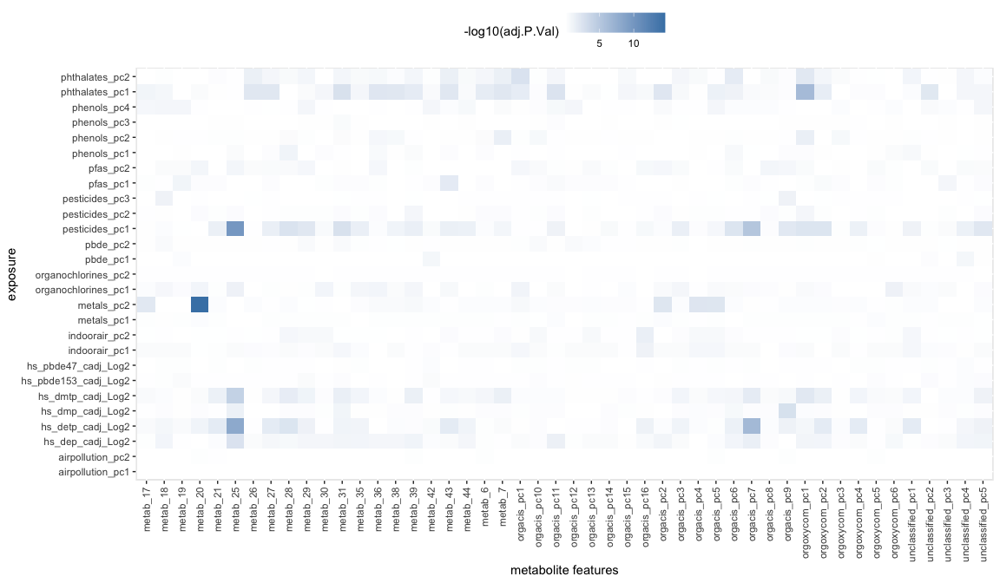<!-- -->


```r
par(mfrow=c(3, 4))
for(ii in seq_len(12)) {
	exp <- as.character(expoUrineDF[ii, "exposure"])
	met <- as.character(expoUrineDF[ii, "feat.ID"])
	apv <- as.numeric(expoUrineDF[ii, "adj.P.Val"])
	
	plot(exposomePC[rownames(urinePC), exp], urinePC[, met], xlab=exp, ylab=met, main=apv,
			 col=urine_covars$e3_sex)
			 #col=c("red", "blue", "green", "yellow", "black", "gray")[as.numeric(urine_covars$h_cohort)])
	abline(lm(urinePC[, met]~exposomePC[rownames(urinePC), exp]), col="red")
}
```

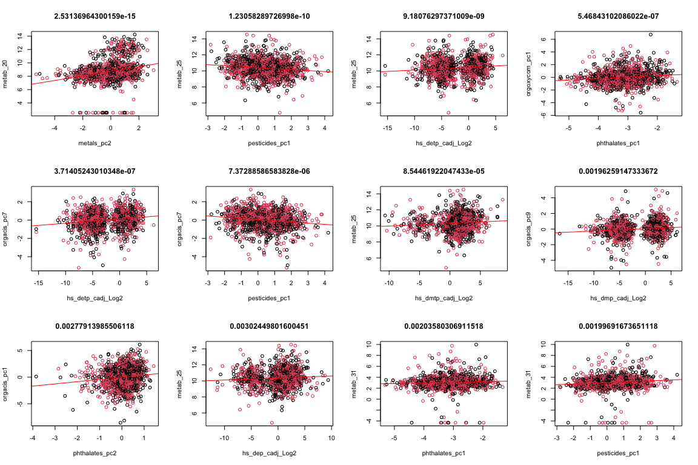<!-- -->

# Validation

Using urine.


```r
expoUrineDF[1:3, ]
```

```
## # A tibble: 3 x 10
##     logFC AveExpr     t  P.Value adj.P.Val     B exposure          feat.ID 
##     <dbl>   <dbl> <dbl>    <dbl>     <dbl> <dbl> <chr>             <chr>   
## 1  0.396     8.73  8.51 5.27e-17  2.53e-15  27.8 metals_pc2        metab_20
## 2 -0.177    10.4  -7.07 2.56e-12  1.23e-10  17.4 pesticides_pc1    metab_25
## 3  0.0520   10.4   6.42 1.91e-10  9.18e- 9  13.0 hs_detp_cadj_Log2 metab_25
## # … with 2 more variables: adj.P.Value.all <dbl>, family <chr>
```

```r
exposome$ID <- paste0('sample_', exposome$ID)
rownames(exposome) <- exposome$ID
```


```r
sel_exp <- c("hs_detp_cadj_Log2", 
	as.character(codebook$variable_name[codebook$family == "Metals"]),
	as.character(codebook$variable_name[codebook$family == "Organophosphate pesticides"]))

urine_covars2 <- urine_covars
urine_covars2 <- cbind(urine_covars2, exposome[rownames(urine_covars), sel_exp])

runValExpoUrine <- function(expname){
  model <- model.matrix(
  	formula(paste("~ ", expname, " + e3_sex + h_cohort + h_edumc_None + hs_zbmi_who + age_sample_years")),
    urine_covars2)
  lmF <- lmFit(exprs(metabol_urine), model)
  lmFe <- eBayes(lmF)
  tab <- topTable(lmFe, number = Inf, coef = 2)
  tab$exposure <- expname
  tab$feat.ID <- rownames(tab)
  tab
}

expoValUrine <- lapply(sel_exp, runValExpoUrine)
```


```r
expoValUrineDF <- Reduce(rbind, expoValUrine) %>%
	filter(feat.ID %in% c("metab_20", "metab_25")) %>%
  tibble() %>%
  arrange(P.Value) %>%
  mutate(adj.P.Value.all = p.adjust(P.Value, method = "fdr")) %>%
  left_join(mutate(exposomePC_fam, exposure = var) %>% select(-var), by = "exposure")
datatable(expoValUrineDF)
```

```{=html}
<div id="htmlwidget-fe1469dcf057e6aa96d7" style="width:100%;height:auto;" class="datatables html-widget"></div>
<script type="application/json" data-for="htmlwidget-fe1469dcf057e6aa96d7">{"x":{"filter":"none","data":[["1","2","3","4","5","6","7","8","9","10","11","12","13","14","15","16","17","18","19","20","21","22","23","24","25","26","27","28","29","30","31","32","33","34","35","36","37","38","39","40","41","42","43","44","45","46","47","48","49","50","51","52","53","54","55","56","57","58","59","60"],[0.105082669432894,0.215533492939799,0.0519788102960121,0.0519788102960121,0.0526832344803079,0.0370559719948194,-0.300668725656522,-0.153116244554399,0.0218462900093233,0.284128470669176,0.0281273832404431,0.0281273832404431,0.0212779857999059,0.0944188175057085,-0.233530347568298,0.107431113407471,-0.0796458083324479,-0.110368895927163,-0.353959478350183,-0.0667370280586937,-0.0381653354835153,0.501900360877665,-0.0195850038899164,-0.0118945422603239,0.0167062754352455,-0.0594026914753178,0.0366132913387523,-0.00537382700616848,-0.0387395186319677,0.0526302680086239,0.00725037349437351,0.0200695621950591,-0.0780788614327323,0.140138449039499,-0.00541661280602982,0.0944390212396418,0.00790391131049397,-0.0121968730238102,0.0499641017413233,0.0417862206391095,0.0060454573538754,-0.0263241073508384,0.00273616032796192,-0.00912772478268492,0.00402547324262883,-0.0161140431742424,-0.0019394526856198,0.0349755392713983,-0.00813528564917897,0.0147705700900029,-0.0174252452681474,0.00374529480038942,0.00821757940490167,0.0106867637310659,-0.0032253199750566,-0.000982093972088477,0.00191757586752928,-0.00506468492512113,-0.000385354847421357,0.000637319641099126],[8.73367922547131,8.73367922547131,10.3649091242734,10.3649091242734,10.3649091242734,10.3649091242734,10.3649091242734,10.3649091242734,10.3649091242734,8.73367922547131,8.73367922547131,8.73367922547131,8.73367922547131,10.3649091242734,10.3649091242734,10.3649091242734,8.73367922547131,8.73367922547131,10.3649091242734,8.73367922547131,10.3649091242734,8.73367922547131,8.73367922547131,8.73367922547131,10.3649091242734,10.3649091242734,10.3649091242734,10.3649091242734,8.73367922547131,10.3649091242734,10.3649091242734,10.3649091242734,10.3649091242734,8.73367922547131,10.3649091242734,8.73367922547131,8.73367922547131,8.73367922547131,8.73367922547131,10.3649091242734,8.73367922547131,8.73367922547131,10.3649091242734,10.3649091242734,8.73367922547131,8.73367922547131,10.3649091242734,8.73367922547131,8.73367922547131,8.73367922547131,8.73367922547131,10.3649091242734,10.3649091242734,8.73367922547131,10.3649091242734,8.73367922547131,10.3649091242734,8.73367922547131,10.3649091242734,8.73367922547131],[7.12459645032022,6.52726171998299,6.42536092816527,6.42536092816527,4.80161900621096,4.01612744442505,-3.85542365005432,-3.07407634779312,3.02296571762389,2.5366716286058,2.10723179109591,2.10723179109591,2.06865469476099,1.94089249981981,-1.77070447586235,1.55594193629916,-1.53499176952375,-1.3592587605627,-1.26481498718726,-1.21971672397482,-1.13951235289819,1.10350144671423,-1.08846383624906,-1.00941604039329,0.90189040029877,-0.887305083122912,0.85926432763173,-0.847688380926976,-0.844879142606586,0.809712597916591,0.757503409308529,0.711193725076984,-0.670747225173482,0.653153439398744,-0.523580561122337,0.499220240107917,0.47015399156261,-0.405093780602933,0.391840040947798,0.390453238234663,0.388622411531724,-0.380088521134277,0.371078353624741,-0.365761786518629,0.335960803235743,-0.295926792433197,-0.209235054370982,0.201109153319999,-0.200605854564873,0.18655534013278,-0.164934244368876,0.117178281495286,0.116965700971908,0.0936077792810798,-0.0658877530479828,-0.0650597216351337,0.0569141127348203,-0.0465400897822775,-0.0186310090058049,0.00801199205305908],[1.81043009174595e-12,9.91738940273693e-11,1.90323229312331e-10,1.90323229312331e-10,1.77539500976856e-06,6.28936070627131e-05,0.000121750877672788,0.00215994180153111,0.00255702693216367,0.0113189638850442,0.0353076880001662,0.0353076880001662,0.038795514952549,0.052508781537023,0.0768675290445076,0.119989572994559,0.125053441282093,0.174323855080909,0.206186948242583,0.2228155751834,0.254720367357711,0.270034050915808,0.276612253959546,0.312981719205968,0.367298813396277,0.375095159757692,0.390368912072307,0.396783137384199,0.398349283613293,0.418268333565962,0.448899293375114,0.477104503017296,0.502512599918989,0.513784375394645,0.600668443400802,0.617717130441783,0.638331727060934,0.68548187491283,0.695247035233767,0.696271776872086,0.697625468582184,0.703947986177172,0.710645664846886,0.714608278249424,0.736960045776725,0.767337965688346,0.83430079936156,0.84064782267338,0.841041287769519,0.852041295445627,0.869023937817603,0.906738682475337,0.906907102237755,0.925436592542996,0.947478332039338,0.948137450328507,0.954623230570534,0.962887642654542,0.985138609581211,0.993608775502397],[7.96589240368219e-11,4.36365133720425e-09,8.37422208974258e-09,8.37422208974258e-09,7.81173804298168e-05,0.00276731871075937,0.00267851930880134,0.0950374392673688,0.112509185015201,0.0553371567713273,0.130965257491179,0.130965257491179,0.802260116312905,0.192532198969084,0.386511201545523,0.329971325735039,0.465530675722138,0.355014632401024,0.648016123048119,0.8912623007336,0.800549725981376,0.65126487185784,0.529171268444349,0.724799770792768,0.887094191063662,0.927376483002203,0.954982715830393,0.928617581986189,0.762059499086301,0.702579469061705,0.822982037854376,0.859666346001264,0.899607208717132,0.843881148593261,0.849312842785642,0.899607208717132,0.849312842785642,0.887094191063662,0.926996046978356,0.941804710597262,0.953230431922276,0.954982715830393,0.941241419394242,0.849804438999315,0.941241419394242,0.844071762257181,0.92594488338355,0.941804710597262,0.881090872901401,0.891740141843401,0.955926331599364,0.927825628579414,0.992232592028179,0.992232592028179,0.969512711854206,0.970187158475681,0.982561813458739,0.999114158898008,0.985138609581211,0.993608775502397],[17.3737166370309,13.8530103283669,12.7239691938118,12.7239691938118,4.13850771198095,0.583834570704632,0.795036334444437,-1.53920356240588,-3.10454738333148,-3.36963945139548,-5.31297580134252,-5.31297580134252,-5.64964887946926,-4.17329068587714,-4.73351261321085,-5.32721257553593,-5.05771060935931,-5.04876726421441,-5.31006150961401,-5.42628291290341,-5.52149924144906,-5.49096793977591,-6.638878145432,-7.14128869405641,-6.31675790855583,-5.18175042236293,-5.57169681058238,-7.4247461153838,-5.96099871448248,-5.25979913054191,-7.08707725592987,-6.06164888514097,-4.95649563506558,-6.03673156534973,-7.15932603941251,-5.02027283645225,-7.18576902973235,-6.63689486468098,-6.31818452754827,-5.82416981995073,-7.29776558667513,-5.84754507323087,-7.56449855286751,-6.36069014097107,-7.576893942019,-6.09961537111887,-7.38361013710808,-5.87605112161455,-6.4062931471499,-5.90682374978101,-5.52648371227174,-6.18017659302066,-6.05112069027353,-6.05344993335105,-6.22229294444282,-7.40160941450777,-6.1346076908669,-5.51182913410274,-6.86442657003749,-6.22435096705225],["hs_as_c_Log2","hs_hg_c_Log2","hs_detp_cadj_Log2","hs_detp_cadj_Log2","hs_dmtp_cadj_Log2","hs_dep_cadj_Log2","hs_dmdtp_cdich_None","hs_mo_m_Log2","hs_dmp_cadj_Log2","hs_cs_c_Log2","hs_detp_cadj_Log2","hs_detp_cadj_Log2","hs_as_m_Log2","hs_co_c_Log2","hs_cu_c_Log2","hs_cs_c_Log2","hs_co_m_Log2","hs_mo_m_Log2","hs_tl_mdich_None","hs_mo_c_Log2","hs_cd_m_Log2","hs_tl_mdich_None","hs_dmtp_cadj_Log2","hs_dmp_cadj_Log2","hs_dep_madj_Log2","hs_mn_m_Log2","hs_pb_m_Log2","hs_as_m_Log2","hs_cd_c_Log2","hs_cs_m_Log2","hs_dmtp_madj_Log2","hs_cd_c_Log2","hs_cu_m_Log2","hs_cu_c_Log2","hs_dmp_madj_Log2","hs_cu_m_Log2","hs_dmp_madj_Log2","hs_dep_madj_Log2","hs_dmdtp_cdich_None","hs_tl_cdich_None","hs_dmtp_madj_Log2","hs_pb_m_Log2","hs_detp_madj_Log2","hs_hg_m_Log2","hs_detp_madj_Log2","hs_cd_m_Log2","hs_as_c_Log2","hs_tl_cdich_None","hs_hg_m_Log2","hs_co_c_Log2","hs_cs_m_Log2","hs_co_m_Log2","hs_mn_c_Log2","hs_mn_c_Log2","hs_pb_c_Log2","hs_dep_cadj_Log2","hs_mo_c_Log2","hs_mn_m_Log2","hs_hg_c_Log2","hs_pb_c_Log2"],["metab_20","metab_20","metab_25","metab_25","metab_25","metab_25","metab_25","metab_25","metab_25","metab_20","metab_20","metab_20","metab_20","metab_25","metab_25","metab_25","metab_20","metab_20","metab_25","metab_20","metab_25","metab_20","metab_20","metab_20","metab_25","metab_25","metab_25","metab_25","metab_20","metab_25","metab_25","metab_25","metab_25","metab_20","metab_25","metab_20","metab_20","metab_20","metab_20","metab_25","metab_20","metab_20","metab_25","metab_25","metab_20","metab_20","metab_25","metab_20","metab_20","metab_20","metab_20","metab_25","metab_25","metab_20","metab_25","metab_20","metab_25","metab_20","metab_25","metab_20"],[1.08625805504757e-10,2.85484843968497e-09,2.85484843968497e-09,2.85484843968497e-09,2.13047401172228e-05,0.000628936070627131,0.00104357895148104,0.0161995635114833,0.0170468462144245,0.0679137833102654,0.176538440000831,0.176538440000831,0.179056222857919,0.22503763515867,0.307470116178031,0.441365086877975,0.441365086877975,0.581079516936362,0.65111667866079,0.6684467255502,0.721597184242294,0.721597184242294,0.721597184242294,0.78245429801492,0.824170931613711,0.824170931613711,0.824170931613711,0.824170931613711,0.824170931613711,0.836536667131923,0.86883734201635,0.89457094315743,0.906678309519962,0.906678309519962,0.974465833976488,0.974465833976488,0.974465833976488,0.974465833976488,0.974465833976488,0.974465833976488,0.974465833976488,0.974465833976488,0.974465833976488,0.974465833976488,0.982613394368967,0.993608775502397,0.993608775502397,0.993608775502397,0.993608775502397,0.993608775502397,0.993608775502397,0.993608775502397,0.993608775502397,0.993608775502397,0.993608775502397,0.993608775502397,0.993608775502397,0.993608775502397,0.993608775502397,0.993608775502397],[null,null,"Organophosphate pesticides","Organophosphate pesticides","Organophosphate pesticides","Organophosphate pesticides",null,null,"Organophosphate pesticides",null,"Organophosphate pesticides","Organophosphate pesticides",null,null,null,null,null,null,null,null,null,null,"Organophosphate pesticides","Organophosphate pesticides",null,null,null,null,null,null,null,null,null,null,null,null,null,null,null,null,null,null,null,null,null,null,null,null,null,null,null,null,null,null,null,"Organophosphate pesticides",null,null,null,null]],"container":"<table class=\"display\">\n  <thead>\n    <tr>\n      <th> <\/th>\n      <th>logFC<\/th>\n      <th>AveExpr<\/th>\n      <th>t<\/th>\n      <th>P.Value<\/th>\n      <th>adj.P.Val<\/th>\n      <th>B<\/th>\n      <th>exposure<\/th>\n      <th>feat.ID<\/th>\n      <th>adj.P.Value.all<\/th>\n      <th>family<\/th>\n    <\/tr>\n  <\/thead>\n<\/table>","options":{"columnDefs":[{"className":"dt-right","targets":[1,2,3,4,5,6,9]},{"orderable":false,"targets":0}],"order":[],"autoWidth":false,"orderClasses":false}},"evals":[],"jsHooks":[]}</script>
```


