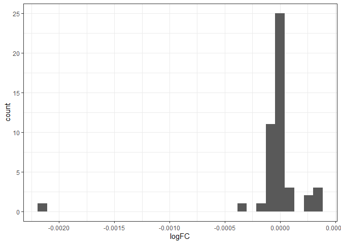
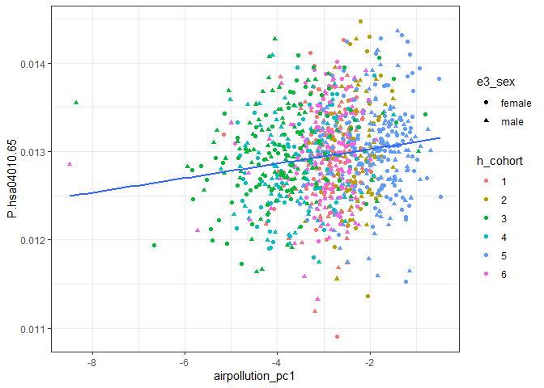
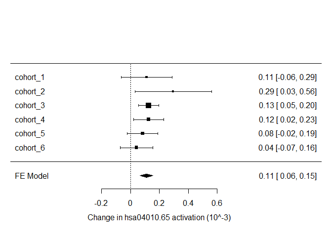

# Introduction

In this document, we aimed to improve the interpretation of the associations between exposures and transcriptome. To this end, we first collapse the exposures in families and the genes in pathways and then we associated them.

To produce a measure of exposure families activation, we run a PCA per family exposure and then we selected the components that explained at least 80-90% of the variability. These principal components were used as a proxy of the global family exposure. 

Genes were collapsed into pathways with Hipathia. Hipathia computes the activation of kegg pathways by using precomputed weights.

Finally, genes were associated with exposures using limma, adjusting for sex, cohort, age, bmi and maternal education.

# Prepare environment


```r
library(SummarizedExperiment)
library(limma)
library(tidyverse)
library(RColorBrewer)
library(metafor)
```

Exposure PCAs and hipathia pathways were precomputed in other scripts:


```r
load("../results/gene_expression/gexpr.hipathia.pathways.Rdata")
load("../results/exposures/exposomePC.RData")
load("../data/exposome.RData")
```

Covariates and exposures should be included to gene expression object.


```r
rownames(covariates) <- covariates$ID
covariates <- covariates[ , -1]
colData(path_vals) <- cbind(colData(path_vals), covariates[colnames(path_vals), c("h_cohort", "h_edumc_None")])

rownames(phenotype) <- phenotype$ID
phenotype <- phenotype[ , -1]
colData(path_vals) <- cbind(colData(path_vals), phenotype[colnames(path_vals), "hs_zbmi_who", drop = FALSE ])

colData(path_vals) <- cbind(colData(path_vals), exposomePC[paste0('sample_', colnames(path_vals)), ])
```

# Analysis

The association between gene expression and the exposures was performed using limma and adjusting for sex, cohort, bmi, age and maternal education.


```r
exps <- colnames(exposomePC)

runExpo <- function(expname){
  
  model <- model.matrix(formula(paste("~", expname, "+ e3_sex + h_cohort + h_edumc_None + hs_zbmi_who + age_sample_years")),
                        colData(path_vals))
  lmF <- lmFit(assay(path_vals), model)
  lmFe <- eBayes(lmF)
  tab <- topTable(lmFe, number = Inf, coef = 2)
  tab$exposure <- expname
  tab$feat.ID <- rownames(tab)
  tab
}
expoRes <- lapply(exps, runExpo)
expoResdf <- Reduce(rbind, expoRes) %>%
  tibble() %>%
  arrange(P.Value) %>%
  mutate(adj.P.Value.all = p.adjust(P.Value, method = "BH")) %>%
  left_join(as.data.frame(rowData(path_vals)) %>% select(-decomposed), by = "feat.ID") %>%
  left_join(mutate(exposomePC_fam, exposure = var) %>% select(-var), by = "exposure")
```

We considered as significant associations whose adjusted p-value was smaller than 0.05. These adjusted p-value correspond to adjust for the total number of pathways an exposure is associated with.


```r
subset(expoResdf, adj.P.Val < 0.05)
```

```
## # A tibble: 3 x 11
##         logFC  AveExpr     t   P.Value adj.P.Val     B exposure      feat.ID    
##         <dbl>    <dbl> <dbl>     <dbl>     <dbl> <dbl> <chr>         <chr>      
## 1 -0.000185   0.0101   -4.91   1.08e-6   0.00203 -1.99 pbde_pc1      P-hsa04015~
## 2  0.000113   0.0130    4.91   1.09e-6   0.00205 -1.99 airpollution~ P-hsa04010~
## 3  0.00000474 0.000208  4.39   1.28e-5   0.0120  -4.36 pbde_pc1      P-hsa05205~
## # ... with 3 more variables: adj.P.Value.all <dbl>, feat.name <chr>,
## #   family <chr>
```

Three associations were significant with this criteria. These associations were also significant when accounting for the total number of tests performed (27 exposures x 1007 pathways). Two associations involved PBDEs while the third involved air pollution. 

We explored these associations with more detail.

## PBDE vs Rap1 signaling pathway: THBS1

Rap1 is a G-protein that intermediates the signaling of different pathways. Thus, Rap1 might be regulated by many effectors while it controls the expression of different genes. In particular, PDBEs are associated with the activation of THBS1, a gene involved in thrombosis. 

PDBEs (Polybrominated diphenyl ethers) are chemicals found in furnitures. 

First, we explored the association identified in the analysis:


```r
covars <- c("h_cohort", "e3_sex", "h_edumc_None", "hs_zbmi_who", "age_sample_years")
assoc1df <- data.frame(`P.hsa04015.95` = as.vector(assay(path_vals["P-hsa04015-95", ])), 
                 colData(path_vals)[,  c("pbde_pc1", covars)])

ggplot(assoc1df, aes(x = pbde_pc1, y = `P.hsa04015.95`, color = h_cohort, shape = e3_sex)) +
  geom_point() +
  geom_smooth(aes(x = pbde_pc1, y = `P.hsa04015.95`), method = lm, se = FALSE, inherit.aes = FALSE) +
  theme_bw()
```

<!-- -->

```r
summary(lm(`P.hsa04015.95` ~ ., assoc1df))
```

```
## 
## Call:
## lm(formula = P.hsa04015.95 ~ ., data = assoc1df)
## 
## Residuals:
##        Min         1Q     Median         3Q        Max 
## -0.0020033 -0.0005984 -0.0000974  0.0004594  0.0036182 
## 
## Coefficients:
##                    Estimate Std. Error t value Pr(>|t|)    
## (Intercept)       9.685e-03  3.967e-04  24.414  < 2e-16 ***
## pbde_pc1         -1.854e-04  3.779e-05  -4.905 1.09e-06 ***
## h_cohort2        -2.693e-04  2.675e-04  -1.007    0.314    
## h_cohort3        -2.195e-04  1.601e-04  -1.371    0.171    
## h_cohort4         6.757e-05  1.027e-04   0.658    0.511    
## h_cohort5        -8.133e-05  1.446e-04  -0.563    0.574    
## h_cohort6        -1.413e-04  1.067e-04  -1.325    0.186    
## e3_sexmale        5.311e-05  5.356e-05   0.992    0.322    
## h_edumc_None2     2.891e-06  9.168e-05   0.032    0.975    
## h_edumc_None3    -1.146e-04  8.960e-05  -1.279    0.201    
## hs_zbmi_who      -1.001e-05  2.383e-05  -0.420    0.675    
## age_sample_years  4.501e-05  5.803e-05   0.776    0.438    
## ---
## Signif. codes:  0 '***' 0.001 '**' 0.01 '*' 0.05 '.' 0.1 ' ' 1
## 
## Residual standard error: 0.0008451 on 995 degrees of freedom
## Multiple R-squared:  0.03292,	Adjusted R-squared:  0.02222 
## F-statistic: 3.079 on 11 and 995 DF,  p-value: 0.0004443
```

Increasing levels of PBDEs are associated with lower activation of Rap1 - THBS1 pathway. Nonetheless, the effect is very low and it explains very little of the pathway's variability.

Next, we explored whether the association was consistent in all cohorts:


```r
assoc1l <- lapply(1:6, function(cohort){
  mini <- subset(assoc1df, h_cohort == cohort)
  mini$h_cohort <- NULL
  summary(lm(`P.hsa04015.95` ~ ., mini))
})
names(assoc1l) <- paste0("cohort_", 1:6)
assoc1est <- lapply(assoc1l, function(x) {
  x$coefficients[2, 1:2]
})
assoc1est <- Reduce(cbind, assoc1est)
meta1 <- rma(assoc1est[1, ]*10^3, sei = assoc1est[2, ]*10^3, 
                       method = "FE", slab = names(assoc1l))

forest(meta1, xlab = "Change in hsa04015.95 activation (10^-3)")
```

<!-- -->

The association is consistent in the six cohorts and significant in three of them.

We next explored the influence on other effectors of the pathway:


```r
assoc1_path <- expoResdf %>%
  filter(exposure  == "pbde_pc1") %>%
  mutate(Rap1 = grepl("hsa04015", feat.ID)) %>%
  filter(Rap1)

assoc1_path %>%
  ggplot(aes(x = logFC)) +
  geom_histogram() +
  theme_bw()
```

<!-- -->

```r
assoc1_path %>%
  ggplot(aes(x = -log10(P.Value))) +
  geom_histogram() +
  theme_bw()
```

<!-- -->

```r
t.test(assoc1_path$logFC)
```

```
## 
## 	One Sample t-test
## 
## data:  assoc1_path$logFC
## t = -0.81709, df = 13, p-value = 0.4286
## alternative hypothesis: true mean is not equal to 0
## 95 percent confidence interval:
##  -7.550087e-05  3.406211e-05
## sample estimates:
##     mean of x 
## -2.071938e-05
```

Although more estimates are negative than positive, this imbalance is not statistically significant.

## PBDE vs Proteoglycans in cancer: KDR**

PBDE were associated with another pathway: proteoglycans in cancer. 
These pathways include the effects mediated by proteoglycans in the cell. In this case, PDBEs are associated with the activation of KDR (Kinase insert domain receptor), a gene involved in angiogenesis. 

First, we explored the association identified in the analysis:


```r
assoc2df <- data.frame(`P.hsa05205.451` = as.vector(assay(path_vals["P-hsa05205-451", ])), 
                 colData(path_vals)[,  c("pbde_pc1", covars)])

ggplot(assoc2df, aes(x = pbde_pc1, y = `P.hsa05205.451`, color = h_cohort, shape = e3_sex)) +
  geom_point() +
  geom_smooth(aes(x = pbde_pc1, y = `P.hsa05205.451`), method = lm, se = FALSE, inherit.aes = FALSE) +
  theme_bw()
```

<!-- -->

```r
summary(lm(`P.hsa05205.451` ~ ., assoc2df))
```

```
## 
## Call:
## lm(formula = P.hsa05205.451 ~ ., data = assoc2df)
## 
## Residuals:
##        Min         1Q     Median         3Q        Max 
## -9.689e-05 -1.125e-05  2.252e-06  1.504e-05  5.863e-05 
## 
## Coefficients:
##                    Estimate Std. Error t value Pr(>|t|)    
## (Intercept)       2.205e-04  1.114e-05  19.799  < 2e-16 ***
## pbde_pc1          4.738e-06  1.061e-06   4.466 8.87e-06 ***
## h_cohort2         1.058e-05  7.510e-06   1.408   0.1594    
## h_cohort3         8.978e-06  4.494e-06   1.998   0.0460 *  
## h_cohort4         7.286e-07  2.884e-06   0.253   0.8006    
## h_cohort5         5.149e-06  4.058e-06   1.269   0.2048    
## h_cohort6         5.842e-06  2.994e-06   1.951   0.0513 .  
## e3_sexmale       -1.734e-06  1.504e-06  -1.153   0.2492    
## h_edumc_None2    -3.166e-07  2.574e-06  -0.123   0.9021    
## h_edumc_None3     4.069e-06  2.515e-06   1.618   0.1060    
## hs_zbmi_who       5.634e-07  6.688e-07   0.842   0.3998    
## age_sample_years -1.701e-06  1.629e-06  -1.044   0.2965    
## ---
## Signif. codes:  0 '***' 0.001 '**' 0.01 '*' 0.05 '.' 0.1 ' ' 1
## 
## Residual standard error: 2.372e-05 on 995 degrees of freedom
## Multiple R-squared:  0.03361,	Adjusted R-squared:  0.02293 
## F-statistic: 3.146 on 11 and 995 DF,  p-value: 0.0003386
```

Increasing levels of PBDEs are associated with increasing activation of the proteoglycans in cancer pathway. Nonetheless, the effect is very low and it explains very little of the pathway's variability.

Next, we explored whether the association was consistent in all cohorts:


```r
assoc2l <- lapply(1:6, function(cohort){
  mini <- subset(assoc2df, h_cohort == cohort)
  mini$h_cohort <- NULL
  summary(lm(`P.hsa05205.451` ~ ., mini))
})
names(assoc2l) <- paste0("cohort_", 1:6)
assoc2est <- lapply(assoc2l, function(x) {
  x$coefficients[2, 1:2]
})
assoc2est <- Reduce(cbind, assoc2est)
meta2 <- rma(assoc2est[1, ]*10^5, sei = assoc2est[2, ]*10^5, 
                       method = "FE", slab = names(assoc2l))

forest(meta2, xlab = "Change in hsa05205.451 activation (10^-5)")
```

<!-- -->

The association is consistent in the six cohorts and significant in three of them.

We next explored the influence on other effectors of the pathway:


```r
assoc2_path <- expoResdf %>%
  filter(exposure  == "pbde_pc1") %>%
  mutate(path = grepl("hsa05205", feat.ID)) %>%
  filter(path)

assoc2_path %>%
  ggplot(aes(x = logFC)) +
  geom_histogram() +
  theme_bw()
```

<!-- -->

```r
assoc2_path %>%
  ggplot(aes(x = -log10(P.Value))) +
  geom_histogram() +
  theme_bw()
```

<!-- -->

```r
t.test(assoc2_path$logFC)
```

```
## 
## 	One Sample t-test
## 
## data:  assoc2_path$logFC
## t = -0.73476, df = 46, p-value = 0.4662
## alternative hypothesis: true mean is not equal to 0
## 95 percent confidence interval:
##  -1.339682e-04  6.231849e-05
## sample estimates:
##     mean of x 
## -3.582485e-05
```

Although more estimates are positive than negative, these imbalance is not statistically significant.


## Air pollution vs MAPK signaling pathway: ELK4

MAPK signaling pathway is involved in different cellular processes, such as cell proliferation or differentiation. There are different types of MAPK than can be activated by different receptors and regulate different effectors. In our case, we found an association with ELK4, a protein activated by the MAPK ERK. ELK3 is a transcription factor regulating genes involved in controlling differentiation and proliferation

First, we explored the association identified in the analysis:


```r
assoc3df <- data.frame(`P.hsa04010.65` = as.vector(assay(path_vals["P-hsa04010-65", ])), 
                 colData(path_vals)[,  c("airpollution_pc1", covars)])

ggplot(assoc3df, aes(x = airpollution_pc1, y = `P.hsa04010.65`, color = h_cohort, shape = e3_sex)) +
  geom_point() +
  geom_smooth(aes(x = airpollution_pc1, y = `P.hsa04010.65`), method = lm, se = FALSE, inherit.aes = FALSE) +
  theme_bw()
```

<!-- -->

```r
summary(lm(`P.hsa04010.65` ~ ., assoc3df))
```

```
## 
## Call:
## lm(formula = P.hsa04010.65 ~ ., data = assoc3df)
## 
## Residuals:
##        Min         1Q     Median         3Q        Max 
## -0.0021122 -0.0003431 -0.0000027  0.0003304  0.0013754 
## 
## Coefficients:
##                    Estimate Std. Error t value Pr(>|t|)    
## (Intercept)       1.375e-02  2.516e-04  54.655  < 2e-16 ***
## airpollution_pc1  1.129e-04  2.303e-05   4.904  1.1e-06 ***
## h_cohort2         2.112e-04  1.616e-04   1.307   0.1914    
## h_cohort3         2.527e-04  9.973e-05   2.534   0.0114 *  
## h_cohort4        -9.311e-05  6.348e-05  -1.467   0.1428    
## h_cohort5         3.561e-05  8.948e-05   0.398   0.6907    
## h_cohort6        -4.793e-05  6.232e-05  -0.769   0.4420    
## e3_sexmale       -7.500e-05  3.237e-05  -2.317   0.0207 *  
## h_edumc_None2     2.509e-05  5.536e-05   0.453   0.6505    
## h_edumc_None3     5.211e-05  5.406e-05   0.964   0.3353    
## hs_zbmi_who      -6.966e-07  1.431e-05  -0.049   0.9612    
## age_sample_years -6.624e-05  3.511e-05  -1.887   0.0595 .  
## ---
## Signif. codes:  0 '***' 0.001 '**' 0.01 '*' 0.05 '.' 0.1 ' ' 1
## 
## Residual standard error: 0.0005104 on 995 degrees of freedom
## Multiple R-squared:  0.04698,	Adjusted R-squared:  0.03644 
## F-statistic: 4.459 on 11 and 995 DF,  p-value: 1.373e-06
```

Increasing levels of air pollution are associated with increasing activation of ELK4 pathway. Nonetheless, the effect is very low and it explains very little of the pathway's variability. In addition, the exposure is strongly associated with the cohort.

Next, we explored whether the association was consistent in all cohorts:


```r
assoc3l <- lapply(1:6, function(cohort){
  mini <- subset(assoc3df, h_cohort == cohort)
  mini$h_cohort <- NULL
  summary(lm(`P.hsa04010.65` ~ ., mini))
})
names(assoc3l) <- paste0("cohort_", 1:6)
assoc3est <- lapply(assoc3l, function(x) {
  x$coefficients[2, 1:2]
})
assoc3est <- Reduce(cbind, assoc3est)
meta3 <- rma(assoc3est[1, ]*10^3, sei = assoc3est[2, ]*10^3, 
                       method = "FE", slab = names(assoc3l))

forest(meta3, xlab = "Change in hsa04010.65 activation (10^-3)")
```

<!-- -->

The association is consistent in the six cohorts and significant in three of them.

We next explored the influence on other effectors of the pathway:


```r
assoc3_path <- expoResdf %>%
  filter(exposure  == "airpollution_pc1") %>%
  mutate(path = grepl("hsa04010", feat.ID)) %>%
  filter(path)

assoc3_path %>%
  ggplot(aes(x = logFC)) +
  geom_histogram() +
  theme_bw()
```

<!-- -->

```r
assoc3_path %>%
  ggplot(aes(x = -log10(P.Value))) +
  geom_histogram() +
  theme_bw()
```

<!-- -->

```r
t.test(assoc3_path$logFC)
```

```
## 
## 	One Sample t-test
## 
## data:  assoc3_path$logFC
## t = 0.52415, df = 27, p-value = 0.6044
## alternative hypothesis: true mean is not equal to 0
## 95 percent confidence interval:
##  -2.620781e-05  4.419181e-05
## sample estimates:
## mean of x 
## 8.992e-06
```

Although more estimates are positive than negative, these imbalance is not statistically significant.

